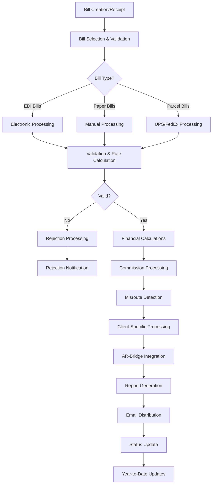
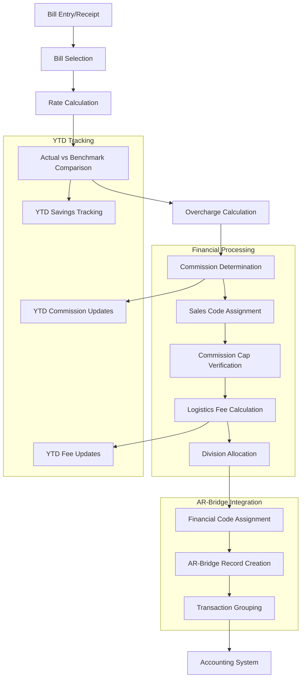
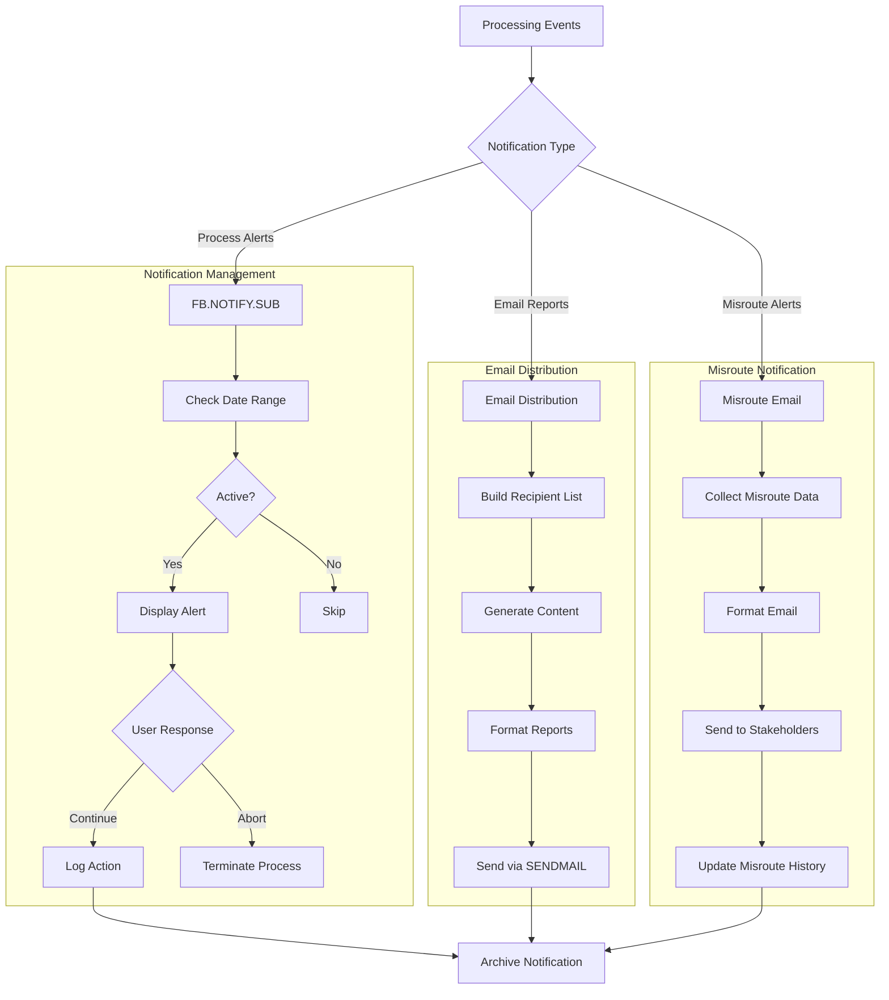
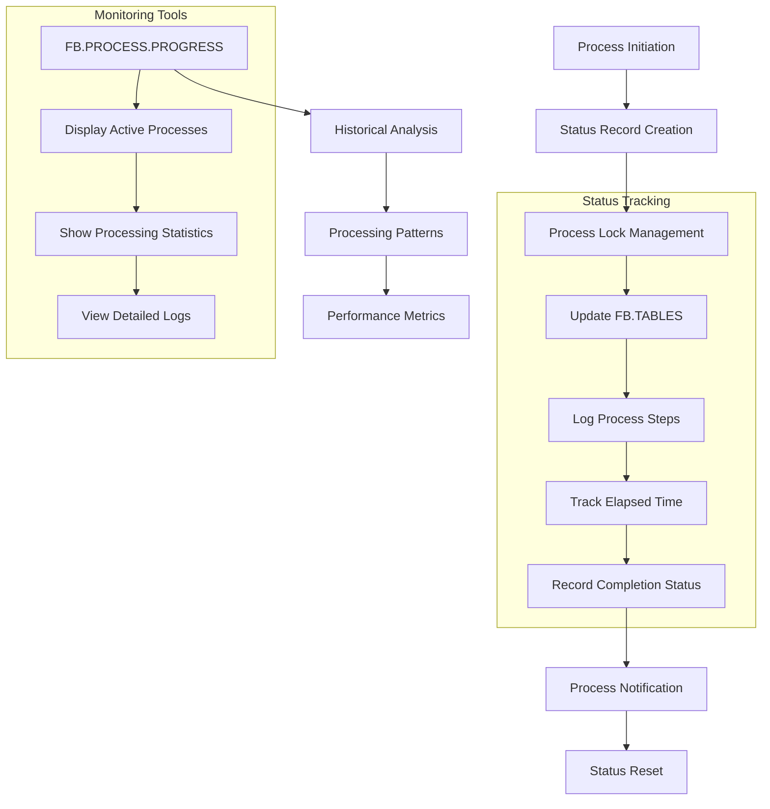

# Freight Bill Processing in AFS Shreveport

## Overview of Freight Bill Processing

The AFS Shreveport system implements a comprehensive end-to-end freight bill processing workflow that manages the lifecycle of freight bills from creation through payment processing. The system handles multiple bill types including LTL, Truckload, Air Freight, and parcel shipments (UPS, FedEx), applying client-specific rules at each stage. Processing begins with bill entry or electronic receipt, followed by validation, rate calculation, auditing, and payment processing. Throughout this workflow, the system applies client-specific business rules, calculates commissions, identifies cost-saving opportunities through misroute detection, and integrates with accounting systems through AR-Bridge integration. The system maintains detailed tracking of year-to-date values for financial reporting and commission calculations, while supporting specialized processing requirements for different clients and carriers.

## Freight Bill Processing Workflow

The freight bill processing workflow in AFS Shreveport follows a structured path from bill entry to payment completion. The process begins with bill creation or receipt, which can occur through manual entry, EDI integration, or electronic bill imports. Bills are then selected for processing based on client parameters and due dates. The system routes bills through different processing paths depending on their type (EDI, paper, or parcel). Each bill undergoes validation and rate calculation, with invalid bills entering a rejection workflow that includes notifications. Valid bills proceed to financial calculations, commission processing, and misroute detection to identify cost-saving opportunities. Client-specific processing rules are applied before integration with the AR-Bridge accounting system. The workflow concludes with report generation, email distribution of results, status updates in the system, and year-to-date record maintenance for future processing cycles.

## Bill Selection and Validation

The bill selection and validation process in AFS Shreveport is a critical first step that determines which freight bills will be processed in each cycle. The system uses a sophisticated selection mechanism that considers multiple factors including client parameters, due dates, and validation rules. For clients with due date processing enabled (indicated by DUE.DT.FLG settings of 'Y', numeric values, or 'C'), the system filters bills based on their due dates relative to the processing end date. This ensures that only bills that need immediate processing are included in each cycle.

The validation process applies a comprehensive set of rules to verify bill integrity before processing. Bills must have complete carrier information, valid dates, and proper formatting. The system performs carrier validation to ensure the carrier exists in the system and is approved for the client. For bills with division codes, the system validates that the division exists and is properly configured. The system also checks for duplicate bills by examining PRO numbers and other identifying information.

For EDI bills, additional validation occurs to ensure that electronic data has been properly received and formatted. The system verifies that expected EDI transmissions have arrived before processing begins, with alerts generated for any pending EDI bills that might be missing. Special validation rules apply to parcel carriers like UPS and FedEx, including tracking number validation and service type verification.

Bills that fail validation are marked with rejection codes and routed to a separate workflow for correction or manual review. The system maintains detailed logs of validation failures to help identify patterns and improve data quality over time. This comprehensive validation approach ensures that only clean, processable bills enter the main processing workflow, reducing errors and improving efficiency in downstream processes.

## Financial Calculations and Commission Processing

The AFS Shreveport system performs complex financial calculations during freight bill processing to determine charges, commissions, and logistics fees. The core of this functionality is implemented in the FB.TEH.JMK program, which handles the calculation of various financial components for each bill.

For each processed bill, the system calculates the actual freight charges, which may include base rates, accessorial charges, and fuel surcharges. It then compares these actual charges against benchmark rates or contracted rates to identify potential savings opportunities. The difference between actual charges and benchmark rates forms the basis for overcharge calculations, which are critical for commission determination.

Commission calculations are multi-faceted and client-specific. The system supports different commission structures based on sales codes, carrier types, and logistics services provided. For standard freight bills, commissions are typically calculated as a percentage of identified savings (overcharges). Special commission rules apply for carriers like UPS and FedEx, including allowances for minimal variances (0.01 and -0.01) as noted in the code. The system also implements commission caps, monitoring year-to-date values against preset caps to prevent exceeding agreed-upon limits.

Logistics fees are calculated based on client configuration, with options for flat fees, per-bill fees, and percentage-based fees. The system supports specialized fee structures for different carriers, as evidenced by the FedEx per-bill fee handling for specific clients. For clients with divisional billing enabled, the system allocates fees across divisions according to client-specific rules.

All financial calculations feed into the AR-Bridge integration, which prepares data for accounting systems. The system organizes financial data into structured arrays (INVOICE array) with specific codes for different financial components:
1. Amount of Freight Bills paid
2. Processing Fees
3. Service Fees
4. Gross Overcharges
5. Gross Logistics
6. Discount Commissions
7. Postage
8. Date
9. Number of Freight Bills processed
10. Cost of Overcharges
11. Cost of Logistics
12. Logistics Fees

This structured approach ensures accurate financial reporting and proper accounting integration throughout the freight bill processing workflow.

## Financial Data Flow

The financial data flow in AFS Shreveport begins with bill entry or receipt and moves through a series of calculations and transformations before reaching the accounting system. After bills are selected for processing, the system calculates applicable rates and compares actual charges against benchmark or contracted rates. This comparison generates overcharge calculations that drive commission determination.

Within the financial processing subsystem, commissions are assigned to appropriate sales codes, verified against year-to-date caps, and combined with logistics fee calculations. For clients with divisional billing, financial amounts are allocated across divisions according to client-specific rules. This creates a comprehensive financial picture for each processed bill.

The AR-Bridge integration subsystem transforms these financial calculations into structured accounting records. Each financial component receives a specific code that determines how it will be treated in the accounting system. The system creates AR-Bridge records that group related transactions and prepare them for export to the accounting system.

Throughout this process, the system maintains year-to-date tracking for commissions, fees, and savings. This tracking is essential for commission cap management, client reporting, and historical analysis. The system stores this information in dedicated YTD files and updates them with each processing cycle.

The financial data flow is designed to ensure accuracy, traceability, and proper accounting integration. Each step in the process is logged and can be audited, providing a complete financial trail from bill entry to accounting system integration.

## Client-Specific Processing

AFS Shreveport implements a highly customizable approach to freight bill processing that accommodates unique client requirements. The system maintains detailed client configuration records that control how bills are processed, what rules are applied, and how financial calculations are performed for each client.

Client-specific processing begins with the client record, which contains numerous flags and parameters that guide processing behavior. These include division settings (CLIENT.REC<12>), expense code usage (CLIENT.REC<13>), variance handling (CLIENT.REC<7>), and logistics fee configuration (CLIENT.REC<93>). The system also tracks client-specific settings for due date processing (DUE.DT.FLG), misroute detection (MR.LTRS and MR.EMAIL), and troubleshooting modes.

For clients with divisional billing requirements, the system maintains separate division code files (DIVISION.CODES) that define how bills should be allocated across business units. The code shows special handling for clients like Regal Plastics (00666), Pipeline Seal (01763), and Vermeer, with custom divisional processing logic. Some clients, like Great Plains (00866) and client 01706, have additional region-based processing that considers geographic information when handling freight bills.

The system also implements client-specific carrier handling. For example, special processing exists for UPS and FedEx shipments, with client-specific rules for tracking numbers, overcharge calculations, and per-bill fees. The code shows specific handling for clients like Airgas Safety (01773) with UPS processing customizations.

Financial rules vary significantly by client. Some clients have specialized commission structures, custom logistics fee calculations, or specific expense allocation requirements. The system supports weekly processing fees that can be split by division (as noted for client implementation in June 2007), client-specific sales code assignments, and specialized benchmark fee handling.

For reporting and notification purposes, the system maintains client-specific email distribution lists and report formats. It can generate customized reports for specific clients, such as the CSV file created for Elliott Electric (01640) and the specialized region reporting for Rexel.

This extensive client customization capability allows AFS Shreveport to handle diverse client requirements within a single system, providing tailored processing while maintaining core functionality and integration capabilities.

## EDI and Electronic Bill Processing

AFS Shreveport implements a sophisticated electronic bill processing system that handles EDI (Electronic Data Interchange) integration and specialized electronic bill formats for carriers like UPS and FedEx. This capability allows for automated processing of high-volume electronic bills while maintaining validation and audit controls.

The EDI processing workflow begins with the receipt of electronic bills through established EDI connections. The system maintains an EDI.XREF file that maps client identifiers to their EDI configurations, and an EDI.BILLS file that stores the received electronic bills. Before processing begins, the system verifies that expected EDI transmissions have been received, alerting users if pending EDI bills exist that might be missing from the current processing cycle.

For validation, EDI bills undergo specialized checks to ensure data integrity and completeness. The system verifies critical fields such as carrier information, charge amounts, and shipment details. EDI-specific validation rules check for proper formatting and required fields according to the EDI standards implemented for each client and carrier. Failed validations result in rejection codes that guide correction efforts.

The system implements specialized handling for major parcel carriers. UPS billing receives particular attention, with the code showing specific UPS tracking number calculations for clients like Vesuvius. The system checks for the presence of UPS e-bills before processing begins, ensuring that electronic data has been properly received. Similar specialized handling exists for FedEx Ground and FedEx Air shipments, with custom overcharge commission rules and per-bill fee structures for specific clients.

For EDI bills that pass validation, the system applies the same financial calculations as manual bills, including rate comparisons, overcharge determinations, and commission calculations. However, EDI bills may have specialized processing fee structures, as indicated by the code that excludes EDI bills from certain postage calculations.

The system maintains EDI statistics and reporting capabilities to track electronic bill volumes, processing status, and rejection rates. It can generate EDI-specific reports and notifications, alerting stakeholders to processing issues or unusual patterns in electronic bill data.

This comprehensive EDI and electronic bill processing capability allows AFS Shreveport to efficiently handle high-volume electronic transactions while maintaining the same level of financial control and audit capability as manual bill processing.

## Notification System Architecture

The notification system in AFS Shreveport is a multi-faceted architecture that handles various types of alerts, notifications, and reports generated during freight bill processing. At its core is the FB.NOTIFY.SUB subroutine, which manages process notifications and coordinates email distribution.

When processing events occur, the system determines the appropriate notification type and routes it through the relevant notification channel. Process alerts are managed by FB.NOTIFY.SUB, which checks notification records in the PROCESS.NOTIFY file to determine if alerts should be displayed. These notifications include date ranges that control when they're active, allowing for time-sensitive alerts. When an alert is triggered, the system displays it to the user and captures their response (continue or abort), logging this action for audit purposes.

Email distribution is handled through a structured process that builds recipient lists based on client configuration, notification settings, and user roles. The system supports multiple recipient types, including client contacts, servicing salespeople, account managers, and internal stakeholders. Email content is dynamically generated based on the notification type, with specialized formatting for different report types. The SENDMAIL function handles the actual email delivery, with logging to track successful and failed deliveries.

Misroute notifications represent a specialized notification type focused on cost-saving opportunities. When the system identifies potential misroutes (shipments that could have been routed more efficiently), it collects relevant data including origin, destination, and potential savings. This information is formatted into detailed emails sent to appropriate stakeholders, including client contacts and internal staff. The system maintains history records of these notifications in FB.MISROUTES.HIST and FB.TEH.EMAIL.HIST files.

The notification system includes archiving capabilities that move expired notifications (older than 7 days) to history files, preventing clutter while maintaining audit trails. It also implements housekeeping for the EMAIL.LOG file to manage storage requirements.

This comprehensive notification architecture ensures that all stakeholders receive timely, relevant information about freight bill processing, enabling quick responses to issues and informed decision-making throughout the process.

## Misroute Processing and Cost Optimization

Misroute processing is a key cost optimization feature in the AFS Shreveport system that identifies shipments that could have been routed more efficiently, potentially generating significant savings for clients. This functionality analyzes shipping patterns, carrier selection, and rate structures to identify opportunities where alternative routing decisions would have resulted in lower costs.

The misroute detection process begins during bill processing, where the system compares the actual carrier and route used against potential alternatives. For each shipment, the system evaluates whether a different carrier, service level, or routing approach would have been more cost-effective while still meeting service requirements. When potential savings are identified, the system flags these as misroutes and calculates the potential savings amount.

For clients with misroute processing enabled (indicated by MR.LTRS='Y' or MR.EMAIL='Y' flags), the system maintains detailed records of identified misroutes in the FB.MISROUTES file. Each record includes information about the original shipment, the alternative routing option, and the calculated savings. The system also captures origin and destination information (added in September 2004) to provide geographic context for the misrouting.

The system implements specialized misroute processing for specific clients. For example, Great Plains (00866) and client 01706 have region-based misroute processing that considers geographic regions when identifying routing opportunities. The code also shows implementation of a misroute check file (FB.MISROUTE.CHECK) specifically for least-cost carrier (LCC) misroute processing.

Notification is a critical component of misroute processing. The system can generate misroute letters (traditional paper notifications) and/or email notifications depending on client configuration. Email notifications are sent to relevant stakeholders, including client contacts and internal staff, with detailed information about the misroute and potential savings. The system maintains history records of these notifications in FB.MISROUTES.HIST and FB.TEH.EMAIL.HIST files.

Financial tracking of misroute savings is integrated into the system's year-to-date tracking. The code shows implementation of YTD misroute savings tracking (added in February 2004), allowing clients to see cumulative savings opportunities over time. This information feeds into client reports and analytics, providing valuable insights for future shipping decisions.

Through this comprehensive misroute processing capability, AFS Shreveport helps clients identify and capitalize on cost optimization opportunities, driving continuous improvement in their freight management practices.

## Year-to-Date Tracking and Reporting

The AFS Shreveport system implements comprehensive year-to-date (YTD) tracking and reporting functionality that maintains historical data and statistics for client billing and commission management. This capability is essential for financial reporting, commission cap enforcement, and trend analysis across processing periods.

At the core of YTD tracking is the FB.BILLS.YTD file, which stores cumulative financial and operational data for each client. The system reads existing YTD records at the beginning of processing and updates them with new information as bills are processed. For new clients without existing YTD records, the system initializes new tracking records. The system also maintains a historical YTD file (FB.BILLS.YTD,HISTORY) that preserves YTD data across fiscal years, allowing for cross-year commission cap verification.

The YTD tracking system captures multiple data points including:
- Processing dates and bill counts for each processing cycle
- Cumulative freight amounts processed
- Commission amounts by sales code
- Logistics fee totals
- Misroute savings
- Processing fees and service charges
- Bill counts by carrier and type

For commission tracking, the system implements sophisticated cap monitoring functionality. The MONITOR.YTD.VALUES subroutine checks current commission values against preset caps, preventing commissions from exceeding agreed-upon limits. This functionality was enhanced in November 2011 (JMK118) to support consulting commission caps and in June 2009 (NPR08) to check caps against YTD values for sales codes.

The system also tracks processing statistics to identify unusual patterns or potential issues. It compares current processing volumes against historical averages, alerting users to significant variances that might indicate missing bills or other processing anomalies. This functionality was enhanced in August 2009 (NPR10) to show bill count, freight dollars, and average amount per bill for the past eight weeks, with notifications for variances.

Reporting on YTD data is integrated into the client reporting workflow. The system generates reports showing cumulative statistics, trend analysis, and performance against benchmarks. These reports can be customized by client and include divisional breakdowns for clients with divisional billing requirements.

The YTD tracking and reporting functionality provides a comprehensive historical view of client activity, supporting financial analysis, commission management, and operational planning throughout the freight bill lifecycle.

## Process Monitoring and Status Tracking

The AFS Shreveport system implements a comprehensive process monitoring and status tracking framework that provides real-time visibility into freight bill processing status and historical performance analysis. This framework enables operators to track active processes, identify bottlenecks, and analyze processing patterns over time.

At the beginning of each processing cycle, the system creates status records in the FB.TABLES file under the 'FP_PROCESS' key. These records include the client being processed, processing date and time, and the user initiating the process. The system implements process lock management to prevent concurrent processing of the same client, with checks to ensure that freight payment processing doesn't conflict with AR posting processes.

Throughout the processing workflow, the system updates status information in real-time. The UPDATE.PROGRESS.REC subroutine manages the freight payment processing status in FB.TABLES, providing a centralized location for status tracking. Each major processing step is logged with timestamps, allowing for elapsed time tracking and performance analysis.

The FB.PROCESS.PROGRESS program serves as the primary monitoring tool, displaying which clients are currently being processed, when processing started, elapsed time for each processing stage, and AR posting status. This program reads from multiple sources including FB.TABLES, CLIENTS, AR-BRIDGE, and AFS.PROCESS.LOGFILE to present a comprehensive view of processing status.

For historical analysis, the system maintains detailed logs of processing activities in the AFS.PROCESS.LOGFILE. This hierarchical logging structure includes header records for each processing session and detail records for individual processing steps. Each log entry includes timestamps, user information, and processing context, enabling detailed performance analysis and troubleshooting.

The monitoring framework also supports comparative analysis of processing patterns. The FB.PROCESS.PROGRESS program includes functionality to analyze processing volumes by day of week, comparing actual processing against expected patterns based on client configuration. This helps identify unusual processing patterns or potential scheduling issues.

Through this comprehensive monitoring and status tracking framework, AFS Shreveport provides operators with the visibility and analytical tools needed to ensure efficient, timely processing of freight bills across all clients and processing stages.

## Exception Handling and Troubleshooting

The AFS Shreveport system implements robust exception handling and troubleshooting capabilities to manage rejected bills, processing errors, and unusual situations that require special attention. These mechanisms ensure that exceptions are properly identified, documented, and addressed throughout the freight bill processing lifecycle.

Bill rejection handling is a core component of the exception management framework. When bills fail validation checks, they are marked with specific rejection codes that identify the nature of the failure. The system maintains these rejected bills in a separate workflow, allowing them to be corrected and reprocessed. The code specifically notes that rejected EDI bills are counted as paper bills (PPR bills) for reporting purposes, ensuring accurate tracking of processing volumes.

For troubleshooting purposes, the system implements a specialized troubleshooting mode that can be activated at the client level. When a client has troubleshooting enabled (indicated by CLIENT.REC<179>), the system prompts users with a specific message (CLIENT.REC<242>) before processing begins. This mode modifies system behavior to facilitate diagnosis and resolution of issues, including changes to how AR-Bridge records are handled. The system also supports a one-time troubleshooting option ("ONCE") for authorized users, allowing temporary troubleshooting without permanent configuration changes.

The system includes comprehensive error tracking and reporting capabilities. Processing errors are logged with detailed context information, enabling effective troubleshooting and resolution. For critical errors, the system generates alerts to appropriate stakeholders, ensuring timely attention to issues that might impact processing accuracy or timeliness.

Variance detection is another key exception handling mechanism. The system monitors for unusual patterns in processing volumes, bill counts, and financial amounts. When significant variances are detected (exceeding configured thresholds like MAX.BILL.VAR.PCT), the system alerts users and requires explicit confirmation before proceeding. This helps identify potential missing bills, data issues, or other anomalies that might require investigation.

For specialized processing scenarios, the system implements client-specific exception handling rules. For example, clients with EDI integration have specialized checks to verify that expected electronic bills have been received before processing begins. The system also includes specific handling for carriers like UPS and FedEx, with alerts when rate information is missing or incomplete.

Through these comprehensive exception handling and troubleshooting capabilities, AFS Shreveport ensures that processing issues are promptly identified, properly documented, and effectively resolved, maintaining processing accuracy and reliability even in complex or unusual scenarios.

[Generated by the Sage AI expert workbench: 2025-05-28 08:06:19  https://sage-tech.ai/workbench]: #