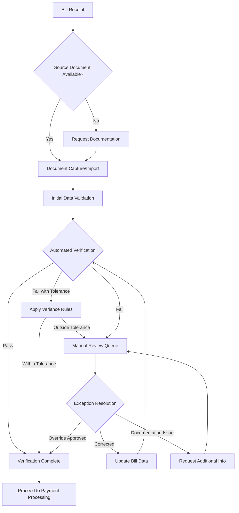
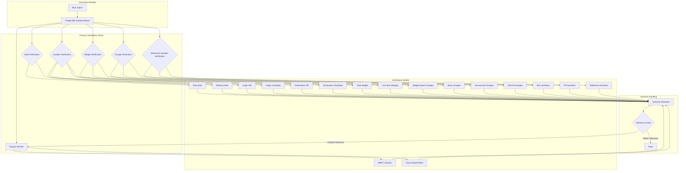
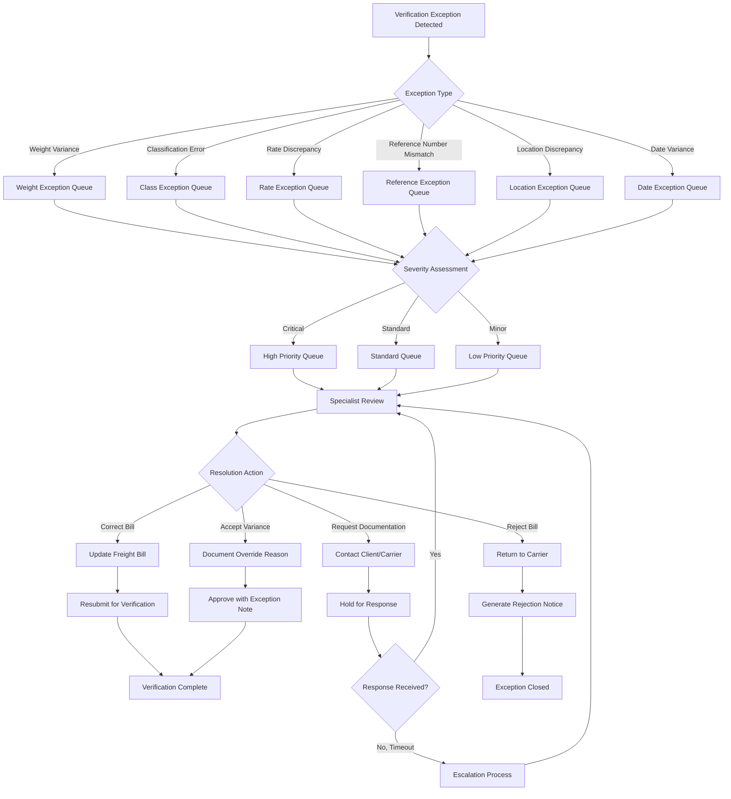

# Freight Bill Verification in AFS Shreveport

## Overview of Freight Bill Verification

Freight bill verification is a critical component of the AFS Shreveport system, serving as a quality control mechanism to ensure accuracy and compliance in freight billing operations. This process involves systematic comparison of freight bill data against source documents such as Bills of Lading (BOL) to identify discrepancies before processing payments. Effective verification prevents overpayment, ensures contractual compliance, and maintains data integrity throughout the logistics chain. In AFS Shreveport, verification is implemented through configurable rules that can be tailored to client-specific requirements, with options for both automated and manual verification workflows. The system's verification capabilities extend beyond simple data matching to include variance tolerance management, which allows for acceptable deviations in certain fields like weights and amounts based on industry standards and client preferences.

## Freight Bill Verification Workflow

The freight bill verification workflow in AFS Shreveport follows a structured process from receipt to approval. The system first checks for the availability of source documents like BOLs. When documents are available, they undergo capture and import, followed by initial data validation against predefined rules. The automated verification engine then compares key fields between the freight bill and source documents, applying client-specific tolerance thresholds for certain fields like weights and amounts. 

Bills that pass verification or have variances within acceptable tolerances proceed to payment processing. Those with significant discrepancies are routed to a manual review queue where specialists can resolve exceptions through correction, approval overrides, or by requesting additional documentation. This workflow ensures that only validated bills proceed to payment, maintaining financial accuracy while accommodating the practical realities of freight documentation.

## Bill of Lading Data Verification

The Bill of Lading (BOL) data verification process in AFS Shreveport involves a comprehensive comparison between BOL documents and freight bills to ensure data consistency and accuracy. The system extracts key data elements from BOLs, including shipper and consignee information, shipping dates, locations, weights, freight classes, and reference numbers. These elements are then systematically compared against corresponding fields in the freight bill records.

The verification logic, particularly evident in the `FB.DISPLAY.BOL.DATA` subroutine, implements field-specific validation rules. For shipping dates, the system checks for exact matches or acceptable date ranges. Location data verification includes validation of city names, state codes, and ZIP codes, with built-in intelligence to handle formatting variations. Weight verification is particularly critical, as it directly impacts freight charges, with the system capable of comparing both total weights and individual line item weights across multiple freight classes.

The system also verifies freight classification codes, which determine rate calculations, and validates accessorial charges to ensure they match the services documented in the BOL. This comprehensive verification approach ensures that the freight bill accurately reflects the actual shipment characteristics documented in the BOL, providing a solid foundation for accurate billing and payment processing.

## Variance Detection and Tolerance Management

AFS Shreveport implements a sophisticated variance detection and tolerance management system that recognizes the practical realities of freight documentation. Not all discrepancies between BOL and bill data require rejection or manual intervention, as minor variations are common in the logistics industry. The system addresses this through configurable tolerance thresholds that define acceptable variance ranges for specific data elements.

Weight variances are particularly important in freight billing, as they directly impact charges. The system allows clients to define percentage-based or absolute weight variance tolerances. For example, a client might configure the system to accept weight variances of up to 2% or 100 pounds, whichever is smaller. Similar tolerance rules can be applied to freight charges and other numerical values.

The tolerance management functionality is controlled through client-specific configuration flags, with the primary settings stored in positions 254-256 of the CLIENTS record. These flags control whether BOL data should populate bill records, whether verification should be performed, and what variance tolerances should be applied. When variances are detected but fall within the configured tolerances, the system can automatically approve the bill while maintaining an audit trail of the detected variances. This approach balances the need for accuracy with operational efficiency, preventing unnecessary manual reviews while still ensuring that significant discrepancies receive appropriate attention.

## Data Verification Points

The diagram illustrates the critical verification points in the AFS Shreveport freight bill verification process. The system performs comprehensive validation across multiple data elements, with each verification point designed to catch specific types of discrepancies.

Date verification ensures that shipping and delivery dates on the freight bill match those on the BOL, which is crucial for service level compliance and accurate transit time calculation. Location verification validates origin and destination information, including ZIP codes, cities, and states, to prevent misrouting and ensure proper rate application based on shipping lanes.

Weight verification is particularly important as it directly impacts charges. The system verifies both total shipment weight and individual line item weights across multiple freight classes. Class verification ensures that the correct freight classification codes are applied, which significantly affects rate calculations.

Charge verification compares base rates, accessorial charges, and fuel surcharges between the BOL and freight bill to prevent overbilling. Reference number verification ensures that BOL numbers, purchase order numbers, and other client reference numbers are correctly captured for proper shipment tracking and allocation.

When variances are detected, the system applies client-specific tolerance rules to determine whether the discrepancy requires manual review or can be automatically approved. This structured approach to verification ensures comprehensive validation while maintaining operational efficiency.

## Client-Specific Verification Rules

AFS Shreveport's verification system is highly configurable, allowing for customized verification rules tailored to each client's unique requirements. This client-specific approach recognizes that different shippers have varying tolerance levels for data discrepancies and different priorities in their verification processes.

The foundation of this customization lies in the client configuration flags, particularly those stored in positions 254-256 of the CLIENTS record. The first flag controls whether BOL data should automatically populate bill records, enabling streamlined data entry for clients who provide reliable BOL information. The second flag determines whether verification should be performed at all, allowing some clients to bypass verification for certain shipment types or carriers. The third flag sets variance tolerances, which can be configured differently for each client based on their business requirements and risk tolerance.

Beyond these basic flags, clients can configure field-specific verification rules. For example, a client might require strict verification of weight and class for LTL shipments but allow greater tolerance for parcel shipments. Similarly, clients can specify which reference numbers are critical for their operations and require exact matching, versus those where minor variations are acceptable.

The system also supports client-specific rules for accessorial charge verification, allowing different validation criteria for services like liftgate, inside delivery, or residential delivery based on client contracts and preferences. This flexible approach ensures that verification processes align with each client's business needs while maintaining overall system integrity.

## Document Validation and Cross-Referencing

Document validation in AFS Shreveport extends beyond simple field-by-field comparison to include sophisticated cross-referencing between multiple document types. The system can validate freight bills against BOLs, as well as against purchase orders, delivery receipts, and other supporting documentation to ensure complete accuracy.

BOL verification forms the foundation of this process, comparing key shipment details like dates, locations, weights, and classes. The system also performs reference number matching across documents, ensuring that BOL numbers, PO numbers, and other client-specific references are consistent throughout the documentation chain. This cross-referencing capability is crucial for maintaining data integrity and providing a complete audit trail.

Accessorial charge validation is another critical component, verifying that services billed on the freight invoice are properly documented on the BOL or other supporting documents. For example, if a residential delivery fee is charged, the system can verify that the destination address is indeed classified as residential in the address validation system.

The document validation process also includes verification of carrier information, ensuring that the carrier on the freight bill matches the carrier assigned on the BOL. For shipments with multiple legs or involving multiple carriers, the system can validate each segment separately while maintaining the relationship between segments.

This comprehensive approach to document validation and cross-referencing ensures that all aspects of the freight transaction are accurately captured and billed, reducing disputes and improving financial accuracy.

## Verification Exception Handling

The verification exception handling workflow in AFS Shreveport provides a structured approach to managing discrepancies identified during the verification process. When exceptions are detected, they are first categorized by type (weight variance, classification error, rate discrepancy, etc.) and routed to specialized exception queues for appropriate handling.

Each exception undergoes severity assessment based on configurable rules, considering factors such as the magnitude of the variance, the financial impact, and client-specific priorities. Critical exceptions that could significantly impact billing accuracy or client relationships are flagged for high-priority handling, while minor variances may be processed with lower urgency.

Specialists reviewing exceptions have multiple resolution options: they can correct the freight bill data to match the source documentation, accept the variance with appropriate documentation if it's justified, request additional information from the client or carrier, or reject the bill entirely if the discrepancies cannot be resolved.

The system maintains a complete audit trail of exception handling, recording who reviewed each exception, what actions were taken, and the justification for any overrides or corrections. This comprehensive exception handling process ensures that verification issues are addressed systematically and consistently, with appropriate controls to maintain billing accuracy while accommodating legitimate variations in freight documentation.

## Automated vs. Manual Verification

AFS Shreveport employs a hybrid approach to freight bill verification, balancing automated verification processes with strategic manual intervention to optimize both efficiency and accuracy. The system's automated verification capabilities handle routine comparisons between freight bills and source documents, applying predefined rules and tolerance thresholds to identify discrepancies without human intervention. This automation is particularly effective for standard shipments with complete documentation and minor or no variances.

However, certain scenarios require manual verification by experienced specialists. Complex discrepancies that involve multiple interrelated fields often need human judgment to resolve correctly. Special handling cases, such as hazardous materials shipments or temperature-controlled freight, may have unique documentation requirements that benefit from manual review. Similarly, high-value shipments or those with unusual routing or service requirements often warrant additional scrutiny beyond automated checks.

The system intelligently routes verification tasks between automated and manual processes based on configurable rules. For example, new carriers or lanes might initially undergo manual verification until a pattern of accuracy is established, after which they can transition to automated verification. Similarly, bills with variances just outside tolerance thresholds might be automatically routed for manual review, while those with extreme variances might be automatically rejected.

This balanced approach ensures that routine verification is handled efficiently through automation, while complex cases receive the necessary human attention, optimizing both operational efficiency and verification accuracy.

## Verification Reporting and Analytics

AFS Shreveport provides comprehensive reporting and analytics capabilities for tracking verification metrics, enabling continuous improvement of the verification process. The system captures detailed data on exception rates, common discrepancies, and verification performance across various dimensions, allowing stakeholders to identify patterns and address root causes of verification issues.

Exception rate reporting breaks down verification failures by type (weight, class, rate, etc.), carrier, lane, and client, helping to identify systematic problems that may require process improvements or carrier discussions. Trend analysis shows how verification metrics change over time, allowing management to assess the impact of process changes or training initiatives.

Common discrepancy reporting highlights the most frequent verification issues, such as persistent weight variances with specific carriers or classification errors for certain commodities. This information can guide targeted improvement efforts or carrier compliance programs.

Verification performance metrics track the efficiency of the verification process itself, including metrics like average verification time, exception resolution time, and auto-verification rates. These metrics help operations teams optimize resource allocation and identify bottlenecks in the verification workflow.

Financial impact analysis quantifies the value of the verification process by tracking the monetary value of corrections made during verification, providing tangible ROI measurements for the verification function. Client-specific reporting allows account managers to share verification metrics with clients, demonstrating the value of the verification service and identifying opportunities for process improvement.

This robust reporting and analytics framework ensures that verification is not just a transactional process but a strategic function that continuously improves and delivers measurable business value.

## Integration Points in Verification Process

```mermaid
graph TD
    subgraph "External Systems"
        EDI[EDI Systems]
        DMS[Document Management Systems]
        CRM[Client Systems]
        CAR[Carrier Systems]
        TMS[Transportation Management Systems]
    end
    
    subgraph "AFS Shreveport Verification Process"
        VE[Verification Engine]
        DV[Data Validation]
        EH[Exception Handling]
        RM[Rules Management]
        AR[Audit Repository]
    end
    
    subgraph "Internal AFS Components"
        BI[Billing System]
        PM[Payment Management]
        RP[Reporting Platform]
        CM[Client Management]
        RT[Rate Tables]
        ML[Mileage Lookup]
        AD[Address Database]
    end
    
    EDI -->|Bill Import| VE
    DMS -->|Document Import| VE
    CRM -->|Shipment Data| VE
    CAR -->|Carrier Invoices| VE
    TMS -->|Shipment Details| VE
    
    VE -->|Verification Results| EDI
    VE -->|Document Status| DMS
    VE -->|Exception Notifications| CRM
    VE -->|Approval/Rejection| CAR
    
    VE <-->|Data Validation| DV
    VE <-->|Exception Processing| EH
    VE <-->|Rule Application| RM
    VE -->|Audit Trail| AR
    
    VE <-->|Bill Data| BI
    VE <-->|Payment Status| PM
    VE -->|Verification Metrics| RP
    VE <-->|Client Rules| CM
    VE <-->|Rate Verification| RT
    VE <-->|Distance Validation| ML
    VE <-->|Location Validation| AD
```

The verification process in AFS Shreveport is deeply integrated with multiple system components and external platforms, creating a cohesive ecosystem for comprehensive freight bill verification. The diagram illustrates these key integration points that enable seamless data flow and process coordination.

EDI integration allows for automated exchange of freight bill data with carriers and clients, supporting both inbound invoice receipt and outbound verification results. The document imaging system integration enables automatic association of digital documents with freight bills, providing verification specialists with immediate access to supporting documentation like BOLs, PODs, and weight tickets.

Client communication channels are integrated to facilitate exception notifications, approval requests, and status updates, ensuring that clients remain informed throughout the verification process. Rate management system integration enables automatic verification of freight charges against contracted rates, detecting billing errors and rate application issues.

Address validation services help verify location information on freight bills, ensuring accurate city/state/ZIP combinations and identifying potential misrouting issues. Mileage calculation tools validate distance-based charges by comparing billed miles against system-calculated distances using industry-standard databases.

Payment processing integration ensures that only verified bills proceed to payment, with appropriate handling of partial approvals, deductions, and payment timing based on verification outcomes. Reporting systems receive verification data to generate analytics on exception rates, financial impacts, and process performance.

These comprehensive integration points ensure that the verification process has access to all necessary data and can efficiently coordinate with other system components, creating a seamless end-to-end freight management solution.

## Continuous Improvement in Verification

The AFS Shreveport system approaches verification not as a static process but as a continuously evolving capability that improves over time through data-driven refinement. By systematically analyzing verification outcomes and patterns, the system enables ongoing enhancement of validation rules, tolerance thresholds, and verification workflows.

Exception pattern analysis forms the foundation of this improvement process. By tracking common verification failures across carriers, lanes, clients, and shipment types, the system can identify systematic issues that may require targeted interventions. For example, if a particular carrier consistently shows weight discrepancies on specific lanes, the system can flag this pattern for carrier compliance discussions or adjustment of verification parameters.

Verification rules undergo continuous refinement based on operational feedback and changing business requirements. As new shipping scenarios emerge or client needs evolve, verification rules can be adjusted to maintain the optimal balance between stringent validation and operational efficiency. The system's configurable architecture allows these adjustments to be implemented without programming changes, enabling rapid adaptation to changing conditions.

Machine learning techniques are increasingly applied to enhance verification accuracy. By analyzing historical patterns of verified bills, the system can develop predictive models that identify potential issues before they reach manual verification, improving both efficiency and accuracy. These models can also help optimize tolerance thresholds by identifying the ideal balance between exception rates and verification accuracy.

Client feedback loops ensure that verification processes remain aligned with client expectations and requirements. Regular reviews of verification metrics with clients provide opportunities to adjust verification parameters based on changing business priorities or emerging challenges.

This commitment to continuous improvement ensures that the verification process evolves alongside the freight industry, maintaining its effectiveness as a critical control point for freight billing accuracy and compliance.

[Generated by the Sage AI expert workbench: 2025-05-28 08:06:22  https://sage-tech.ai/workbench]: #