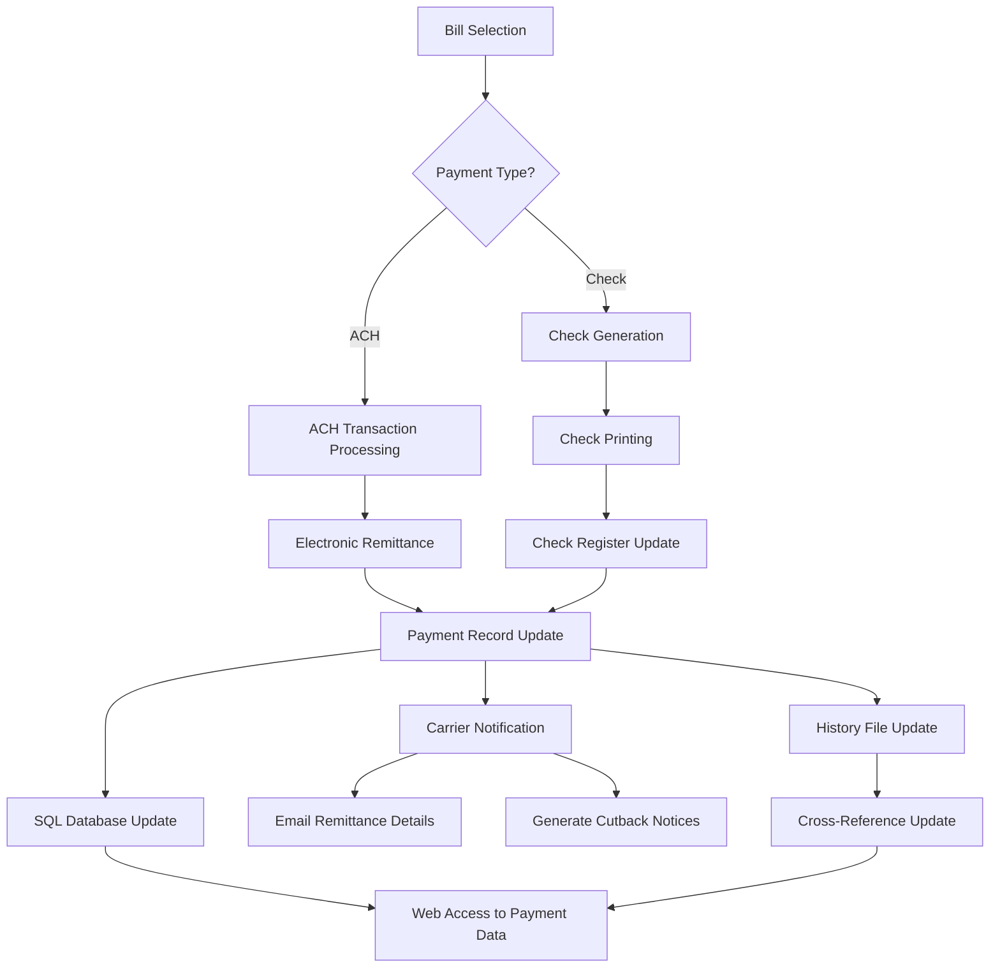
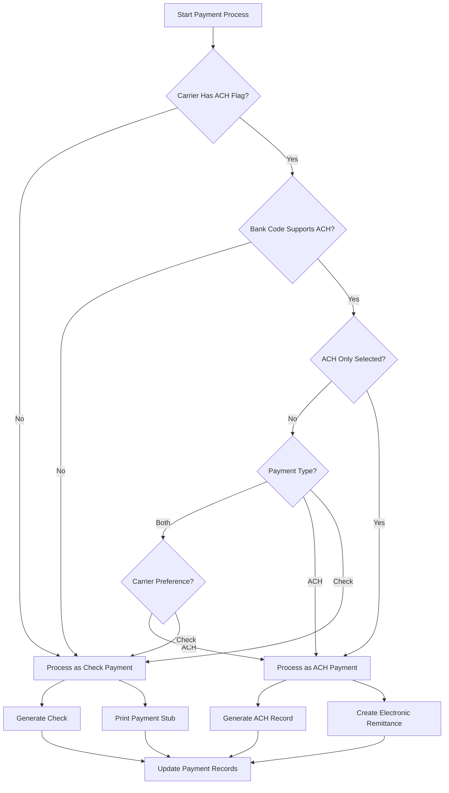
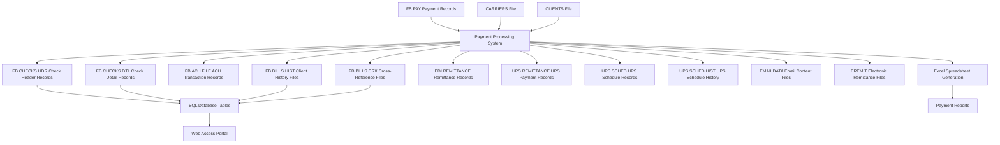

# Freight Payment Processing in AFS Shreveport

## Overview of Freight Payment Processing

The freight payment process in AFS Shreveport is a comprehensive workflow that manages carrier payments and financial transactions for logistics operations. The system handles the entire payment lifecycle, from bill selection to check issuance or electronic funds transfer. It supports multiple payment methods including traditional checks and ACH (Automated Clearing House) transactions, with specialized handling for major carriers like UPS, FedEx, and others. The system maintains detailed payment records, manages check numbering sequences, and provides electronic remittance advice to carriers. It also implements sophisticated payment adjustment mechanisms, including cutbacks with reason codes, and integrates with both internal databases and external accounting systems to ensure accurate financial tracking and reporting.

## Freight Payment Processing Workflow

The freight payment workflow begins with bill selection based on criteria such as carrier, client, and process date. The system then determines the appropriate payment method (check or ACH) based on carrier settings and bank configurations. For ACH transactions, the system creates electronic payment records and generates remittance advice. For check payments, the system prints checks with detailed payment stubs. In both cases, payment records are updated in multiple systems, including the check register, payment history files, and SQL databases for web access. The system also sends notifications to carriers, including email remittance details and cutback notices explaining short payments. The process concludes with comprehensive updates to history files and cross-reference tables, ensuring complete traceability of all payment transactions.

## Check Generation and Management

The check generation process in AFS Shreveport is highly structured to maintain financial integrity and accurate record-keeping. The system manages check numbering sequences for multiple bank accounts, with safeguards to prevent duplicate check numbers. When generating checks, the system first validates the availability of the next check number and can automatically void missing check numbers in a sequence if needed.

Checks are formatted according to specific templates, with support for both standard US formats and specialized Canadian check formatting that accommodates different date and amount presentation requirements. The system prints detailed payment stubs with the checks, showing individual freight bill information including dates, PRO numbers, billed amounts, paid amounts, and any cutback reasons. For payments with extensive line items, the system can generate overflow stubs or provide electronic remittance advice.

The check management process includes comprehensive record-keeping, with each check linked to its associated freight bills in the FB.CHECKS.HDR and FB.CHECKS.DTL files. The system also maintains cross-reference files by check date (FB.CHECK.DATE.XREF) to facilitate tracking and reporting. For void checks, the system properly marks them in the database while maintaining the audit trail. The system also supports manual check generation for special payment scenarios outside the standard freight payment process.

## ACH and Electronic Payments

AFS Shreveport's ACH transaction processing provides a streamlined alternative to paper checks for carrier payments. The system identifies ACH-eligible carriers through a flag in the carrier record (field 102) and processes these payments separately from check payments. When processing ACH transactions, the system generates electronic payment records in the FB.ACH.FILE, capturing essential information including the carrier's name (limited to 22 characters with special characters removed), routing number, account number, and payment amount.

The system supports bank-specific ACH configurations, allowing different bank accounts (identified by bank codes like 'F', 'M', etc.) to be used for ACH transactions. For ACH payments, the system uses a separate check number sequence defined in the bank record, ensuring proper tracking and reconciliation.

Electronic remittance is a key component of the ACH process, with the system generating detailed remittance advice that can be emailed to carriers. The remittance information includes payment details such as invoice numbers, PRO numbers, amounts, and any adjustment information. The system maintains carrier-specific email addresses for remittance delivery and can format the remittance data according to carrier requirements, including specialized formats for major carriers like UPS and FedEx.

The ACH process also includes proper record-keeping, with ACH transactions recorded in the check history files with appropriate flags to distinguish them from paper checks. This ensures consistent tracking and reporting across all payment methods.

## Payment Method Decision Tree

The decision process for determining payment method begins with checking if the carrier has an ACH flag set in their record. If the carrier is not set up for ACH, the system defaults to check payment. For ACH-enabled carriers, the system verifies if the selected bank account supports ACH transactions. Bank codes like 'F' and 'M' support ACH, while others like 'C' may not.

The user can also specify an "ACH Only" option during the payment run, which restricts processing to only ACH-eligible transactions. When "Both" payment types are selected, the system processes each carrier according to their configured preference.

For ACH payments, the system generates an electronic record with the carrier's banking information and creates appropriate electronic remittance advice. For check payments, the system generates a physical check and prints detailed payment stubs. In both cases, comprehensive payment records are updated to maintain accurate financial tracking.

## Carrier Remittance and Notifications

AFS Shreveport implements a sophisticated carrier notification system that provides detailed remittance information through various channels. The system automatically generates and sends electronic remittance advice to carriers based on their configured preferences and capabilities.

For carriers with electronic remittance capabilities, the system creates formatted remittance files that include comprehensive payment details such as invoice numbers, PRO numbers, billed amounts, paid amounts, and any adjustment reasons. These files are automatically emailed to carrier-specific addresses stored in the carrier record. The system supports different remittance formats for major carriers, including specialized formats for UPS, FedEx, and DHL.

The remittance notification process includes several carrier-specific customizations:
- For FedEx EDI payments, the system sends remittance to "e-remit@fedex.com" with a tab-delimited file containing tracking numbers and payment amounts
- For UPS payments, the system generates a REPS file sent to "payups@ups.com" with account numbers, tracking numbers, and payment amounts
- For DHL Express, the system sends a specialized format to "dhlach.remit@dhl.com"

The system also maintains internal notification workflows, alerting AFS staff about specific carrier payments that require special handling. For example, certain carriers have configured notifications to remind staff about special shipping requirements for the physical checks.

For carriers without electronic remittance capabilities, the system prints detailed payment stubs with the checks, providing the same level of payment information in physical form. When payment stubs exceed the available space, the system generates overflow stubs that are printed separately.

## Payment Adjustments and Cutbacks

The AFS Shreveport system provides robust capabilities for managing payment adjustments and cutbacks, allowing for precise control over payment amounts and clear communication of adjustment reasons to carriers. The system supports predefined adjustment codes stored in the FB.TABLES file under the "CHECK.ADJUST" record, each with an associated description and amount.

During the payment process, users can select an adjustment code to apply to specific carriers. For adjustments with variable amounts, the system prompts the user to enter the specific adjustment amount. These adjustments are then applied to the carrier's payment and clearly documented on the payment stub.

For individual freight bills that are paid less than the billed amount (cutbacks), the system tracks detailed information including the original billed amount, the reduced amount, the final paid amount, and the reason for the reduction. This information is displayed on the payment stub and included in electronic remittance advice.

The system also generates specialized cutback notifications for carriers, automatically emailing a detailed report of all bills that were paid short in a given payment run. These notifications include comprehensive information about each cutback, including the client name, auditor name, PRO date, PRO number, billed amount, reduced amount, paid amount, and the reason for the short payment. The cutback emails are sent to carrier-specific email addresses configured in the carrier record, ensuring that the right personnel receive this important information.

All adjustment and cutback information is permanently stored in the payment history records, providing a complete audit trail of payment modifications and supporting future analysis and dispute resolution.

## Data Integration Points

The freight payment system integrates with numerous data repositories to maintain comprehensive payment records and support various business functions. The core payment data originates in the FB.PAY file, which contains the freight bills selected for payment. During processing, the system interacts with the CARRIERS and CLIENTS files to retrieve essential information about payment recipients and payers.

As payments are processed, the system updates multiple record sets:
- FB.CHECKS.HDR and FB.CHECKS.DTL store check header and line item details
- FB.ACH.FILE maintains electronic payment records
- FB.BILLS.HIST client-specific history files preserve complete payment history
- FB.BILLS.CRX cross-reference files enable efficient data retrieval
- EDI.REMITTANCE and carrier-specific remittance files (like UPS.REMITTANCE) store electronic remittance data
- UPS.SCHED and UPS.SCHED.HIST track UPS-specific payment schedules

The system also generates various output files including email content in EMAILDATA and electronic remittance files in EREMIT. A critical integration point is the synchronization with SQL database tables, which makes payment data available through the web access portal.

The system also includes functionality to generate Excel spreadsheets for payment reporting and analysis. This comprehensive data integration ensures that payment information is consistently maintained across all systems and accessible to all stakeholders through appropriate channels.

## Special Carrier Handling Requirements

The AFS Shreveport system implements numerous carrier-specific payment processing rules to accommodate the unique requirements of major carriers and specialized transportation providers. These special handling requirements ensure that payments are processed correctly and reach the appropriate departments within each carrier organization.

For major carriers, the system includes specialized remittance formatting and delivery methods:
- FedEx payments utilize EDI remittance sent to "e-remit@fedex.com" with specific formatting requirements
- UPS payments include REPS (Remittance Electronic Payment System) files with account and tracking information
- DHL Express payments require specialized remittance formatting sent to "dhlach.remit@dhl.com"
- Airborne Express payments include specific department routing information

The system also manages carrier-specific payment addresses and routing instructions. For EDI-enabled carriers, the system may use different payment addresses than those used for standard check payments. For example, FedEx EDI payments are directed to "FedEx ERS, PO Box 371741, Pittsburgh, PA 15250-7741" rather than the standard payment address.

For certain carriers, the system triggers notification emails to internal staff with specific handling instructions. These notifications include details about special shipping requirements for physical checks, such as using carrier-specific FedEx or UPS account numbers for overnight delivery. Examples include:
- JED Service checks for Calgon Carbon using UPS Next Day Air Collect
- Motor Ways Inc checks using a specific FedEx account
- Racing Cargo checks requiring preprinted FedEx International Airbills

The system also handles international carriers with appropriate formatting for addresses and payment information. For Canadian carriers, the system implements special check formatting with different date and amount presentation to comply with Canadian banking requirements.

These carrier-specific handling rules ensure that payments are processed efficiently and reach the correct departments, minimizing payment application delays and reconciliation issues.

## Record Keeping and Payment History

The AFS Shreveport system maintains comprehensive payment records and history, ensuring complete traceability and supporting detailed reporting and analysis. The record keeping architecture spans multiple files and databases, creating a robust audit trail for all payment transactions.

The primary payment records are stored in the FB.CHECKS.HDR and FB.CHECKS.DTL files, which contain check header information and detailed line items respectively. Each check record includes essential information such as check number, check date, carrier, total amount, and links to the individual freight bills paid. The system also maintains FB.CHECK.DATE.XREF files that provide date-based cross-references to facilitate retrieval by payment date.

For each client, the system maintains detailed payment history in client-specific FB.BILLS.HIST files. These records track all payments made on behalf of the client, including the freight bill details, carrier information, and payment references. The FB.BILLS.CRX cross-reference files provide additional indexing to support efficient data retrieval and reporting.

For electronic payments, the system maintains parallel record structures in the FB.ACH.FILE, ensuring consistent tracking regardless of payment method. Specialized carrier payment records are also maintained in carrier-specific files like UPS.REMITTANCE and UPS.SCHED.HIST.

The system synchronizes payment data with SQL database tables, making the information available through web portals for both internal users and external stakeholders. This enables clients and carriers to access payment information online without requiring direct access to the core system.

Payment history is preserved indefinitely, supporting historical analysis, trend reporting, and dispute resolution. The comprehensive record keeping ensures that all payment details remain accessible and properly cross-referenced throughout the lifecycle of the freight payment relationship.

## Error Handling and Exception Processing

The AFS Shreveport system implements robust error handling and exception processing mechanisms to maintain data integrity and ensure proper payment processing even when issues arise. The system includes multiple validation checks and recovery procedures to address various error scenarios.

One critical error handling feature is the detection and prevention of duplicate check numbers. The system validates check numbers before processing and alerts users if a check number is already in use. If a check run is interrupted due to a duplicate check number, the system sends automated email notifications to key personnel and allows the process to be resumed from the point of interruption when restarted with a valid check number.

The system also manages missing check numbers in a sequence by offering users the option to automatically void the missing numbers, ensuring continuous check numbering without gaps. This prevents reconciliation issues and maintains proper audit trails.

For payment processing errors, the system implements transaction locking to prevent concurrent payment runs that could lead to data corruption. If a user attempts to run the payment process while another session is active, the system displays a warning message with details about the existing process and sends email notifications to system administrators.

Exception handling for carrier-specific requirements includes fallback procedures when electronic remittance delivery fails. The system can detect when electronic remittance cannot be sent and automatically generates printed remittance advice as an alternative.

The system also includes specialized handling for payment adjustments and cutbacks, ensuring that all payment modifications are properly documented and communicated. When payments are reduced from the original billed amount, the system generates detailed cutback notices explaining the reasons for the reduction.

For system integration issues, the system includes error detection and reporting mechanisms that alert administrators when data synchronization with SQL databases or other external systems fails. This ensures that any integration issues can be promptly addressed to maintain data consistency across all systems.

[Generated by the Sage AI expert workbench: 2025-05-28 08:06:23  https://sage-tech.ai/workbench]: #