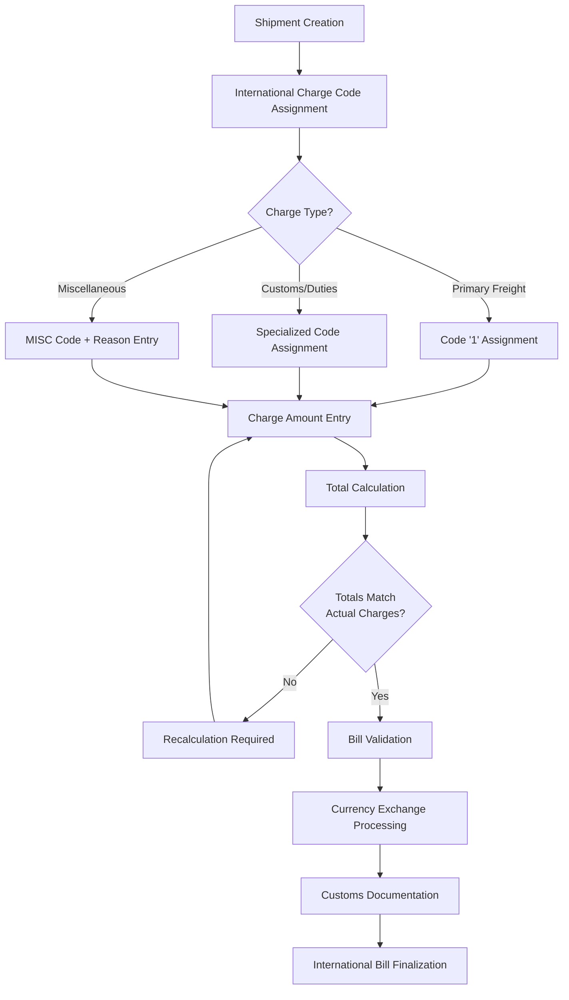
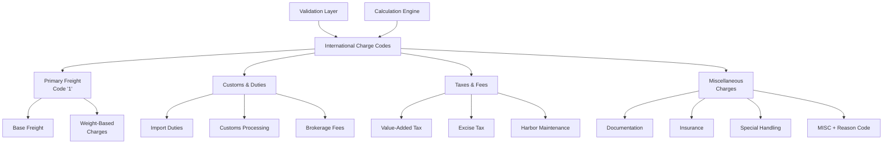
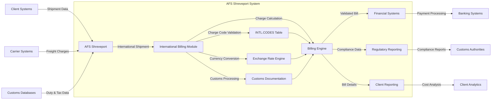
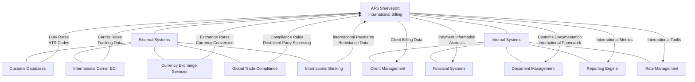

# International Freight Billing in AFS Shreveport

## Introduction to International Freight Billing

International freight billing within the AFS Shreveport system represents a critical component for managing cross-border shipments and global logistics operations. Unlike domestic freight management, international shipping involves complex regulatory requirements, multiple currencies, customs documentation, and specialized charge codes. The system has been specifically adapted to handle these unique challenges, providing a comprehensive solution for processing international freight bills. The international freight billing module builds upon the domestic freight billing architecture but incorporates specialized functionality to address the complexities of global shipping, including duty management, customs fees, and currency conversion. This specialized module ensures accurate billing, compliance with international regulations, and efficient processing of cross-border shipments, ultimately supporting AFS clients in their global logistics operations.

## Core Components of International Freight Management

International freight management in the AFS Shreveport system consists of several key components designed to handle the unique aspects of global shipping. At its core, the system utilizes specialized charge codes specifically for international shipments, with code '1' representing the primary freight charge (adapted from the domestic system). The charge code structure supports duty management, customs fees, brokerage charges, and other international-specific expenses. Currency exchange functionality allows for billing and reconciliation across multiple currencies, with conversion rates applied at appropriate stages of the process. The system maintains comprehensive customs documentation tracking to ensure compliance with international regulations and border requirements. Additionally, specialized validation rules verify that international shipments meet both system requirements and regulatory standards. These components work together to provide a robust framework for managing the complexities of international freight billing, ensuring accuracy and compliance throughout the process.

## International Freight Billing Workflow

The international freight billing workflow in AFS Shreveport follows a structured process designed to handle the complexities of cross-border shipments. The process begins with shipment creation, where basic origin and destination information is captured. The system then facilitates the assignment of appropriate international charge codes, with code '1' automatically assigned as the primary freight charge. Based on the nature of the charges, the system routes the entry through different paths - primary freight charges, customs/duties, or miscellaneous charges (which require additional documentation). 

After charge code assignment and amount entry, the system performs automatic calculations to ensure that all charges are properly accounted for and that the total matches the actual charges. If discrepancies are found, the system prompts for recalculation. Once validated, the bill undergoes currency exchange processing if necessary, followed by customs documentation association. The workflow concludes with final validation and bill finalization, ensuring all international requirements have been met before the freight bill is processed for payment.

## Charge Code Structure and Management

International charge codes in the AFS Shreveport system follow a specialized structure designed to accommodate the unique requirements of cross-border shipping. The primary freight charge is designated by code '1', which was adapted from the domestic freight billing system but tailored for international use. Beyond the primary code, the system supports a comprehensive set of specialized codes for duties, taxes, customs fees, brokerage charges, and other international-specific expenses. Each charge code is linked to a description that clearly identifies its purpose, ensuring clarity in billing documentation.

The system enforces strict validation rules for these codes, requiring that they exist in the predefined INTL.CODES table before they can be applied to a freight bill. For miscellaneous charges (MISC code), the system mandates additional documentation in the form of a reason code, ensuring transparency and auditability. The charge code structure also supports hierarchical relationships, with primary freight charges serving as the foundation and additional charges building upon this base. This structured approach ensures that all international charges are properly categorized, validated, and documented, facilitating accurate billing and reporting for global shipments.

## International Charge Code Hierarchy

The International Charge Code Hierarchy diagram illustrates the structured organization of charge codes within the AFS Shreveport system for international freight billing. At the top level, charge codes are categorized into four main groups: Primary Freight (using code '1'), Customs & Duties, Taxes & Fees, and Miscellaneous Charges.

The Primary Freight category includes base freight charges and weight-based charges, forming the foundation of the billing structure. Customs & Duties encompasses import duties, customs processing fees, and brokerage charges that are essential for cross-border shipments. The Taxes & Fees section covers various governmental and regulatory charges such as value-added tax, excise tax, and harbor maintenance fees.

Miscellaneous Charges include documentation fees, insurance, special handling requirements, and other charges that require specific reason codes for transparency. The entire hierarchy is supported by a validation layer that ensures all codes are properly formatted and exist in the system, and a calculation engine that processes the charges according to business rules and international regulations. This hierarchical structure enables the system to maintain organization and clarity while handling the complex charging requirements of international freight.

## Currency Exchange and Financial Reconciliation

Currency exchange and financial reconciliation represent critical components of the AFS Shreveport international freight billing system. The system is designed to handle multiple currencies seamlessly, allowing for the entry, processing, and reporting of freight charges in various international denominations. When processing international shipments, the system captures both the original currency and amount, as well as performing conversions to the client's base currency for consistent reporting and financial integration.

Exchange rates are managed through a centralized database that can be updated regularly to reflect current market rates. The system applies these rates at various stages of the billing process, including initial entry, validation, and final billing. For financial reconciliation, the system maintains a comprehensive audit trail of all currency conversions, ensuring transparency and accuracy in financial reporting.

The reconciliation process includes matching converted amounts across systems, validating exchange rates applied, and ensuring that all international charges are properly accounted for in both the original and converted currencies. This dual-currency tracking is particularly important for clients operating across multiple countries, as it allows them to analyze shipping costs in both local and base currencies. Additionally, the system supports currency-specific reporting, enabling financial teams to understand the impact of currency fluctuations on overall shipping costs and to make informed decisions about international shipping strategies.

## Customs Documentation and Compliance

The AFS Shreveport system provides robust capabilities for managing customs documentation and compliance requirements for international freight. The system maintains comprehensive records of all documentation required for cross-border shipments, including commercial invoices, certificates of origin, packing lists, and customs declarations. These documents are linked directly to the freight bill, creating a complete audit trail for compliance purposes.

For regulatory compliance, the system incorporates validation rules specific to international shipping requirements, ensuring that all necessary information is captured before a shipment can be processed. This includes verification of harmonized tariff codes, export/import license information, and country-specific regulatory requirements. The system also tracks customs clearance status, allowing users to monitor the progress of shipments through customs processes and identify potential delays or issues.

Additionally, the AFS Shreveport system supports the management of customs bonds and guarantees, ensuring that financial obligations related to duties and taxes are properly tracked and fulfilled. The system can generate customs-specific reports for both internal compliance monitoring and external reporting to regulatory authorities. By centralizing customs documentation and compliance management within the freight billing system, AFS Shreveport provides clients with a streamlined approach to managing the complex regulatory requirements of international shipping, reducing the risk of compliance issues and associated penalties.

## International Billing Data Flow

The International Billing Data Flow diagram illustrates how information moves through the AFS Shreveport system during international freight billing processes. The flow begins with data inputs from three primary sources: client systems providing shipment details, carrier systems supplying freight charges, and customs databases delivering duty and tax information.

Once this data enters the AFS Shreveport system, it's routed to the International Billing Module, which serves as the central processing hub. This module interacts with several key components: the INTL.CODES table for charge code validation, the Exchange Rate Engine for currency conversion, the Customs Documentation system for regulatory compliance, and the Billing Engine for charge calculation and validation.

The Billing Engine processes all this information to produce three main outputs: validated bills sent to financial systems for payment processing, compliance data directed to regulatory reporting for customs authorities, and detailed billing information provided to client reporting systems for cost analysis.

The diagram shows how data flows not only within the AFS Shreveport system but also extends to external systems, including banking systems for payment processing, customs authorities for compliance reporting, and client analytics platforms for cost analysis. This comprehensive data flow ensures that all aspects of international freight billing—from charge validation to customs compliance to financial reconciliation—are handled efficiently and accurately within a single integrated system.

## Validation Rules and Error Handling

The AFS Shreveport system implements a comprehensive set of validation rules specifically designed for international freight bills, ensuring accuracy and compliance throughout the billing process. These rules begin with basic validations such as ensuring that all charge codes exist in the INTL.CODES table and that required fields contain appropriate values. For international shipments, additional validations include verifying that country codes are valid, customs documentation is complete, and currency information is properly specified.

The system enforces business rules specific to international billing, such as requiring reason codes for miscellaneous charges and ensuring that the total of all line items matches the actual charges. This validation is particularly critical for international shipments, where discrepancies can lead to customs delays or compliance issues. The system also validates currency-related information, ensuring that exchange rates are within acceptable ranges and that converted amounts are calculated correctly.

Error handling in the international freight billing module follows a structured approach. When validation failures occur, the system provides specific error messages that clearly identify the issue and suggest corrective actions. For critical errors that prevent bill processing, the system blocks progression until the issues are resolved. Less critical issues may generate warnings that allow processing to continue but flag the bill for review.

The system maintains a comprehensive audit trail of all validation failures and corrections, ensuring transparency and accountability throughout the process. This approach to validation and error handling helps prevent costly mistakes in international billing, reduces customs delays, and ensures compliance with both system requirements and international regulations.

## Reporting and Analytics for International Freight

The AFS Shreveport system offers specialized reporting and analytics capabilities designed specifically for international shipments, providing valuable insights into global logistics operations. These reporting tools enable clients to analyze duty costs across different countries and regions, identifying opportunities for duty optimization and compliance improvement. Customs fee tracking reports provide detailed breakdowns of fees by type, country, and carrier, helping to identify trends and anomalies in customs processing.

International carrier performance reports measure key metrics such as on-time delivery, customs clearance time, and documentation accuracy across global carriers, enabling data-driven carrier selection and performance management. Currency impact analysis reports help clients understand how exchange rate fluctuations affect their overall shipping costs, providing valuable information for financial planning and risk management.

The system also generates compliance reports that track documentation completeness, customs holds, and regulatory issues across international shipments, helping to identify and address compliance gaps before they lead to penalties or delays. Route analysis reports compare costs and transit times across different international shipping lanes, supporting optimal routing decisions for global shipments.

These specialized reporting capabilities are complemented by customizable dashboards that provide real-time visibility into international shipping metrics, allowing users to monitor key performance indicators and respond quickly to emerging issues. By providing comprehensive analytics specific to international freight, the AFS Shreveport system enables clients to make informed decisions about their global logistics operations, optimize costs, and improve compliance with international regulations.

## System Integration Points for International Billing

The System Integration Points diagram illustrates how the International Billing module of AFS Shreveport connects with both external and internal systems to facilitate comprehensive international freight management.

On the external side, the system integrates with five key types of systems: Customs Databases that provide duty rates and harmonized tariff schedule (HTS) codes; International Carrier EDI systems that supply carrier rates and tracking data; Currency Exchange Services that deliver up-to-date exchange rates for accurate currency conversion; Global Trade Compliance systems that provide compliance rules and restricted party screening; and International Banking systems that handle international payments and remittance data.

Internally, the International Billing module connects with Client Management systems to provide client-specific billing data; Financial Systems for payment processing and accruals; Document Management systems to store and retrieve customs documentation and international paperwork; the Reporting Engine to deliver international metrics and analytics; and Rate Management systems to maintain international tariffs and pricing.

These integration points create a comprehensive ecosystem that enables the seamless flow of information between the International Billing module and other critical systems, both within and outside the AFS Shreveport platform. This interconnected architecture ensures that international freight billing processes have access to all necessary data—from customs requirements to carrier rates to currency exchange information—while also feeding processed billing information to downstream systems for financial management, reporting, and client service.

[Generated by the Sage AI expert workbench: 2025-05-28 08:06:23  https://sage-tech.ai/workbench]: #