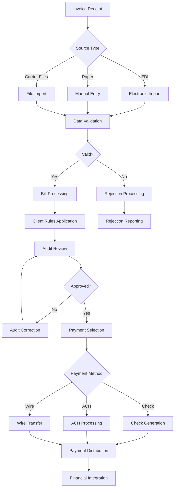
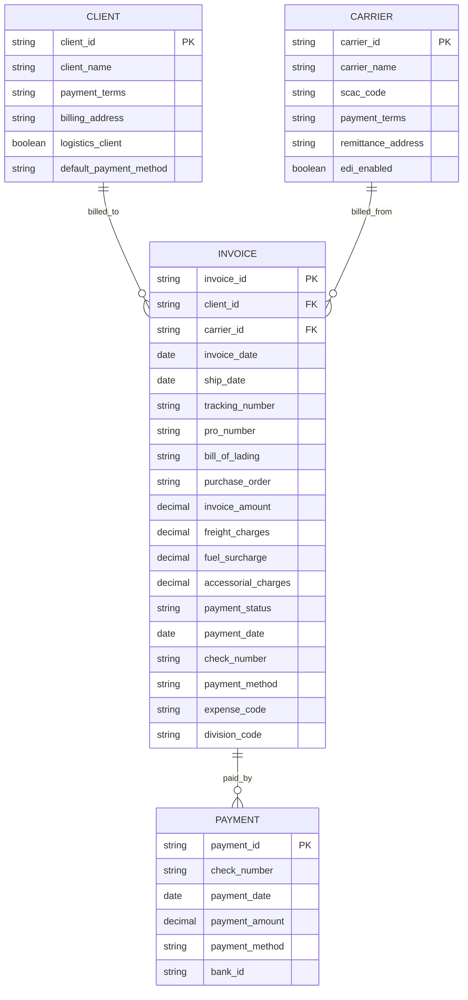
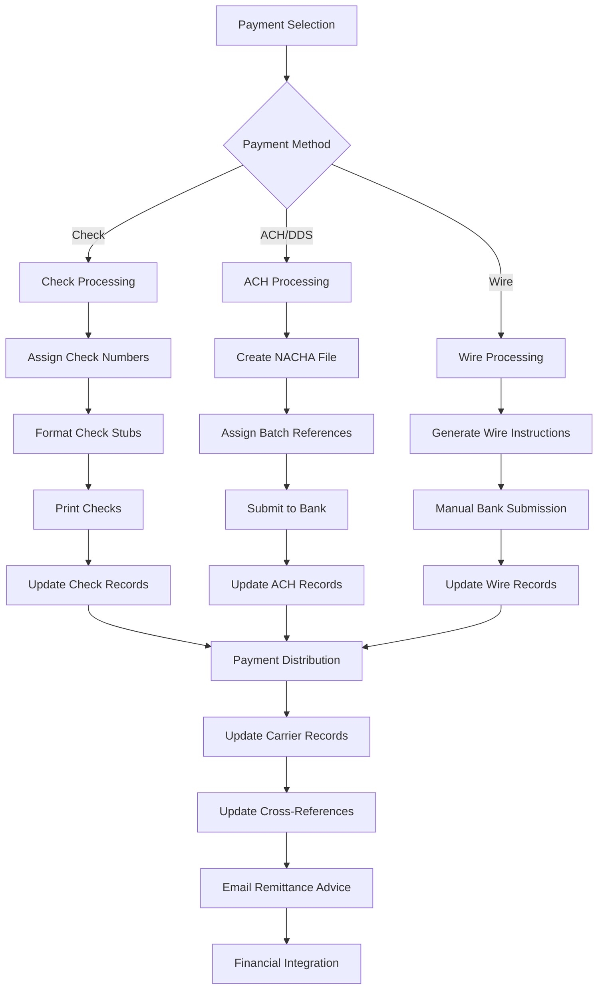
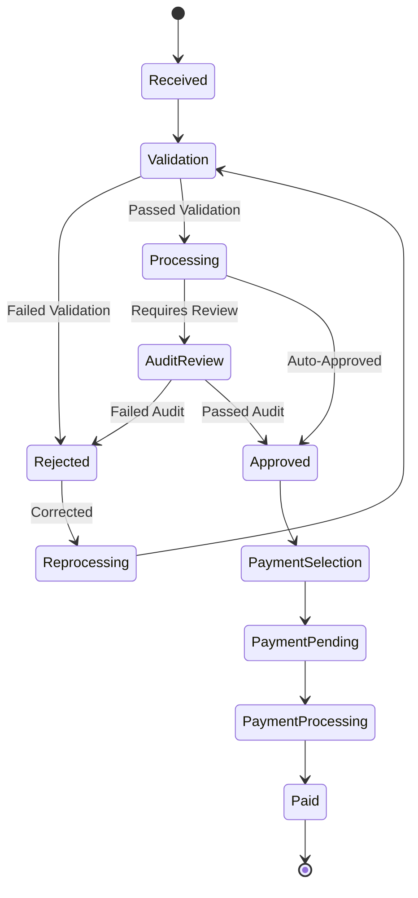

# Overview of Invoice Processing in AFS Shreveport

The AFS Shreveport System implements a comprehensive invoice processing workflow that manages freight bills from creation through payment across multiple carrier types. The system serves as the central platform for handling all aspects of invoice management, including data import, validation, payment selection, check generation, and financial integration. It supports various carrier types including LTL, Truckload, Parcel (UPS, FedEx), and Air Freight, with specialized processing paths for each. The system is designed to handle both standard and specialized billing scenarios, with extensive support for client-specific rules, carrier agreements, and payment terms.

## Invoice Processing Workflow

The workflow begins with invoice receipt through various channels, proceeds through validation and processing stages, and culminates in payment selection and financial integration. Each step involves specific business rules and validation checks to ensure accuracy and compliance with client and carrier agreements.

## Invoice Creation and Data Import

The AFS Shreveport system supports multiple methods for invoice creation and data import. Electronic Data Interchange (EDI) is a primary method for high-volume carriers like UPS and FedEx, allowing automated import of invoice data directly into the system. The system processes specialized formats for each carrier, with programs like `LOAD.FEDEX.PARCEL.FP.DATA` handling FedEx Parcel data and `LOAD.PCL.DATA.TEST.BILLDATA` managing parcel data from SLC (Salt Lake City).

For non-EDI carriers, the system supports file imports through various formats including CSV, tab-delimited text, and specialized carrier formats. Programs like `LOAD.CONT.CART.FP.DATA` and `LOAD.ECON.EXPR.FP.DATA` handle these imports, transforming external data into the standardized internal format required by the system.

Manual entry is also supported through programs like `LI.BILL.ENTRY`, which provides a comprehensive interface for creating and modifying invoices. This includes capturing shipper information, consignee data, billing preferences, and line items.

The system maintains cross-references between various identifiers (carrier PRO numbers, invoice numbers, tracking numbers) to ensure proper tracking and association of related records throughout the processing lifecycle.

## Validation and Verification

Invoice validation is a critical component of the AFS Shreveport system, ensuring that all invoices are accurate and comply with client rules and carrier agreements before processing. The validation process includes multiple checks:

1. **Carrier Validation**: The system verifies that the carrier is active and approved for the client. Programs like `LOAD.PCL.DATA.TEST.BILLDATA` check carrier status and send email notifications if inactive carriers are found.

2. **Client Rules Application**: Each client can have specific rules for invoice processing, including expense code assignments, division codes, and approval requirements. These rules are applied during the validation phase.

3. **Reference Data Verification**: The system validates reference information such as PRO numbers, tracking numbers, and invoice numbers against expected formats and existing records.

4. **Rate Verification**: For many clients, the system validates carrier charges against contracted rates or benchmarks, identifying potential overcharges or discrepancies.

5. **Duplicate Detection**: Programs like `FEDEX.RES` identify and handle duplicate invoices to prevent double payment.

When validation issues are detected, the system can either reject the invoice outright or flag it for manual review. Rejected invoices are tracked in specialized files and can be reported through programs like `FB.2.3.NW`, which includes rejection reporting functionality.

The validation process ensures that only accurate and compliant invoices proceed to the payment selection phase, reducing errors and improving financial control.

## Invoice Data Structure

The invoice data structure in AFS Shreveport is comprehensive, capturing all relevant information needed for processing, payment, and reporting. The core invoice record contains client and carrier information, shipping details, financial data, and payment tracking.

The system maintains this data across multiple files, with the primary invoice data stored in client-specific `FB.BILLS.HIST` files. Cross-reference files like `FB.BILLS.CRX` and `FED.INV.XREF` maintain relationships between different identifiers (PRO numbers, invoice numbers, tracking numbers).

Payment information is stored in `FB.CHECKS.HDR` and `FB.CHECKS.DTL` files, with cross-references to the original invoice records. This structure allows for efficient tracking of payments and reconciliation with invoice data.

The system also maintains specialized files for different carrier types, such as `UPS.SCHED` for UPS shipments and `PAST.DUE.INV` for late fee processing. These specialized structures support the unique requirements of different carrier relationships and billing models.

## Payment Selection and Processing

Payment selection in AFS Shreveport is a sophisticated process that considers due dates, client preferences, and payment terms. The `FB.5.1` program allows users to select open freight bills for payment based on multiple criteria:

1. **Cash Receipt Date**: When payment was received from the client
2. **Payment Type**: Wire, DDS (Direct Deposit System)/ACH, or Check
3. **Process Date**: When the payment should be processed
4. **Deposit Date**: When funds should be deposited
5. **Client and Carrier Filters**: To select specific subsets of bills

The system calculates appropriate payment dates based on configured schedules, taking into account holidays and weekends. It also validates payment selections against client default payment methods, flagging conflicts for review.

For clients with pre-funding requirements (like UPS and FedEx), the system includes specialized handling through programs like `PPP.SEND.EMAIL` that manage notification and payment timing.

The payment selection process creates records in the `FB.PAY` file, which are then used by subsequent processes for check printing, ACH file generation, or wire transfer instructions.

## Check and ACH Payment Generation

Once payments are selected, the AFS Shreveport system generates the appropriate payment instruments based on the selected payment method:

### Check Processing
For check payments, the `FB.5.4` program handles the entire check printing process:
1. Selects bank accounts and determines check numbers
2. Formats check stubs with payment details
3. Prints physical checks on appropriate forms
4. Updates carrier records with payment information
5. Maintains cross-reference records for payment tracking

The system supports different form types (vouchers, paper, or none) and can handle special cases like overflow stubs and separate checks for certain clients.

### ACH Processing
For ACH payments, the `FB.DOWNLOAD.ACH` program creates NACHA-formatted files for electronic payment processing:
1. Takes pending ACH transactions from `FB.ACH.FILE`
2. Formats them according to NACHA standards
3. Creates structured output files with headers, detail records, and control records
4. Supports both standard ACH transfers and credit card payments (American Express and Mastercard)

The `FB.ASSIGN.BATCH.ACH` program manages the assignment of batch reference numbers for ACH transactions, updating records in `FB.CHECKS.HDR` with the assigned reference numbers.

Both check and ACH processes update various system files to maintain payment history and audit trails, including `FB.CHECKS.HDR`, `FB.CHECKS.DTL`, `FB.CHECK.DATE.XREF`, and carrier-specific tracking files like `UPS.SCHED`.

## Payment Methods and Workflows

The AFS Shreveport system supports multiple payment methods, each with its own specialized workflow:

### Check Workflow
The check workflow begins with payment selection in `FB.5.1`, followed by check generation in `FB.5.4`. Physical checks are printed with remittance advice detailing the invoices being paid. The system updates `FB.CHECKS.HDR` and `FB.CHECKS.DTL` with payment information and maintains cross-references in `FB.CHECK.DATE.XREF`. Programs like `FB.5.9` handle the entry of cleared checks for bank reconciliation.

### ACH/DDS Workflow
The ACH workflow also begins with payment selection but uses `FB.DOWNLOAD.ACH` to create NACHA-formatted files for bank submission. The system supports delayed email notifications through the `EMAIL.DELAY` subsystem, allowing remittance advices to be sent at appropriate times relative to the payment date. Programs like `IMPORT.ML.ACH` handle the reconciliation of cleared ACH transactions.

### Wire Workflow
Wire transfers follow a similar selection process but typically involve manual bank submission. The system generates the necessary instructions and updates payment records accordingly.

All payment methods ultimately update carrier records with payment information, maintain cross-references for reporting and audit purposes, and integrate with financial systems for accounting reconciliation.

## Carrier-Specific Processing

The AFS Shreveport system includes specialized processing for major carriers like UPS, FedEx, and parcel services with unique requirements:

### UPS Processing
UPS invoices receive specialized handling through programs like `UPS.UPDATE.01640` and `UPS.UPDATE.01825`, which update electronic billing files with AFS commission amounts for specific clients. The system also maintains UPS scheduling records in `UPS.SCHED` and `UPS.SCHED.HIST` files, which track payment scheduling and history.

For UPS remittance, the `UPS.REMITTANCE` program generates electronic remittance information and can implement delayed email delivery based on check dates. The `FB.UPS.CALL.RPT` program generates reports of UPS invoice payment schedules and deadlines.

### FedEx Processing
FedEx invoices are managed through programs like `LOAD.FEDEX.PARCEL.FP.DATA` for data import and `FB.2.7` for invoice inquiry. The system maintains cross-references in `FED.INV.XREF`, which links invoice numbers to airbill records. The `REBUILD.FED.INV` program rebuilds these cross-references when needed.

### Parcel Processing
Parcel processing is handled through programs like `PCL.PROCESS` and `LOAD.PCL.DATA.TEST.BILLDATA`, which manage the import and processing of parcel billing data. The system includes specialized handling for SLC (Salt Lake City) parcel data, with programs like `FB.SLC.PARCEL.BLOCK` managing invoicing blocks for clients with SLC Parcel activity.

Each carrier type has specific validation rules, data formats, and processing requirements that are accommodated through specialized programs and workflows.

## Client Reporting and Notifications

AFS Shreveport provides comprehensive reporting and notification capabilities to keep clients informed about their invoice processing:

1. **Invoice Reports**: Programs like `FB.3.1.COMBINEDTEMPLATE` generate HTML-formatted invoice templates with detailed billing information, including summary of charges, prior charges, duplicate savings, and non-duplicate savings.

2. **Email Notifications**: The system sends various email notifications to clients, including:
   - Invoice processing confirmations
   - Payment remittance advices
   - Pre-payment notifications for pre-funded carriers
   - Late fee notifications

3. **Specialized Reports**: Client-specific reports are generated through programs like `BUILD.DF.VOUCHER.DIETRICH`, which creates delimited files for specific clients with customized formats.

4. **Excel Exports**: Programs like `FB.2.7.S` and `FB.5.4.XLS` generate Excel-compatible spreadsheets of invoice and payment data for client analysis.

The system supports both standard and customized reporting formats, with the ability to deliver reports via email, file transfer, or direct access through the system interface.

## Invoice Status Lifecycle

Invoices in the AFS Shreveport system follow a defined lifecycle from receipt through payment:

1. **Received**: The invoice has been received through EDI, file import, or manual entry.

2. **Validation**: The system validates the invoice against client rules, carrier agreements, and reference data.

3. **Rejected**: If validation fails, the invoice is rejected and may require correction before reprocessing.

4. **Processing**: The invoice is being processed according to client rules and system workflows.

5. **Audit Review**: For invoices that require manual review, they enter an audit review state where they are examined by auditors.

6. **Approved**: The invoice has been approved for payment, either automatically or through audit review.

7. **Payment Selection**: The invoice has been selected for payment through `FB.5.1` or similar processes.

8. **Payment Pending**: Payment has been initiated but not yet completed.

9. **Payment Processing**: The payment is being processed through check printing, ACH file generation, or wire transfer.

10. **Paid**: The invoice has been paid, with payment information recorded in the system.

The system tracks the status of each invoice through various attributes and cross-reference files, allowing for comprehensive reporting and analysis of invoice processing efficiency and status.

## Financial Integration and Reconciliation

The AFS Shreveport system integrates with financial systems for accounting, reconciliation, and audit purposes:

1. **AR Bridge**: Programs like `FB.2.3.NW` create AR-Bridge records for accounting integration, posting charges to the appropriate general ledger accounts.

2. **Bank Reconciliation**: Programs like `FB.5.9`, `FB.5.11`, and `IMPORT.ML` handle the reconciliation of cleared checks and ACH transactions against bank statements.

3. **Financial Reporting**: Programs like `FB.5.10` generate reports of outstanding checks, while `FB.5.13` and `FB.5.20` report on voided checks.

4. **Tax Reporting**: Programs like `GET.W9.CARRIER.DATA` generate tax reporting information for non-exempt carriers.

5. **External Integration**: The system supports integration with external financial platforms like Taulia through programs like `TAB.CARRIER.TAULIA`.

The financial integration capabilities ensure that invoice and payment data flows seamlessly between the freight billing system and accounting systems, maintaining consistency and accuracy across the financial ecosystem.

For specialized financial needs, the system includes programs like `PPP.POST.LATE.FEE` for charging late fees to clients who have not reimbursed AFS for pre-paid parcel bills within specified timeframes.

The comprehensive financial integration capabilities of AFS Shreveport ensure that invoice processing is fully synchronized with accounting, tax, and financial reporting requirements.

[Generated by the Sage AI expert workbench: 2025-05-28 08:06:14  https://sage-tech.ai/workbench]: #