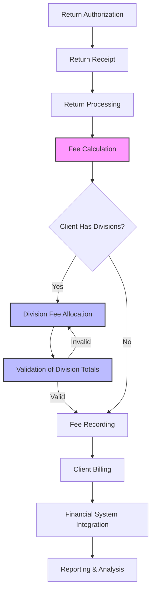
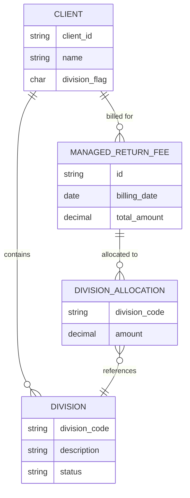
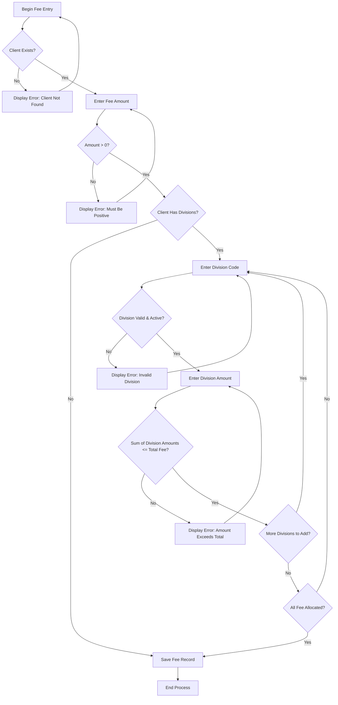

# Managed Return Fees in AFS Shreveport

## Introduction to Managed Return Fees

Managed Return Fees represent a critical component in the freight logistics ecosystem, particularly within the AFS Shreveport system. These fees are specifically designed to handle the financial aspects of returned shipments, which require specialized processing, documentation, and logistics coordination. In the freight industry, returns management presents unique challenges compared to standard forward logistics, often involving exception handling, quality inspection, and specialized routing. Within AFS Shreveport, Managed Return Fees provide a structured mechanism for billing clients for these specialized return handling services, ensuring proper cost recovery while maintaining transparency in the billing process. The system's architecture supports both simple fee structures and more complex division-based allocations, allowing for precise cost attribution within client organizations.

## Fee Structure and Calculation

Managed Return Fees in the AFS Shreveport system follow a flexible calculation model that accommodates various client requirements. The base fee structure typically consists of a flat rate or percentage-based fee determined by the volume and complexity of returns processing required by each client. The system allows for precise date-specific billing, enabling fees to be applied for specific billing periods. For clients with divisional structures, the system supports sophisticated allocation models where return fees can be distributed across multiple business units according to predetermined ratios or actual usage metrics. This division-based allocation ensures that costs are appropriately distributed within client organizations based on their internal cost accounting requirements. The calculation process validates that all divisional allocations sum precisely to the total fee amount, preventing accounting discrepancies while maintaining the flexibility needed to handle complex organizational structures.

## Managed Return Fee Workflow

The workflow diagram illustrates the end-to-end process for handling Managed Return Fees in the AFS Shreveport system. The process begins with return authorization and receipt, followed by processing of the returned goods. The fee calculation step determines the appropriate charge based on client-specific agreements and the complexity of the return. For clients with divisional structures, the system supports allocation of fees across multiple divisions, with built-in validation to ensure the sum of divisional allocations matches the total fee. Once validated, the fee is recorded in the FB.MANG.RTRNS file with appropriate client and date identifiers, making it available for client billing and financial system integration. The entire process is designed to maintain accurate financial records while providing flexibility in how return handling costs are allocated within client organizations.

## Client Configuration for Managed Returns

The AFS Shreveport system implements a comprehensive client configuration framework for managed returns, centered around client-specific settings stored in the CLIENTS file. Each client record contains flags indicating whether the client utilizes division-based billing (field 12 with value 'Y'), which triggers the division allocation workflow during fee entry. Client configuration extends to division setup, where each division is maintained in client-specific DIVISION.CODES files, allowing for granular control over which organizational units can receive fee allocations. The system enforces validation against these division codes, preventing allocation to inactive or invalid divisions. Additional client-specific parameters may include default allocation percentages, billing frequency preferences, and specialized handling instructions for returned shipments. This configuration framework ensures that the managed return fee process aligns with each client's organizational structure and financial requirements, while maintaining system-wide consistency in fee processing and validation.

## Division-Based Fee Allocation

The AFS Shreveport system implements a sophisticated division-based fee allocation mechanism that allows managed return fees to be distributed across multiple organizational units within a client's structure. This capability is particularly valuable for clients with complex organizational hierarchies where costs need to be allocated to specific cost centers, departments, or business units. The allocation process begins with verification that the client is configured for divisional billing by checking the division flag in the client record. For division-enabled clients, the system prompts users to specify both the division code and the corresponding amount to be allocated to that division. Multiple divisions can receive allocations from a single managed return fee, with the system maintaining a running calculation to ensure that the sum of all divisional allocations precisely equals the total fee amount. This prevents over or under-allocation scenarios that could create accounting discrepancies. The division allocation feature supports sophisticated cost accounting practices while maintaining the integrity of the overall billing process.

## Division Allocation Data Model

The data model diagram illustrates the relationship structure for managed return fees in the AFS Shreveport system. The central entity is the MANAGED_RETURN_FEE, which is linked to a CLIENT entity through a one-to-many relationship, indicating that a client can have multiple managed return fees over time. For clients configured with divisions, the CLIENT entity has a one-to-many relationship with the DIVISION entity, representing the organizational structure. When division allocation is used, the MANAGED_RETURN_FEE connects to multiple DIVISION_ALLOCATION records, each specifying a portion of the total fee amount to be allocated to a specific division. Each DIVISION_ALLOCATION references a valid DIVISION through a many-to-one relationship, ensuring that allocations can only be made to properly configured divisions. This data model supports both simple fee structures and complex divisional allocations while maintaining referential integrity throughout the system.

## Fee Entry and Management Interface

The AFS Shreveport system provides a comprehensive user interface for entering and managing return fees, implemented in the FB.2.17 program. The interface follows a logical workflow that guides users through the fee entry process. It begins with client selection, supporting both direct client ID entry and fuzzy name matching through SOUNDEX capabilities for situations where the exact client ID is unknown. After client selection, the system prompts for the billing date, defaulting to the current date but allowing modification as needed. The fee amount entry follows, with validation to ensure positive values. For clients configured with divisional billing, the interface extends to support division code entry and amount allocation, with real-time validation ensuring that division codes are valid and active, and that the sum of divisional allocations doesn't exceed the total fee amount. The interface provides contextual help messages and clear navigation options, allowing users to move backward in the workflow to correct entries or exit the program entirely. This structured approach ensures accurate data entry while accommodating the varying complexity of client billing requirements.

## Validation and Error Handling

The AFS Shreveport system implements robust validation and error handling mechanisms for managed return fees to ensure data integrity and prevent accounting discrepancies. Client validation occurs at the beginning of the fee entry process, verifying that the specified client exists in the CLIENTS file before proceeding. For clients with divisional billing, the system performs multi-level validation including: verification that division codes exist in the client-specific DIVISION.CODES file, confirmation that specified divisions are active (not marked with status 'I' for inactive), and mathematical validation ensuring that the sum of all division allocations exactly equals the total fee amount. The system employs a running calculation approach that tracks remaining unallocated amounts, preventing both over-allocation and under-allocation scenarios. Error handling is implemented through clear, context-specific error messages that guide users toward resolution, such as "You have entered more than the total amount of the billing amount" when division allocations exceed the total fee. The validation framework maintains strict data integrity while providing meaningful feedback that facilitates efficient error correction.

## Fee Validation Process

The flowchart illustrates the comprehensive validation process implemented for managed return fee entry in the AFS Shreveport system. The process begins with client validation, ensuring the specified client exists before proceeding. After validating that the fee amount is positive, the system determines whether division allocation is required based on the client's configuration. For clients with divisions, the system enters a validation loop for each division allocation, verifying that the division code is valid and active, and that the allocated amount doesn't cause the total allocated amount to exceed the fee total. The process continues adding divisions until either the user indicates completion or the entire fee amount has been allocated. This multi-stage validation approach ensures data integrity while providing appropriate feedback at each step, guiding users toward successful fee entry while preventing common errors such as invalid divisions or mismatched allocation totals.

## Integration with Financial Systems

Managed Return Fees in the AFS Shreveport system are designed with comprehensive integration into broader financial systems, forming a critical link in the end-to-end accounting workflow. Once entered and validated, fee records stored in the FB.MANG.RTRNS file serve as the authoritative source for client billing processes. The system architecture supports integration with accounts receivable systems, enabling automated invoice generation that incorporates these fees alongside other billable services. For clients with complex ERP environments, the division allocation capability ensures that costs flow correctly to the appropriate cost centers within the client's financial structure. The integration extends to financial reporting systems, where managed return fees can be aggregated and analyzed alongside other revenue streams. The system's date-based fee structure facilitates accurate period-based financial reporting, supporting month-end closing processes and revenue recognition requirements. This integration framework ensures that managed return fees are properly captured, billed, and reported within the broader financial ecosystem while maintaining data consistency across systems.

## Reporting and Analysis

The AFS Shreveport system provides comprehensive reporting and analysis capabilities for managed return fees, enabling stakeholders to gain insights into return handling costs and their distribution across client organizations. The reporting framework supports multiple perspectives, including client-centric views that aggregate all return fees for a specific client over time, period-based reports that analyze fee trends across billing cycles, and division-focused reports that examine how fees are distributed within client organizational structures. The system's structured data model, with clear relationships between clients, fees, and divisional allocations, facilitates sophisticated analytical queries that can reveal patterns in return volumes, identify clients with complex return handling requirements, and support cost optimization initiatives. For clients with division-based billing, the reporting capabilities extend to divisional cost analysis, providing transparency into how return handling costs are distributed across business units. These reporting and analysis capabilities transform managed return fee data from simple transactional records into valuable business intelligence that can inform client relationship management and operational optimization strategies.

[Generated by the Sage AI expert workbench: 2025-05-28 08:06:23  https://sage-tech.ai/workbench]: #