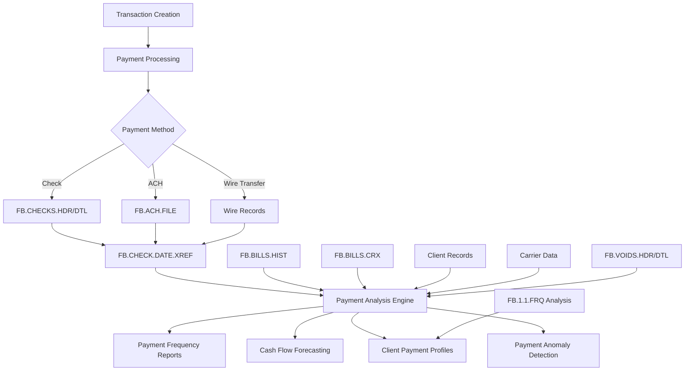
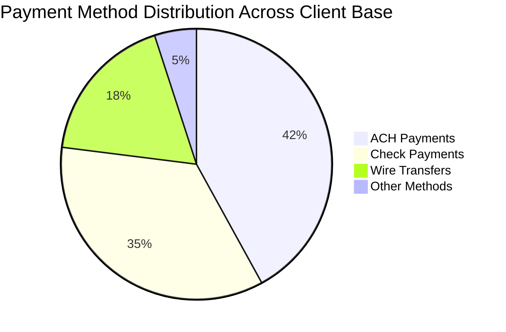
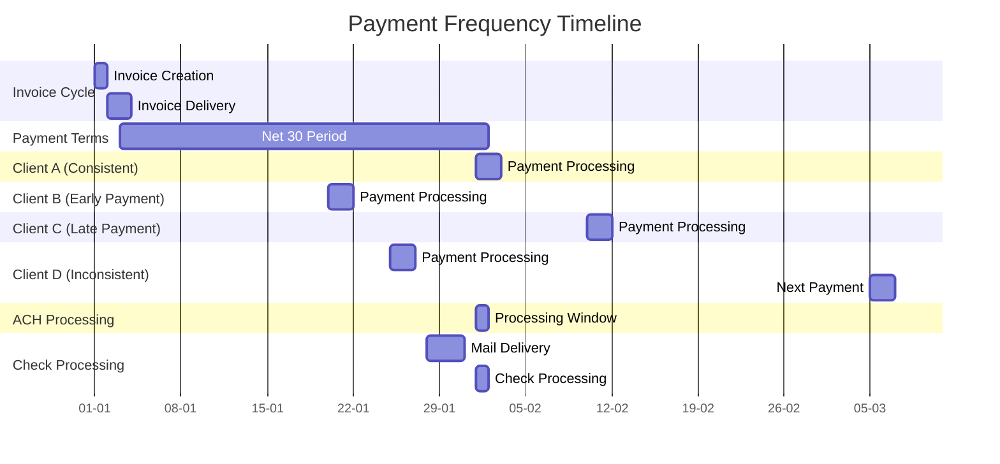
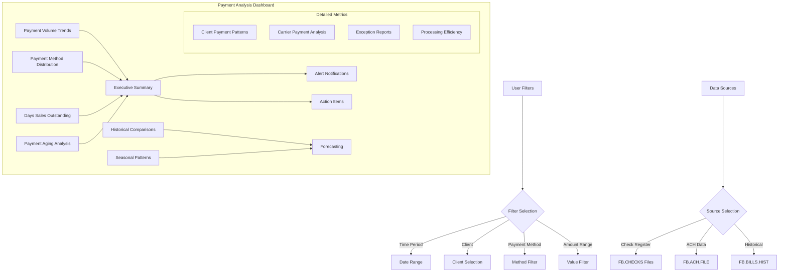

# Payment Frequency Analysis in AFS Shreveport

## Introduction to Payment Frequency Analysis

Payment frequency analysis is a critical component of the AFS Shreveport system, serving as the foundation for effective cash flow management, client relationship optimization, and operational efficiency. By systematically examining the timing, patterns, and characteristics of payment transactions, AFS Shreveport enables logistics managers to predict revenue streams, identify payment anomalies, and optimize financial operations.

The system's payment frequency analysis capabilities extend beyond simple transaction tracking to include sophisticated pattern recognition that identifies seasonal variations, client-specific payment behaviors, and industry trends. This intelligence allows AFS Logistics to strategically manage working capital, reduce days sales outstanding (DSO), and develop targeted approaches for different client segments based on their payment histories.

Furthermore, payment frequency analysis serves as an early warning system for potential collection issues, allowing proactive intervention before payment delays impact operations. The insights derived from this analysis inform critical business decisions ranging from staffing levels in accounts receivable departments to the timing of major capital expenditures.

## Data Sources for Payment Analysis

AFS Shreveport leverages multiple data repositories to conduct comprehensive payment frequency analysis. The primary data sources include check records stored in `FB.CHECKS.HDR` and `FB.CHECKS.DTL` files, which contain detailed information about payment amounts, dates, and associated carriers. ACH transaction data is maintained in the `FB.ACH.FILE`, capturing electronic payment details including transaction IDs, dates, and amounts.

Historical payment data is preserved in the `FB.BILLS.HIST` files, organized by client ID, which allows for longitudinal analysis of payment behaviors over extended periods. The system also utilizes cross-reference files like `FB.BILLS.CRX` and `FB.CHECK.DATE.XREF` to establish relationships between payments, bills, and carriers, enabling multi-dimensional analysis.

For voided or deleted payments, the system maintains records in `FB.VOIDS.HDR` and `FB.VOIDS.DTL` files, ensuring that payment analysis accounts for canceled transactions. Client-specific payment preferences and patterns are stored in client records within the `CLIENTS` file, with specialized analysis performed by utilities like `FB.1.1.FRQ` which examines transaction histories to determine preferred payment methods.

The system also incorporates external data sources through integration points, allowing payment information from bank systems, carrier portals, and client ERP systems to be incorporated into the analysis, providing a comprehensive view of the payment ecosystem.

## Payment Data Flow Architecture

The payment data flow in AFS Shreveport follows a structured path from transaction creation through analysis. When a payment is initiated, it's processed according to its method (check, ACH, or wire transfer) and stored in the appropriate repository. The FB.CHECK.DATE.XREF file serves as a central index, linking payment records across different systems.

The Payment Analysis Engine aggregates data from multiple sources, including historical bill records, cross-references, client information, and carrier data. This comprehensive approach ensures that analysis accounts for all variables that might influence payment patterns. The system also incorporates voided payment records to maintain analytical integrity.

The architecture supports both real-time analysis for operational decisions and batch processing for deeper trend analysis. Data flows are designed to maintain referential integrity while allowing flexible querying across different dimensions such as time periods, payment methods, carriers, and clients.

## Check Register Analysis Tools

AFS Shreveport provides robust check register analysis tools that offer deep insights into payment patterns, frequencies, and amounts across different time periods. The FB.5.6.SUB subroutine forms the backbone of these capabilities, generating detailed check register reports that can be filtered by date range, carrier, bank code, and payment type (checks, ACH, or manual checks).

These tools support multiple output formats, including printer reports, screen displays, and downloadable files, making the data accessible for various analytical needs. The system can generate both summary and detailed reports, with options for alphabetical sorting by carrier name, enhancing the ability to identify carrier-specific payment trends.

A key feature is the BUILD.CHECK.ARR subroutine, which handles complex date-based aggregation of payment data with source tracking. This allows users to analyze payment distributions across different time periods and identify seasonal patterns or anomalous payment behaviors.

The check register tools also provide specialized functionality for tracking different payment sources (check, ACH, wire transfer) with separate counters for each type. This granularity enables analysis of payment method preferences over time and helps identify shifts in payment behaviors that might require operational adjustments.

For deeper analysis, the FB.4.7 program generates carrier lists sorted by last payment date, providing visibility into carrier payment frequencies and helping identify carriers with irregular payment patterns that might require attention.

## Client Payment Preference Detection

AFS Shreveport employs sophisticated mechanisms to identify and track client payment preferences based on historical transaction data. The FB.1.1.FRQ subroutine specifically analyzes a customer's payment transactions over the past 91 days to determine their preferred payment method (check, ACH, or wire transfer).

This analysis works by examining transaction records marked as 'CR' or 'CA' types, extracting payment method information, and tallying the counts for each method. The system then identifies the most frequently used method and assigns a preference code ('C' for check, 'A' for ACH, 'W' for wire, or 'M' for mixed/no preference).

The detection process is designed to be dynamic, continuously updating as new transactions are processed. This ensures that the system's understanding of client preferences remains current even as clients modify their payment behaviors. By processing transactions in reverse chronological order, the system prioritizes recent behavior patterns, which are typically more indicative of current preferences.

When clients demonstrate consistent payment behaviors, the system can automatically optimize processes to accommodate these preferences. For example, clients who consistently use ACH payments might receive different remittance information than those who prefer checks. Similarly, clients with irregular payment methods might be flagged for additional attention during payment processing.

The system also identifies correlations between payment methods and other client characteristics, such as industry, size, or geographic location, enabling broader strategic insights about payment trends across different client segments.

## Payment Method Distribution

The distribution of payment methods across the AFS Shreveport client base reveals important patterns that inform financial operations and client relationship management. ACH payments represent the largest segment at 42%, reflecting the growing preference for electronic payment methods that offer reduced processing times and lower transaction costs. Traditional check payments remain significant at 35%, particularly among established clients with longstanding payment processes.

Wire transfers account for 18% of payments, typically associated with high-value transactions or time-sensitive payments. The remaining 5% consists of emerging payment methods and specialized arrangements for specific clients.

This distribution is not static—analysis of historical data shows a steady migration from check payments toward electronic methods, with ACH adoption increasing approximately 3-4% annually. Regional variations are notable, with clients in technology-focused regions showing higher electronic payment adoption rates compared to clients in more traditional industries.

The payment method distribution also correlates with payment reliability metrics. ACH payments show the most consistent timing patterns, typically arriving within 1-2 days of their expected date. Check payments demonstrate greater variability, with an average deviation of 4-5 days from expected receipt dates. Wire transfers, while immediate upon execution, show the greatest unpredictability in initiation timing.

Understanding this distribution enables AFS Shreveport to optimize cash flow forecasting, staffing for payment processing, and client communication strategies based on the predominant payment methods in different client segments.

## Payment Timing Patterns

The AFS Shreveport system reveals distinct payment timing patterns that significantly impact cash flow management and operational planning. Analysis of payment data across multiple years shows clear seasonal variations, with payment volumes typically peaking at quarter-ends (particularly Q4) and experiencing noticeable dips during holiday periods. This seasonality requires proactive management to ensure sufficient liquidity during slower payment periods.

Day-of-week preferences are particularly pronounced, with Tuesday and Wednesday showing the highest payment processing volumes—approximately 25% and 28% of weekly totals respectively. Monday payments account for roughly 20%, while Thursday and Friday combined represent the remaining 27%. This pattern influences staffing decisions in accounts receivable departments to ensure optimal coverage on high-volume days.

Payment clustering behavior is another significant pattern, with approximately 40% of clients consistently making payments within specific date ranges each month, typically aligning with their internal payment cycles (1st-5th, 10th-15th, or 25th-30th). This clustering creates predictable processing spikes that can be anticipated and managed.

The system also identifies client-specific timing patterns, such as clients who consistently pay exactly 30 days after invoice receipt versus those who batch payments bi-weekly regardless of invoice dates. These individualized patterns enable more accurate cash flow forecasting at the client level.

Interestingly, payment timing patterns often correlate with payment methods—ACH payments show greater timing consistency than checks, which can vary significantly in processing time due to mail delivery and deposit delays. This insight helps in developing tailored collection strategies for different client segments based on their typical payment behaviors.

## Due Date Management

AFS Shreveport implements sophisticated due date management capabilities to optimize cash flow and accommodate client-specific requirements. The system supports flexible due date calculation based on multiple factors, including standard payment terms, client-specific agreements, and seasonal adjustments. This flexibility is demonstrated in utilities like PPP.DUEDT.ADJ, which can adjust payment due dates for specific clients when necessary.

Due date management incorporates intelligent rules that account for business days, holidays, and regional variations in banking schedules. The system integrates with TC.HOLIDAYS files to ensure that due dates falling on non-business days are appropriately adjusted, preventing unnecessary payment delays.

For clients with special payment arrangements, the system maintains custom payment terms in client records, automatically applying these terms when calculating due dates for new invoices. This customization extends to handling different payment terms for different service types or transaction volumes within the same client relationship.

The system also implements due date alerts that proactively notify both internal staff and clients about upcoming payment obligations. These notifications can be configured based on client preferences and payment history, with more frequent reminders for clients with inconsistent payment records.

Analytics capabilities allow for continuous refinement of due date strategies based on actual payment behaviors. By analyzing the relationship between stated due dates and actual payment dates across different client segments, the system can recommend optimized payment terms that balance cash flow needs with client satisfaction.

When business conditions require adjustments to payment timing, batch utilities can systematically modify due dates across multiple records while maintaining an audit trail of these changes, ensuring transparency in financial operations.

## Payment Frequency Timeline

The Payment Frequency Timeline illustrates the typical payment cycles within the AFS Shreveport system, highlighting the intervals between payments and processing timeframes for different client types. The timeline begins with invoice creation and delivery, followed by the standard Net 30 payment terms period.

Client payment behaviors are categorized into distinct patterns: Client A demonstrates consistent payment exactly on the due date, Client B consistently pays early (10 days before due date), Client C typically pays late (10 days after due date), and Client D shows inconsistent payment timing with variable intervals between payments.

The timeline also depicts the processing windows for different payment methods. ACH payments have a shorter processing window (typically 1 day), while check payments involve additional time for mail delivery and processing (typically 3-4 days total).

This visualization helps operational teams understand the rhythm of payment activities throughout the month and anticipate workload distributions. It also illustrates how different payment methods and client behaviors create varying patterns in cash flow timing.

The timeline is particularly valuable for financial planning, as it shows how the theoretical payment terms (Net 30) often differ from actual payment behaviors, requiring sophisticated cash flow forecasting that accounts for these client-specific patterns rather than relying solely on due dates.

## Performance Metrics for Payment Processing

AFS Shreveport implements comprehensive performance metrics to monitor and optimize payment processing operations. These metrics provide visibility into processing efficiency, error rates, and overall system performance, enabling continuous improvement in payment handling.

Processing time metrics track the average time required to complete each step in the payment lifecycle, from receipt to posting. The system maintains benchmarks for different payment types, with current averages of 0.8 days for ACH processing, 1.2 days for check processing, and 0.5 days for wire transfers. These metrics help identify bottlenecks and prioritize process improvements.

Error rates are carefully monitored across different payment processing stages. The current system maintains an error rate below 0.5% for payment application, with automated validation rules catching most potential issues before they impact financial records. When errors do occur, the system tracks error types and frequencies to identify root causes and implement preventive measures.

Efficiency metrics include the number of payments processed per hour by both automated systems and human operators. The FB.3.20.12 program specifically analyzes freight payment keying time and bill entry performance, calculating total time spent, number of bills entered, character counts, and average time per bill for individual users. These metrics inform staffing decisions and identify opportunities for additional automation.

Payment reconciliation metrics track the time required to match payments with invoices and resolve discrepancies. The current system achieves an automatic match rate of 87% for electronic payments and 72% for check payments, with continuous improvements driven by pattern recognition algorithms.

Exception handling metrics monitor the volume and resolution time for payment exceptions, such as partial payments, overpayments, or payments without sufficient reference information. These metrics help identify clients who consistently generate exceptions, enabling targeted process improvements.

## Integration with Financial Systems

The payment frequency analysis capabilities of AFS Shreveport are tightly integrated with broader financial systems, creating a seamless flow of payment data throughout the organization's financial ecosystem. This integration ensures that payment insights inform accounting processes, reconciliation activities, and financial reporting.

At the core of this integration is the synchronization between payment records and the general ledger. When payments are processed through the FB.5.6.SUB subroutine, the system automatically generates the appropriate accounting entries, ensuring that payment activities are accurately reflected in financial statements. This integration extends to handling specialized scenarios such as voided checks (processed by FB.5.7) and payment adjustments.

The system also maintains integration with bank reconciliation processes, automatically matching cleared payments with bank statement data to identify discrepancies. This integration reduces manual reconciliation efforts and provides early detection of payment anomalies such as unauthorized transactions or processing errors.

For financial reporting, payment frequency data feeds into customizable reporting templates that support both standard financial statements and specialized analyses. These reports can be segmented by client, carrier, payment method, or time period, providing multidimensional views of payment activities that inform financial decision-making.

The integration extends to external systems through EDI capabilities and API connections. Payment data can be exchanged with client accounting systems, carrier portals, and banking platforms, creating a cohesive financial ecosystem that spans organizational boundaries. This interoperability is particularly valuable for managing complex payment arrangements involving multiple parties.

For audit and compliance purposes, the integrated system maintains comprehensive audit trails of all payment activities, including modifications, voids, and adjustments. These audit trails support both internal controls and external compliance requirements, ensuring that payment processes meet regulatory standards.

## Payment Analysis Dashboard

The Payment Analysis Dashboard provides a comprehensive visual interface for monitoring payment metrics, trends, and anomalies. This conceptual visualization represents how payment frequency data is organized and presented to management for strategic decision-making.

The dashboard's Executive Summary section aggregates key performance indicators including payment volume trends, method distribution, days sales outstanding, and aging analysis. These high-level metrics provide an immediate overview of payment health and highlight areas requiring attention.

Detailed metrics sections allow users to drill down into specific aspects of payment performance. Client Payment Patterns visualize individual client behaviors over time, while Carrier Payment Analysis focuses on payment relationships with transportation providers. Exception Reports highlight unusual payment activities that may require investigation, and Processing Efficiency metrics track the operational performance of payment handling.

The dashboard incorporates predictive elements through Historical Comparisons and Seasonal Patterns analysis, which feed into Forecasting capabilities that project future payment volumes and timing. This forward-looking perspective supports proactive financial planning.

Interactive filtering capabilities allow users to customize their view based on time periods, clients, payment methods, or amount ranges. These filters enable focused analysis on specific segments of payment data, supporting both strategic overview and detailed investigation.

The dashboard draws from multiple data sources within the AFS Shreveport system, including check registers, ACH data, and historical bill records. This comprehensive data integration ensures that the dashboard presents a complete picture of payment activities across all channels and time periods.

Alert Notifications and Action Items sections highlight critical issues requiring immediate attention, ensuring that payment anomalies are promptly addressed before they impact financial operations.

[Generated by the Sage AI expert workbench: 2025-05-28 08:06:17  https://sage-tech.ai/workbench]: #