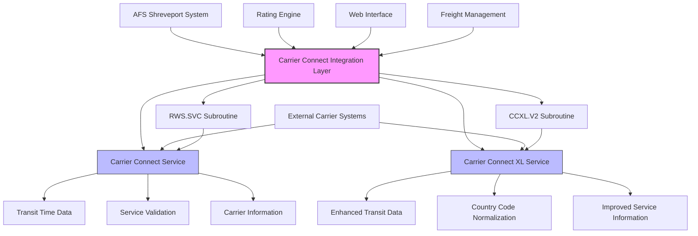
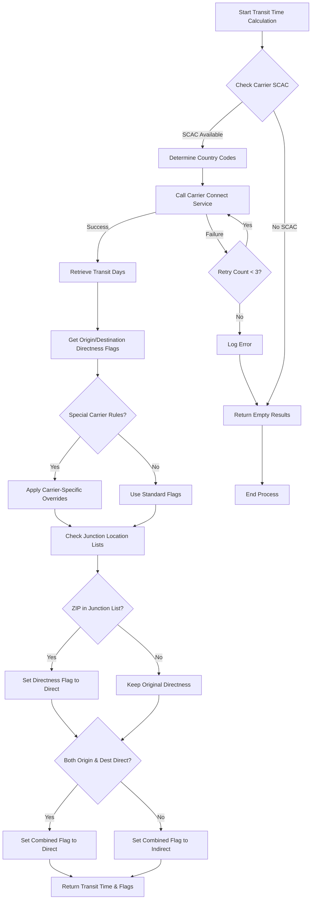
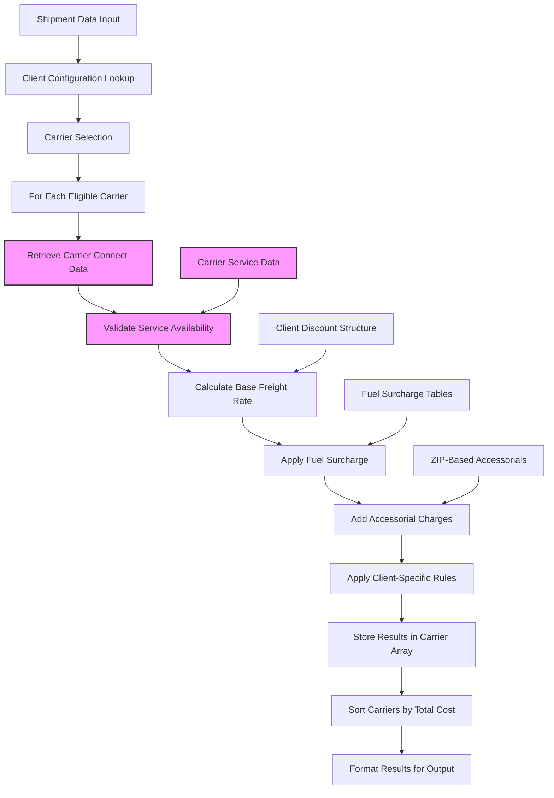
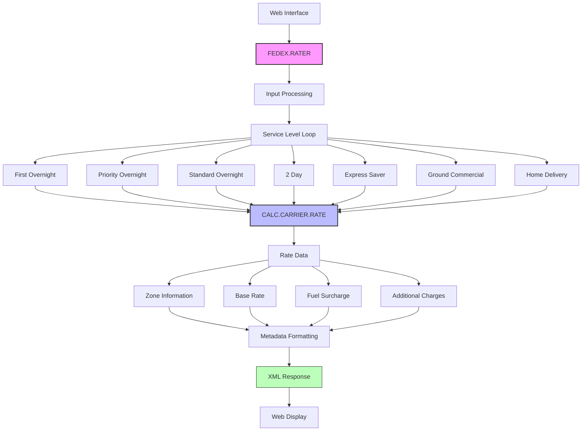
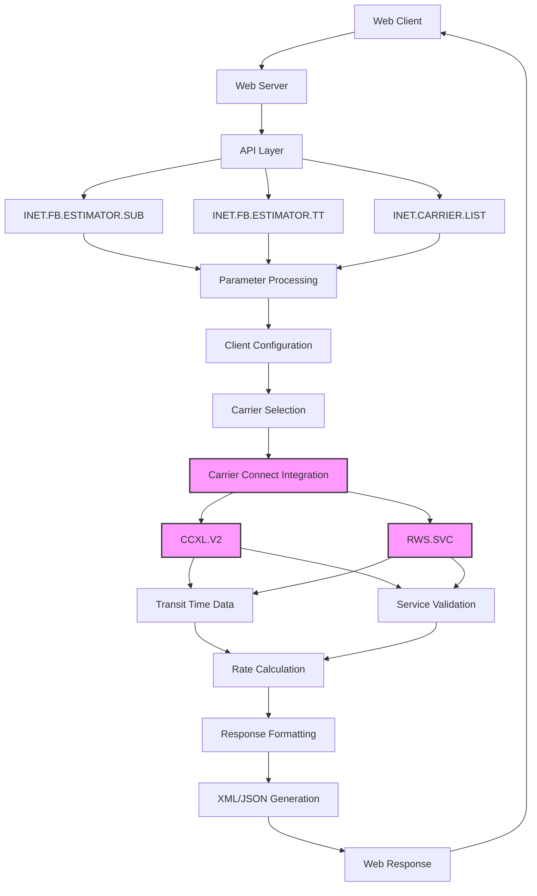

# Carrier Connect Integration in AFS Shreveport

## Overview of Carrier Connect Integration

Carrier Connect is a critical integration component within the AFS Shreveport system that provides automated access to carrier information, transit times, and service details essential for efficient freight management. This integration allows AFS Shreveport to retrieve real-time data from multiple carriers, enabling accurate rate calculations, transit time estimations, and service validation. The system has evolved from the original Carrier Connect to an enhanced version called Carrier Connect XL (CCXL), which provides more comprehensive carrier data with improved country code handling and service information. Through this integration, AFS Shreveport can automate carrier selection processes, validate service availability for specific routes, and ensure that clients receive accurate shipping information and optimal carrier choices based on their specific requirements and preferences.

The diagram illustrates how Carrier Connect interfaces with the AFS Shreveport system. The integration layer contains two primary service interfaces: the original Carrier Connect service accessed through the RWS.SVC subroutine, and the enhanced Carrier Connect XL service accessed through the CCXL.V2 subroutine. These services communicate with external carrier systems to retrieve essential freight data including transit times, service validation information, and carrier details. The integration layer serves multiple components of the AFS Shreveport system, including the Rating Engine for rate calculations, Web Interface for customer-facing applications, and the core Freight Management functionality.

## Barcode Processing for Carriers

The BAR.CODE subroutine implements sophisticated carrier-specific barcode processing within the AFS Shreveport system. This utility handles the validation and formatting of barcodes according to each carrier's unique requirements. When a barcode is scanned or entered into the system, BAR.CODE first validates it by checking for the presence of a 'BC' suffix, which serves as an identifier for valid barcodes in the system. After validation, the subroutine removes this artificial suffix and applies carrier-specific formatting patterns based on the carrier ID and barcode length.

The formatting logic is implemented through a comprehensive BEGIN CASE structure that contains specific rules for each supported carrier. For example, Roadway Express (carrier ID 00017) requires 10-digit barcodes formatted as XXX-XXXXXX-X, while AAA Cooper (carrier ID 00050) uses 8-digit barcodes formatted as XX-XXXXXXX. The system supports numerous carriers including Yellow, CF, Old Dominion, Saia, and others, each with their own unique barcode structure. This carrier-specific processing ensures that barcodes are correctly formatted for downstream processing, carrier communication, and tracking purposes, maintaining compatibility with each carrier's systems while providing a standardized interface within the AFS Shreveport platform.

## Transit Time Calculation

The transit time calculation functionality in AFS Shreveport is primarily implemented through the FB.TRANSIT and RECALC.TRANSIT.TIME.V2 subroutines, which retrieve time-in-transit information from Carrier Connect services. These routines process origin and destination ZIP codes to determine the expected transit days between locations, supporting both US and Canadian routes. The system first validates carrier information and normalizes country codes based on ZIP code patterns, then makes service calls to retrieve transit data.

A key aspect of the transit time calculation is the handling of directness flags, which indicate whether shipments are direct or indirect between locations. The system maintains three directness indicators: origin directness (ORIG.DIR.FLG), destination directness (DEST.DIR.FLG), and combined directness (COMB.DIR.FLG). For indirect shipments, additional transit time may be added to account for transfers between terminals. The code also implements special handling for specific carriers like Conway (CNWY), which overrides directness flags to ensure accurate transit time calculations.

The system includes fallback mechanisms for service call failures, with retry logic for up to three attempts when socket errors occur. Additionally, it incorporates junction location verification by checking ZIP codes against junction lists (JL) stored in the FB.TABLES file. This verification helps determine if shipments between specific locations are direct, potentially overriding the information received from Carrier Connect when more accurate client-specific data is available.

The flowchart illustrates the process of retrieving transit times from origin to destination locations. The system first checks for carrier SCAC code availability, then determines country codes for the locations. It calls the Carrier Connect service to retrieve transit information, implementing retry logic for failed calls. After retrieving the basic transit data, the system applies special carrier rules if needed and verifies the directness of the shipment by checking junction location lists. Based on this verification, it sets appropriate directness flags and returns the final transit time information along with the directness indicators.

## Carrier Connect XL Integration

The AFS Shreveport system has evolved its carrier integration capabilities with the implementation of Carrier Connect XL (CCXL.V2), which represents a significant enhancement over the original Carrier Connect service. This evolution addresses limitations in the original service by providing more comprehensive carrier information, improved country code handling, and enhanced service data retrieval. The CCXL.V2 integration normalizes country codes (converting US to USA, CA to CAN, etc.) to ensure consistent international shipping data processing and implements a more robust service call structure.

A key improvement in Carrier Connect XL is its handling of directional flags for shipments. The system interprets carrier-specific service codes (such as 'C' or 'P' for consolidation or pool points) and translates them into standardized directness indicators ('D' for direct, 'I' for indirect). This translation ensures consistent interpretation of carrier service types across the system. Additionally, CCXL.V2 provides more detailed transit information, including specific terminal data and service availability for particular routes.

The integration maintains backward compatibility with existing code by mapping the CCXL response fields to the same structure used by the original Carrier Connect service. This allows legacy code to continue functioning while benefiting from the enhanced data. The modification history in the code (marked as NKH01) documents this transition, showing how the system evolved from calling RWS.SVC to using CCXL.V2 while maintaining the same interface for consuming components. This approach demonstrates the system's architectural flexibility in accommodating service enhancements without disrupting existing functionality.

## Rate Calculation and Comparison

The AFS Shreveport system implements sophisticated rate calculation and comparison functionality that leverages Carrier Connect integration to determine optimal shipping options. The system processes shipment details including origin and destination ZIP codes, freight classes, weights, and accessorial requirements to calculate rates across multiple carriers. This calculation incorporates both benchmark rates (standard industry rates) and contract rates (client-specific negotiated rates), allowing for comprehensive cost analysis and potential savings identification.

The rate calculation process begins by retrieving client-specific carrier configurations from FB.AUDIT files, which define approved carriers and their specific pricing rules. For each eligible carrier, the system calls FB.AUTO.V2 to calculate the base freight charges, then applies fuel surcharges, accessorial charges, and logistics commissions according to client-specific rules. The Carrier Connect integration provides essential service information including transit times and directness flags, which influence both rate calculations and carrier eligibility for specific routes.

A key feature of the rate calculation system is its support for least-cost carrier analysis. The RERATE.SUB.LCC subroutine sorts carriers by total cost and presents them in ascending order, allowing clients to identify the most cost-effective options. The system also implements client-specific rules such as carrier preferences, service requirements, and markup percentages that may override pure cost-based selection. Additionally, the code handles special cases like hazardous materials shipments by filtering carriers based on their ability to handle such freight, ensuring that all recommended options are valid for the specific shipment requirements.

The diagram illustrates the rate calculation workflow, highlighting how carrier data from Carrier Connect is incorporated into the process. After initial shipment data input and client configuration lookup, the system selects eligible carriers and processes each one individually. Carrier Connect data is retrieved to validate service availability for the specific route, which influences the subsequent rate calculations. The system calculates the base freight rate using client-specific discount structures, applies fuel surcharges from appropriate tables, adds accessorial charges (including those automatically determined by ZIP code relationships), and applies any client-specific rules. The results are stored in a carrier array, sorted by total cost, and formatted for output to the client.

## Carrier-Specific Service Validation

The AFS Shreveport system implements comprehensive carrier-specific service validation to ensure that shipments are routed through carriers capable of providing the required service levels. This validation process uses Carrier Connect data to determine whether a carrier can service specific origin-destination pairs and what type of service (direct or indirect) they can provide. The system evaluates directness flags for both origin and destination locations, with three key indicators: origin directness (ORIG.DIR.FLG), destination directness (DEST.DIR.FLG), and combined directness (COMB.DIR.FLG).

A critical component of service validation is the junction location verification process. The system maintains junction lists (JL) in the FB.TABLES file, which contain ZIP codes for locations where carriers maintain direct service terminals. When processing a shipment, the code checks both origin and destination ZIP codes against these junction lists. If both locations are found in the junction list for a specific carrier, the shipment is marked as direct (COMB.DIR.FLG='D'), indicating that the carrier can provide direct service without transfers. This verification may override the information received from Carrier Connect when more accurate client-specific data is available.

The system also implements special carrier rules, such as the override for Conway (CNWY) that automatically sets all directness flags to 'D' regardless of the Carrier Connect response. Additionally, the code handles Canadian routes by recognizing non-numeric ZIP codes and applying appropriate country code normalization. For carriers not integrated with Carrier Connect, the system falls back to checking client-specific carrier service (CS) records, which contain manually maintained service information. This multi-layered approach ensures accurate service validation across diverse carrier networks and geographical regions.

## FedEx Integration Specifics

The FEDEX.RATER subroutine implements specialized integration with FedEx services, providing detailed rate calculations across multiple service levels. This integration extends beyond basic Carrier Connect functionality to deliver comprehensive FedEx-specific rating capabilities. The subroutine accepts input parameters including origin and destination ZIP codes, effective date, weight, residential delivery flag, and package type (letter or parcel), then calculates rates for seven distinct FedEx service levels: First Overnight, Priority Overnight, Standard Overnight, 2 Day, Express Saver, Ground Commercial, and Home Delivery.

For each service level, the code calls CALC.CARRIER.RATE to determine the appropriate rates, handling different carrier IDs for express services (00015) versus ground services (01075). The returned data includes zone information, base rate, fuel surcharge percentage and amount, total amount, and any additional charges. The subroutine processes this information into a structured metadata response suitable for consumption by web interfaces, with specific data types defined for each field.

The FedEx integration includes sophisticated error handling and debugging capabilities, with a debug flag that can be toggled for specific users to enable detailed output during troubleshooting. The code also implements logging functionality to track rate requests and responses, storing input parameters and calculation results for audit purposes. This specialized integration demonstrates how the AFS Shreveport system extends its carrier connectivity beyond the standard Carrier Connect framework to accommodate carrier-specific requirements and provide enhanced functionality for major shipping partners.

The diagram shows how the web interface integrates with the FEDEX.RATER component to retrieve and display rate information. The process begins with the web interface making a request to FEDEX.RATER, which processes the input parameters and loops through each FedEx service level. For each service level, it calls CALC.CARRIER.RATE to perform the actual rate calculation, retrieving zone information, base rate, fuel surcharge, and additional charges. This data is then formatted into a structured metadata response with specific data types, converted to XML format, and returned to the web interface for display to the user. The integration provides a comprehensive view of available FedEx shipping options with detailed cost breakdowns.

## Web Interface Integration

The AFS Shreveport system exposes Carrier Connect data through sophisticated web interfaces that enable rate estimation, carrier selection, and transit time information retrieval. These interfaces serve both internal users and external clients, providing real-time access to carrier information through standardized API endpoints. The INET.FB.ESTIMATOR.SUB and INET.FB.ESTIMATOR.TT components form the core of this integration, processing input parameters from web requests and returning structured responses with detailed carrier information.

The web interface integration handles various input formats, including pipe-delimited parameters that are converted into multi-valued lists for internal processing. It implements client-specific business rules such as carrier selection criteria, markup percentages, and service constraints, ensuring that the returned data reflects the client's specific requirements and preferences. The system also provides carrier lists through the INET.CARRIER.LIST program, which populates available carriers based on client ID and request type (RATE or FREIGHT).

For response formatting, the system generates structured metadata with specific data types for web consumption. The FEDEX.RATER component, for example, returns detailed rate information across multiple service levels, formatted with field definitions that enable proper display in web interfaces. Similarly, the estimator components return XML-formatted responses containing comprehensive quote information including carrier rates, transit times, terminal information, fuel surcharges, and accessorial charges. This standardized approach to data exchange ensures seamless integration between the core AFS Shreveport system and its web-facing components, providing users with accurate and timely carrier information for informed decision-making.

The diagram illustrates how Carrier Connect data is exposed through web interfaces in the AFS Shreveport system. Web clients connect to the web server, which routes requests through the API layer to appropriate components like INET.FB.ESTIMATOR.SUB, INET.FB.ESTIMATOR.TT, or INET.CARRIER.LIST. These components process input parameters, retrieve client configurations, and select applicable carriers based on client-specific rules. The Carrier Connect integration layer (highlighted in pink) provides access to transit time data and service validation information through CCXL.V2 and RWS.SVC calls. This data feeds into the rate calculation process, which generates detailed carrier quotes. The results are formatted into structured responses (XML or JSON) and returned to the web client for display. This integration enables real-time access to carrier information through standardized web interfaces.

## Future Enhancements and Maintenance

The Carrier Connect integration in AFS Shreveport requires ongoing maintenance and presents opportunities for future enhancements to improve functionality and performance. Current maintenance requirements include monitoring service availability, updating carrier-specific formatting rules as carriers modify their systems, and ensuring that junction location lists remain current. The system's evolution from the original Carrier Connect to Carrier Connect XL demonstrates a commitment to enhancing integration capabilities, and this evolutionary approach should continue with future improvements.

Potential enhancements to the Carrier Connect integration include expanding support for international shipping beyond the current US and Canadian capabilities, implementing real-time tracking integration for shipment visibility, and developing more sophisticated caching mechanisms to improve performance and reduce external service calls. Additionally, the system could benefit from enhanced error handling and fallback mechanisms to ensure continuity of service during connectivity issues or carrier system outages.

Best practices for maintaining and enhancing the Carrier Connect integration include implementing comprehensive logging for all service calls to facilitate troubleshooting, establishing regular validation processes to verify carrier data accuracy, and developing standardized testing procedures for new carrier additions or service changes. The system should also maintain backward compatibility when implementing enhancements, following the pattern established in the transition to Carrier Connect XL where new functionality was added while preserving existing interfaces. By adhering to these practices and pursuing strategic enhancements, AFS Shreveport can continue to provide reliable and efficient carrier integration services that meet evolving business requirements.

[Generated by the Sage AI expert workbench: 2025-05-28 08:06:28  https://sage-tech.ai/workbench]: #