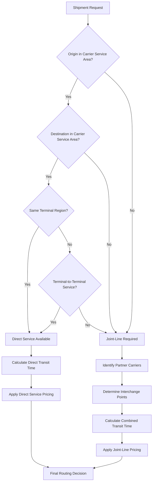
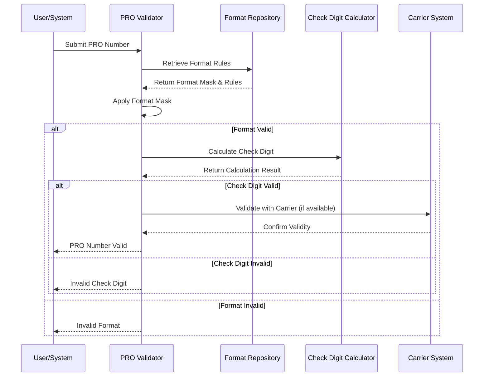

# Carrier Terminal Details in AFS Shreveport

## Introduction to Carrier Terminal Details

Carrier terminal details are a critical component of freight logistics operations, serving as the foundation for effective shipment routing, service level determination, and operational efficiency. In the AFS Shreveport system, terminal information encompasses the physical locations where carriers receive, process, and transfer freight, along with the associated data that defines service capabilities, geographic coverage, and processing parameters. This information is essential for making routing decisions, calculating transit times, validating shipment documentation, and ensuring that freight moves efficiently through the supply chain. The system maintains comprehensive terminal data to support both direct service between points and more complex joint-line operations that may involve multiple carriers or terminals.

## Carrier Master Records

The AFS Shreveport system maintains comprehensive carrier records in the CARRIERS database file, which serves as the central repository for all carrier-related information. These records include standard contact information (name, address, phone numbers), but extend well beyond basic details to encompass operational parameters critical for freight management. Each carrier record contains remittance and correspondence addresses, transportation modes supported, terminal-specific details, and service capabilities. The system tracks carrier status (active/inactive), tax information, payment preferences (including ACH and AMEX options), and specialized handling requirements. The FB.1.2 program provides the primary interface for creating and maintaining these carrier records, with specialized extensions like FB.1.2.ACH for managing payment details. The system also maintains cross-reference tables (SCAC.XREF) that link Standard Carrier Alpha Codes (SCAC) to internal carrier IDs, enabling integration with industry-standard identification systems.

## Carrier Information Structure

```mermaid
graph TD
    A[Carrier Master Record] --> B[Basic Information]
    A --> C[Terminal Details]
    A --> D[Service Parameters]
    A --> E[Payment Information]
    A --> F[Cross-References]
    
    B --> B1[Carrier ID]
    B --> B2[Carrier Name]
    B --> B3[Contact Information]
    B --> B4[Status Active/Inactive]
    
    C --> C1[Terminal Addresses]
    C --> C2[Terminal Types]
    C --> C3[Service Areas by ZIP]
    C --> C4[Terminal Contact Info]
    
    D --> D1[Transit Days]
    D --> D2[Direct/Joint Service]
    D --> D3[Equipment Types]
    D --> D4[Transportation Modes]
    
    E --> E1[Payment Terms]
    E --> E2[ACH Information]
    E --> E3[Remittance Address]
    E --> E4[Tax Information]
    
    F --> F1[SCAC Code]
    F --> F2[Carrier Aliases]
    F --> F3[External System IDs]
    F --> F4[PRO Number Format]
```

The carrier information structure in AFS Shreveport is organized hierarchically, with the carrier master record at the top level. This structure enables efficient storage and retrieval of all carrier-related data, supporting both operational processes and reporting needs. The system maintains relationships between carrier IDs, terminal locations, and service areas through a series of cross-reference files and attributes within the carrier record. This comprehensive approach ensures that all necessary information is available for routing decisions, service level determinations, and financial transactions.

## Terminal Location Management

The AFS Shreveport system provides robust capabilities for maintaining accurate terminal location information, which is essential for proper freight routing and service level determination. Terminal addresses are stored with complete contact details including physical address, city, state, ZIP code, phone numbers, and email addresses. The system differentiates between various terminal types (pickup, delivery, consolidation, etc.) and maintains specific contact information for each terminal location. 

Terminal data can be managed directly through the FB.1.2 carrier maintenance program or through specialized interfaces that connect with external rating services like RateWare XL and CarrierConnect. The RWS.SVC subroutine plays a critical role in retrieving terminal information from these external services, providing up-to-date terminal addresses and contact details based on origin and destination postal codes.

For international shipments, the FB.11.2 program enables management of international destinations with associated city and country information, supporting global shipping operations. The system also maintains terminal substitution capabilities through FB.1.11.20, which allows for exception handling when specific terminals need to be overridden for particular client-carrier-ZIP code combinations.

Terminal location data is regularly validated and synchronized with external systems to ensure accuracy, with special attention paid to address standardization and proper geographic coding to support efficient routing decisions.

## Service Area Coverage

The AFS Shreveport system tracks carrier service territories through sophisticated ZIP code range management, enabling precise determination of whether direct service is available between locations or if joint-line routing is required. Service area coverage is maintained at multiple levels of granularity, from 3-digit ZIP code prefixes for broad regional coverage to full 5- or 6-digit postal codes for specific locations.

The CARRIER.SVC file stores service information including origin/destination ZIP codes, direct/indirect indicators, and transit days. This data can be maintained through the FB.1.11.17 program, which provides an interface for adding, editing, and deleting carrier service records. The system also supports importing service data from external sources through utilities like LOAD.CARRIER.SVC and FB.11.16.1.

For each carrier, the system maintains detailed service area information that defines:
- Which ZIP codes are serviced directly from origin points
- Which ZIP codes require joint-line service (involving multiple carriers)
- Transit times between service points
- Service types available (standard, expedited, etc.)
- Equipment restrictions or requirements for specific service areas

The FB.CHECK.COVERAGE.ZIP subroutine evaluates whether a shipment qualifies for direct service by checking if both origin and destination points are within a carrier's direct service territory. This determination is critical for proper rating and routing decisions, as joint-line shipments typically involve different service parameters and pricing structures.

## Direct vs. Joint-Line Service Flow

The decision process for determining whether a shipment qualifies for direct service or requires joint-line handling involves multiple evaluation steps. The system first checks if both the origin and destination points fall within a carrier's service territory. Even when both points are serviced by the same carrier, the system evaluates whether they belong to the same terminal region or if terminal-to-terminal service is available.

When joint-line service is required, the system identifies appropriate partner carriers, determines interchange points where freight will transfer between carriers, calculates the combined transit time, and applies joint-line pricing rules. This process ensures that shipments are routed efficiently while maintaining accurate service expectations and pricing.

The FB.CHECK.COVERAGE.ZIP subroutine implements this logic, evaluating carrier service areas and returning a status code (D=Direct, J=Joint-line, U=Unknown) along with explanatory comments. The system also supports client-specific overrides through the FB.1.11.20 program, which maintains exception files for specific client-carrier-ZIP code combinations.

## Transit Time Management

AFS Shreveport implements sophisticated methods for tracking and calculating service days between terminals based on origin/destination pairs and carrier capabilities. Transit time data is stored in the CARRIER.SVC file, which maintains service days as a multi-valued field associated with origin-destination ZIP code pairs. This information is critical for providing accurate delivery estimates to clients and for planning shipment timing.

The FB.1.11.17 program provides an interface for maintaining transit time information, allowing users to specify the number of service days required between specific origin and destination points. This data can be entered manually or imported from carrier-provided service guides using utilities like LOAD.CARRIER.SVC and FB.11.16.1.

For carriers integrated with external rating services, the RWS.SVC subroutine retrieves real-time transit time information from RateWare XL and CarrierConnect. This integration ensures that the system always has access to the most current service standards, which can change based on carrier network adjustments, seasonal variations, or other factors.

The system accounts for various factors that can affect transit times:
- Day of week restrictions (no weekend service, etc.)
- Holiday schedules
- Geographic challenges (remote areas, island destinations)
- Service type selection (standard, expedited, etc.)
- Equipment type requirements

Transit time data is used throughout the system for shipment planning, service level compliance monitoring, and performance reporting. The BUILD.CARRIER.PROFILE utility generates reports that analyze carrier performance against established transit time standards, providing valuable insights for carrier selection and service improvement initiatives.

## PRO Number Format Configuration

The AFS Shreveport system provides comprehensive capabilities for managing carrier-specific tracking number formats, validation rules, and check digit calculations. PRO (Progressive Rotating Order) numbers are the primary tracking identifiers used by carriers to track shipments through their networks, and each carrier typically has unique format requirements and validation rules.

The FB.1.11.13 program enables the configuration of client/carrier-specific PRO number formats, allowing users to define:
- Format masks with pattern validation
- Check digit calculation methods and positions
- Lookup parameters for old-style PRO numbers
- Active/inactive/lookup-only status indicators

PRO format configurations are stored in the FB.PRO.FORMAT file, which maintains multiple format entries per client-carrier pair to accommodate changes in carrier numbering systems over time. The system supports various check digit calculation methods, which are retrieved from the CHECK.DIGIT subroutine and applied according to carrier-specific rules.

The BAR.CODE subroutine processes barcode data for specific carriers, formatting the barcode according to carrier-specific rules after validating and removing any 'BC' suffix. This ensures that barcode-scanned PRO numbers are correctly formatted for system processing.

For carriers with special PRO number requirements, the ENTER.PRO.OVERRIDE program allows authorized users to add carrier PRO format overrides for OCR processing, ensuring that automated document scanning systems can correctly interpret carrier-specific formats.

## PRO Number Validation Process

The PRO number validation process in AFS Shreveport follows a structured sequence to ensure that tracking numbers conform to carrier-specific requirements. When a PRO number is submitted for validation, the system first retrieves the appropriate format rules from the FB.PRO.FORMAT file based on the carrier and client context.

The validation process applies the format mask to check if the PRO number matches the expected pattern, including length, character types, and position-specific requirements. If the format is valid, the system proceeds to check digit validation when applicable.

Check digit validation involves calculating a verification digit using the carrier's specified algorithm (retrieved from the CHECK.DIGIT subroutine) and comparing it to the check digit in the provided PRO number. The system supports multiple calculation methods to accommodate different carrier requirements.

For carriers with electronic integration capabilities, the system may also validate the PRO number against the carrier's own systems to ensure it represents an active shipment. This multi-layered validation approach ensures that only valid tracking numbers enter the system, reducing errors in shipment tracking and billing processes.

## External Rating Integration

The AFS Shreveport system implements sophisticated integration with external services like RateWare XL and CarrierConnect to retrieve terminal information and service details. This integration is primarily handled through the RWS.SVC subroutine, which establishes socket connections to these external rating engines and manages the request-response communication.

RWS.SVC formats specialized request packets according to the RateWare XL API specifications, submits them via socket connections, and parses the returned data into structured output. The subroutine handles three main types of requests:
1. Service information requests (transit days, terminal types)
2. Terminal information requests for origin and destination points
3. Carrier data requests for contact information and service capabilities

The integration includes robust error handling with retry logic and server failover capabilities. If the primary RateWare server is unavailable, the system automatically switches to a backup server to ensure continuous operation. The subroutine also monitors server performance and sends email alerts when connection problems persist.

For SMC3's CarrierConnectXL service, the HTTPS.T file implements a SOAP client that communicates using secure TLSv1.2 connections. This client constructs XML SOAP requests with authentication credentials, origin/destination postal codes, and shipping parameters to query terminal locations for specific carriers.

The external rating integration provides real-time access to carrier terminal information, service capabilities, and transit times, ensuring that the AFS Shreveport system always has the most current data for routing decisions and service level determinations.

## Payment Information Management

AFS Shreveport implements comprehensive processes for maintaining carrier payment details including ACH information, payment terms, and verification procedures. The FB.CARRIER.ACH program allows authorized users to set up and manage Automated Clearing House (ACH) payment information for carriers, including bank routing numbers, account numbers, and account types. The system tracks approval status (Active, Pending, Inactive, Cancelled), manages effective dates, and records confirmation information.

For carriers that prefer American Express payments, the FB.CARRIER.AMEX program provides similar functionality for managing AMEX-specific details. The system ensures that when AMEX is activated, ACH is automatically deactivated, enforcing business rules for payment method exclusivity.

The FB.CARRIER.CONF.ACH utility script manages the confirmation of ACH penny test deposits, allowing authorized users to record confirmation dates and confirming personnel. This process is critical for verifying the accuracy of banking information before initiating full payment transactions.

The FB.DOWNLOAD.PENNY.ACH program automates the creation and processing of penny test ACH transactions for carriers with pending status. It identifies carriers with banking information in 'P' status, creates a penny ACH transaction for each, and generates a downloadable CSV file. The program also sends notification emails to carriers informing them about the test transaction.

For client-specific payment handling, the FB.4.12.6 program manages bank code overrides for carriers, allowing users to assign specific bank codes to carriers for a client, overriding default settings. This flexibility ensures that payment processing can be tailored to meet specific client requirements while maintaining overall system consistency.

## Reporting and Analytics

The AFS Shreveport system provides robust capabilities for analyzing carrier performance, generating terminal-specific reports, and evaluating service levels across locations. These reporting and analytics functions enable data-driven decision-making for carrier selection, performance improvement, and cost optimization.

The BUILD.CARRIER.PROFILE utility generates carrier profile reports for freight billing analysis, allowing users to select a specific client or all clients and define a date range. The program queries the FB.BILLS.HIST file to collect billing data, aggregates it by carrier and transport mode, and calculates metrics including bill counts, amounts paid, overcharges, logistics amounts, and percentages.

For carrier control reporting, the FB.4.20.4 program generates reports from the FB.CAR.CTRL file, allowing users to filter by client number, client status, and transportation mode. This reporting helps manage carrier relationships and restrictions effectively.

The FB.CAR.CTRL.SS utility script generates a spreadsheet showing the relationships between clients and carriers, compiling information such as client names, carrier details, start/end dates, and update information. This report provides a comprehensive view of carrier-client relationships for analysis and management purposes.

For specialized reporting needs, the system includes various utilities like UPD.QV.CAR and LOAD.QV.INT.CAR that automate the extraction of carrier data for QuickView reporting. These utilities process data within specified date ranges and execute multiple data extraction processes across different business systems.

The reporting and analytics capabilities extend to carrier service performance, cost analysis, compliance monitoring, and relationship management, providing a comprehensive view of carrier operations and supporting continuous improvement initiatives.

## Conclusion

Carrier terminal details form a critical foundation for the AFS Shreveport freight logistics system. The comprehensive management of carrier information, terminal locations, service areas, transit times, PRO number formats, and payment details enables efficient shipment routing, accurate service level determination, and effective financial operations. The system's integration with external rating services ensures access to current carrier information, while robust reporting and analytics capabilities support data-driven decision-making.

The modular architecture of the AFS Shreveport system, with specialized programs for different aspects of carrier management, provides the flexibility to accommodate diverse carrier requirements and client needs. From the core carrier master records maintained through FB.1.2 to the specialized handling of payment information in FB.CARRIER.ACH and FB.CARRIER.AMEX, the system offers comprehensive capabilities for managing all aspects of carrier operations.

As freight logistics continues to evolve with increasing emphasis on real-time information, service level compliance, and cost optimization, the carrier terminal details management in AFS Shreveport provides a solid foundation for meeting these challenges and delivering value to both clients and carriers.

[Generated by the Sage AI expert workbench: 2025-05-28 08:06:15  https://sage-tech.ai/workbench]: #