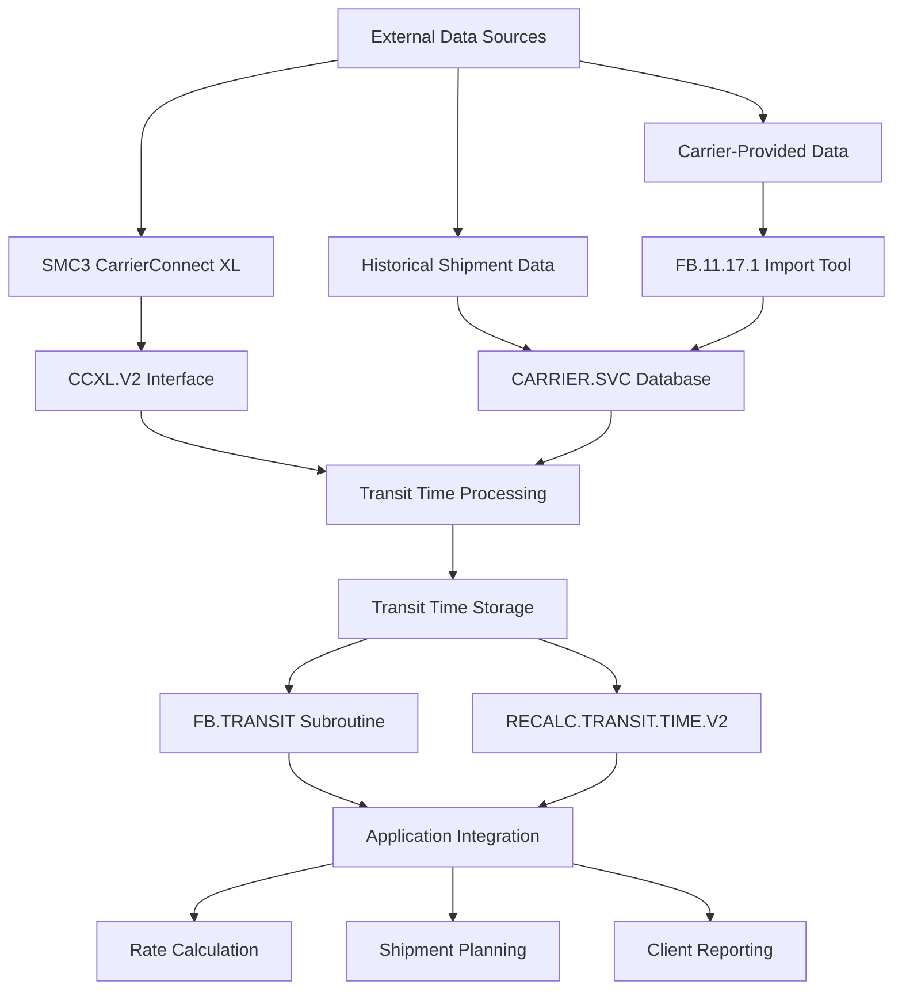
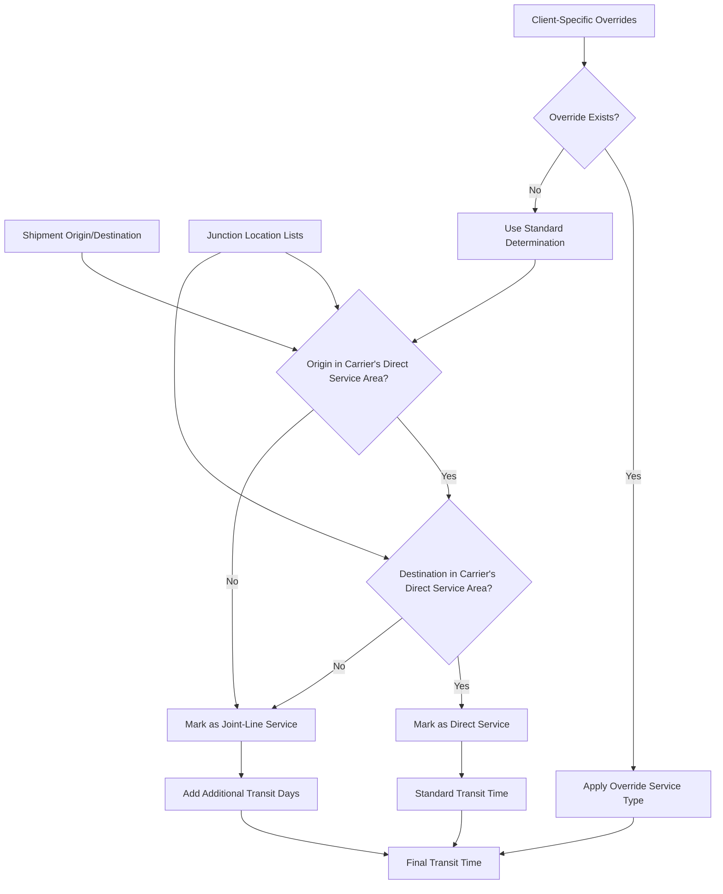
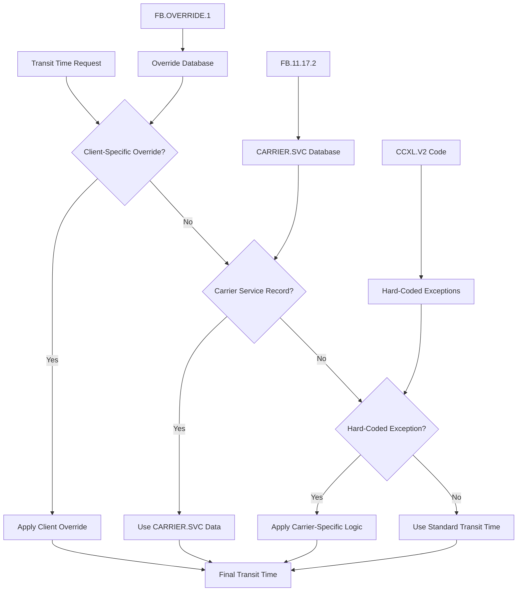

# Overview of Carrier Transit Times

## Overview of Carrier Transit Times

Transit time management is a critical component of the AFS Shreveport system, enabling accurate planning, routing decisions, and customer service. The system's transit time functionality allows for precise estimation of delivery timeframes, which is essential for both operational efficiency and client satisfaction. By maintaining comprehensive transit time data, AFS Shreveport can optimize carrier selection, identify potential service failures, and provide clients with reliable delivery estimates.

## Transit Time Data Sources

AFS Shreveport obtains transit time data from multiple sources to ensure comprehensive coverage and accuracy. The primary external source is SMC3's CarrierConnect XL web service, which provides standardized transit times for numerous carriers across North America. This is supplemented by internal carrier service records maintained in the CARRIER.SVC file, which stores carrier-specific transit day information between origin and destination points. For carriers not covered by SMC3 (referred to as "non-SMC carriers"), the system maintains custom transit time data through manual imports and updates. This multi-source approach ensures that even when external services are unavailable, the system can still provide transit time estimates based on historical data.

## Carrier Service Maintenance

The AFS Shreveport system provides tools for maintaining carrier service information through the FB.11.17.2 program. This interface allows authorized users to manage service details between origin and destination locations, including transit days and direct/indirect service types. The system supports both US ZIP codes and Canadian postal codes, validating location data against reference files. Users can add, modify, or delete service entries for specific carrier and location combinations.

Service information is stored in the CARRIER.SVC file with keys formatted as 'carrier_id*zip_code'. Each record contains destination ZIP codes, service types (direct or indirect), and transit days. The system also maintains a list of non-SMC carriers in the FB.TABLES file to identify carriers requiring manual transit time management. This maintenance capability ensures that transit time data remains accurate and up-to-date, even for carriers not covered by external services.

## Joint Line Determination

Joint line determination is a critical process in the AFS Shreveport system that identifies whether a shipment can be delivered directly by a single carrier or requires transfer between multiple carriers (joint-line service). This determination significantly impacts transit times and shipping costs.

The system determines joint-line status through several methods:
1. Checking carrier service records in the CARRIER.SVC file
2. Querying SMC3's CarrierConnect XL for service type information
3. Consulting junction location (JL) lists stored in FB.TABLES with IDs formatted as 'JL*CLIENT_ID*SCAC_ID'

When a shipment is identified as joint-line, additional transit days are typically added to account for the transfer between carriers. The FB.CHECK.COVERAGE.ZIP program provides additional validation by evaluating whether both origin and destination points are within a carrier's direct service area.

## Transit Time Calculation

The AFS Shreveport system calculates transit times through a sophisticated process that considers multiple factors. The primary calculation engine is the RECALC.TRANSIT.TIME.V2 subroutine, which determines the number of business days required for delivery between origin and destination points.

The calculation process follows these steps:
1. Determine country codes for origin and destination locations
2. Call the appropriate transit time service (CarrierConnect XL or internal database)
3. Apply carrier-specific rules and adjustments
4. Add additional days for joint-line service if necessary
5. Convert calendar days to business days using the BUSINESS.DAY4 and NEXT.BUSINESS.DAY subroutines

The system accounts for weekends, holidays, and carrier-specific non-service days. For international shipments, additional processing time for customs clearance is factored into the calculation. The FB.TRANSIT subroutine serves as the main interface for applications to retrieve transit time information, providing a standardized method for accessing this data across the system.

## Carrier-Specific Overrides

AFS Shreveport implements a robust system for handling carrier-specific transit time overrides and exceptions. These overrides are essential for accommodating unique carrier operations, special service agreements, and temporary service changes.

The system supports several types of overrides:
1. Client-carrier specific overrides stored in the FB.TABLES file with IDs formatted as 'JL*CLIENT_ID*SCAC_ID'
2. Carrier service records in the CARRIER.SVC file that override standard transit times
3. Hard-coded carrier exceptions in the CCXL.V2 program for carriers with unique requirements

The FB.OVERRIDE.1 program provides an interface for authorized users to create, edit, and delete override entries that modify carrier behavior for specific date ranges. This allows for temporary adjustments during peak seasons, weather events, or other service disruptions.

## Misroute Management

The AFS Shreveport system includes comprehensive functionality for identifying and managing shipments that used incorrect carriers or routing. This is implemented through the FB.MR.LTRS and FB.MR.EMAILS programs, which generate misroute notifications and debit memos.

The misroute detection process compares the actual carrier used against the approved carrier list for the specific origin-destination pair. When a misroute is identified, the system calculates the cost difference (overcharge) and initiates a progressive notification process:

1. First acknowledgment letter (informational)
2. Second acknowledgment letter (warning)
3. Additional requests (escalation)
4. Debit memo (financial consequence)

The FB.MR.EMAILS program sends email notifications to vendors who have shipped using incorrect carriers, with the content based on the stage in the progressive warning system. The FB.PRINT.LTRS subroutine formats these communications, including shipment details, approved carriers, and overcharge amounts.

This misroute management capability ensures that carriers adhere to approved routing guidelines, which are often based on optimal transit times and costs. By enforcing these guidelines, the system helps maintain service quality and cost efficiency.

## Performance Monitoring and Reporting

AFS Shreveport provides robust tools for monitoring carrier performance regarding transit times and service levels. The FB.3.20.1 program generates Carrier Bills And Revenue Analysis reports that calculate what percentage of revenue each carrier represents, along with metrics like amount paid, overcharge amounts, logistics markup, and bill counts.

The system tracks actual delivery performance against estimated transit times, enabling identification of carriers that consistently underperform or exceed expectations. This data is used for:

1. Carrier performance reviews and negotiations
2. Client reporting on service levels
3. Optimization of carrier selection algorithms
4. Identification of potential service issues before they impact clients

Performance data can be exported to spreadsheets for further analysis or integrated with other reporting tools. The system also supports email notifications for significant performance deviations, ensuring that stakeholders are promptly informed of service issues.

By continuously monitoring transit time performance, AFS Shreveport can make data-driven decisions about carrier selection, routing optimization, and service level agreements, ultimately improving the overall efficiency and reliability of freight operations.

[Generated by the Sage AI expert workbench: 2025-05-28 08:06:16  https://sage-tech.ai/workbench]: #