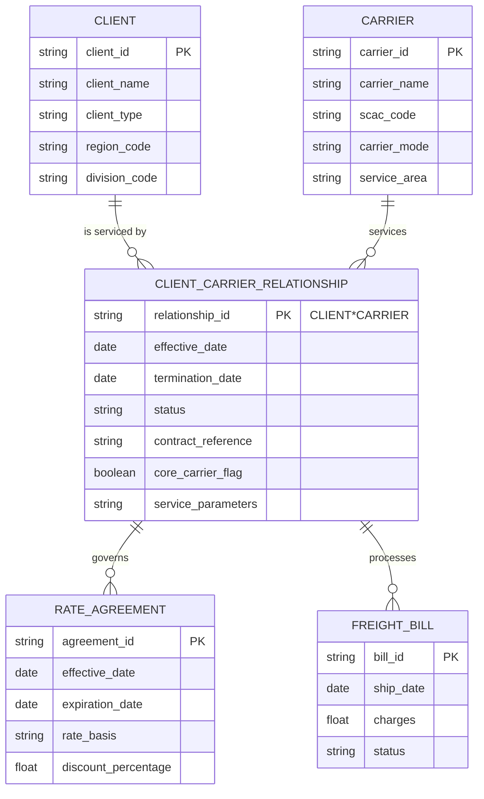
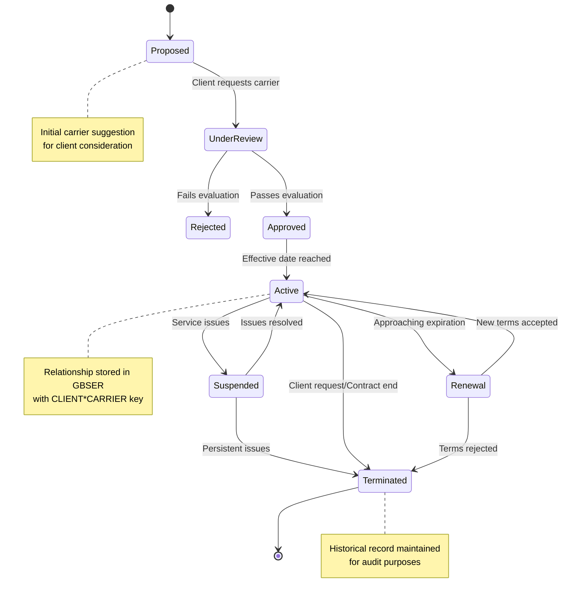
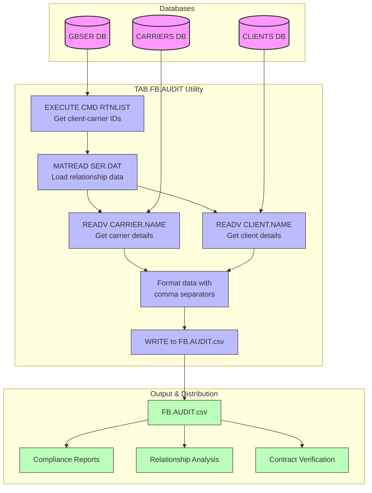
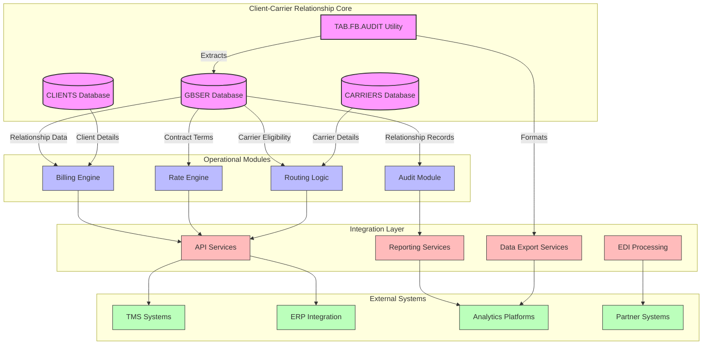

# Client-Carrier Relationships in AFS Shreveport

## Client-Carrier Relationship Overview

The AFS Shreveport system implements a sophisticated framework for managing the complex relationships between clients and carriers in freight logistics operations. These relationships form the backbone of the freight management process, enabling the system to properly route, price, and audit shipments according to negotiated terms. Client-carrier relationships in the system are structured as many-to-many associations, where each client can work with multiple carriers and each carrier can service multiple clients. These relationships are stored in the GBSER database with unique identifiers that combine client and carrier codes (formatted as "CLIENT*CARRIER"). Each relationship includes critical metadata such as effective dates, contract terms, and service parameters that govern how freight is processed. The system uses these relationships to enforce business rules, calculate appropriate rates, and ensure compliance with contractual agreements throughout the freight billing lifecycle.

## Client-Carrier Relationship Model

The diagram illustrates the central role of the CLIENT_CARRIER_RELATIONSHIP entity in the AFS Shreveport system. This entity serves as the bridge between clients and carriers, storing the essential parameters that define how they interact. The relationship is identified by a composite key combining the client and carrier IDs, and includes attributes like effective dates and contract references. This structure enables the system to maintain a comprehensive history of client-carrier associations while supporting current operations.

The model shows how these relationships connect to other critical system components, including rate agreements that define pricing terms and freight bills that represent actual shipments. By maintaining these relationships in a structured database, the system can efficiently route shipments, apply appropriate rates, and ensure compliance with negotiated terms. The audit functionality, as seen in the TAB.FB.AUDIT utility, leverages this data model to generate reports that provide visibility into these relationships for compliance and operational purposes.

## Relationship Configuration and Setup

Client-carrier relationships in AFS Shreveport require careful configuration during the initial setup phase. The process begins with the creation of base client and carrier records in their respective databases (CLIENTS and CARRIERS). Once these entities exist, a relationship record is established in the GBSER database with a composite key structure of "CLIENT*CARRIER" that uniquely identifies each relationship. The effective date (stored in SER.DAT(1)) is a critical parameter that determines when the relationship becomes active in the system. This date-driven approach allows for future-dated relationships to be configured in advance of their activation, supporting planned transitions between carriers.

Configuration parameters extend beyond simple linkage to include contract references, service levels, and specialized routing instructions. The system supports multiple concurrent relationships between a client and different carriers, allowing for service-specific carrier selection (e.g., different carriers for ground vs. air shipments). Administrators can define relationship attributes that influence freight routing decisions, such as preferred carrier flags, geographic service areas, and equipment type restrictions. The TAB.FB.AUDIT utility demonstrates how these relationships are extracted for auditing purposes, pulling the essential identifiers and effective dates that define the relationship parameters.

## Carrier Selection and Approval Process

The carrier selection and approval process in AFS Shreveport follows a structured workflow that ensures clients are matched with appropriate carriers based on service requirements, cost considerations, and established preferences. Initially, potential carriers are evaluated against client-specific criteria including geographic coverage, service capabilities, and pricing structures. Once approved, carriers are formally associated with clients through the creation of relationship records in the GBSER database, as evidenced in the TAB.FB.AUDIT utility which extracts these associations.

The system supports the designation of "core carriers" for clients, which receive preferential routing for specific lanes or shipment types. This designation is stored as a flag in the relationship record and influences the automated carrier selection process. The approval workflow typically involves multiple stakeholders including client representatives, account managers, and operations personnel who validate that the carrier meets all service requirements. Once established, these relationships become the foundation for routing rules that determine which carriers are eligible for specific shipments.

The system maintains an audit trail of relationship approvals, including who authorized the relationship and when it was established. The effective date captured in the SER.DAT(1) field marks the official start of the relationship, while additional parameters may define relationship expiration or review dates. This structured approach ensures that only properly vetted and approved carriers are utilized for client shipments, maintaining service quality and contractual compliance.

## Relationship Lifecycle Workflow

The lifecycle of a client-carrier relationship in AFS Shreveport follows a well-defined path from proposal through activation to eventual termination or renewal. As illustrated in the diagram, relationships begin in a proposed state when either a client requests a specific carrier or the system suggests a carrier based on service requirements. The relationship then undergoes review to ensure the carrier meets all necessary criteria.

Once approved, the relationship is formalized in the GBSER database with an effective date (as seen in the TAB.FB.AUDIT utility where EFF.DT is extracted from SER.DAT(1)). When this date is reached, the relationship becomes active and available for freight routing and processing. During the active phase, the relationship may be temporarily suspended due to service issues or other concerns, with the possibility of reactivation if those issues are resolved.

As relationships approach their contractual end dates, they enter a renewal phase where terms are renegotiated. This may result in either a refreshed active relationship with updated terms or termination if new terms cannot be agreed upon. Throughout this lifecycle, the system maintains comprehensive records for audit purposes, as demonstrated by the TAB.FB.AUDIT utility which extracts relationship data for compliance reporting.

## Contract and Rate Management

Contract and rate management is a critical component of client-carrier relationships in the AFS Shreveport system. Each relationship is governed by contractual terms that define service levels, pricing structures, and operational parameters. These contracts are linked to the client-carrier relationship records in the GBSER database and serve as the foundation for rate calculations and service expectations. The system maintains detailed contract metadata including effective dates, expiration dates, amendment history, and authorized signatories.

Rate management within these relationships is particularly sophisticated, supporting multiple pricing models including distance-based rates, weight-break pricing, flat rates, and accessorial charges. Each client-carrier relationship can have multiple associated rate tables that apply to different lanes, service levels, or time periods. The system enforces contract-specific business rules during the freight rating process, ensuring that the appropriate negotiated rates are applied to each shipment based on the active client-carrier relationship.

Contract amendments and rate changes are handled through a controlled process that maintains historical pricing for accurate back-billing and audit purposes. When rate adjustments occur, the system can apply them from the specified effective date while preserving the previous rate structure for historical shipments. This approach ensures billing accuracy while maintaining a comprehensive audit trail of rate changes over time. The TAB.FB.AUDIT utility extracts relationship data that serves as a foundation for these contract and rate management functions, providing visibility into which relationships are active and when they became effective.

## Relationship Auditing and Compliance

Relationship auditing and compliance functions in AFS Shreveport ensure that client-carrier relationships adhere to established business rules, contractual obligations, and regulatory requirements. The TAB.FB.AUDIT utility exemplifies this functionality by generating comprehensive audit reports of all client-carrier relationships in the system. These reports capture essential relationship data including client and carrier identifiers, names, and effective dates, providing a complete view of active relationships for compliance verification.

The system implements multi-layered auditing mechanisms that validate relationships at various stages. During relationship creation, validation rules ensure that only authorized carriers with proper credentials and insurance coverage can be linked to clients. Ongoing compliance checks verify that relationships remain valid based on expiration dates, service performance metrics, and regulatory status. The system also monitors for potential conflicts of interest or exclusivity violations in carrier assignments.

Audit trails capture all changes to relationship parameters, including who made modifications and when they occurred. This comprehensive change history supports both internal governance requirements and external regulatory compliance. The exported audit data (formatted as CSV in the TAB.FB.AUDIT utility) serves multiple compliance purposes, including contract management, service level agreement monitoring, and regulatory reporting. By maintaining this detailed audit information, AFS Shreveport provides stakeholders with transparent visibility into the complete ecosystem of client-carrier relationships.

## Audit Report Data Flow

The diagram illustrates the data flow process for generating client-carrier relationship audit reports in the AFS Shreveport system. The process begins with the TAB.FB.AUDIT utility accessing three critical databases: GBSER (which stores the relationship records), CLIENTS, and CARRIERS (which store the entity details).

The utility first executes a command to retrieve a list of all client-carrier relationship IDs from the GBSER database. For each relationship ID (structured as "CLIENT*CARRIER"), the system reads the full relationship record using MATREAD, extracting essential data such as the effective date. The utility then parses the composite ID to separate the client and carrier identifiers, and uses these to retrieve the corresponding names from their respective databases.

After gathering all required data, the utility formats it into a structured CSV format with appropriate field separators. The data undergoes transformation to ensure proper formatting, including the conversion of attribute marks (ASCII 254) to line feeds for CSV compatibility. The final output is written to FB.AUDIT.csv, which serves as the source for various compliance and analysis functions.

This audit report data flow demonstrates how the system integrates information from multiple databases to provide a comprehensive view of client-carrier relationships. The resulting CSV file supports critical business functions including compliance reporting, relationship analysis, and contract verification, ensuring that all relationships are properly documented and maintained according to business requirements.

## Performance Monitoring and Benchmarking

Performance monitoring and benchmarking capabilities in AFS Shreveport provide critical insights into the operational effectiveness of client-carrier relationships. The system tracks key performance indicators (KPIs) for each carrier across multiple dimensions, including on-time delivery rates, damage frequencies, invoice accuracy, and cost efficiency. These metrics are collected at the relationship level, allowing for client-specific performance analysis rather than just carrier-wide statistics.

The benchmarking functionality enables comparative analysis of carrier performance against industry standards, historical averages, and peer carriers. This allows clients to evaluate whether their carriers are delivering competitive service levels and identify opportunities for improvement. The system supports customizable performance thresholds that trigger alerts when carriers fall below expected service levels, enabling proactive relationship management.

Performance data is integrated with the client-carrier relationship records, providing context for service evaluations and contract negotiations. Historical performance trends are maintained alongside relationship data, creating a comprehensive view of how carrier service has evolved over time. This information proves invaluable during carrier reviews, contract renewals, and when considering relationship changes. The audit reports generated by utilities like TAB.FB.AUDIT provide the foundational relationship data that supports these performance monitoring functions, ensuring that metrics are properly associated with the correct client-carrier pairings.

## Relationship Data Integration

Client-carrier relationship data serves as a critical integration point across multiple components of the AFS Shreveport system. These relationships, stored in the GBSER database and extracted by utilities like TAB.FB.AUDIT, provide essential context for numerous operational processes. The relationship data integrates with the billing module to determine appropriate rate applications based on negotiated contracts. When processing freight bills, the system references the active client-carrier relationships to validate that the carrier is authorized for the client and to apply the correct contractual rates.

The EDI (Electronic Data Interchange) module leverages relationship data to manage document exchange configurations between clients and their approved carriers. Each relationship may have specific EDI parameters including document types, communication protocols, and trading partner identifiers. The reporting module incorporates relationship data to generate client-specific analytics that segment performance by carrier, enabling comparative analysis across a client's carrier portfolio.

Integration extends to external systems as well, with relationship data being exposed through APIs that allow third-party applications to validate carrier assignments and access contract terms. The system's data synchronization processes ensure that relationship changes propagate appropriately across all integrated components, maintaining consistency throughout the platform. This comprehensive integration approach ensures that client-carrier relationships remain a foundational element that connects and contextualizes data throughout the entire freight management lifecycle.

## System Integration Architecture

The system integration architecture diagram illustrates how client-carrier relationship data forms a central hub that connects various components of the AFS Shreveport system. At the core, the GBSER, CLIENTS, and CARRIERS databases store the fundamental relationship data, with utilities like TAB.FB.AUDIT providing extraction and formatting capabilities.

These relationship records feed into operational modules that drive key business functions. The Billing Engine uses relationship data to determine appropriate pricing based on contracted terms. The Rate Engine applies relationship-specific discounts and surcharges. The Routing Logic references relationship data to determine eligible carriers for shipments. The Audit Module validates that all transactions comply with established relationship parameters.

The Integration Layer exposes relationship data through standardized interfaces. API Services provide programmatic access to relationship information for external systems. EDI Processing uses relationship configurations to determine document routing and format requirements. Reporting Services generate analytics based on relationship parameters. Data Export Services, exemplified by the TAB.FB.AUDIT utility, format relationship data for external consumption.

External systems connect to this architecture to leverage relationship data. TMS (Transportation Management Systems) and ERP platforms integrate via APIs to access current relationship status. Analytics platforms consume exported relationship data for advanced analysis. Partner systems exchange documents through EDI channels configured according to relationship parameters.

This architecture demonstrates how client-carrier relationship data serves as a foundational element that connects and contextualizes operations throughout the freight management ecosystem.

## Maintenance and Data Governance

Maintaining accurate client-carrier relationship data is essential for the proper functioning of the AFS Shreveport system. The platform implements comprehensive data governance policies that define ownership, update procedures, and quality standards for relationship records. Dedicated data stewards are responsible for overseeing relationship data integrity, with clearly defined roles for who can create, modify, or terminate client-carrier associations.

The system enforces strict validation rules during relationship creation and modification. These rules verify that carrier identifiers exist in the CARRIERS database, client identifiers exist in the CLIENTS database, and that the relationship parameters conform to business standards. Relationship effective dates are validated to ensure they follow logical sequencing, preventing scenarios where termination dates precede effective dates or where overlapping relationships create ambiguity.

Regular data cleanup processes identify and resolve anomalies in relationship records. These include detecting orphaned relationships (where either the client or carrier no longer exists), identifying duplicate relationships, and flagging relationships with expired contracts. Utilities like TAB.FB.AUDIT support these governance activities by providing comprehensive exports of relationship data for review and analysis.

The system maintains a complete audit trail of all changes to relationship records, capturing who made each modification, when it occurred, and what specific attributes were changed. This change history supports both compliance requirements and troubleshooting efforts. Data governance policies also define archiving strategies for terminated relationships, ensuring that historical data remains available for audit purposes while keeping active data optimized for operational performance.

[Generated by the Sage AI expert workbench: 2025-05-28 08:06:25  https://sage-tech.ai/workbench]: #