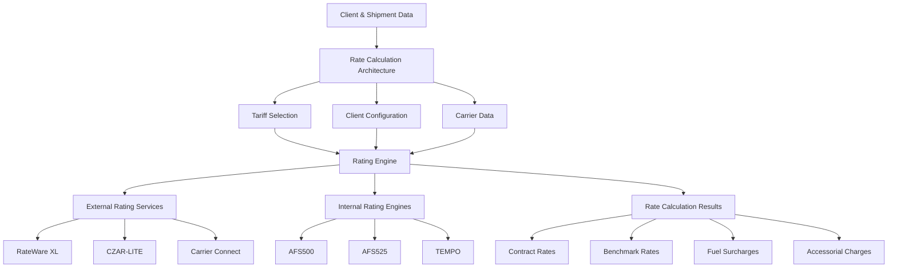
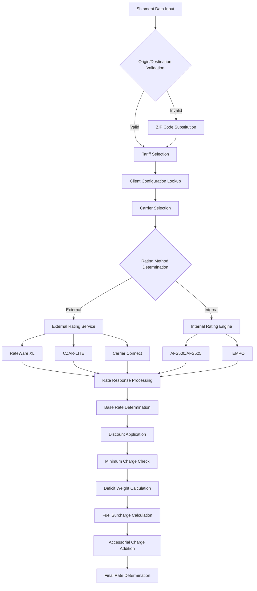
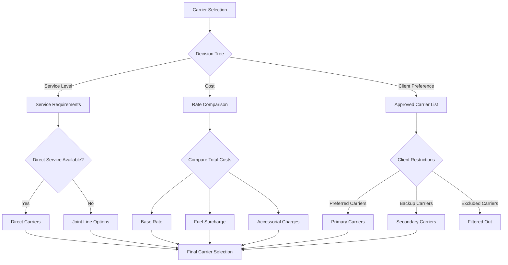
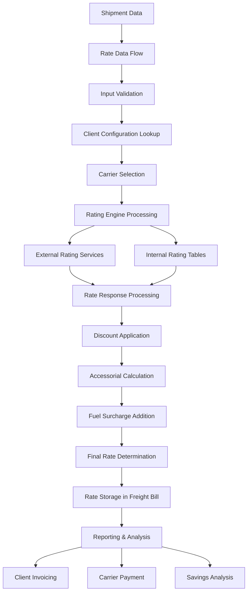

# Overview of Automated Rate Calculation

The Automated Rate Calculation system in AFS Shreveport is a sophisticated component that forms the backbone of the freight billing and logistics operations. This system automatically determines shipping costs based on a complex interplay of factors including origin/destination locations, freight classifications, weight, carrier contracts, and accessorial charges. The rate calculation engine supports multiple transportation modes including Less Than Truckload (LTL), Truckload, and Air Freight, and can process both domestic and international shipments, including specialized handling for Canadian cross-border freight.

At its core, the system is designed to calculate both contract rates (what carriers actually charge) and benchmark rates (industry standards used for savings calculations), enabling AFS to demonstrate value to clients through cost comparisons. The rate calculation process integrates with external rating services like RateWare XL, CZAR-LITE, and Carrier Connect, while also maintaining proprietary rating engines like AFS500 and AFS525 for specialized scenarios.

# Core Rating Components

The AFS Shreveport rate calculation system consists of several key components that work together to determine accurate freight charges:

1. **Tariff Management**: The system maintains a comprehensive database of carrier tariffs that define base rates for different shipping lanes, weight breaks, and freight classes. Programs like FB.1.12 allow administrators to create and modify rate tables that link clients, carriers, and freight classifications.

2. **Client Configuration**: Each client has specific settings that determine how rates are calculated, including FAK (Freight All Kinds) classes, discount structures, markup rules, and carrier preferences. These configurations can include client-specific overrides for certain carriers or lanes.

3. **Carrier Data Integration**: The system integrates with carrier systems to retrieve current rates, service capabilities, and transit times. This includes connections to external rating engines like RateWare XL and CZAR-LITE, as well as proprietary rating tables.

4. **Rating Engines**: Multiple rating engines (FB.AUTO.V2, RATER.V2, RATER.V3, etc.) perform the actual calculations, applying client-specific rules, discounts, and accessorial charges to determine final freight costs.

5. **Accessorial Charge Management**: Beyond base rates, the system calculates various accessorial charges like fuel surcharges, residential delivery fees, and handling charges based on shipment characteristics and carrier rules.

6. **Minimum Charge Logic**: Programs like CALC.MIN.CHG ensure that shipments meet carrier-defined minimum charges, which can vary by lane, weight, and service level.

7. **Deficit Weight Calculation**: The system optimizes costs by comparing actual weight charges against higher weight breaks that might result in lower overall costs due to better discount levels.

# Rating Methodologies

The AFS Shreveport system employs several rating methodologies to ensure accurate and competitive freight pricing:

1. **Contract Rates**: These are negotiated rates between carriers and clients, typically offering discounts off base rates. The system applies client-specific discount structures, which can vary by lane, weight break, and freight class.

2. **Benchmark Rates**: Used primarily for logistics clients, benchmark rates represent industry standard pricing and serve as a baseline for measuring savings. Programs like RATER.V2 calculate both contract and benchmark rates to demonstrate cost savings.

3. **Flat Rates**: For certain clients and lanes, the system supports flat rate pricing where a fixed charge applies regardless of weight or distance, often used for regular shipping lanes or specialized services.

4. **Deficit Weight Calculations**: The system automatically checks if using a higher weight break would result in a lower total cost due to better discount levels. This optimization ensures clients always get the most economical rate.

5. **FAK (Freight All Kinds) Rating**: The system supports FAK configurations where multiple freight classes are consolidated into a single class for rating purposes, simplifying pricing and often resulting in better rates.

6. **Tiered Rating**: Some clients have tiered pricing structures where different discount levels apply based on shipment characteristics like weight ranges or total volume.

7. **Joint Line Pricing**: For shipments requiring multiple carriers, the system can calculate complex joint line rates where different carriers handle different segments of the shipment.

# External Rating Services Integration

The AFS Shreveport system integrates with several external rating services to ensure accurate and up-to-date freight rates:

1. **RateWare XL Integration**: The system connects to SMC3's RateWare XL service through programs like RWXL.V2 and RWS. These interfaces construct SOAP XML requests containing shipment details, submit them to the RateWare API, and parse the responses to extract rates, transit times, and service information.

2. **CZAR-LITE Integration**: For specialized LTL rating, the system interfaces with CZAR-LITE through programs like FB.7.2.CZAR94. This integration handles both domestic and Canadian shipments, applying appropriate tariffs and discounts.

3. **Carrier Connect XL**: Programs like CCXL.V2 interface with Carrier Connect to retrieve carrier service information including transit times, service points, and directional flags that indicate if a carrier provides direct service between specific points.

4. **Failover Mechanisms**: The system implements sophisticated failover logic that can switch between primary and backup rating servers when connection issues occur, ensuring continuous operation even during service disruptions.

5. **Error Handling**: Comprehensive error handling includes email notifications for invalid ZIP codes, connection failures, and rating errors, with detailed diagnostic information to support quick resolution.

# Accessorial Charge Handling

The AFS Shreveport system includes sophisticated handling of accessorial charges, which are additional fees beyond the base freight rate:

1. **Charge Types**: The system supports multiple accessorial charge types including percentage-based (calculated as a percentage of the base rate), flat (fixed amount per shipment), and CWT (cost per hundredweight) charges.

2. **Client-Specific Rules**: Each client can have specific rules for accessorial charges, including which charges apply, how they're calculated, and any caps or minimums that should be enforced.

3. **ZIP Code-Based Charges**: The system can automatically apply accessorial charges based on origin or destination ZIP codes through the ZIP.LINE.ITEM file, which defines location-specific fees like residential delivery or limited access charges.

4. **Charge Validation**: Programs like CALC.MIN.CHG ensure that accessorial charges meet minimum requirements and are applied correctly based on shipment characteristics.

5. **Multiple Charge Handling**: The system can process multiple accessorial charges per shipment, ensuring each is applied only once when appropriate and calculating the correct total.

6. **Charge Descriptions**: Detailed descriptions of accessorial charges are maintained for reporting and audit purposes, providing transparency into how each charge was calculated.

7. **Carrier-Specific Accessorials**: Different carriers may have unique accessorial charges, which the system handles through carrier-specific configuration and processing logic.

# Fuel Surcharge Calculation

Fuel surcharge calculation is a critical component of the AFS Shreveport rate calculation system, with several methods implemented to handle different carrier and client requirements:

1. **Calculation Methods**: The system supports multiple fuel surcharge calculation methods including percentage-based (applied to base rate), flat rate (fixed amount per shipment), and weight-based (applied per hundredweight).

2. **Carrier-Specific Tables**: Each carrier can have its own fuel surcharge table that defines surcharge percentages based on current fuel prices, with the system automatically selecting the appropriate table.

3. **Benchmark vs. Contract Variations**: The system can apply different fuel surcharge calculations for benchmark rates versus contract rates, as these often have different structures in the industry.

4. **Client-Specific Overrides**: For certain clients, the system supports overriding standard fuel surcharge calculations with client-specific rates or methods.

5. **Date-Based Adjustments**: Fuel surcharges can vary over time based on fuel price fluctuations, and the system maintains historical fuel surcharge tables to ensure accurate calculations for any given shipment date.

6. **Inclusion/Exclusion Rules**: The system determines which components of the freight charge are subject to fuel surcharges, as some accessorial charges may be excluded from the calculation base.

7. **Minimum/Maximum Constraints**: Some carriers implement minimum or maximum fuel surcharge amounts, which the system enforces during calculations.

# Client-Specific Rating Rules

The AFS Shreveport system implements extensive client-specific rating rules to ensure accurate and customized freight pricing:

1. **FAK Class Configurations**: Clients can define FAK (Freight All Kinds) classes that consolidate multiple freight classes into a single class for rating purposes. For example, a client might rate all classes from 50-85 as class 70, simplifying pricing and often resulting in better rates.

2. **Markup Rules**: For logistics clients, the system applies markup rules that determine how much is added to carrier costs when billing the client. These can be percentage-based or flat amounts, with minimum markup values enforced.

3. **Carrier Preferences**: Clients can specify preferred carriers, excluded carriers, or carrier ranking preferences that influence the carrier selection process during rating.

4. **Special Lane Pricing**: The system supports client-specific pricing for particular lanes (origin-destination pairs) that override standard rating methods, often used for high-volume shipping routes.

5. **Minimum Charge Overrides**: Clients can have custom minimum charge rules that differ from standard carrier minimums, which the system applies during rate calculations.

6. **Accessorial Charge Customizations**: Client-specific rules for accessorial charges determine which charges apply and how they're calculated, with options to waive certain charges or apply custom rates.

7. **Logistics Commission Structures**: For logistics clients, the system calculates commissions based on the difference between benchmark and contract rates, with client-specific commission percentages and minimum values.

8. **Division-Based Rating**: Some clients require rates to be calculated differently based on divisions or departments within their organization, which the system handles through division-specific configurations.

# Rerating and Comparison Tools

The AFS Shreveport system includes powerful rerating and comparison tools that enable analysis of shipping costs across multiple carriers and scenarios:

1. **Least Cost Carrier Analysis**: Programs like RERATE.SUB.LCC compare rates across multiple carriers to identify the most cost-effective shipping option for each shipment, considering base rates, fuel surcharges, and accessorial charges.

2. **Spreadsheet-Based Rerating**: Tools like RERATE.SS allow users to submit spreadsheets containing shipment details and receive back detailed rate comparisons across carriers, supporting "what-if" analysis for different shipping scenarios.

3. **Historical Rerating**: The system can rerate historical shipments using current rates or different carrier options, helping clients identify potential savings opportunities for future shipments.

4. **Benchmark Comparison**: For logistics clients, the system automatically compares contract rates against benchmark rates to quantify savings and calculate logistics commissions.

5. **Transit Time Analysis**: Beyond cost comparisons, the system retrieves and displays transit times from carriers, allowing for service-level comparisons alongside rate information.

6. **Carrier Performance Metrics**: The comparison tools include carrier performance data such as on-time delivery percentages and service quality metrics to support carrier selection decisions.

7. **Detailed Calculation Breakdowns**: The WHY.CALCS function generates comprehensive breakdowns of how rates were calculated, showing base rates, discounts, minimums, and accessorials for transparency and audit purposes.

In conclusion, the Automated Rate Calculation system in AFS Shreveport represents a sophisticated and comprehensive solution for freight rating and cost optimization. By integrating multiple rating methodologies, external services, and client-specific rules, the system ensures accurate and competitive freight pricing while providing powerful tools for cost analysis and carrier selection. The modular architecture allows for continuous enhancement and customization to meet evolving client needs and industry requirements.

[Generated by the Sage AI expert workbench: 2025-05-28 08:06:14  https://sage-tech.ai/workbench]: #