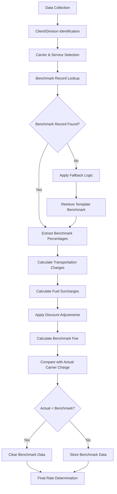
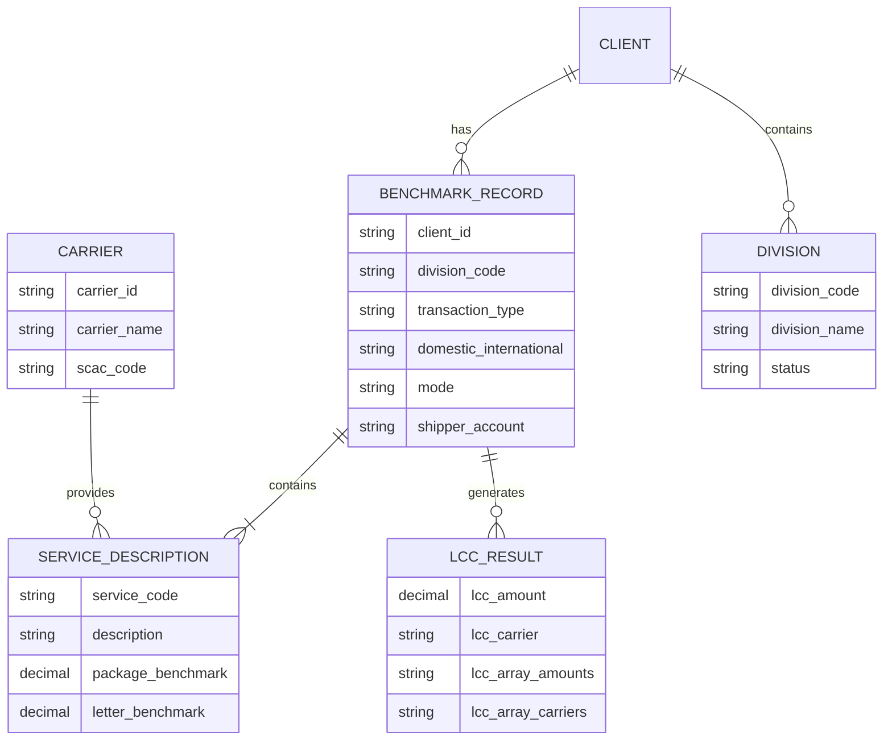
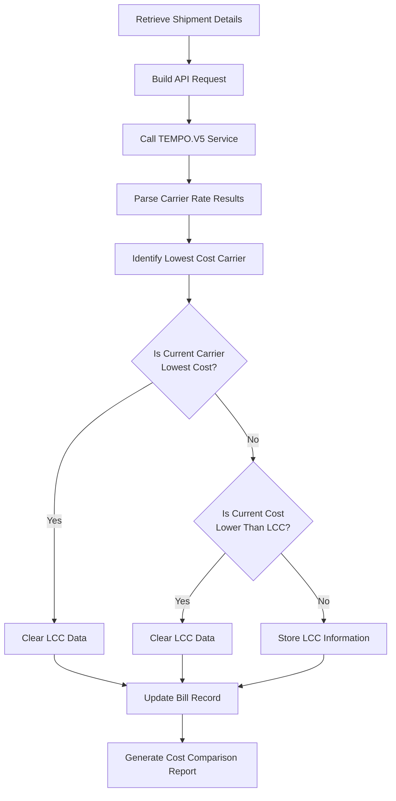
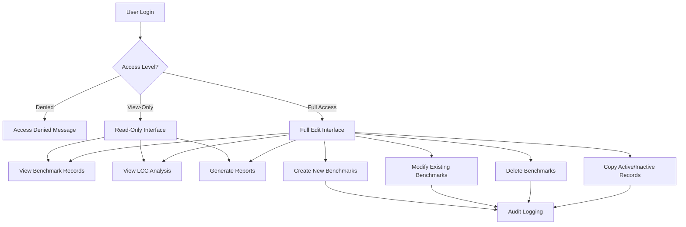

# Benchmark Rate Calculation in Freight Logistics

## Introduction to Benchmark Rate Calculation

Benchmark rate calculation is a fundamental process in freight logistics that establishes competitive pricing standards for shipping services. It serves as a reference point against which actual carrier rates can be compared, enabling clients to optimize their transportation costs. In the AFS Shreveport system, benchmark rates function as target pricing models that help identify cost-saving opportunities by comparing actual carrier charges with optimal market rates. These calculations incorporate various factors including shipment characteristics, carrier capabilities, geographic considerations, and market conditions to determine the most cost-effective shipping options for clients. By establishing these benchmarks, AFS provides clients with a powerful tool for negotiating better carrier rates, validating invoices, and making data-driven decisions about their logistics operations.

## Benchmark Rate Structure and Components

Benchmark rates in the AFS Shreveport system are structured using a multi-layered approach that accommodates different carrier types and service levels. The primary components include:

1. **Percentage-based benchmarks**: Most commonly used format where the benchmark is expressed as a percentage of the transportation charge. These percentages typically range from 1% to 99% and are applied to the base transportation charge to calculate the benchmark fee.

2. **Flat fee benchmarks**: Used primarily for hundredweight (CWT) services, these are fixed dollar amounts applied regardless of shipment size or distance.

3. **Service-specific components**: Different service descriptions (like Next Day Air, Ground, etc.) have unique benchmark percentages based on market competitiveness and service value.

4. **Domestic vs. International modifiers**: Separate benchmark structures for domestic and international shipments that account for the complexity and additional costs of cross-border logistics.

5. **Transaction type differentiators**: Different benchmark calculations for normal shipments versus multiweight shipments, which consolidate multiple packages to a single destination.

6. **Fuel surcharge considerations**: Benchmark calculations often include adjustments for fuel surcharges, either incorporating them into the base calculation or treating them separately.

The system maintains these components in carrier-specific benchmark files (UPS.BM, FEDEX.BM, MAIL.CONS.BM) that store the percentage values and flat fees for each service description, organized by client, division, and shipping direction.

## Benchmark Rate Calculation Flow



The benchmark rate calculation process begins with collecting shipment data including origin, destination, weight, and service type. The system identifies the appropriate client and division configuration, then selects the carrier and service level. It performs a benchmark record lookup using a hierarchical approach, falling back to templates if client-specific benchmarks aren't found. 

Once the benchmark percentages are retrieved, the system calculates transportation charges and applies fuel surcharges. Discount adjustments are factored in, with special handling for fuel-related discounts. The benchmark fee is calculated using the formula: `Discount Amount - Fuel Discount + ((Transportation Charge + Fuel Surcharge + Fuel Discount) * Benchmark Percentage / 10000)`.

The calculated benchmark is compared with the actual carrier charge. If the actual charge is already lower than the benchmark, the benchmark data is cleared. Otherwise, the benchmark data is stored for reporting and analysis. This process ensures that clients always receive the most competitive rates available for their shipments.

## Carrier-Specific Benchmark Management

The AFS Shreveport system implements specialized benchmark management approaches for different carriers, each with unique configuration requirements:

**FedEx Benchmarks:**
FedEx benchmarks are managed through the FEDEX.BM file and are structured around transaction types (normal vs. multiweight), domestic/international status, and shipping mode (inbound, outbound, or third-party). The system supports both package and letter benchmarks with different percentage values for each service description. FedEx benchmark calculations include special handling for discount amounts, transportation charges, and fuel surcharges, with client-specific rules for companies like 01152, 01644, and 01475 that modify how benchmark fees are calculated based on additional charges.

**UPS Benchmarks:**
UPS benchmarks are stored in the UPS.BM file and are organized by client ID, shipping mode (inbound, outbound, or both), and shipper account number. The system distinguishes between percentage-based benchmarks for standard services and flat fee structures for hundredweight services. UPS benchmark records include visual indicators in the user interface to differentiate between percentage benchmarks and flat fee minimums, ensuring proper application during calculations.

**Mail Consolidated Benchmarks:**
Mail Consolidated benchmarks use a simpler structure in the MAIL.CONS.BM file, primarily focusing on markup percentages rather than service-specific rates. These benchmarks are configured by client ID and shipper account number, with validation rules ensuring that percentages remain between 0% and 99.99%. The system supports both active and inactive benchmark states, allowing for historical rate preservation while implementing new rate structures.

Each carrier's benchmark management includes access controls, template-based creation for new records, and audit logging of changes to maintain data integrity and traceability.

## Client and Division Benchmark Configuration

The AFS Shreveport system provides a highly customizable framework for configuring benchmarks at multiple organizational levels:

At the client level, benchmark configurations establish the baseline pricing strategy for all shipments. These client-level benchmarks can be overridden by more specific configurations at lower levels. The system allows for client-specific templates that serve as starting points for new benchmark records, ensuring consistency in rate structures.

Division-level benchmarks add another layer of customization, allowing different business units within a client organization to have their own benchmark rates. This is particularly valuable for clients with diverse shipping needs across different departments or locations. The system supports division codes that can be used to retrieve division-specific benchmark records.

For even more granular control, the system allows benchmark configuration at the shipper account level. This enables clients to maintain different benchmark rates for different shipping accounts with the same carrier, accommodating various negotiated rate agreements and shipping volumes.

The benchmark configuration hierarchy follows a fallback pattern when looking up the appropriate benchmark record:
1. First, it attempts to find a match for the specific client, division, transaction type, domestic/international status, and mode
2. If not found, it tries broader matches by substituting "ALL" for the division code
3. If still not found, it falls back to template benchmarks

This hierarchical approach ensures that the most specific applicable benchmark is always used while providing fallback options when specific configurations aren't available.

## Benchmark Data Structure



The benchmark data structure in AFS Shreveport is organized around carrier-specific files (UPS.BM, FEDEX.BM, MAIL.CONS.BM) that store benchmark information. Each benchmark record is identified by a composite key that includes client ID, division code (or "ALL"), transaction type, domestic/international indicator, mode, and optionally a shipper account number.

Within each benchmark record, data is organized in a multi-value structure:
- Attribute 1: Service description codes (e.g., "1DM" for Next Day Air Morning)
- Attribute 2: Package benchmark percentages (stored as integers representing hundredths of a percent)
- Attribute 3: Letter benchmark percentages or flat fees for hundredweight services

The system maintains relationships between benchmark records and service descriptions through the FB.TABLES file, which contains the master list of service descriptions for each carrier. When new service descriptions are added to FB.TABLES, they are automatically incorporated into existing benchmark records during the next access.

For Lowest Cost Carrier (LCC) analysis, additional data structures store comparison results:
- LCC amount: The lowest available rate for the shipment
- LCC carrier: The carrier offering the lowest rate
- LCC array amounts: All available carrier rates for comparison
- LCC array carriers: The corresponding carriers for each rate

This comprehensive data structure enables efficient benchmark lookups, supports the hierarchical fallback mechanism, and provides the foundation for comparative rate analysis across carriers.

## Domestic vs. International Benchmark Handling

The AFS Shreveport system implements distinct approaches for handling domestic and international shipments in benchmark calculations, reflecting the fundamental differences in pricing structures, regulatory requirements, and operational complexities between these shipment types.

For domestic shipments, benchmark calculations typically focus on standard transportation charges, fuel surcharges, and discounts. The system uses a domestic indicator ('D') when retrieving benchmark records, ensuring that domestic-specific rates are applied. Domestic benchmarks often have more standardized service descriptions and more predictable pricing structures, allowing for more straightforward percentage-based calculations.

International shipments require more complex benchmark handling due to additional factors such as customs fees, duties, taxes, and international fuel surcharges. The system identifies international shipments through destination country codes or explicit international indicators in the shipment data. When processing international shipments, the system uses an international indicator ('I') to retrieve appropriate benchmark records that account for these additional complexities.

The benchmark lookup process prioritizes specificity, first attempting to find benchmarks that match the exact domestic/international status of the shipment. If no specific benchmark is found, the system may fall back to more general benchmarks, but this fallback behavior is carefully controlled to prevent inappropriate rate applications.

Special considerations for international benchmarks include:
- Currency exchange rate impacts on benchmark calculations
- Country-specific regulatory requirements that affect pricing
- Additional service fees unique to international shipping
- Varying transit times that may affect service level selection

By maintaining separate benchmark structures for domestic and international shipments, the AFS Shreveport system ensures accurate rate calculations that reflect the true cost differences between these fundamentally different shipping scenarios.

## Benchmark Fee Calculation Logic

The benchmark fee calculation in AFS Shreveport employs sophisticated algorithms that account for multiple cost components and client-specific requirements. The core calculation logic varies by carrier but generally follows these principles:

For FedEx shipments, the benchmark fee calculation uses this formula:
```
FSC_DSC = 1 + (Discount_Amount / Transportation_Amount)
FSC_DSC = Fuel_Surcharge / FSC_DSC - Fuel_Surcharge
Benchmark_Fee = Discount_Amount - FSC_DSC + (((Transportation_Amount + Fuel_Surcharge + FSC_DSC) * Benchmark_Percentage) / 10000)
```

This formula accounts for the relationship between discounts and fuel surcharges, ensuring that the benchmark fee accurately reflects the effective discount rate applied to the total shipment cost. The division by 10000 converts the benchmark percentage from basis points (stored as integers) to a decimal percentage.

For certain clients (01152, 01644, 01475), additional logic is applied:
```
If Benchmark_Fee < 0 Then
    Benchmark_Fee = Benchmark_Fee - Additional_Amount
Else
    Benchmark_Fee = 0 - Additional_Amount
End If
```

This client-specific adjustment ensures that additional charges are properly accounted for in the benchmark calculation.

For UPS shipments, the calculation distinguishes between percentage-based benchmarks and flat fee benchmarks for hundredweight services:
- For standard services, the benchmark fee is calculated as a percentage of the transportation charge plus applicable surcharges
- For hundredweight services, the benchmark is applied as a minimum charge regardless of the shipment size

Mail Consolidated benchmarks use a simpler markup percentage approach, applying the configured percentage to the base transportation charge.

In all cases, the system implements validation rules to ensure benchmark fees are reasonable:
- If the actual carrier matches the lowest cost carrier, the benchmark fee is cleared
- If the actual charge is already lower than the calculated benchmark, the benchmark fee is cleared
- Benchmark percentages are validated to ensure they're between 0% and 99.99%

This comprehensive calculation logic ensures that benchmark fees accurately reflect potential cost savings while accounting for the complexities of different carrier pricing structures and client-specific requirements.

## Lowest Cost Carrier Analysis



The Lowest Cost Carrier (LCC) analysis is a critical component of the benchmark rate calculation process in AFS Shreveport. This analysis identifies the most cost-effective carrier option for a given shipment and compares it with the carrier actually used, providing valuable insights for future shipping decisions.

The process begins by retrieving detailed shipment information including origin/destination locations, weight, dimensions, and service requirements. This data is used to build an API request to the TEMPO.V5 service, which returns competitive rate quotes from multiple carriers based on the shipment characteristics.

When the results are returned, the system parses the carrier rates and identifies the lowest cost option. For each carrier, the system calculates the total cost including base transportation charges, fuel surcharges, and any additional fees. The carrier with the lowest total cost is identified as the LCC.

The system then performs a series of validations:
1. If the actual carrier used matches the LCC, the LCC data is cleared since no cost savings opportunity exists
2. If the actual charge is already lower than the LCC amount (which can happen due to negotiated rates or special discounts), the LCC data is cleared
3. If the LCC's SCAC code isn't found in the database, an email notification is sent to system administrators

When a valid LCC is identified with potential cost savings, the system stores the LCC information in the bill record, including:
- LCC amount: The lowest available rate
- LCC carrier: The carrier offering this rate
- LCC array: All available carrier rates for comparison

This comprehensive analysis enables clients to identify cost-saving opportunities, evaluate carrier performance, and make data-driven decisions about their shipping strategies. The LCC data provides concrete evidence of potential savings that can be used in carrier negotiations or to justify changes in shipping policies.

## Benchmark Templates and Standardization

Benchmark templates are a critical feature of the AFS Shreveport system that enable standardization of rate calculations and facilitate the efficient creation of new benchmark records. These templates serve as pre-configured starting points that incorporate industry best practices and carrier-specific pricing structures.

The system maintains several types of templates:
- Standard templates (e.g., "TEMPLATE" in UPS.BM) that include typical benchmark percentages for common services
- Zero-commission templates (e.g., "ZERO-TEMPLATE" in UPS.BM) that provide a baseline for clients requiring no commission structure
- Carrier-specific templates that account for the unique service offerings and pricing models of each carrier

When creating a new benchmark record, users can select the appropriate template as a starting point, which automatically populates the record with the standard service descriptions and benchmark percentages. This approach ensures consistency across client configurations and significantly reduces the time required to set up new benchmarks.

Templates also serve as a standardization mechanism, ensuring that all benchmark records follow a consistent structure and include all required service descriptions. When new service descriptions are added to the master list in FB.TABLES, they are automatically incorporated into existing benchmark records during the next access, maintaining consistency across the system.

The template-based approach offers several benefits:
- Reduces configuration errors by providing pre-validated benchmark structures
- Ensures comprehensive coverage of all service types offered by a carrier
- Accelerates the onboarding process for new clients
- Facilitates the implementation of best practices across client configurations
- Provides a baseline for customization to meet specific client requirements

By leveraging templates, AFS Shreveport maintains a standardized approach to benchmark rate calculation while still providing the flexibility to accommodate client-specific needs and carrier-specific pricing structures.

## Benchmark Rate Recalculation and Updates

Benchmark rates in the AFS Shreveport system are not static values but dynamic calculations that may require updates and recalculations in response to changing market conditions, carrier rate adjustments, or client requirements. The system provides robust mechanisms for managing these updates while maintaining historical accuracy.

Historical rate adjustments are handled through specialized recalculation programs like RECALC.FEDEX.BM, which process historical freight bills and apply updated benchmark calculations. These programs select bills based on specific criteria (such as carrier, date range, or client), retrieve the appropriate benchmark records, and recalculate the benchmark fees using the current calculation logic. The results are written to report files that document the changes and provide audit trails of the recalculations.

The impact on client billing is carefully managed through several mechanisms:
- Active vs. inactive benchmark states allow for testing new rate structures before implementation
- Audit logging captures all changes to benchmark records with attribute-level tracking
- Historical benchmark records are preserved to maintain accurate reporting on past shipments

When benchmark rates need to be updated, the system provides user interfaces (UPS.BM.SETUP, FEDEX.BM.SETUP, MAIL.CONS.BM.SETUP) that allow authorized users to modify benchmark percentages for specific service descriptions. These interfaces implement validation rules to ensure that benchmark percentages remain within acceptable ranges (0% to 99.99%) and provide visual indicators for different types of benchmarks (percentage vs. flat fee).

The recalculation process follows these general steps:
1. Identify the freight bills requiring recalculation
2. Retrieve the current benchmark records for each bill
3. Apply the benchmark calculation logic using the updated rates
4. Compare the new benchmark fees with the actual carrier charges
5. Update the bill records with the recalculated benchmark information
6. Generate reports documenting the changes

This comprehensive approach to benchmark rate recalculation and updates ensures that the system maintains accurate and up-to-date benchmark information while preserving historical data integrity and providing clear audit trails of all changes.

## User Access Control for Benchmark Management



The AFS Shreveport system implements a robust three-tiered access control system for benchmark rate management, ensuring that only authorized users can view or modify these critical financial parameters. This access control framework balances security requirements with operational needs by providing appropriate levels of access based on user roles.

The three access levels are:

1. **Denied Access (Level 0)**: Users with this access level cannot view or interact with benchmark management interfaces. When these users attempt to access benchmark management programs, they receive a clear message indicating that access is denied and directing them to request access through the appropriate channels.

2. **View-Only Access (Level 1)**: Users with view-only access can browse benchmark records, view lowest cost carrier analyses, and generate reports, but cannot make any changes to the data. The interface visually indicates the view-only status, and edit functions are disabled. This level is appropriate for users who need to reference benchmark information for reporting or analysis purposes but should not modify the rates.

3. **Full Access (Level 2)**: Users with full access can perform all benchmark management functions, including creating new benchmark records, modifying existing ones, deleting records, and copying between active and inactive states. This level is reserved for users directly responsible for maintaining benchmark rates, typically financial analysts or logistics managers.

Access control is implemented through user name validation against hardcoded lists or through integration with the OPERATOR file, which stores user privileges. The system clearly indicates the current access level in the program header, ensuring users understand their permissions.

All changes made by users with full access are captured in a detailed audit log that records:
- The attribute being changed
- The old value
- The new value
- The user making the change
- The date and time of the change

This comprehensive access control system ensures that benchmark rates are protected from unauthorized modifications while still allowing appropriate users to view and analyze the data. The audit logging provides accountability and traceability for all changes, supporting compliance requirements and enabling historical analysis of benchmark rate adjustments.

[Generated by the Sage AI expert workbench: 2025-05-28 08:06:18  https://sage-tech.ai/workbench]: #