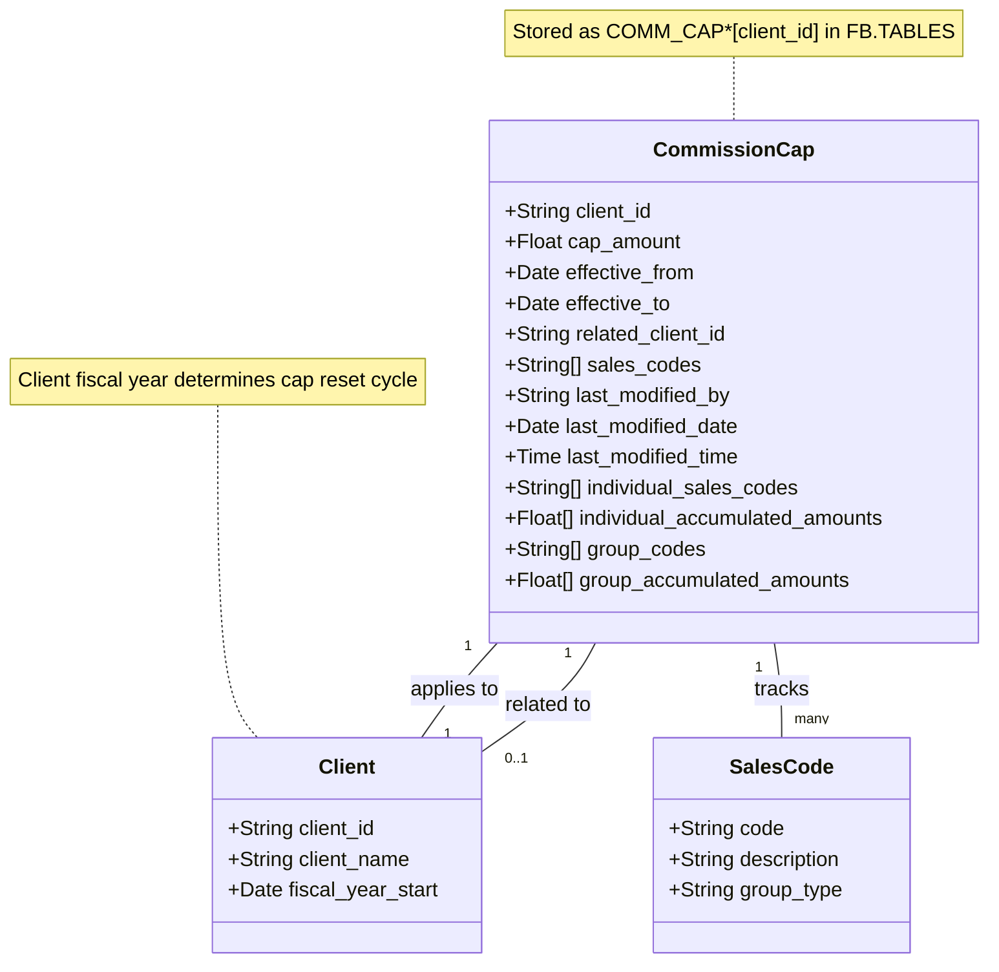
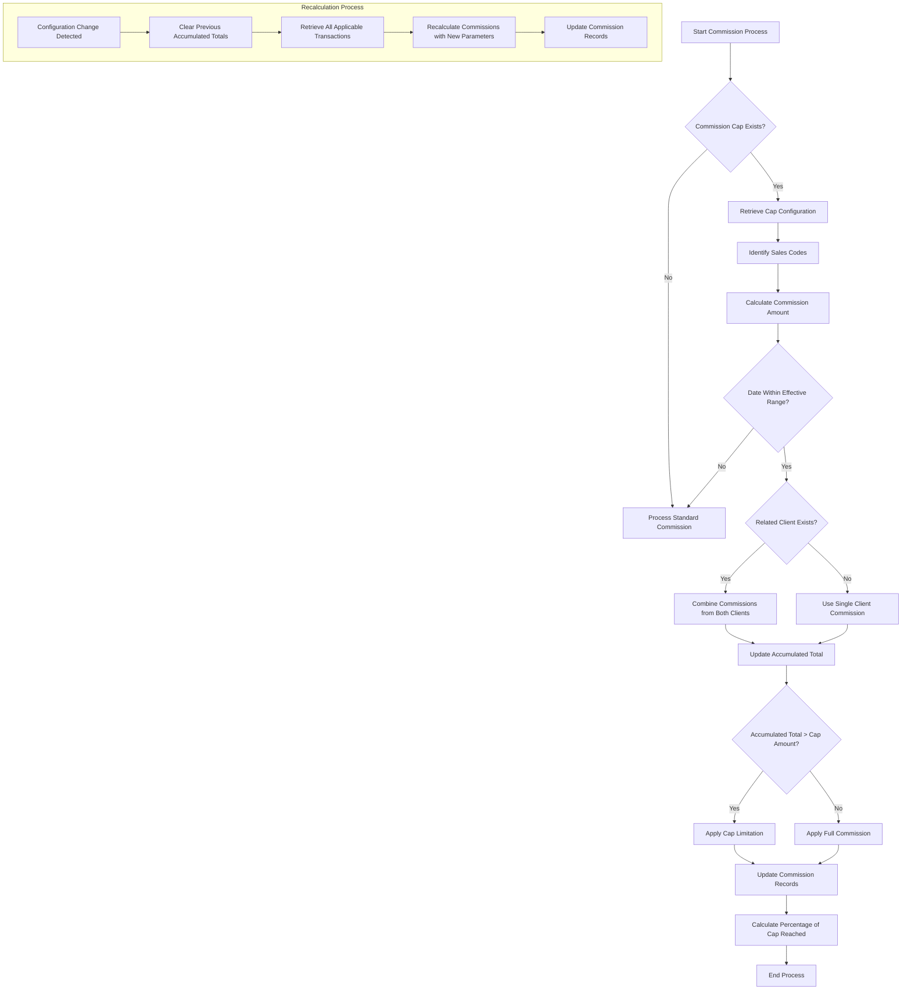
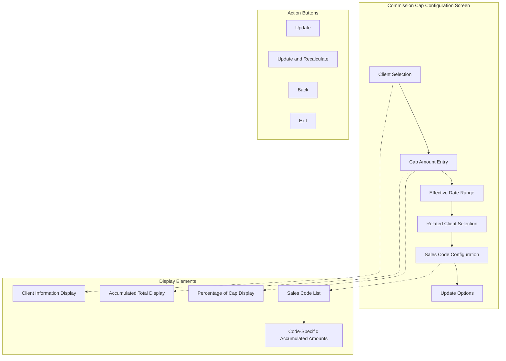

# Client Commission Configuration in AFS Shreveport

## Client Commission Configuration Overview

The commission cap system in AFS Shreveport serves as a comprehensive mechanism for managing and tracking commission payments to sales representatives based on client billing activities. This feature allows administrators to establish maximum commission thresholds (caps) for specific clients, define effective date ranges aligned with fiscal years, and track accumulated commission totals against these predefined caps. The system supports granular control through sales code associations, enabling organizations to monitor commissions across different service categories such as carrier charges, logistics services, and miscellaneous fees. By implementing commission caps, AFS Shreveport helps businesses maintain predictable commission expenses while providing transparency in sales compensation tracking.

## Commission Cap Data Structure

The commission cap data structure maintains relationships between clients, sales representatives, and accumulated commission totals. The system stores commission cap records with a unique identifier format of "COMM_CAP*[client_id]" in the FB.TABLES file. Each record contains the cap amount, effective date range, related client information (if applicable), and detailed tracking of accumulated commissions by individual sales codes and code groups. When a client has a related client relationship, both entities share a combined commission cap through cross-referenced records, enabling consolidated tracking across business entities.

## Setting Commission Caps

The process for establishing maximum commission amounts for clients involves several key steps. First, administrators identify the client requiring a commission cap and determine the appropriate maximum amount based on business agreements or policies. The system requires setting an effective date range that defines when the cap should be applied, typically aligned with the client's fiscal year. 

When configuring a commission cap, users specify:
1. The client identifier (by number or name search)
2. The maximum commission amount (cap)
3. The effective start date (when cap monitoring begins)
4. The effective end date (optional, when cap monitoring ends)
5. Any related clients that should share the cap
6. Applicable sales codes or code groups

Once established, the commission cap is applied to all billing activities for the specified client during the effective date range. The system automatically tracks accumulated commissions against this cap, providing percentage calculations to show how much of the cap has been reached. When commission caps need modification, the system supports updates to the amount or date ranges and can recalculate accumulated totals based on the new parameters.

## Related Client Feature

The AFS Shreveport system implements a powerful related client feature that allows multiple client accounts to share a combined commission cap. This functionality is particularly valuable for businesses with complex organizational structures where a single entity may operate under multiple client accounts within the system. 

When a related client relationship is established, the commission cap configuration links the two client accounts, allowing their commission totals to be tracked collectively against a single cap amount. This ensures that sales representatives cannot exceed their commission limits by splitting transactions across different client accounts for the same business entity.

The system maintains this relationship by creating mirrored commission cap records for both the primary and related clients, with cross-references to each other. When commissions are calculated for either client, the system aggregates the totals from both accounts to determine the percentage of the cap that has been reached. If the related client configuration changes, the system automatically updates or removes the corresponding records to maintain data integrity.

## Commission Calculation Workflow

The commission calculation workflow illustrates how commissions are calculated, tracked against caps, and how accumulated totals are updated when configuration changes occur. When a commission-eligible transaction is processed, the system first checks if a commission cap exists for the client. If a cap is active and the transaction date falls within the effective date range, the system identifies the applicable sales codes and calculates the commission amount.

For clients with related accounts, the system combines commissions from both entities before comparing against the cap. The accumulated total is updated, and if it exceeds the cap amount, the commission is limited accordingly. The system then calculates the percentage of the cap that has been reached for reporting purposes.

When commission cap configurations change (such as modified date ranges or cap amounts), the recalculation process is triggered. This process clears previous accumulated totals, retrieves all applicable transactions within the new parameters, recalculates commissions, and updates the commission records with the revised totals.

## Sales Code Integration

The AFS Shreveport commission cap system provides granular control through integration with specific sales codes or code groups. This integration allows organizations to track commissions at a detailed level across different service categories, including Carrier Charges (CC), Logistics (LG), Miscellaneous (MS), Overcharges (OC), and Fees (PB).

When configuring a commission cap, administrators can specify individual sales codes or select entire code groups to be monitored against the cap. This flexibility enables businesses to implement different commission structures for various service types while maintaining overall caps. For example, a client might have different commission rates for logistics services versus carrier charges, but all would count toward the same overall cap.

The system maintains separate accumulated totals for each sales code and group, allowing for detailed analysis of commission distribution across service categories. When processing transactions, the system automatically identifies the applicable sales codes and updates the corresponding accumulated totals. This integration provides valuable insights into which service areas are generating the most commission activity and helps identify trends in sales performance across different business segments.

## Commission Monitoring and Reporting

AFS Shreveport provides comprehensive methods for tracking accumulated commissions against established caps, enabling organizations to monitor sales performance and manage commission expenses effectively. The system automatically calculates the percentage of the cap that has been reached, providing a clear indication of how close a client is to its commission limit.

Key monitoring capabilities include:

1. Real-time tracking of accumulated commission totals against established caps
2. Percentage calculations showing what portion of the cap has been utilized
3. Detailed breakdowns of commissions by sales code or code group
4. Historical tracking of commission trends over time

The reporting functionality allows administrators to generate detailed reports showing commission activity across clients, sales representatives, and service categories. These reports can be used for financial planning, sales performance evaluation, and commission expense management.

When a commission cap is approaching its limit, the system provides visual indicators in the user interface, helping administrators make informed decisions about commission adjustments or cap increases. This proactive monitoring ensures that sales representatives are properly compensated while maintaining control over commission expenses.

## Commission Cap User Interface

The commission cap user interface in AFS Shreveport provides a comprehensive screen layout for managing commission caps. The main interface elements include client selection, amount entry, and sales code configuration sections. At the top of the screen, users can search for clients by number or name, with the system displaying the selected client's information including name and fiscal year details.

The central portion of the interface allows users to enter the cap amount, specify effective date ranges, and select any related clients that should share the commission cap. Below this section, users can configure which sales codes or code groups should be included in the cap tracking.

The interface displays real-time information about accumulated commission totals and the percentage of the cap that has been reached. For each selected sales code or group, the system shows individual accumulated amounts, providing a detailed breakdown of commission distribution.

Action buttons at the bottom of the screen allow users to update the commission cap configuration, with options to simply save changes or to update and recalculate accumulated totals based on the new parameters. Navigation buttons enable users to move back to previous screens or exit the commission cap management function.

## Fiscal Year Alignment

Commission caps in AFS Shreveport are designed to align with client fiscal years, providing a natural cycle for commission tracking and management. The system automatically identifies a client's fiscal year start date from their client record (field 29), which determines when commission caps should be reset.

When configuring a commission cap, the effective date range typically corresponds to the client's fiscal year. The system displays the client's fiscal year information on the commission cap screen, helping administrators ensure proper alignment. If a client's fiscal year information is not configured, the system can still establish commission caps, but without automatic alignment to fiscal periods.

At the end of a fiscal year, organizations typically reset commission caps for the new period. While the system does not automatically reset caps, it provides tools to efficiently establish new caps for the upcoming fiscal year. Administrators can update the effective date range to correspond with the new fiscal period and reset the accumulated totals.

The fiscal year alignment ensures that commission tracking remains consistent with other financial reporting periods, simplifying reconciliation and financial analysis. It also provides a natural boundary for commission cap management, allowing organizations to adjust cap amounts and policies on a regular, predictable schedule.

## Security and Audit Controls

The AFS Shreveport commission cap system implements robust security and audit trail features to ensure proper access control and accountability. Access to the commission cap configuration is restricted to authorized users only, with the system maintaining a predefined list of users who can modify commission cap settings.

When unauthorized users attempt to access the commission cap configuration, the system not only denies access but also generates email notifications to security administrators, providing details about the access attempt including the user name, date, time, and program accessed. This proactive security measure helps organizations identify potential security breaches or training needs.

For all changes to commission cap configurations, the system maintains a comprehensive audit trail that includes:

1. The user who made the change (stored in field 7)
2. The date when the change was made (stored in field 8)
3. The time when the change was made (stored in field 9)

This audit information is stored directly in the commission cap record, providing a permanent record of who modified the configuration and when the changes occurred. The audit trail is particularly valuable for compliance purposes and for troubleshooting discrepancies in commission calculations.

The system's security model ensures that only authorized personnel can establish or modify commission caps, protecting the integrity of the commission management process while maintaining accountability through detailed audit records.

## Recalculation Process

The recalculation process in the AFS Shreveport commission cap system is a critical feature that ensures accumulated commission totals remain accurate when configuration parameters change. This process is triggered when users modify date ranges, cap amounts, sales code selections, or other parameters that affect how commissions are calculated and tracked.

When a user selects the "Update and Recalculate" (UR) option, the system performs the following steps:

1. Saves the updated commission cap configuration to the database
2. Identifies all transactions that fall within the new effective date range
3. Clears previous accumulated totals for the affected sales codes or groups
4. Processes each applicable transaction to calculate commission amounts
5. Aggregates the recalculated commissions by sales code and group
6. Updates the accumulated totals in the commission cap record
7. Recalculates the percentage of the cap that has been reached

This comprehensive recalculation ensures that the accumulated totals accurately reflect the current configuration parameters. For clients with related accounts, the system also updates the corresponding commission cap records to maintain consistency across the linked entities.

The recalculation process is particularly important when date ranges are modified, as it ensures that only transactions within the current effective period are included in the accumulated totals. This prevents discrepancies that could arise from misaligned date ranges and provides accurate, up-to-date information for commission monitoring and reporting.

[Generated by the Sage AI expert workbench: 2025-05-28 08:06:25  https://sage-tech.ai/workbench]: #