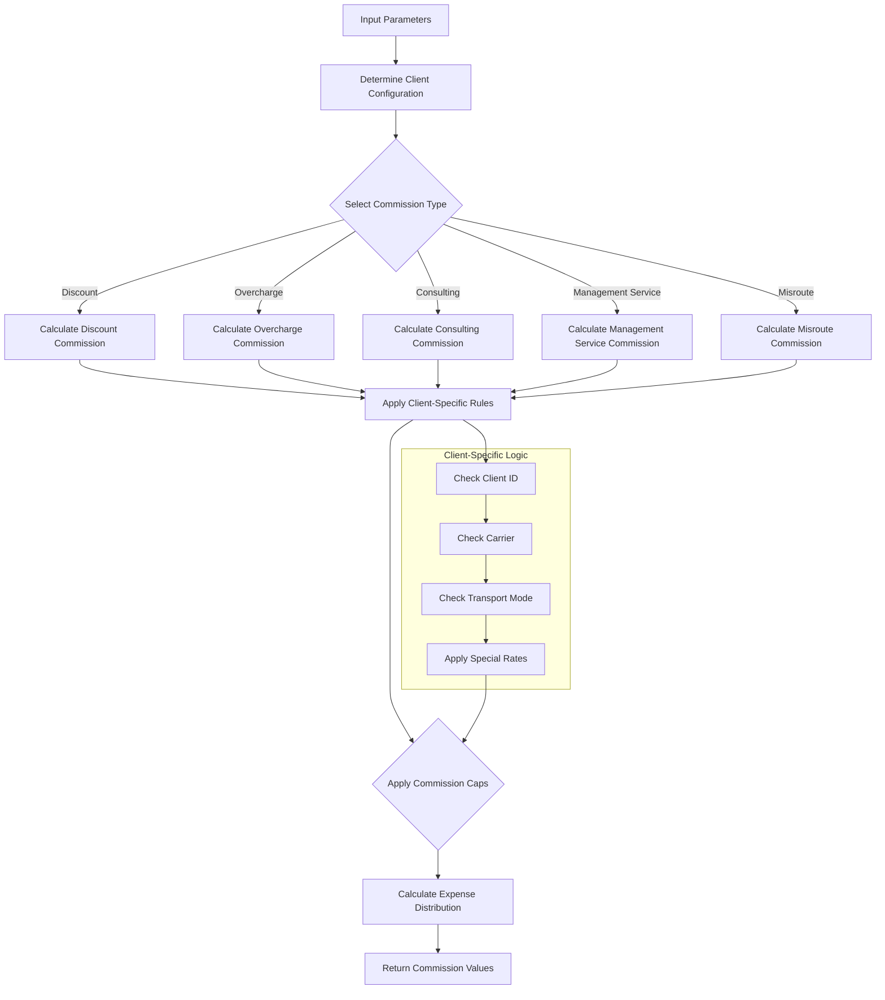
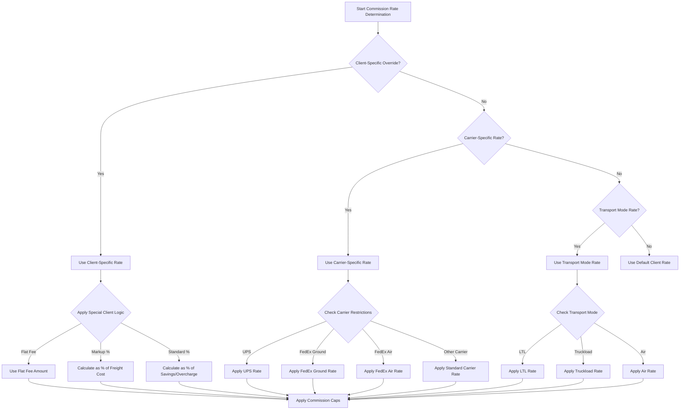
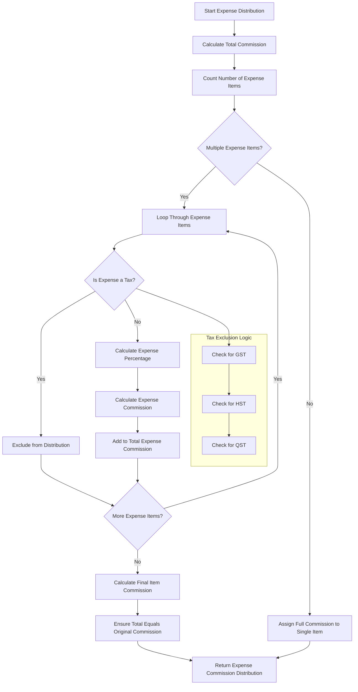
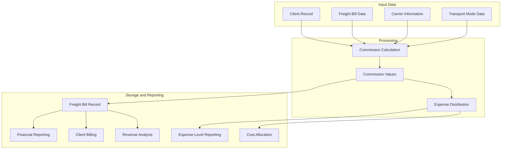

# Commission Calculation in AFS Shreveport

## Commission Calculation Overview

The commission calculation functionality in AFS Shreveport is a sophisticated component that determines various types of commissions for freight bills based on client-specific rules and configurations. This system processes input parameters from client records and bill data to calculate appropriate commission rates and amounts for each freight bill. The commission calculation logic is highly customizable, allowing for different commission structures across clients, carriers, and transport modes. The system supports percentage-based calculations, flat fees, markups on freight costs, and carrier-specific rates, providing flexibility to accommodate diverse business arrangements. Commission calculations are a critical part of the financial operations of AFS Shreveport, directly impacting revenue recognition, client billing, and financial reporting.

## Commission Types and Structure

AFS Shreveport calculates several distinct commission types, each serving a specific purpose in the freight billing ecosystem:

1. **Discount Commission**: Calculated based on discounts applied to freight bills, typically as a percentage of the discount amount.

2. **Overcharge Commission**: Applied to amounts recovered from carrier overcharges, with special handling for carriers like UPS, FedEx Ground, and FedEx Air that have their own specific commission rates.

3. **Consulting Commission**: Also known as logistics commission, this can be calculated as a percentage of freight costs or as a flat fee depending on client configuration.

4. **Expense Distribution Commission**: Allocates commissions proportionally across expense items on a freight bill, with special handling to exclude certain tax-related expenses like GST, HST, and QST.

5. **Management Service Commission**: Determined by transport mode, this commission is calculated as a percentage of the freight cost.

6. **Misroute Consulting Commission**: Applied to costs recovered from carrier routing errors, calculated as a percentage of the recovered amount.

The system supports both percentage-based calculations (where commission is a percentage of savings or costs) and flat-fee structures (where a fixed amount is charged regardless of bill value). Additionally, the system implements markup-based commission models for specific clients where commissions are calculated as a percentage of total freight costs rather than savings.

## Commission Calculation Flow



The commission calculation process begins with gathering input parameters from client records and freight bill data. The system then determines the appropriate commission rates based on client configuration, carrier, and transport mode. For each commission type, the system applies specific calculation rules, which may include percentage-based calculations, flat fees, or markup-based models.

Client-specific logic is a critical part of the process, with extensive conditional checks to apply special rates or calculation methods for particular clients. After calculating the base commission amounts, the system applies any applicable caps or limitations. Finally, for expense distribution commission, the system allocates the total commission proportionally across expense items, excluding certain tax-related expenses.

## Client-Specific Commission Rules

AFS Shreveport implements a highly customized approach to commission calculations with extensive client-specific rules. These rules allow for tailored commission structures that reflect the unique business arrangements with each client. The system maintains client-specific commission rates in the client record, including discount rates, overcharge rates, consulting rates, and management service rates.

For many clients, the system implements special commission calculation logic that overrides the standard percentage-based approach. For example:

- Some clients have flat-fee arrangements where a fixed commission amount (e.g., $800) is applied regardless of the freight bill amount
- Many clients use markup-based models where commissions are calculated as a percentage of total freight costs (ranging from 3% to 25% depending on the client)
- Certain clients have carrier-specific commission rates that only apply to designated carriers
- Some clients have transport mode-specific commission rates that vary between LTL, truckload, and air freight shipments

The system also implements client-specific commission caps that limit the maximum commission amount for certain commission types. These caps provide predictability for clients while protecting them from unexpectedly high commission charges.

The extensive use of client IDs in conditional logic throughout the commission calculation code demonstrates the highly customized nature of commission rules. Each client may have unique requirements, and the system is designed to accommodate these variations while maintaining a consistent calculation framework.

## Commission Rate Determination Hierarchy



The commission rate determination follows a hierarchical decision process that evaluates multiple factors to select the appropriate rate. This hierarchy ensures that the most specific applicable rate is used for each freight bill. The system first checks for client-specific overrides, which take precedence over all other rate determinations. If no client-specific override exists, the system checks for carrier-specific rates, followed by transport mode-specific rates. If none of these specific rates apply, the system falls back to the default client rate.

This hierarchical approach allows for precise control over commission rates while maintaining a manageable configuration structure. The most specific rules (client-carrier-mode combinations) take precedence over more general rules, ensuring that special arrangements are properly honored while providing sensible defaults for standard situations.

## Carrier-Based Commission Configuration

AFS Shreveport provides robust support for carrier-specific commission configurations, allowing different commission rates to be applied based on the carrier handling the shipment. This is particularly important for major carriers like UPS, FedEx Ground, and FedEx Air, which often have unique commission structures negotiated separately from other carriers.

The system maintains carrier-specific commission rates in the client record, with separate fields for carrier codes, fees, percentages, minimums, caps, and maximums. When calculating commissions, the system checks if the carrier for the current freight bill matches any of the carrier codes configured for the client. If a match is found, the system uses the carrier-specific commission rate instead of the default rate.

Special handling is implemented for UPS (carrier code 00041), FedEx Ground (carrier code 01075), and FedEx Air (carrier code 00015), with dedicated fields in the client record for their specific commission rates. This allows for streamlined processing of these high-volume carriers while maintaining flexibility for other carriers.

For some clients, carrier-specific logic extends beyond just the commission rate. For example, certain clients may only apply commissions for specific carriers, excluding all others. This is implemented through conditional checks that verify the carrier code before calculating any commission.

The carrier-based commission configuration provides a powerful mechanism for implementing complex business rules while maintaining a clean separation between different commission structures.

## Transport Mode Commission Logic

The transport mode significantly influences commission calculations in AFS Shreveport, with different rules applied to LTL (Less Than Truckload), Truckload, and Air Freight shipments. The system maintains transport mode-specific commission rates in the client record, allowing for customized commission structures based on the shipping method.

When calculating commissions, particularly consulting commissions, the system checks the transport mode of the freight bill against the configured transport modes for the client. If a match is found, the system applies the transport mode-specific commission rate instead of the default rate.

For many clients, commission calculations are limited to specific transport modes. For example, some clients may only apply markup-based commissions to LTL shipments, excluding truckload and air freight. This is implemented through conditional checks that verify the transport mode before calculating the commission.

The system also supports management service commissions that are specifically tied to transport modes. The client record contains fields for transport mode codes and corresponding management service rates, allowing for different management service commission percentages based on the shipping method.

Transport mode-specific commission logic is particularly important for clients with diverse shipping needs, as it allows for tailored commission structures that reflect the different cost structures and service levels associated with each transport mode.

## Expense Distribution Commission Model



The expense distribution commission model in AFS Shreveport allocates the total commission amount proportionally across the various expense items on a freight bill. This ensures that commissions are distributed accurately when a freight bill contains multiple expense components.

The process begins by calculating the total commission amount across all commission types (discount, overcharge, consulting, and management service). The system then determines the number of expense items on the freight bill. If there is only one expense item, the entire commission is assigned to that item. However, if there are multiple expense items, the system distributes the commission proportionally based on each item's percentage of the total freight cost.

A key feature of the expense distribution model is its tax awareness. The system specifically excludes certain tax-related expenses (GST, HST, and QST) from the commission distribution. This is important for compliance with tax regulations and ensures that commissions are only applied to eligible freight costs.

The distribution process calculates each expense item's commission amount by multiplying the total commission by the expense's percentage of the total eligible freight cost. To ensure accuracy, the system keeps a running total of distributed commissions and assigns any remaining amount (due to rounding) to the final expense item. This guarantees that the sum of distributed commissions exactly matches the original total commission amount.

## Commission Caps and Limitations

AFS Shreveport implements a comprehensive system of commission caps and limitations to control commission payouts and provide predictability for clients. These caps are configured at the client level and can be applied to different commission types, ensuring that commissions remain within acceptable ranges regardless of freight bill amounts.

The system supports several types of commission caps:

1. **Overcharge Commission Caps**: Limit the maximum commission amount for overcharge recoveries. These caps are stored in the client record and applied during commission calculation. Some carriers, like UPS, may be excluded from overcharge caps based on specific business arrangements.

2. **Consulting Commission Caps**: Control the maximum consulting commission amount. These caps are particularly important for markup-based commission models where the commission is calculated as a percentage of freight costs.

3. **Transport Mode Caps**: Set maximum commission amounts specific to each transport mode (LTL, Truckload, Air Freight). This allows for different caps based on the shipping method.

4. **Carrier-Specific Caps**: Establish maximum commission amounts for specific carriers, providing fine-grained control over commission payouts.

In addition to caps, the system also implements minimum commission amounts and maximum commission percentages. These provide additional control points to ensure that commissions remain within acceptable ranges.

The commission cap logic includes checks to ensure that commission amounts do not exceed the configured caps. If a calculated commission amount exceeds the applicable cap, the system automatically reduces the commission to the cap amount. Similarly, negative commissions (which can occur in certain adjustment scenarios) are limited to the negative value of the cap.

## Markup-Based Commission Calculations

Markup-based commission calculations represent a significant alternative to the traditional savings-based commission model in AFS Shreveport. While traditional commission models calculate commissions as a percentage of savings or overcharges, markup-based models calculate commissions as a percentage of the total freight cost.

The system implements markup-based commission calculations for numerous clients, with markup percentages ranging from 3% to 25% depending on the specific client arrangement. These markup percentages are applied directly to the freight cost (stored in PRO.REC<8>) to calculate the commission amount.

Markup-based commissions are typically implemented through client-specific conditional logic in the commission calculation code. For example:

```
IF CLIENT='01510' THEN
   CONSULTING.COMM=(PRO.REC<8>*.08)'R0'
   IF CARRIER='23288' THEN CONSULTING.COMM=0
   IF CONSULTING.PERC='0' THEN
      CONSULTING.COMM=0
   END
END
```

This code applies an 8% markup for client 01510, except for carrier 23288 which receives no commission.

Many markup-based commission arrangements include additional restrictions based on transport mode or carrier. For example, some clients only apply markup-based commissions to LTL shipments, while others only apply them to specific carriers. These restrictions are implemented through conditional checks that verify the transport mode or carrier before calculating the markup-based commission.

Markup-based commission calculations provide a more predictable revenue stream compared to savings-based models, as they are tied directly to freight volume rather than the ability to find savings or overcharges. This makes them particularly suitable for clients with stable shipping patterns and predictable freight costs.

## Commission Data Flow in AFS Shreveport



Commission data flows through multiple components of the AFS Shreveport system, from initial calculation to storage and reporting. The process begins with input data from client records, freight bill data, carrier information, and transport mode data. These inputs feed into the commission calculation engine, which applies the appropriate business rules to determine commission amounts.

The calculated commission values are then stored in the freight bill record, with separate fields for each commission type (discount commission, overcharge commission, consulting commission, expense distribution commission, management service commission, and misroute consulting commission). For expense distribution commission, the system further allocates the commission amounts across individual expense items.

Once stored in the freight bill record, commission data becomes available for various reporting and analysis functions. Financial reporting uses commission data to track revenue and profitability. Client billing incorporates commission information to generate accurate invoices. Revenue analysis examines commission trends to identify opportunities for optimization.

The commission data flow is designed to ensure that commission information is accurately calculated, properly stored, and readily available for reporting and analysis. This enables AFS Shreveport to maintain transparency in its commission structures while providing the flexibility needed to accommodate diverse client requirements.

## Commission Calculation Integration

The commission calculation functionality in AFS Shreveport is deeply integrated with other system components, creating a cohesive platform for freight bill processing and financial management. This integration ensures that commission data flows seamlessly between different parts of the system, maintaining data consistency and supporting comprehensive reporting.

Key integration points include:

1. **Client Records**: The commission calculation process draws heavily from client records, using client-specific commission rates, caps, and special rules. Changes to client configuration automatically flow through to commission calculations, ensuring that commissions always reflect current client arrangements.

2. **Freight Bill Processing**: Commission calculation is an integral part of the freight bill processing workflow. As freight bills are processed, the system automatically calculates applicable commissions based on the bill details and client configuration.

3. **Financial Reporting**: Commission data is a critical component of financial reporting in AFS Shreveport. The system integrates commission information into various financial reports, providing visibility into revenue sources and profitability.

4. **Expense Distribution**: The commission calculation functionality integrates with the expense distribution system to allocate commissions across expense items. This integration ensures that commission allocations accurately reflect the expense structure of each freight bill.

5. **Carrier Management**: The system's integration with carrier data allows for carrier-specific commission rates and rules. This integration supports complex business arrangements where commission structures vary by carrier.

6. **Transport Mode Configuration**: Integration with transport mode data enables mode-specific commission calculations, supporting different commission structures for LTL, truckload, and air freight shipments.

The commission calculation functionality also integrates with the system's audit trail capabilities, ensuring that all commission calculations are properly documented and traceable. This integration supports compliance requirements and provides transparency in commission determinations.

Through these integration points, the commission calculation functionality becomes a central component of the AFS Shreveport system, touching virtually every aspect of freight bill processing and financial management.

[Generated by the Sage AI expert workbench: 2025-05-28 08:06:24  https://sage-tech.ai/workbench]: #