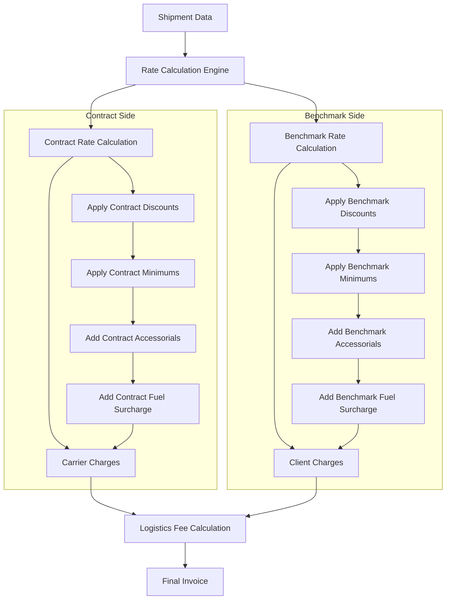
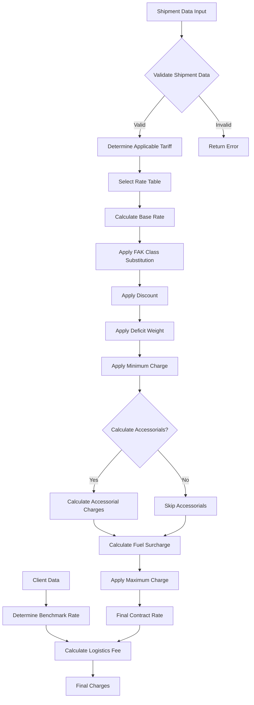
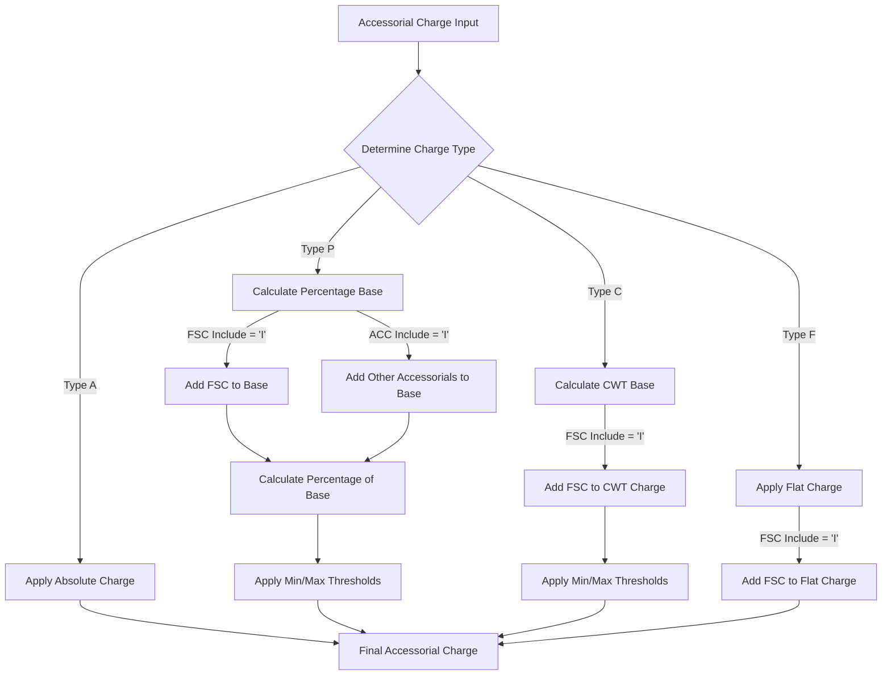

# Contract Rate Calculation in AFS Shreveport

## Overview of Contract Rate Calculation

The AFS Shreveport system implements a sophisticated contract rate calculation mechanism for freight billing that serves as the foundation for the company's logistics and auditing services. At its core, the contract rate calculation process determines the appropriate charges for shipments based on negotiated carrier agreements and client-specific pricing structures.

The system calculates freight rates by analyzing shipment characteristics (origin/destination, weight, class, dimensions) and applying the appropriate tariffs, discounts, and accessorial charges according to contractual terms. This calculation engine powers multiple business functions including freight bill auditing, cost optimization, logistics fee determination, and client billing.

The calculation process involves several key components: tariff selection based on effective dates, application of discounts to base rates, calculation of weight-based charges, determination of minimum/maximum thresholds, application of fuel surcharges, and addition of accessorial charges. The system maintains separate contract rates (what carriers charge AFS) and benchmark rates (what AFS charges clients), with the difference representing the logistics fee or commission.

## Contract vs. Benchmark Rate Structure

AFS Shreveport employs a dual-rate system that distinguishes between contract rates and benchmark rates:

**Contract Rates** represent the negotiated charges that carriers bill to AFS for transportation services. These rates are typically discounted from the carrier's published tariffs based on volume commitments and negotiated agreements. Contract rates include the base transportation charge plus applicable accessorial charges and fuel surcharges.

**Benchmark Rates** represent the charges that AFS bills to its clients. These rates are typically higher than contract rates and are established based on market conditions, service levels, and client-specific agreements. The benchmark rates may use different discount structures, minimums, and accessorial charge calculations than the contract rates.

The difference between benchmark and contract rates constitutes AFS's logistics fee or commission, which compensates for services such as freight auditing, carrier management, and cost optimization. This dual-rate structure allows AFS to generate revenue while still providing cost savings to clients compared to what they would pay dealing directly with carriers.

Both rate structures follow similar calculation methodologies but may use different tariffs, discount percentages, and rules for determining charges. The system maintains these calculations separately but in parallel, ensuring accurate billing for both carriers and clients.

## Contract Rate Calculation Flow

The contract rate calculation process in AFS Shreveport follows a systematic flow from input parameters to final charges. This diagram illustrates the end-to-end process for calculating freight rates.

## Tariff Management and Selection

The AFS Shreveport system employs a sophisticated tariff management system that maintains a comprehensive database of carrier tariffs with effective dates. This ensures that the correct rates are applied based on when a shipment occurred.

Tariffs in the system are identified by unique codes (such as AFS500, RDW507, etc.) and are linked to specific rating programs that implement the calculation logic. Each tariff has an effective date range, ensuring that historical rates can be preserved and applied to shipments that occurred during their validity period.

The tariff selection process begins by identifying the appropriate carrier and service type for the shipment. The system then determines which tariff applies based on:

1. **Effective Date Matching**: The system compares the shipment date against the effective date ranges of available tariffs to find the one that was valid when the shipment occurred.

2. **Geographic Applicability**: Tariffs may be specific to certain regions, states, or service points. The system checks origin and destination ZIP codes to determine which tariff applies.

3. **Client-Specific Overrides**: Some clients may have negotiated special tariff applications that override the standard selection process.

4. **Service Type Matching**: Different tariffs apply to different service types (LTL, truckload, air freight, etc.).

Once the appropriate tariff is selected, the system retrieves the associated rate tables, which contain the base rates, discounts, minimums, and other parameters needed for the calculation. These tables are structured to accommodate various weight breaks and freight classes, allowing for precise rate determination based on shipment characteristics.

The system also handles special cases such as joint line pricing (shipments requiring multiple carriers) and FAK (Freight All Kinds) class substitutions, where a single class is used regardless of the actual freight classification.

## Accessorial Charge Calculation

Accessorial charges in the AFS Shreveport system represent additional fees for services beyond basic transportation. These charges are calculated using a sophisticated system that supports different charge types, each with its own calculation methodology and rules for inclusion or exclusion of other charges.

The system implements four primary accessorial charge types:

1. **Type A (Absolute)**: Fixed charges that are applied directly without modifications. These charges are not subject to minimum/maximum thresholds or inclusion/exclusion rules.

2. **Type P (Percentage)**: Charges calculated as a percentage of the base transportation charge. The calculation can optionally include or exclude fuel surcharges and other accessorial charges in the base amount. For example, a residential delivery fee might be 25% of the base transportation charge.

3. **Type C (CWT - Per Hundredweight)**: Charges calculated based on the shipment weight, expressed as a rate per hundredweight (cwt). These charges may include fuel surcharges and are subject to minimum and maximum thresholds.

4. **Type F (Flat)**: Fixed amount charges that may be adjusted by including fuel surcharges based on the flat amount.

Each accessorial charge has inclusion/exclusion flags that determine whether fuel surcharges (FSC) and other accessorial charges should be included in the calculation base. For example:

- If the FSC inclusion flag is set to 'I', the fuel surcharge amount is included in the calculation base.
- If the accessorial inclusion flag is set to 'I', other accessorial charges are included in the calculation base.

The system also applies minimum and maximum thresholds to accessorial charges. If a calculated charge falls below the minimum, the minimum amount is applied. Similarly, if a charge exceeds the maximum, it is capped at the maximum amount.

## Fuel Surcharge Handling

Fuel surcharges represent a critical component of freight rate calculation in the AFS Shreveport system, as they account for the fluctuating cost of fuel. The system implements a sophisticated approach to calculating and applying fuel surcharges for both contract and benchmark rates.

Fuel surcharges are typically calculated as a percentage of the base transportation charge. The percentage is determined by fuel tables that correlate current fuel prices with surcharge percentages. These tables are regularly updated to reflect changes in fuel costs.

The key aspects of fuel surcharge handling include:

1. **Surcharge Determination**: The system retrieves the applicable fuel surcharge percentage based on the shipment date and carrier-specific fuel tables. Different carriers may have different fuel surcharge schedules.

2. **Base Calculation**: The fuel surcharge is calculated by multiplying the base transportation charge by the surcharge percentage. The base may include or exclude certain accessorial charges depending on carrier rules.

3. **Inclusion/Exclusion Rules**: Some accessorial charges may include fuel surcharges in their calculation, while others may exclude them. This is controlled by the inclusion/exclusion flags ('I' for include, 'E' for exclude) associated with each accessorial charge.

4. **Client-Specific Handling**: Benchmark fuel surcharges may differ from contract fuel surcharges based on client agreements. Some clients may have negotiated caps on fuel surcharges or alternative calculation methods.

5. **Separate Tracking**: The system maintains separate tracking of fuel surcharge amounts for both contract and benchmark rates, allowing for transparent reporting and analysis.

The fuel surcharge calculation is integrated with the accessorial charge calculation process. When an accessorial charge has its fuel surcharge inclusion flag set to 'I', the system adds the appropriate fuel surcharge amount to the accessorial charge. This ensures that fuel costs are properly accounted for across all components of the freight charge.

For reporting and analysis purposes, the system maintains separate fields for the base transportation charge and the fuel surcharge, allowing for detailed breakdowns of cost components.

## Minimum and Maximum Charge Thresholds

The AFS Shreveport system implements minimum and maximum charge thresholds for both contract and benchmark rates to ensure that shipment charges fall within acceptable ranges regardless of the calculated rate. These thresholds are critical for maintaining profitability while honoring contractual agreements.

**Minimum Charge Thresholds** establish a floor for shipment charges, ensuring that even small or lightweight shipments generate sufficient revenue to cover handling costs. When a calculated rate falls below the minimum threshold, the system automatically applies the minimum charge instead. Minimum charges may vary based on:

1. **Carrier-specific minimums**: Each carrier may have different minimum charge requirements.
2. **Geographic factors**: Different regions or lanes may have different minimum charges.
3. **Client agreements**: Special minimum charge arrangements may be negotiated with specific clients.
4. **Service type**: Different service levels (standard, expedited, etc.) may have different minimums.

**Maximum Charge Thresholds** establish a ceiling for shipment charges, preventing excessive costs for large or heavy shipments. When a calculated rate exceeds the maximum threshold, the system caps the charge at the maximum amount. Maximum charges help ensure that:

1. **Truckload alternatives are considered**: When LTL charges approach truckload rates, it may be more economical to use truckload service.
2. **Client expectations are met**: Maximum charges prevent billing surprises for clients.
3. **Competitive pricing is maintained**: Caps ensure that rates remain competitive with market alternatives.

Both minimum and maximum thresholds are applied separately to contract and benchmark rates, allowing for different thresholds in each case. This enables AFS to maintain appropriate margins while offering competitive pricing to clients.

The thresholds are also applied to individual accessorial charges, with each charge potentially having its own minimum and maximum values. When calculating accessorial charges, the system first determines the base charge, then applies any applicable minimum or maximum threshold before adding the result to the total shipment cost.

## Rate Table Structure

The LTL rate table structure in AFS Shreveport is designed to efficiently organize freight rates based on weight breaks and freight classes. This structure allows for precise rate determination based on shipment characteristics.

```mermaid
graph TD
    A[LTL Rate Table] --> B[Weight Breaks]
    A --> C[Freight Classes]
    A --> D[Discount Structure]
    
    B --> B1[50 lbs]
    B --> B2[100 lbs]
    B --> B3[200 lbs]
    B --> B4[500 lbs]
    B --> B5[1000 lbs]
    B --> B6[2000 lbs]
    B --> B7[5000 lbs]
    B --> B8[10000 lbs]
    B --> B9[20000 lbs]
    
    C --> C1[Class 50]
    C --> C2[Class 55]
    C --> C3[Class 60]
    C --> C4[Class 70]
    C --> C5[Class 85]
    C --> C6[Class 92.5]
    C --> C7[Class 100]
    C --> C8[Class 125]
    C --> C9[Class 150]
    C --> C10[Class 250]
    C --> C11[Class 300]
    C --> C12[Class 400]
    
    D --> D1[Contract Discount]
    D --> D2[Benchmark Discount]
    D --> D3[FAK Substitution]
    
    E[Rate Calculation] --> F[Less than 500 lbs Rate]
    E --> G[Over 500 lbs Rate]
    E --> H[Minimum Charge]
    
    F --> I[Final Rate]
    G --> I
    H --> I
```

The rate table structure consists of several key components:

1. **Weight Breaks**: The tables define different rate tiers based on shipment weight. Common weight breaks include 50, 100, 200, 500, 1000, 2000, 5000, 10000, and 20000 pounds. Rates typically decrease as weight increases.

2. **Freight Classes**: Standard freight classes (50, 55, 60, 70, 85, 92.5, 100, 125, 150, 250, 300, 400, 500) are used to categorize shipments based on density, stowability, handling, and liability. Higher classes generally have higher rates.

3. **Rate Types**:
   - **Less than 500 lbs Rate (L5C)**: Applied to shipments weighing less than 500 pounds.
   - **Over 500 lbs Rate (O5C)**: Applied to shipments weighing 500 pounds or more.
   - **Minimum Charge (TMIN)**: The minimum amount charged regardless of calculated rate.

4. **Discount Structure**:
   - **Contract Discounts**: Applied to carrier rates to determine what AFS pays.
   - **Benchmark Discounts**: Applied to determine what clients pay to AFS.
   - **FAK (Freight All Kinds)**: Class substitutions that simplify rating by using a single class.

5. **Table Organization**:
   - Each row represents a freight class.
   - Columns contain rates for different weight breaks.
   - Separate sections exist for contract and benchmark rates.
   - Additional fields store minimum charges, FAK classes, and other parameters.

The system uses these tables to determine the appropriate rate by:
1. Identifying the correct weight break for the shipment.
2. Finding the rate corresponding to the shipment's freight class (or FAK class).
3. Applying any applicable discounts.
4. Comparing the calculated rate to the minimum charge and using the higher value.
5. Applying any deficit weight adjustments if necessary.

This structured approach ensures consistent and accurate rate calculations across all shipments while accommodating the complex pricing models used in the freight industry.

## Joint Line Pricing

Joint Line Pricing in the AFS Shreveport system addresses the complex scenario where a shipment requires multiple carriers to complete the transportation from origin to destination. This typically occurs when a single carrier doesn't service both the origin and destination points directly, necessitating a handoff between carriers.

The system handles joint line pricing through a sophisticated process that:

1. **Detects Joint Line Requirements**: By analyzing origin and destination ZIP codes against carrier service areas, the system identifies when a shipment requires joint line service.

2. **Carrier Selection**: The system determines which carriers are needed for each leg of the shipment. This selection considers:
   - Carrier service territories
   - Interline agreements between carriers
   - Client-approved carrier lists
   - Cost optimization

3. **Rate Calculation**: Joint line pricing can follow several models:
   - **Through Rate**: A single rate is applied for the entire shipment, with carriers sharing the revenue based on predetermined agreements.
   - **Combination Rate**: Each carrier's portion is rated separately, and the charges are combined.
   - **Proportional Rate**: The total distance is considered, with each carrier receiving a proportion based on their segment's distance.

4. **Inbound vs. Outbound Handling**: The system differentiates between:
   - **Inbound Joint Line**: Where the destination is outside the origin carrier's service area.
   - **Outbound Joint Line**: Where the origin is outside the destination carrier's service area.

5. **Special Considerations**:
   - Additional transit time is factored in for carrier transfers.
   - Accessorial charges may be applied differently for joint line shipments.
   - Minimum charges may be applied to each segment or to the total shipment.
   - Service guarantees may be modified for joint line shipments.

The system maintains special tables that define joint line relationships between carriers, including which carriers can interchange with each other and at which service points these interchanges can occur. These tables also define how rates should be calculated and how revenue should be allocated between the participating carriers.

Joint line pricing adds complexity to the rating process but is essential for providing comprehensive coverage to clients whose shipping needs extend beyond the service area of any single carrier. The AFS Shreveport system's ability to handle these complex scenarios enables clients to ship to any location while maintaining visibility and control over their transportation costs.

## Client-Specific Rating Rules

The AFS Shreveport system implements a highly flexible framework for client-specific rating rules that allows for customized freight rate calculations based on individual client requirements and agreements. These rules ensure that each client's unique business needs and negotiated terms are accurately reflected in their freight charges.

Client-specific rating rules are stored in dedicated client files and are applied during the rate calculation process. The system supports a wide range of customization options, including:

1. **Carrier Selection Rules**: Clients may have approved carrier lists or preferred carrier hierarchies that dictate which carriers should be used for their shipments. The system can enforce these preferences during rate calculation and carrier selection.

2. **Custom Discount Structures**: Clients may have negotiated special discount percentages that differ from standard rates. These custom discounts can be applied to specific lanes, weight ranges, or freight classes.

3. **FAK (Freight All Kinds) Arrangements**: Clients may have agreements to use specific freight classes regardless of the actual commodity being shipped. The system supports client-specific FAK arrangements that simplify classification and potentially reduce costs.

4. **Minimum Charge Overrides**: Custom minimum charges can be established for specific clients, carriers, or lanes, ensuring that shipment charges meet negotiated thresholds.

5. **Accessorial Charge Modifications**: Clients may have special arrangements for accessorial charges, such as reduced rates for residential delivery or liftgate service, or complete waivers for certain accessorial charges.

6. **Fuel Surcharge Alternatives**: Custom fuel surcharge calculations or caps may be implemented for specific clients based on their agreements with carriers or with AFS.

7. **Geographic Considerations**: Special rating rules may apply to specific origins, destinations, or lanes based on client shipping patterns or negotiated lane-specific discounts.

8. **Volume-Based Pricing**: Tiered pricing structures based on shipment volume or frequency can be implemented to reward clients with high shipping volumes.

The system applies these client-specific rules during the rating process by:

1. Identifying the client associated with the shipment.
2. Retrieving the client's custom rating rules from their profile.
3. Applying these rules during the appropriate stages of the rate calculation process.
4. Documenting which rules were applied for audit and reporting purposes.

This client-centric approach allows AFS to provide tailored freight management services that align with each client's unique requirements while maintaining the efficiency and accuracy of the rating process.

## Commission and Fee Calculation

The AFS Shreveport system implements a sophisticated commission and fee calculation mechanism that determines the revenue generated from the difference between benchmark rates (charged to clients) and contract rates (paid to carriers). This calculation is central to AFS's business model as a logistics service provider.

The commission and fee calculation process involves several components:

1. **Logistics Fee Determination**: The primary logistics fee is calculated as the difference between the benchmark rate and the contract rate for the base transportation charge. This represents the core revenue for AFS's freight management services.

2. **Accessorial Fee Calculation**: Similar to the base transportation charge, accessorial charges may have different rates in the benchmark and contract calculations. The difference represents additional revenue for AFS.

3. **Fuel Surcharge Handling**: The system can be configured to either pass through fuel surcharges directly (charging clients exactly what carriers charge) or to apply a markup on fuel surcharges as an additional revenue source.

4. **Commission Structures**: The system supports various commission structures for sales representatives and partners:
   - Flat percentage of the logistics fee
   - Tiered commission rates based on volume or revenue
   - Split commissions between initial and servicing salespeople
   - Commission rates that vary by client, carrier, or service type

5. **Fee Allocation**: Fees can be allocated to different business units or cost centers based on predefined rules, supporting internal accounting and performance tracking.

6. **Minimum Fee Requirements**: The system enforces minimum fee thresholds to ensure that each shipment generates sufficient revenue to cover processing costs.

7. **Client-Specific Fee Arrangements**: Special fee structures can be implemented for specific clients based on negotiated agreements, volume commitments, or strategic importance.

The commission and fee calculations are performed automatically as part of the rate calculation process and are stored with the shipment record for reporting and analysis purposes. This information feeds into financial systems for invoicing, commission payments, and profitability analysis.

The system's ability to maintain separate contract and benchmark rate structures while calculating the resulting fees and commissions enables AFS to provide transparent pricing to clients while optimizing revenue generation across its diverse client base.

[Generated by the Sage AI expert workbench: 2025-05-28 08:06:17  https://sage-tech.ai/workbench]: #