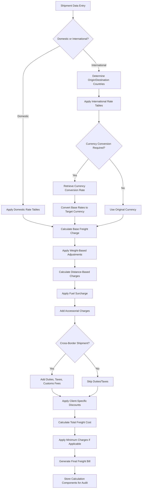
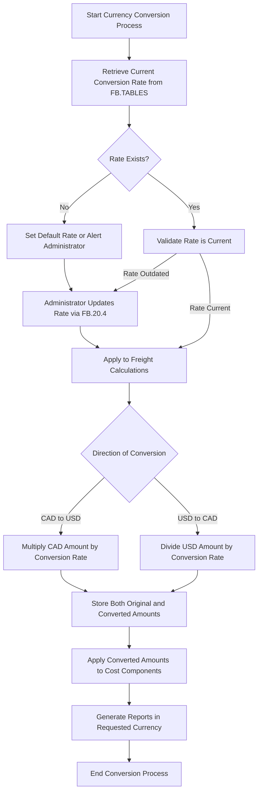
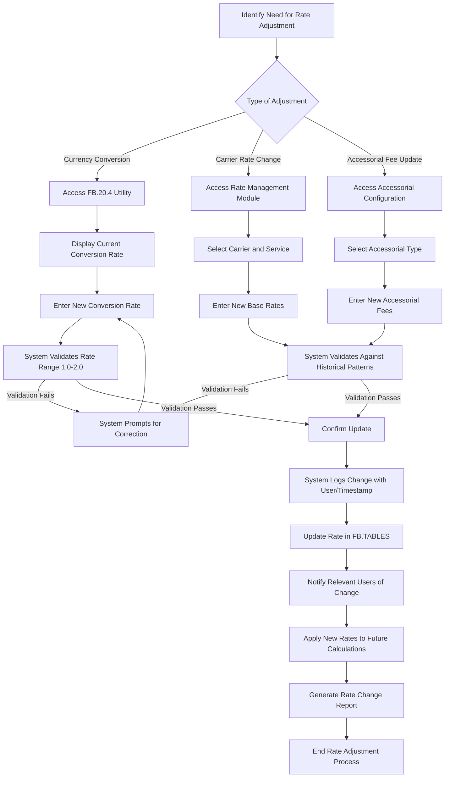

# Freight Cost Calculation in AFS Shreveport

## Currency Conversion in Freight Calculations

Currency conversion plays a critical role in the AFS Shreveport system, particularly for cross-border freight operations between the United States and Canada. The system maintains a centralized conversion rate in the FB.TABLES file under the 'CAN.TO.US.DOLLARS' record, which serves as the foundation for all currency-related calculations.

When processing cross-border shipments, the system applies this conversion rate to transform Canadian dollar amounts to US dollars or vice versa, depending on the billing requirements. This conversion affects multiple aspects of freight calculations, including base rates, accessorial charges, and fuel surcharges. The system enforces logical validation boundaries (between 1.0 and 2.0) for the conversion rate to prevent erroneous calculations that could significantly impact financial reporting.

For financial reporting purposes, the system maintains both the original currency amount and the converted amount, allowing for transparent audit trails and reconciliation. This dual-currency tracking is essential for accurate financial statements, tax compliance, and client billing. The conversion rate's application is consistent across all modules that handle cross-border transactions, ensuring system-wide integrity in financial calculations.

## Cost Calculation Components

The AFS Shreveport system breaks down freight cost calculations into several distinct components that work together to determine the final billable amount:

1. **Base Rates**: The foundational component derived from carrier tariffs or negotiated contracts, typically based on weight breaks, distance zones, or flat rates depending on the shipment type.

2. **Accessorial Charges**: Additional services beyond standard transportation, such as liftgate service, inside delivery, residential delivery, or limited access locations. These are applied as either fixed amounts or percentages of the base rate.

3. **Fuel Surcharges**: Dynamic adjustments that reflect fluctuating fuel costs, calculated as a percentage of the base rate according to carrier-specific or industry-standard fuel indices.

4. **Mileage-Based Calculations**: For distance-dependent pricing models, the system leverages its mileage database to determine precise distances between origin and destination points.

5. **Weight-Based Adjustments**: Including dimensional weight calculations, minimum charges, and excess weight fees that may override standard rates.

6. **Currency Adjustments**: For international shipments, particularly between the US and Canada, the system applies the stored conversion rate to normalize costs to the client's preferred currency.

7. **Taxes and Duties**: For cross-border shipments, the system calculates applicable customs duties, goods and services tax (GST), harmonized sales tax (HST), and other regulatory fees.

8. **Discount Structures**: Client-specific or volume-based discounts that may be applied to the base rate or total charges.

The system maintains these components separately in the calculation process, allowing for detailed audit trails, variance analysis, and the ability to recalculate specific components when rates or factors change.

## Freight Cost Calculation Flow

The freight cost calculation process in AFS Shreveport follows a comprehensive workflow that begins with shipment data entry and ends with a fully calculated freight bill. For international shipments, particularly between the US and Canada, the system retrieves the current currency conversion rate from the FB.TABLES file to ensure accurate financial calculations.

The process handles various pricing models including weight-based, distance-based, and flat-rate pricing, applying the appropriate calculations based on shipment characteristics. The system maintains detailed records of each calculation component, enabling precise auditing and variance analysis. For cross-border shipments, additional complexity is introduced with duties, taxes, and currency conversion, all of which are systematically applied to ensure compliance with international trade regulations.

The final calculation undergoes validation against minimum charges and business rules before generating the freight bill. Throughout this process, the system preserves both the original and converted currency values for transparency and audit purposes.

## Rate Management and Maintenance

The AFS Shreveport system provides sophisticated tools for managing and maintaining freight rates, including specialized utilities for currency conversion adjustments. The FB.20.4 program exemplifies this functionality by enabling administrators to update the Canadian to US dollar conversion rate stored in the FB.TABLES file.

Rate management encompasses several key components:

1. **Rate Tables**: The system maintains comprehensive rate tables for various carriers, modes of transportation, and geographic regions. These tables include base rates, accessorial charges, and fuel surcharges that can be updated individually or in bulk.

2. **Currency Conversion**: For international operations, particularly between the US and Canada, the system provides dedicated utilities like FB.20.4 to maintain accurate currency conversion rates. These rates are subject to validation rules (e.g., between 1.0 and 2.0 for CAD to USD) to prevent erroneous entries.

3. **Effective Dating**: Rate changes can be scheduled with effective dates, allowing the system to automatically apply the correct rates based on shipment date.

4. **Audit Logging**: All rate modifications are logged with user information, timestamp, and before/after values, creating a comprehensive audit trail for compliance and troubleshooting purposes.

5. **Batch Updates**: For large-scale rate changes, such as general rate increases (GRIs), the system supports batch processing to efficiently update multiple rate entries simultaneously.

6. **Rate Versioning**: Historical rates are preserved, enabling the system to recalculate older shipments using the rates that were in effect at the time of shipment.

7. **Rate Testing**: Before implementing new rates, administrators can test the impact on sample shipments to verify calculations and assess financial implications.

The system's rate management capabilities ensure that freight cost calculations remain accurate and up-to-date, even as market conditions, carrier rates, and currency exchange rates fluctuate.

## Cross-Border Shipping Considerations

Cross-border shipping, particularly between the United States and Canada, introduces several complex cost calculation challenges that the AFS Shreveport system addresses through specialized functionality:

1. **Currency Conversion**: The system maintains a centralized conversion rate between Canadian and US dollars, which is applied consistently across all cross-border transactions. This rate is carefully managed through dedicated utilities like FB.20.4, which includes validation to ensure the rate remains within logical boundaries.

2. **Customs Duties and Brokerage**: For cross-border shipments, the system calculates applicable customs duties based on commodity codes, country of origin, and trade agreements. Brokerage fees are also factored into the total cost calculation.

3. **Tax Calculations**: The system handles complex tax scenarios including Canadian GST/HST, provincial sales taxes, and US state/local taxes. These calculations consider the shipment's origin, destination, and the tax status of both the shipper and consignee.

4. **International Accessorial Charges**: Cross-border shipments often incur additional accessorial charges such as customs clearance fees, documentation preparation, in-bond transit fees, and border crossing charges. The system maintains separate accessorial tables for international shipments.

5. **Documentation Requirements**: The system generates appropriate documentation for cross-border shipments, including commercial invoices, certificates of origin, and customs declarations, all of which may impact the final cost calculation.

6. **Regulatory Compliance**: Cost calculations for cross-border shipments must account for regulatory requirements such as NAFTA/USMCA documentation, security filings, and other compliance-related expenses.

7. **Multi-Currency Reporting**: The system supports reporting in both origin and destination currencies, maintaining the original values alongside converted amounts for transparency and audit purposes.

8. **Exchange Rate Fluctuations**: For long-term contracts, the system can track exchange rate fluctuations and apply adjustments or surcharges when rates move beyond predetermined thresholds.

By addressing these considerations, the AFS Shreveport system ensures accurate and compliant cost calculations for cross-border shipments, providing clients with transparent visibility into all components of their international freight expenses.

## Currency Conversion Process

The currency conversion process in AFS Shreveport is a critical component for handling cross-border freight between the US and Canada. The system maintains the conversion rate in the FB.TABLES file under the 'CAN.TO.US.DOLLARS' record, which administrators can update using the FB.20.4 utility program.

When processing international shipments, the system first retrieves the current conversion rate and validates its existence. If the rate is missing or potentially outdated, the system either applies a default rate or alerts administrators to update it. The FB.20.4 program enforces validation rules to ensure the rate falls within logical boundaries (between 1.0 and 2.0), preventing erroneous calculations.

The direction of conversion depends on the billing requirements and client preferences. For Canadian shipments billed in US dollars, the system multiplies the Canadian amount by the conversion rate. Conversely, for US shipments billed in Canadian dollars, it divides the US amount by the same rate.

Throughout this process, the system maintains both the original and converted amounts for all cost components, ensuring transparency and facilitating audit trails. This dual-currency tracking extends to financial reports, which can be generated in either currency based on user requirements.

The system also includes safeguards against rate fluctuations, with monitoring capabilities to alert administrators when significant changes occur that might impact freight costs. This comprehensive approach ensures accurate and consistent currency conversion across all cross-border freight operations.

## Cost Optimization Strategies

The AFS Shreveport system incorporates sophisticated cost optimization strategies that leverage its comprehensive freight calculation capabilities to minimize shipping expenses while maintaining service requirements. These strategies include:

1. **Rate Shopping**: The system can automatically compare rates across multiple carriers and service levels for a given shipment, identifying the most cost-effective option that meets delivery requirements. This comparison accounts for base rates, accessorial charges, fuel surcharges, and applicable discounts.

2. **Mode Optimization**: For shipments that could potentially move via different transportation modes (LTL, truckload, air, etc.), the system evaluates cost-service tradeoffs to recommend the optimal mode based on client-defined parameters.

3. **Consolidation Opportunities**: The system identifies potential shipment consolidation opportunities by analyzing shipping patterns, destinations, and timing requirements. By combining multiple shipments into a single, larger shipment, clients can often achieve significant cost savings.

4. **Accessorial Avoidance**: Through analysis of historical shipping data, the system can identify patterns of accessorial charges and recommend operational changes to avoid unnecessary fees, such as adjusting delivery appointments to prevent detention charges.

5. **Carrier Selection Optimization**: Beyond simple rate shopping, the system considers carrier performance metrics, service consistency, and claims history to recommend carriers that minimize total cost of ownership rather than just the quoted rate.

6. **Route Optimization**: For multi-stop shipments or complex distribution networks, the system calculates optimal routing to minimize total mileage and associated costs while meeting all delivery requirements.

7. **Currency Advantage**: For cross-border shipments, the system can identify opportunities to leverage favorable exchange rates by timing non-urgent shipments or selecting billing currencies that provide cost advantages.

8. **Contract Compliance**: The system ensures that negotiated rates and discounts are properly applied to all eligible shipments, preventing billing errors that could result in overpayment.

9. **Benchmark Analysis**: Freight costs are continuously compared against industry benchmarks and historical performance to identify outliers and opportunities for negotiation or operational improvements.

These optimization strategies are integrated into the freight calculation process, allowing the system to not only calculate accurate costs but also to proactively identify opportunities for cost reduction across the entire logistics operation.

## Variance Analysis and Reconciliation

The AFS Shreveport system incorporates robust variance analysis and reconciliation capabilities that are integral to its freight bill auditing process. These features enable the detection, investigation, and resolution of discrepancies between expected and actual freight costs:

1. **Automated Variance Detection**: The system automatically compares carrier-billed amounts against calculated expected costs, flagging discrepancies that exceed predefined thresholds. These thresholds can be configured based on absolute dollar amounts, percentage differences, or both.

2. **Root Cause Analysis**: When variances are detected, the system breaks down the calculation components to identify the specific elements contributing to the discrepancy, such as base rate differences, incorrect accessorial charges, or currency conversion issues.

3. **Historical Pattern Recognition**: The system analyzes historical variance patterns to identify recurring issues with specific carriers, lanes, or shipment types, enabling proactive resolution of systematic problems.

4. **Currency-Related Variances**: For cross-border shipments, the system distinguishes between variances caused by exchange rate fluctuations versus those resulting from actual billing errors, providing clarity on the true nature of discrepancies.

5. **Reconciliation Workflow**: When variances are identified, the system initiates a structured workflow for investigation and resolution, including carrier communication, documentation collection, and approval processes for adjustments.

6. **Audit Trail Documentation**: Throughout the reconciliation process, the system maintains comprehensive documentation of all findings, communications, and resolutions, creating an audit trail for compliance and financial reporting purposes.

7. **Financial Impact Reporting**: The system quantifies the financial impact of identified variances, both individually and in aggregate, providing visibility into the ROI of the freight audit process.

8. **Continuous Improvement Feedback**: Insights gained from variance analysis are fed back into the rate management and cost calculation processes, continuously refining the accuracy of future freight cost predictions.

This comprehensive approach to variance analysis and reconciliation ensures that freight bills are paid accurately, discrepancies are resolved efficiently, and systematic issues are identified and addressed proactively, resulting in significant cost savings and improved financial control.

## Rate Adjustment Workflow

The rate adjustment workflow in AFS Shreveport provides a structured process for updating various components of freight cost calculations, including currency conversion rates, carrier base rates, and accessorial charges. The diagram illustrates the comprehensive workflow that ensures accuracy, validation, and proper documentation of all rate changes.

For currency conversion updates specifically, administrators use the FB.20.4 utility to modify the CAD to USD conversion rate stored in the FB.TABLES file. The system displays the current rate and prompts for a new value, applying strict validation to ensure the rate falls within logical boundaries (between 1.0 and 2.0). This validation prevents potentially costly errors in cross-border freight calculations.

For carrier rates and accessorial charges, the system provides dedicated interfaces with appropriate validation rules based on historical patterns and industry standards. All rate adjustments, regardless of type, follow a consistent pattern of validation, confirmation, logging, and notification to ensure transparency and accountability.

The system maintains a comprehensive audit trail of all rate changes, recording the user who made the change, the timestamp, and both the previous and new values. This audit trail supports compliance requirements and provides valuable context for future analysis of cost trends.

Once rates are updated, the system immediately applies the new values to future calculations while preserving historical rates for recalculating older shipments. This approach ensures that freight costs are always calculated using the rates that were in effect at the time of shipment, maintaining accuracy across time periods.

## Financial Integration and Reporting

The AFS Shreveport system's freight cost calculation capabilities are tightly integrated with financial systems, providing seamless data flow for accounting, reporting, and analysis purposes. This integration encompasses several key aspects:

1. **General Ledger Integration**: Freight costs are automatically categorized according to client-specific chart of accounts structures, with configurable rules for allocating expenses to appropriate cost centers, departments, or projects. This integration supports both summary-level and detailed posting options.

2. **Multi-Currency Handling**: The system maintains both original and converted currency values throughout the financial integration process, ensuring accurate reporting regardless of the currency used for accounting purposes. Currency conversion rates are consistently applied across all financial touchpoints.

3. **Accrual Management**: For shipments in transit or awaiting final billing, the system generates accurate accruals based on calculated expected costs, which are then reversed when actual invoices are processed. This capability ensures proper period-end financial reporting.

4. **Cost Allocation**: Freight expenses can be automatically allocated across multiple business units, products, or projects based on configurable rules, supporting sophisticated cost accounting requirements for complex organizations.

5. **Financial Reporting Suite**: The system provides a comprehensive suite of financial reports including:
   - Freight spend analysis by carrier, mode, lane, and time period
   - Variance reports comparing actual vs. expected costs
   - Currency impact analysis for international shipments
   - Accrual reconciliation reports
   - Cost savings and avoidance reporting

6. **Data Export Capabilities**: For integration with external financial systems, the system supports configurable data exports in various formats (CSV, XML, JSON, etc.), with scheduled or on-demand execution options.

7. **Audit Support**: The system maintains detailed audit trails of all financial calculations and transactions, supporting both internal and external audit requirements with comprehensive documentation.

8. **Financial Analytics**: Beyond basic reporting, the system provides advanced analytics capabilities including trend analysis, forecasting, and scenario modeling to support strategic financial decision-making related to freight costs.

This comprehensive financial integration ensures that freight cost data flows seamlessly into financial systems, supporting accurate accounting, detailed analysis, and informed decision-making across the organization.

## Audit and Compliance Mechanisms

The AFS Shreveport system incorporates robust audit and compliance mechanisms that ensure accurate freight cost calculations and maintain proper documentation for regulatory purposes. These mechanisms operate at multiple levels throughout the system:

1. **Calculation Validation**: Every freight cost calculation undergoes systematic validation against predefined business rules and logical constraints. For example, currency conversion rates are restricted to reasonable ranges (1.0-2.0 for CAD to USD), preventing potentially costly calculation errors.

2. **Change Tracking**: All modifications to rates, rules, and calculation parameters are logged with detailed information including the user making the change, timestamp, previous value, new value, and reason for change. The FB.20.4 utility exemplifies this approach by logging all currency conversion rate updates.

3. **Access Controls**: The system implements role-based access controls that restrict rate management and calculation parameter modifications to authorized users only, preventing unauthorized changes that could impact financial outcomes.

4. **Version Control**: Historical versions of rates and calculation rules are preserved, enabling the system to recalculate freight costs using the parameters that were in effect at any point in time, supporting audit investigations and historical analysis.

5. **Regulatory Documentation**: For cross-border shipments, the system maintains all required documentation for customs compliance, including commercial invoices, certificates of origin, and customs declarations, with appropriate retention periods.

6. **Audit Trails**: Comprehensive audit trails are maintained for all freight cost calculations, showing each step in the process from initial rate determination through currency conversion to final billing amount, providing full transparency for internal and external auditors.

7. **Exception Reporting**: The system automatically identifies and reports on unusual patterns or outliers in freight costs, flagging potential compliance issues or calculation errors for investigation.

8. **Reconciliation Documentation**: When variances between expected and actual costs are identified and resolved, the system maintains detailed documentation of the investigation process, findings, and resolution, supporting audit requirements.

9. **Compliance Reporting**: The system generates specialized reports to support various compliance requirements, including tax reporting for cross-border shipments, hazardous materials documentation, and environmental impact reporting.

These audit and compliance mechanisms work together to ensure that freight cost calculations are accurate, transparent, and defensible, while maintaining the documentation required to satisfy regulatory requirements and support both internal and external audits.

[Generated by the Sage AI expert workbench: 2025-05-28 08:06:24  https://sage-tech.ai/workbench]: #