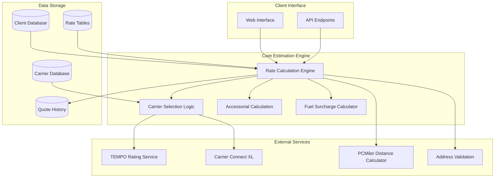
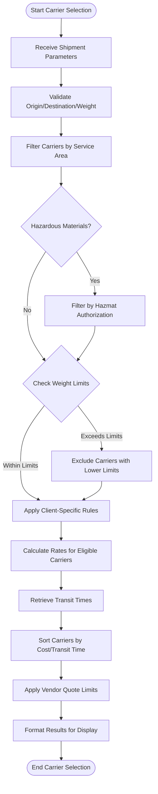
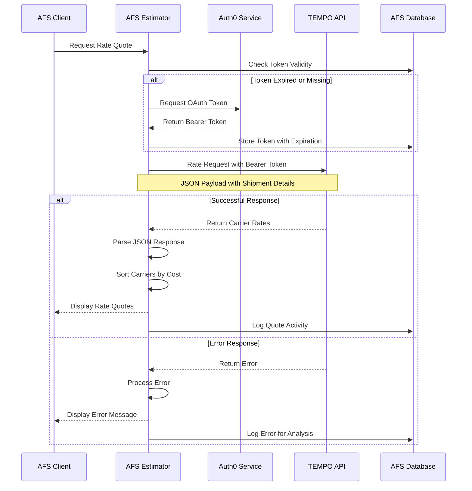
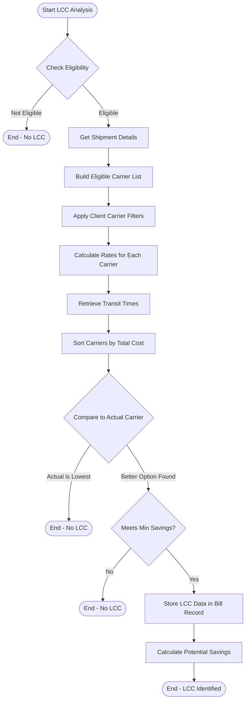

# Freight Cost Estimation in AFS Shreveport

## Introduction to Freight Cost Estimation

Freight cost estimation is a critical component of the AFS Shreveport system, enabling clients to make informed logistics decisions through accurate shipping cost predictions. The system employs sophisticated algorithms and data structures to calculate freight costs across various carriers, modes of transportation, and shipping scenarios. By providing reliable cost estimates, AFS Shreveport helps clients optimize their shipping strategies, control transportation expenses, and improve supply chain efficiency.

The estimation process integrates multiple data sources including carrier contracts, benchmark rates, accessorial charges, and fuel surcharges to deliver comprehensive cost projections. The system supports various shipping types including Less-Than-Truckload (LTL), Truckload, and Air Freight, with specialized handling for hazardous materials, residential deliveries, and international shipments. Through its web interfaces and API connections, AFS Shreveport makes freight cost estimation accessible to clients for both immediate decision-making and long-term logistics planning.

## Core Components of the Estimation System

The freight cost estimation system in AFS Shreveport consists of several interconnected components that work together to provide accurate shipping cost predictions. At its foundation, the system relies on a robust database architecture that stores client-specific contract rates, carrier information, and historical shipping data. The estimation engine processes this data through specialized rating modules tailored to different shipping modes and scenarios.

Key components include:

1. **Rating Engine**: The central processing unit that applies business rules, contract terms, and carrier-specific logic to calculate freight costs. This component is implemented through programs like `FB.AUTO.V2`, `INET.FB.ESTIMATOR`, and the newer TEMPO-based estimators.

2. **Carrier Database**: Maintains comprehensive information about carriers including service areas, transit times, and terminal locations. This data is essential for determining carrier eligibility for specific shipments.

3. **Client Configuration**: Stores client-specific settings including contract rates, preferred carriers, markup rules, and special handling requirements that influence cost calculations.

4. **External Integration Services**: Connects with third-party systems like TEMPO, Carrier Connect XL, and PCMiler to obtain real-time rates, transit information, and mileage data.

5. **Web Interface Layer**: Provides user-friendly access to the estimation system through web services and APIs, allowing clients to obtain quotes directly or through integrated systems.

The system's modular design allows for specialized handling of different transportation modes while maintaining consistency in the estimation methodology across the platform.

## Freight Estimation System Architecture

The architecture diagram illustrates how the freight estimation system components interact. Client requests enter through the web interface or API endpoints, which pass shipment details to the core estimation engine. The rate calculation engine coordinates with carrier selection logic, accessorial calculation, and fuel surcharge calculator components to determine the total freight cost.

External services provide critical data: TEMPO delivers carrier rates, Carrier Connect XL supplies terminal and transit information, PCMiler calculates distances, and SmartyStreets validates addresses and determines residential/commercial status. The system draws from multiple databases containing client configurations, carrier information, and rate tables, while storing quote history for reporting and analysis.

This architecture enables the system to handle complex estimation scenarios while maintaining high performance and accuracy. The modular design allows for component updates without disrupting the entire system, as demonstrated by the evolution from legacy estimators to the TEMPO-based implementation.

## Rating Methodologies and Algorithms

AFS Shreveport employs sophisticated rating methodologies and algorithms to calculate freight costs with precision. The system implements multiple calculation approaches to handle the diverse requirements of different shipping scenarios and client contracts.

### Contract Rate Calculation

The primary method for calculating freight costs is through contract rates negotiated between clients and carriers. The system stores these rates in client-specific tables and applies them based on shipment parameters:

- For LTL shipments, rates are typically calculated using a base rate determined by origin/destination pair and freight class, multiplied by the shipment weight, with minimum charges applied when necessary.
- For truckload shipments, rates may be mileage-based (rate per mile) or flat rates between specific origin/destination pairs.
- For air freight, rates often incorporate dimensional weight calculations and expedited service premiums.

The `FB.AUTO.V2` subroutine serves as the workhorse for contract rate calculations, processing complex rating rules including weight breaks, deficit weight calculations, and minimum charges.

### Benchmark Rate Calculation

In addition to contract rates, the system calculates benchmark rates that represent standard market pricing. These benchmark rates serve several purposes:

- Providing a baseline for comparison against contract rates
- Supporting cost analysis for clients without carrier-specific contracts
- Enabling "least cost carrier" analysis to identify potential savings

Benchmark rates are typically derived from industry standard tariffs or carrier base rates before discounts, stored in the system's rating tables.

### Accessorial Charge Calculation

The system incorporates accessorial charges for special services beyond basic transportation:

- Location-based accessorials (residential delivery, limited access locations)
- Handling-based accessorials (inside delivery, liftgate service)
- Time-based accessorials (appointment delivery, limited delivery window)
- Special cargo accessorials (hazardous materials, oversized freight)

Accessorial charges are applied based on shipment characteristics, ZIP code rules stored in the `ZIP.LINE.ITEM` file, and carrier-specific pricing for these services.

### Fuel Surcharge Calculation

Fuel surcharges are calculated dynamically based on:

- Carrier-specific fuel surcharge tables stored in `FB.BC.FSC`
- Current fuel index values
- Contract-specific fuel surcharge rules

The system applies fuel surcharges as either a percentage of the base rate or as a per-mile charge, depending on carrier and contract specifications.

### Logistics Commission Calculation

For logistics clients, the system calculates commissions based on complex rules:

- Percentage-based markups that vary by client, carrier, and shipment characteristics
- Flat fee additions for specific services
- Tiered commission structures based on shipment value or weight

These calculations are embedded in programs like `INET.FB.ESTIMATOR` and its variants, with client-specific rules stored in the `CLIENTS` database.

The integration of these methodologies allows AFS Shreveport to provide accurate cost estimates across diverse shipping scenarios while accommodating the unique requirements of each client's business model.

## Carrier Selection and Comparison

The AFS Shreveport system employs a sophisticated carrier selection and comparison process to identify the most cost-effective shipping options for clients. This functionality is central to the system's value proposition, enabling clients to optimize their transportation spend through data-driven carrier choices.

The carrier selection process begins by identifying eligible carriers for a specific shipment based on multiple criteria:

1. **Service Area Coverage**: The system verifies that carriers service both the origin and destination locations, using ZIP code data and carrier service points.

2. **Equipment and Capacity**: For specialized shipments, the system filters carriers based on equipment availability and capacity constraints.

3. **Service Level Requirements**: Time-sensitive shipments are matched with carriers that can meet required delivery timeframes.

4. **Hazardous Materials Handling**: For shipments containing hazardous materials, the system identifies carriers authorized to transport specific hazard classes.

5. **Client Preferences**: Client-specific carrier preferences and restrictions are applied, including preferred carrier lists and blacklisted carriers.

Once eligible carriers are identified, the system calculates costs for each option using the rating methodologies described earlier. These calculations include base rates, accessorial charges, fuel surcharges, and any applicable discounts or surcharges.

The comparison process then evaluates carriers based on multiple factors:

- **Total Cost**: The primary sorting criterion for most shipments
- **Transit Time**: Important for time-sensitive shipments
- **Service Quality**: Based on carrier performance metrics
- **Direct vs. Indirect Service**: Preference for direct service when available

For logistics clients, the system also calculates potential savings through "Least Cost Carrier" (LCC) analysis, comparing the client's preferred carrier against alternatives to identify cost-saving opportunities.

The carrier comparison results are presented to users in order of cost or other specified criteria, with detailed breakdowns of charges to support informed decision-making. This comprehensive approach to carrier selection and comparison enables AFS Shreveport clients to optimize their shipping strategies while meeting service requirements.

## Carrier Selection Process Flow

The carrier selection process flow diagram illustrates the systematic approach used by AFS Shreveport to identify and compare carrier options for a shipment. The process begins with receiving and validating shipment parameters, including origin, destination, weight, and freight class.

The system then filters carriers based on service area coverage, checking if carriers serve both the origin and destination locations. For hazardous materials shipments, an additional filter is applied to identify carriers authorized to transport specific hazard classes.

Weight limits are evaluated next, excluding carriers whose weight limits would be exceeded by the shipment. Client-specific rules are then applied, including preferred carrier lists, blacklisted carriers, and specialized routing instructions.

For the remaining eligible carriers, the system calculates rates using the appropriate rating methodologies and retrieves transit times from Carrier Connect XL or carrier-specific sources. The carriers are then sorted based on cost, transit time, or a combination of factors according to client preferences.

For vendor quotes, additional limits may be applied to restrict the number of carriers shown or to limit quotes to those within a certain percentage of the lowest cost option. Finally, the results are formatted for display to the user, providing comprehensive information to support carrier selection decisions.

This structured approach ensures that AFS Shreveport clients receive accurate, relevant carrier options that meet their specific shipping requirements while optimizing for cost and service quality.

## Client-Specific Pricing Rules

AFS Shreveport implements a sophisticated system of client-specific pricing rules that customize freight cost estimation based on each client's unique business requirements and carrier relationships. These rules enable precise cost calculations that reflect negotiated rates, special handling requirements, and business-specific markup structures.

The system stores client-specific pricing rules in several database files, primarily in the `CLIENTS` file and client-specific instances of `FB.AUDIT`. These rules govern various aspects of the pricing calculation:

### Contract Rate Application

Each client has specific contract rates with carriers, stored in client-specific audit files. The system applies these rates based on:

- Origin/destination pairs
- Freight classifications
- Weight breaks
- Minimum charges
- Deficit weight calculations

For clients with multiple divisions or business units, the system can apply different rate structures based on the shipping division, allowing for granular control of pricing.

### Markup Structures

The system supports diverse markup structures for logistics clients:

- Percentage-based markups that vary by carrier, service level, or shipment characteristics
- Flat fee additions for specific services or shipment types
- Tiered markup structures based on shipment value or weight
- Special markup rules for inbound vs. outbound shipments

For example, client 01215 (For-Shor) has a specific markup rule that adds 10% to freight costs, while client 05294 (Atlas Bolt & Screw) has a 3% markup specifically for LTL shipments.

### Client Substitution

For clients without comprehensive carrier contracts, the system implements a "substitution" mechanism where one client's rates can be used as a baseline for another client. This is controlled through the `SUBSTITUTE` field in the `FB.AUDIT` file, allowing for flexible rate sharing between related clients.

### Special Handling Rules

Client-specific rules also govern special handling scenarios:

- Hazardous materials pricing adjustments
- Residential delivery handling
- Special accessorial charge applications
- Ferry ZIP code surcharges

### Vendor Quote Limitations

For vendor clients, the system implements quote limiting rules that restrict the number of carriers shown or limit quotes to those within a certain percentage of the lowest cost option. This prevents vendors from "cherry-picking" rates while still providing competitive options.

The implementation of these client-specific pricing rules allows AFS Shreveport to deliver highly customized freight cost estimates that accurately reflect each client's unique shipping requirements and business model. The system's flexibility in this area is a key differentiator, enabling precise cost control and optimization across diverse client scenarios.

## TEMPO Integration for Rate Retrieval

The AFS Shreveport system integrates with the TEMPO API service to obtain real-time carrier rates, representing a significant advancement in freight cost estimation capabilities. This integration allows the system to access current carrier pricing data, ensuring accurate and competitive rate quotes for clients.

### Authentication and Security

The TEMPO integration implements robust security measures to protect sensitive pricing data:

- OAuth 2.0 authentication using client credentials flow
- Secure token management with automatic renewal when tokens expire
- TLS 1.2 encryption for all API communications
- Token caching in the CONTROL file to minimize authentication requests

The system stores authentication credentials securely and manages token lifecycle to maintain continuous access to the rating service.

### Request Formation

When requesting rates from TEMPO, the system constructs detailed JSON payloads containing:

- Client identifier for client-specific contract rates
- Origin and destination information (city, state, ZIP code, country)
- Shipment details including weight, freight class, and dimensions
- Shipment direction (inbound, outbound, third-party)
- Special service requirements and accessorial needs
- Carrier SCAC codes when specific carrier quotes are needed

For shipments with multiple line items, the system consolidates similar freight classes to optimize the request structure while maintaining rating accuracy.

### Response Processing

After receiving the TEMPO API response, the system:

1. Parses the JSON data using the UDO (Universe Database Objects) library
2. Extracts carrier information including SCAC codes, names, and service types
3. Retrieves base rates, discounts, and net charges
4. Processes fuel surcharge percentages and amounts
5. Identifies accessorial charges and special service fees
6. Extracts transit time information when available

The parsed data is then structured into a multi-dimensional array (CARRIER.EST.ARRAY) that can be easily sorted, filtered, and presented to users.

### Error Handling

The integration implements comprehensive error handling:

- Connection timeout management with appropriate retry logic
- Detailed error logging for troubleshooting
- Email notifications to system administrators when persistent errors occur
- Fallback mechanisms to alternative rating methods when TEMPO is unavailable

### Performance Optimization

To ensure optimal performance, the system:

- Implements request batching for multiple carrier quotes
- Uses parallel processing when appropriate
- Caches frequently used data to reduce API calls
- Monitors and logs response times for performance analysis

The TEMPO integration represents a significant enhancement to the AFS Shreveport freight cost estimation capabilities, providing access to current carrier rates and enabling more accurate and competitive quotes for clients. This integration is particularly valuable for truckload and specialized shipping scenarios where rates fluctuate frequently based on market conditions.

## TEMPO API Integration Flow

The sequence diagram illustrates the data exchange between AFS Shreveport and the TEMPO rating service. The process begins when a client requests a freight rate quote through the AFS Estimator interface. The estimator first checks if a valid OAuth token exists in the database.

If the token is expired or missing, the system requests a new token from the Auth0 service using client credentials. Upon receiving the bearer token, the system stores it in the database with its expiration date for future use.

With a valid token, the estimator constructs a JSON payload containing shipment details such as origin, destination, weight, dimensions, and freight class. This request is sent to the TEMPO API with the bearer token for authentication.

Upon successful response, the TEMPO API returns a comprehensive set of carrier rates. The estimator parses this JSON response, extracting carrier information, base rates, discounts, fuel surcharges, and accessorial charges. The carriers are then sorted by cost or other criteria as specified by client preferences.

The formatted rate quotes are displayed to the client, and the quote activity is logged in the database for reporting and analysis. If an error occurs during the API interaction, the system processes the error, displays an appropriate message to the client, and logs the error for further analysis.

This integration flow ensures secure, efficient communication between AFS Shreveport and the TEMPO rating service, enabling accurate and timely freight cost estimates for clients.

## Accessorial Charges and Special Services

Accessorial charges represent a significant component of freight cost estimation in the AFS Shreveport system. These charges account for special services beyond basic transportation, ensuring accurate cost projections for shipments requiring additional handling or services.

### Types of Accessorial Charges

The system supports a comprehensive range of accessorial charges, categorized as follows:

1. **Location-Based Accessorials**:
   - Residential delivery/pickup fees
   - Limited access location charges
   - Inside delivery/pickup
   - Construction site delivery
   - Trade show delivery

2. **Equipment-Based Accessorials**:
   - Liftgate service
   - Pallet jack requirements
   - Forklift assistance
   - Special equipment needs

3. **Time-Based Accessorials**:
   - Appointment delivery
   - Delivery time guarantees
   - Weekend/holiday service
   - After-hours delivery
   - Detention charges

4. **Handling-Based Accessorials**:
   - Sort and segregate
   - Marking/tagging
   - Packaging services
   - Shrink-wrapping
   - Palletizing

5. **Special Cargo Accessorials**:
   - Hazardous materials handling
   - Temperature-controlled shipments
   - High-value goods
   - Oversized freight
   - Fragile items

### Accessorial Charge Application

The system applies accessorial charges through several mechanisms:

1. **Manual Selection**: Users can select accessorial services during quote generation, with the system adding appropriate charges based on carrier-specific rates.

2. **ZIP Code-Based Application**: The `ZIP.LINE.ITEM` file contains rules for automatically applying accessorials based on origin or destination ZIP codes. For example, certain ZIP codes may automatically trigger high-cost delivery area surcharges or ferry fees.

3. **Client-Specific Rules**: Some clients have predefined accessorial requirements stored in their profile, which the system automatically applies to their shipments.

4. **Carrier-Specific Pricing**: Each carrier may have different rates for the same accessorial service, which the system accounts for during rate calculation.

### Special Handling for Residential Deliveries

Residential delivery classification is particularly important for accurate cost estimation. The system determines residential status through:

1. **Address Validation**: Integration with services like SmartyStreets to obtain residential/commercial indicators (RDI).

2. **ZIP Code Analysis**: Certain ZIP codes are predominantly residential and trigger automatic residential classification.

3. **Manual Flagging**: Users can explicitly mark shipments as residential when this information is known.

### Hazardous Materials Handling

For hazardous materials shipments, the system implements specialized logic:

1. **Carrier Filtering**: Only carriers authorized to transport specific hazard classes are included in quotes.

2. **Zone-Based Restrictions**: Some carriers have geographic restrictions for hazardous materials transport.

3. **Surcharge Application**: Appropriate hazardous materials surcharges are added based on carrier-specific rates and hazard class.

The comprehensive handling of accessorial charges and special services ensures that AFS Shreveport provides accurate cost estimates that account for all aspects of the shipping process, helping clients avoid unexpected charges and make informed logistics decisions.

## Least Cost Carrier Analysis

Least Cost Carrier (LCC) analysis is a sophisticated feature of the AFS Shreveport system that identifies potential cost savings by comparing the actual carrier used for a shipment against alternative carriers. This functionality helps clients optimize their transportation spend by highlighting more cost-effective shipping options.

### Purpose and Benefits

LCC analysis serves multiple purposes within the freight management process:

1. **Cost Optimization**: Identifies immediate savings opportunities by comparing carrier rates for specific shipments.

2. **Contract Negotiation Support**: Provides data to support future carrier contract negotiations by highlighting competitive rate disparities.

3. **Routing Guide Compliance**: Helps enforce routing guide compliance by flagging shipments that didn't use the lowest-cost approved carrier.

4. **Performance Benchmarking**: Enables clients to benchmark their carrier selection performance against optimal choices.

### Analysis Methodology

The LCC analysis process follows a structured methodology:

1. **Shipment Qualification**: The system first determines if a shipment qualifies for LCC analysis based on:
   - Client settings (CL.AUTO.MISROUTE flag)
   - Shipment status (excluding duplicates, held bills, and never-pay items)
   - Carrier type and mode of transportation

2. **Alternative Carrier Identification**: For qualifying shipments, the system:
   - Identifies carriers that service both origin and destination
   - Applies client-specific carrier restrictions
   - Considers service requirements (transit time, equipment needs)

3. **Rate Calculation**: The system calculates rates for alternative carriers using:
   - Contract rates from client-specific audit files
   - Applicable accessorial charges
   - Fuel surcharges based on current indices
   - Special handling fees as required

4. **Comparison and Analysis**: The calculated rates are compared against the actual carrier cost to:
   - Identify the lowest-cost alternative
   - Calculate potential savings
   - Determine if the savings meet minimum threshold requirements

5. **Results Storage**: The analysis results are stored in the freight bill record, including:
   - LCC carrier identification
   - LCC amount
   - Potential savings amount
   - Service day comparison

### Implementation Details

The LCC analysis functionality is implemented through several key components:

1. **FIND.GOOD.CARRIERS.SUB.V2**: This subroutine evaluates potential carriers for a shipment, calculating rates and identifying the lowest-cost option.

2. **FB.2.16**: This program processes freight bills to identify misrouting opportunities and update records with LCC information.

3. **RECALC.COMM.LCC.MISR**: This subroutine recalculates LCC data when changes occur to carrier rates or fuel surcharges.

4. **POP.LCC.6916**: Client-specific implementations provide customized LCC analysis for particular clients like Strategic Materials (06916).

The system includes special handling for client-specific requirements, such as markup calculations, service level considerations, and carrier preferences. It also implements validation logic to ensure that LCC data is only applied when it represents genuine savings opportunities.

By providing comprehensive LCC analysis, AFS Shreveport enables clients to make data-driven carrier selection decisions that optimize transportation costs while meeting service requirements.

## Least Cost Carrier Calculation Process

The flowchart illustrates the detailed process for calculating the Least Cost Carrier (LCC) for freight shipments in the AFS Shreveport system. The process begins by checking if a shipment is eligible for LCC analysis based on client settings, shipment status, and carrier type.

For eligible shipments, the system retrieves detailed shipment information including origin, destination, weight, freight class, and accessorial requirements. It then builds a list of carriers that could potentially service the shipment based on service area coverage and equipment availability.

Client-specific carrier filters are applied next, removing carriers that don't meet the client's requirements or preferences. This might include excluding certain carriers based on service quality concerns or contractual restrictions.

The system then calculates rates for each eligible carrier using the appropriate rating methodologies, including base rates, accessorial charges, and fuel surcharges. Transit times are retrieved to ensure service level requirements can be met.

Carriers are sorted by total cost, and the lowest-cost option is compared to the actual carrier used for the shipment. If the actual carrier already represents the lowest-cost option, the LCC analysis ends without storing LCC data.

If a better option is found, the system checks if the potential savings meet the minimum threshold requirement (typically a percentage or dollar amount). This prevents flagging minor cost differences that might not justify carrier changes.

For shipments with significant potential savings, the system stores the LCC data in the freight bill record, including the carrier ID, rate amount, and service information. The potential savings are calculated as the difference between the actual carrier cost and the LCC amount.

This systematic approach to LCC calculation ensures that AFS Shreveport clients receive actionable insights into cost-saving opportunities while maintaining appropriate service levels for their shipments.

## Web-Based Estimation Interface

The AFS Shreveport system provides a comprehensive web-based estimation interface that allows clients to obtain freight quotes quickly and efficiently. This interface serves as the primary entry point for many clients seeking to estimate shipping costs before making transportation decisions.

### Interface Design and Functionality

The web-based estimation interface features a user-friendly design with several key components:

1. **Input Parameters**: The interface collects essential shipment information including:
   - Origin and destination locations (ZIP codes, cities, states)
   - Shipment details (weight, freight class, dimensions)
   - Special service requirements (residential delivery, liftgate, etc.)
   - Shipping date and time constraints

2. **Carrier Selection Options**: Users can specify carrier preferences or request quotes from all available carriers.

3. **Quote Results Display**: The interface presents quote results in a clear, sortable format showing:
   - Carrier name and service level
   - Base rate and accessorial charges
   - Fuel surcharges and total cost
   - Transit time estimates
   - Terminal information for origin and destination

4. **Detailed Carrier Information**: Users can access additional carrier details including:
   - Terminal contact information
   - Service points and coverage areas
   - Carrier-specific service notes

### Integration Capabilities

The web estimation interface supports various integration options:

1. **API Access**: Clients can integrate the estimation functionality directly into their systems using the provided API endpoints.

2. **XML/JSON Data Exchange**: The interface supports structured data formats for seamless integration with client systems.

3. **Batch Processing**: Clients can submit multiple quote requests simultaneously for bulk processing.

4. **Email Delivery**: Quote results can be automatically emailed to specified recipients.

### Client-Specific Customization

The interface accommodates client-specific requirements through:

1. **Branded Interfaces**: Custom-branded estimation portals for specific clients.

2. **Restricted Carrier Lists**: Client-specific carrier options based on routing guides and preferences.

3. **Custom Field Support**: Additional fields for client-specific reference information.

4. **Role-Based Access Control**: Different user roles with varying levels of access and capabilities.

### Performance and Reliability

The web estimation interface is designed for optimal performance and reliability:

1. **Response Time Optimization**: The system is engineered to provide quote results quickly, typically within seconds.

2. **Scalability**: The architecture supports high volumes of concurrent quote requests.

3. **Availability Monitoring**: System health is continuously monitored to ensure high availability.

4. **Historical Quote Storage**: All quote activities are stored for future reference and analysis.

### Implementation Details

The web estimation interface is implemented through several key components:

1. **INET.FB.ESTIMATOR** and its variants: Core estimation logic that processes quote requests.

2. **TEMPO Integration**: Modern API-based rating service for real-time carrier rates.

3. **Carrier Connect XL Integration**: Provides terminal and transit time information.

4. **Quote Activity Logging**: Records all estimation activities in the INET.FBESTIMATOR.ACTIVITY file.

The web-based estimation interface represents a critical touchpoint for clients interacting with the AFS Shreveport system, providing immediate access to accurate freight cost estimates that support informed logistics decision-making.

[Generated by the Sage AI expert workbench: 2025-05-28 08:06:14  https://sage-tech.ai/workbench]: #