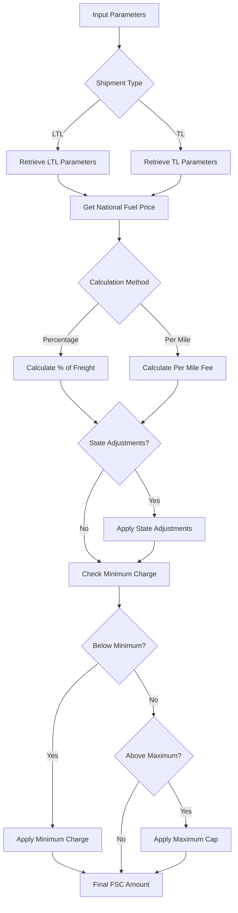
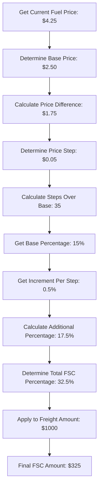
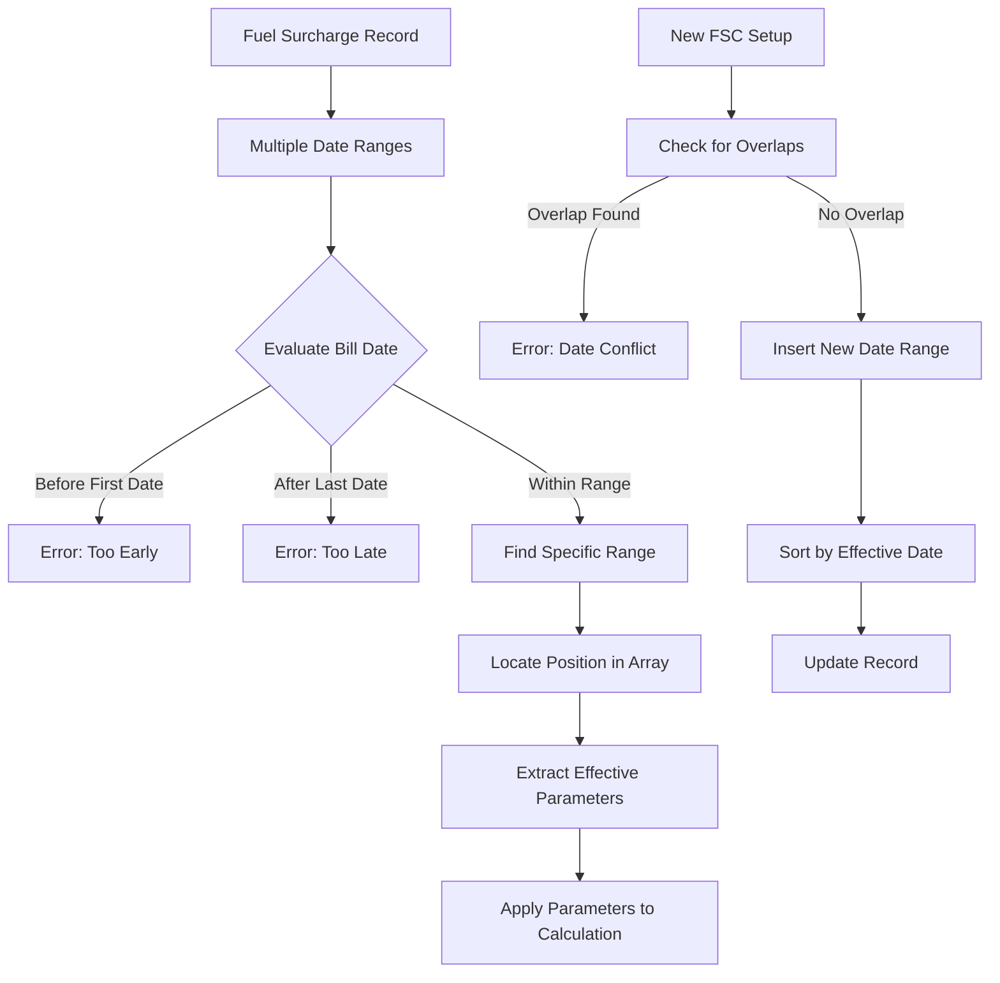

# Fuel Surcharge Calculation in AFS Shreveport

## Introduction to Fuel Surcharges

Fuel surcharges represent a critical component in freight billing, serving as a mechanism to adjust transportation costs based on fluctuating fuel prices. In the AFS Shreveport system, fuel surcharges provide carriers with a method to recover increased operational costs due to volatile fuel markets without constantly renegotiating base rates. These surcharges are typically calculated as either a percentage of the base freight charge or as a per-mile fee, and are applied separately from the base transportation rate. The AFS Shreveport system implements a sophisticated framework for managing these surcharges, allowing for carrier-specific configurations, client exceptions, and various calculation methodologies to ensure accurate and fair billing.

## Fuel Surcharge Components

Fuel surcharge calculations in AFS Shreveport involve several key components that work together to determine the appropriate surcharge amount. The base percentage represents the starting point for percentage-based calculations and is often tied to a specific fuel price threshold. Price breaks establish tiers at which surcharge percentages change based on national fuel price indices. Calculation methods determine whether surcharges are applied as a percentage of the freight charge (most common for LTL shipments) or as a per-mile fee (often used for truckload shipments). Minimum charges ensure carriers recover at least a baseline amount regardless of shipment size, while maximum caps limit the total surcharge that can be applied to any single shipment. The system also supports formula-based calculations that automatically adjust surcharges based on the difference between current fuel prices and established baseline prices.

## Fuel Surcharge Calculation Flow

## Calculation Methods

AFS Shreveport supports two primary methods for calculating fuel surcharges: percentage-based and per-mile calculations. 

Percentage-based calculations are predominantly used for LTL (Less Than Truckload) shipments, where the surcharge is computed as a percentage of the base freight charge. This method is straightforward and widely accepted in the industry. The system retrieves the appropriate percentage based on current fuel prices and applies it to the freight amount. For example, if the base freight charge is $1,000 and the current fuel surcharge percentage is 25%, the fuel surcharge would be $250.

Per-mile calculations are more commonly applied to TL (Truckload) shipments, where the surcharge is based on the distance traveled. This method requires accurate mileage data and applies a fixed rate per mile. For instance, if a shipment travels 800 miles and the per-mile surcharge is $0.35, the total fuel surcharge would be $280. The AFS system can automatically calculate mileage between origin and destination points using integrated mapping tools when explicit mileage isn't provided.

## National Fuel Price Indices

The AFS Shreveport system relies on national fuel price indices as the foundation for determining applicable fuel surcharge rates. These indices, such as the U.S. Department of Energy's weekly retail diesel price index, provide an objective basis for surcharge calculations. The system stores these prices in dedicated tables (like FSC*US, FSC*CA, FSC*WC) that are regularly updated.

A critical aspect of the fuel price implementation is the concept of delay days, which determines which historical fuel price should be applied to a particular shipment. For example, if a carrier specifies a 7-day delay, a shipment on January 15th would use the fuel price published on January 8th. This delay mechanism allows carriers and shippers time to adjust to price changes and ensures consistent application across shipments.

Some carriers, like Xpedx, use specialized regional indices. For instance, shipments originating from California, Arizona, Nevada, Oregon, or Washington might use a weighted average of California and West Coast fuel prices rather than the national average, reflecting the typically higher fuel costs in these regions.

## Formula-Based Calculation Example

In formula-based calculations, the system determines the fuel surcharge by analyzing how much the current fuel price exceeds a predefined baseline price. First, the system retrieves the current national fuel price ($4.25 in this example) and compares it to the carrier's baseline price ($2.50). It then calculates the difference ($1.75) and divides by the price step increment ($0.05) to determine how many steps above baseline the current price is (35 steps).

Each step corresponds to an incremental percentage increase (0.5% per step in this example) that is added to the base percentage (15%). The calculation results in a total surcharge percentage of 32.5% (15% base + 17.5% from the 35 steps), which is then applied to the freight amount ($1000) to yield a final fuel surcharge of $325.

This method allows for dynamic adjustment of surcharges in direct proportion to fuel price fluctuations without requiring manual updates to percentage tables.

## State-Specific Adjustments

The AFS Shreveport system supports sophisticated state-specific adjustments to fuel surcharges, recognizing that fuel costs and operational expenses can vary significantly by geographic region. These adjustments are configured as percentage modifications that can be applied to shipments based on their origin and/or destination states.

For example, shipments originating from or destined to California might incur an additional 1.5% fuel surcharge due to the state's higher fuel prices and environmental regulations. The system allows these adjustments to be applied selectively to inbound shipments, outbound shipments, or both, providing granular control over regional pricing.

State adjustments can be configured to apply either before or after any maximum caps are enforced. When applied before caps, the adjustment increases the calculated percentage before checking against maximum limits. When applied after caps, the adjustment is made to the final amount after any caps have been enforced, potentially exceeding the nominal maximum cap for specific state pairs.

## Carrier and Client Exceptions

The AFS Shreveport system provides extensive flexibility for handling carrier-specific and client-specific exceptions to standard fuel surcharge calculations. This capability is essential for accommodating negotiated rates and special agreements that deviate from standard industry practices.

Carrier-specific exceptions are stored in the FB.BC.FSC file with carrier identifiers, allowing different carriers to have entirely different calculation methodologies, base percentages, and price break structures. For instance, one carrier might use a simple percentage-based approach while another implements a complex formula tied to specific fuel price thresholds.

Client-specific exceptions override carrier defaults and are stored with composite keys that combine both carrier and client identifiers (e.g., "C*00453*01344"). These exceptions allow AFS to implement client-negotiated fuel surcharge arrangements that may differ from a carrier's standard rates. When processing a shipment, the system first checks for client-specific exceptions before falling back to carrier defaults, ensuring that negotiated rates are always applied correctly.

## Date Range Management

The AFS Shreveport system implements a sophisticated date range management system for fuel surcharge tables, allowing carriers to schedule changes in advance and maintain historical records. Each fuel surcharge configuration includes effective date ranges that determine when specific rates and calculation methods apply.

When setting up a new fuel surcharge entry, the system validates that the new date range doesn't overlap with existing ranges, preventing conflicting rates from being applied to the same period. Date ranges can be open-ended (with no specified end date) to remain in effect until explicitly replaced by a newer configuration.

When calculating a fuel surcharge for a specific bill, the system first validates that the bill date falls within an effective date range. It then locates the appropriate position in the array of date ranges to extract the parameters that were in effect on that date. This approach ensures that historical bills are always calculated using the rates that were valid at the time of shipment, even if rates have subsequently changed.

## Caps and Minimums

Fuel surcharge calculations in AFS Shreveport incorporate both maximum caps and minimum charges to provide boundaries on the applied surcharges. These limits are essential for ensuring that surcharges remain reasonable during extreme fuel price fluctuations and that carriers can recover administrative costs for small shipments.

Minimum charges establish a floor below which the fuel surcharge will not fall, regardless of the calculated percentage or per-mile amount. This ensures that carriers recover at least a baseline amount for processing the fuel surcharge, even on small shipments where a percentage-based calculation might yield a negligible amount.

Maximum caps set an upper limit on the fuel surcharge, either as a fixed dollar amount or as a maximum percentage of the freight charge. These caps protect shippers from excessive surcharges during periods of extreme fuel price volatility. The system supports different caps for LTL and TL shipments, recognizing the different cost structures and operational considerations between these shipment types.

Both minimums and caps can be configured at the carrier level and overridden at the client level, allowing for customized arrangements that reflect negotiated agreements while maintaining system-wide consistency in the calculation methodology.

## Configuration and Maintenance

The AFS Shreveport system provides comprehensive tools for configuring and maintaining fuel surcharge tables. The primary configuration interface is FB.BC.FSC.SETUP, which offers a multi-page interface for managing all aspects of fuel surcharge calculations. Authorized users can define calculation methods, set base percentages and price breaks, configure formula parameters, and establish state-specific adjustments.

The system maintains separate configuration tables for benchmark rates (used for cost comparison) and contract rates (used for actual billing), allowing for sophisticated analysis of carrier pricing relative to market standards. Special handling is implemented for AFS and AFN fuel tables, which serve as system-wide defaults that can be referenced by multiple carriers.

Configuration changes are tracked with user identification and timestamps, creating an audit trail of modifications. The system also supports notes and descriptions for each fuel surcharge entry, providing context for specific configurations and helping document special arrangements or temporary adjustments.

Regular maintenance tasks include updating national fuel price indices, reviewing and adjusting formula parameters as market conditions change, and implementing new carrier or client-specific arrangements as they are negotiated.

## Integration with Freight Rating

Fuel surcharge calculations are tightly integrated with the overall freight rating and billing process in the AFS Shreveport system. When a freight bill is processed, the appropriate fuel surcharge is calculated automatically based on the shipment details, carrier configuration, and applicable client exceptions.

The calculated fuel surcharge appears as a separate line item on freight bills, clearly distinguishing it from the base freight charge and other accessorial fees. This separation allows for transparent reporting and analysis of fuel costs across shipments, carriers, and time periods.

The system supports both pre-calculation of fuel surcharges during rate quoting and post-calculation during freight bill auditing. During rate quoting, estimated fuel surcharges are included to provide accurate total cost projections. During auditing, the system verifies that the carrier-applied fuel surcharge matches the expected calculation based on the configured rules and current fuel prices.

For analytical purposes, the system maintains both the carrier-applied fuel surcharge and the AFS-calculated amount, enabling variance analysis and identification of potential billing errors or opportunities for cost optimization.

[Generated by the Sage AI expert workbench: 2025-05-28 08:06:16  https://sage-tech.ai/workbench]: #