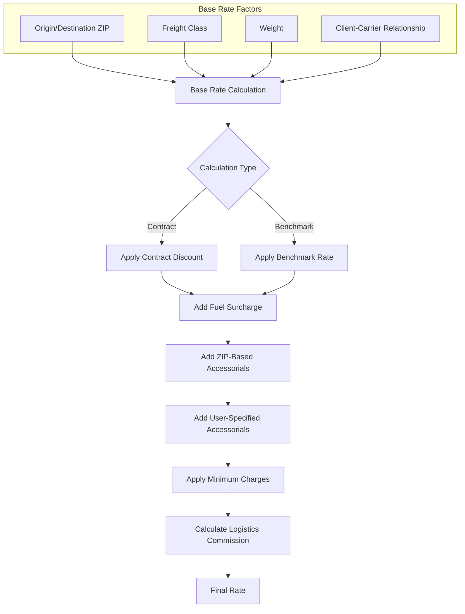

# Least Cost Carrier Analysis in AFS Shreveport

## Introduction to Least Cost Carrier Analysis

The Least Cost Carrier Analysis feature in AFS Shreveport is a sophisticated rate comparison engine designed to identify the most cost-effective shipping options across multiple carriers based on specific shipment parameters. This functionality enables clients to make data-driven decisions about carrier selection by providing side-by-side comparisons of freight rates, accessorial charges, fuel surcharges, and potential savings. The system processes shipment details including origin and destination locations, freight classes, and weights to calculate accurate rates using both benchmark (standard market) rates and negotiated contract rates. By analyzing these rates across the client's approved carrier base, the system identifies optimal shipping options while considering service requirements, transit times, and carrier capabilities for specific routes.

## Data Input and Validation Process

The Least Cost Carrier Analysis begins with processing spreadsheet data containing essential shipment details. The system reads input files with a structured format containing client information, carrier preferences, inbound/outbound/third-party designation, origin and destination ZIP codes, freight classes, and weights. The validation process is thorough, checking for required fields and proper formatting before proceeding with rate calculations. 

The code performs multiple validation steps including:
- Verifying client numbers against the CLIENTS file
- Confirming carrier codes exist in the CARRIERS file
- Validating that origin and destination ZIP codes exist in the ZIP code database
- Ensuring freight classes match standard industry classifications (50, 55, 60, etc.)
- Checking that weights are present and within system limits (typically under 15,000 lbs for LTL shipments)
- Confirming the shipment date is in a valid format

If any validation fails, the system records specific error messages in the output spreadsheet, allowing users to quickly identify and correct issues with their input data.

## Least Cost Carrier Analysis Workflow


The workflow diagram illustrates the end-to-end process of the Least Cost Carrier Analysis feature. The system begins by processing input data from a spreadsheet, validating all required fields, and then identifying eligible carriers based on client settings and core carrier designations. For each qualified carrier, the system calculates both benchmark and contract rates, applies appropriate fuel surcharges and accessorial charges, and determines potential savings. The results are sorted by cost and formatted into a comprehensive output spreadsheet that provides detailed cost breakdowns for each carrier option.

## Carrier Selection and Qualification

The carrier selection process is a critical component of the Least Cost Carrier Analysis. The system identifies eligible carriers for a shipment based on multiple qualification criteria:

1. **Client-Carrier Relationships**: The system checks the FB.AUDIT file for the client to determine which carriers are enabled for that client's shipments.

2. **Core Carrier Designations**: When performing a "least cost" analysis (CARRIER.ID = 'ALL'), the system specifically filters for carriers flagged as core carriers (D.AUDIT<13> = "Y"), ensuring that only preferred carriers are included in the comparison.

3. **Carrier Status**: Active carriers are identified by checking the CARRIERS file for status indicators (CHECK.CARRIER.STATUS ≠ "I"), excluding inactive carriers from consideration.

4. **Route Capabilities**: The system validates that carriers service the specific origin-destination pair by checking carrier service points and directional flags through integration with Carrier Connect XL.

5. **Client-Specific Overrides**: Special carrier qualifications can be applied for specific clients, as seen in the code's handling of fuel surcharge calculations for certain client-carrier combinations.

Once eligible carriers are identified, the system processes each one through the rating engine to determine applicable rates and charges. Carriers that cannot provide valid rates for the shipment (due to service limitations, weight restrictions, or other factors) are automatically excluded from the final comparison.

## Rate Calculation Components



The diagram illustrates the various components that contribute to freight rate calculations in the Least Cost Carrier Analysis. The process begins with determining the base rate using origin/destination ZIP codes, freight classes, and weights. The system then applies either contract discounts or benchmark rates depending on the calculation type. Fuel surcharges are added based on carrier-specific tables in the FB.BC.FSC file, with different calculation methods possible based on client settings (A.VIN<49>). 

Accessorial charges are incorporated from multiple sources:
- ZIP code-based accessorials automatically applied from the ZIP.LINE.ITEM file
- User-specified accessorial codes from the input spreadsheet
- Standard accessorials based on shipment characteristics

The system applies minimum charges where applicable and calculates logistics commissions based on the savings between benchmark and contract rates. The final rate represents the comprehensive cost of shipping with each carrier, enabling accurate comparison.

## Benchmark vs. Contract Rate Comparison

The Least Cost Carrier Analysis performs a sophisticated comparison between standard benchmark rates and negotiated contract rates to determine potential savings for each carrier option. Benchmark rates represent standard industry pricing without negotiated discounts, while contract rates reflect client-specific negotiated pricing agreements with carriers.

For each carrier, the system:

1. Retrieves benchmark rate information from standard tariff tables
2. Applies the appropriate benchmark discount (stored in CARRIER.EST.ARRAY<21,IX> and displayed as "Carrier X Bench. Disc")
3. Calculates the benchmark line amount (base charges excluding fuel and accessorials)
4. Retrieves contract rate information specific to the client-carrier relationship
5. Applies the contract discount percentage (stored in CARRIER.EST.ARRAY<19,IX> and displayed as "Carrier X Contr. Disc.")
6. Calculates the contract line amount (discounted base charges)

The system then determines the savings by comparing the total benchmark amount against the contract amount. This savings calculation becomes particularly important for logistics clients, as it forms the basis for commission calculations. The benchmark vs. contract comparison provides clients with clear visibility into the value of their negotiated rates and helps identify opportunities for further rate negotiations with carriers showing minimal savings.

## Accessorial Charge Management

The Least Cost Carrier Analysis implements a comprehensive approach to accessorial charge management, ensuring that all applicable surcharges and fees are accurately reflected in the carrier cost comparison. The system handles accessorial charges from multiple sources:

1. **ZIP Code-Based Accessorials**: The system automatically applies location-specific accessorial charges by querying the ZIP.LINE.ITEM file. This functionality, implemented in the GRB02 section of the code, checks both origin and destination ZIP codes against carrier-specific accessorial tables. When a match is found, the system adds the appropriate accessorial code (such as "YRCA" for rural delivery) to the shipment's accessorial list. This automation ensures that geographic-based surcharges like limited access fees, residential delivery charges, and high-cost service area surcharges are consistently applied.

2. **User-Specified Accessorials**: The system processes accessorial codes provided in the input spreadsheet, allowing users to specify known service requirements like liftgate service, inside delivery, or appointment scheduling.

3. **Carrier-Specific Accessorials**: Different carriers may have different accessorial charges for the same service. The system accounts for these variations by applying carrier-specific pricing for each accessorial code.

The accessorial charges are tracked separately for both benchmark and contract rates (W.TOT.BENCH.ACC.AMTS and W.TOT.CONT.ACC.AMTS), allowing for accurate comparison of the total shipping costs. This detailed handling of accessorial charges ensures that the least cost carrier analysis reflects the true all-inclusive cost of shipping with each carrier.

## Carrier Cost Comparison Output


The Carrier Cost Comparison Output provides a comprehensive side-by-side comparison of carrier options in spreadsheet format. The system organizes results by carrier, with each carrier occupying a set of columns that display detailed cost breakdowns. The output is structured to facilitate easy comparison, with carriers typically sorted from lowest to highest total cost.

For each carrier, the output includes:
- Carrier identification (ID and name)
- Benchmark rate information (discount percentage, base rate, fuel surcharge, accessorials)
- Contract rate information (discount percentage, base rate, fuel surcharge, accessorials)
- Logistics commission amount (if applicable)
- Total cost

This detailed breakdown allows users to understand not just which carrier offers the lowest overall rate, but also how the various components (base rate, fuel, accessorials) contribute to the total cost. The spreadsheet format enables further analysis and manipulation of the data, and the results can be easily shared with stakeholders for decision-making purposes.

## Logistics Commission Calculation

The Logistics Commission Calculation is a key component of the Least Cost Carrier Analysis for clients utilizing AFS's logistics services. This calculation determines how savings generated through negotiated rates are distributed between the client and AFS as the logistics provider.

The system calculates logistics commissions using the following approach:

1. First, it identifies the applicable commission percentage by locating the appropriate rate in the client record based on the shipment date:
   ```
   LOCATE RATE.DATE IN DCLIENTS<84> BY 'AR' SETTING POS ELSE
      POS=POS-1
   END
   COMM.PERC = DCLIENTS<85,POS>
   ```

2. It then calculates the total savings by comparing benchmark and contract amounts:
   ```
   SAVINGS = BENCH.AMT-CONTR.AMT
   ```

3. The logistics commission is calculated as a percentage of these savings:
   ```
   LOG.COMM = SAVINGS*COMM.PERC/100
   ```

4. The client's portion of the savings is determined:
   ```
   CL.SAVINGS = SAVINGS - LOG.COMM
   ```

5. For quote purposes, an additional calculation may be applied based on client-specific quote percentages that vary by shipment direction (inbound, outbound, or third-party):
   ```
   SAVINGS.QUOTE.AMT = CL.SAVINGS*(1-SAVINGS.QUOTE.PERC/10000)
   ```

The logistics commission is stored in the carrier estimate array (CARRIER.EST.ARRAY<12,IX>) and displayed in the output spreadsheet as "Carrier X Contr. Log Amt." This transparent approach ensures clients understand how their shipping costs are calculated and the value provided by the logistics service in securing favorable carrier rates.

## Transit Time and Service Analysis

The Least Cost Carrier Analysis enhances its value by incorporating carrier service information including transit times and directional service flags through integration with Carrier Connect XL (CCXL). This integration, implemented in the NKH01 modification, provides critical service metrics alongside cost data, enabling more informed carrier selection decisions.

The system retrieves carrier service information by:

1. Constructing a query to the Carrier Connect XL service with origin/destination information:
   ```
   CCVIN<1> = CARRIER.SCAC
   CCVIN<2> = DEST.COUNTRY
   CCVIN<3> = DEST.ZIP
   CCVIN<4> = ORIG.COUNTRY
   CCVIN<5> = ORIG.ZIP
   CCVIN<6> = CLIENT.ID
   ```

2. Processing the response to extract transit times and directional service flags:
   ```
   TRANSIT.TIME = CCVOUT<29,S.POS>
   ORIG.DIR.FLG = CCVOUT<31,S.POS>[1,1]
   DEST.DIR.FLG = CCVOUT<30,S.POS>[1,1]
   COMB.DIR.FLG = CCVOUT<32,S.POS>[1,1]
   ```

3. Standardizing directional flags for consistency:
   ```
   IF ORIG.DIR.FLG = 'C' OR ORIG.DIR.FLG = 'P' THEN ORIG.DIR.FLG = 'I'
   ```

These service metrics are incorporated into the rating process (VIN<56> through VIN<58>) and can influence carrier qualification and selection. The directional flags indicate whether a carrier provides direct service to the origin/destination points or requires interlining with other carriers, which can affect transit reliability and handling quality.

By combining cost analysis with service information, the system enables users to make trade-off decisions between lowest cost and service quality, particularly important for time-sensitive shipments or those requiring special handling.

## Business Benefits and ROI

The Least Cost Carrier Analysis feature delivers substantial business value to AFS Shreveport users through multiple avenues:

1. **Cost Savings**: By automatically identifying the most cost-effective carrier for each shipment, the system generates immediate and measurable savings. The side-by-side comparison of benchmark versus contract rates provides transparency into negotiated savings, while the comparison across multiple carriers ensures optimal carrier selection for each unique shipment.

2. **Operational Efficiency**: The automated rate calculation process eliminates the need for manual carrier rate lookups and comparisons, significantly reducing the time required to select carriers. What might take a logistics professional 15-30 minutes per shipment can be accomplished in seconds, allowing staff to focus on higher-value activities.

3. **Data-Driven Decision Making**: The comprehensive output provides decision-makers with detailed cost breakdowns across carriers, enabling informed choices that balance cost considerations with service requirements. The inclusion of transit time information from Carrier Connect XL further enhances this decision support capability.

4. **Contract Optimization**: By regularly analyzing the spread between benchmark and contract rates across carriers, clients can identify opportunities for rate negotiations with carriers showing minimal savings off benchmark rates. This ongoing analysis drives continuous improvement in the client's carrier rate structure.

5. **Accessorial Cost Management**: The automatic application of ZIP code-based accessorials ensures that all applicable charges are consistently included in cost comparisons, eliminating surprises from unexpected accessorial charges and providing a true "all-in" cost comparison.

6. **Commission Transparency**: For logistics clients, the clear calculation and display of logistics commissions provides transparency into the value-sharing model, building trust and demonstrating the tangible benefits of the logistics relationship.

The ROI from this feature is typically realized immediately through lower freight costs, improved staff productivity, and better carrier selection decisions. For high-volume shippers, the cumulative savings can represent a significant percentage of overall transportation spend, directly impacting the bottom line.

[Generated by the Sage AI expert workbench: 2025-05-28 08:06:20  https://sage-tech.ai/workbench]: #