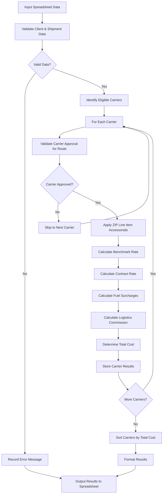
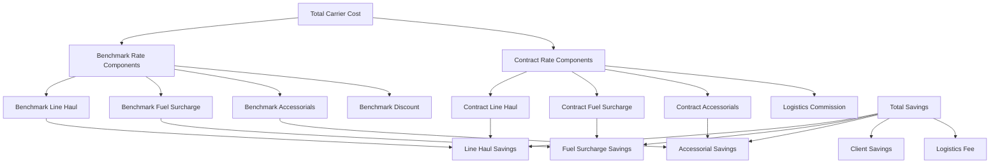

# Least Cost Carrier Rating in AFS Shreveport

## Overview of Least Cost Carrier Rating

Least Cost Carrier (LCC) rating is a critical functionality within the AFS Shreveport system that enables clients to identify the most cost-effective shipping options for their freight shipments. This feature analyzes multiple carriers simultaneously, calculating both benchmark and contract rates for each eligible carrier based on specific shipment characteristics. The LCC rating process considers numerous factors including client-specific preferences, carrier capabilities, geographic constraints, accessorial charges, and fuel surcharges to determine the optimal carrier selection. By providing a comprehensive comparison of available carriers ranked by total cost, the system empowers logistics managers to make data-driven decisions that minimize transportation expenses while meeting service requirements.

## Data Collection and Validation Process

The Least Cost Carrier rating system begins by collecting comprehensive shipment details from a spreadsheet input file. This data includes client identification numbers, carrier codes (or "ALL" for comparing all eligible carriers), inbound/outbound/third-party designation, bill and ship dates, origin and destination ZIP codes, and freight classification details (class codes and weights). The system performs rigorous validation on all input data, ensuring client numbers exist in the database, carrier codes are valid, ZIP codes are in the system's geographic database, and freight classes conform to standard classifications (50, 55, 60, etc.). Weight values are verified to ensure they are non-zero and within program limits (typically 15,000 pounds for LTL shipments, though this can be client-configurable). The system also validates accessorial charge codes that may apply to the shipment. This thorough validation process prevents rating errors and ensures accurate carrier comparisons.

## Least Cost Carrier Rating Workflow

The workflow diagram illustrates the end-to-end process for least cost carrier rating. The system begins by reading shipment data from an input spreadsheet and validating all required fields. For each eligible carrier, the system verifies route approval, applies any ZIP-specific accessorial charges, and calculates both benchmark and contract rates. After calculating fuel surcharges and logistics commissions, the total cost for each carrier is determined. Once all carriers have been processed, the system sorts them by total cost and formats the results in a comprehensive output spreadsheet with detailed cost breakdowns.

## Carrier Selection Logic

The Least Cost Carrier rating system employs sophisticated logic to identify eligible carriers for each shipment. The selection process begins by examining the client's carrier relationships stored in the `FB.AUDIT` file. When processing an "ALL" carrier request, the system specifically targets carriers marked as "ENABLE" and flagged as core carriers (with a "Y" value in field 13). For client-specific carrier selections, the system validates that the carrier is properly configured for freight estimates.

The system also enforces route-specific carrier approvals by checking if a carrier is authorized to service the specific origin-destination pair. This is determined through the audit status returned by the `FB.AUTO.V2` rating engine, which may return "MA" (Not an approved carrier) for carriers that don't service the route. Additionally, the system integrates with Carrier Connect XL to retrieve directional flags that indicate whether a carrier provides inbound, outbound, or combined service for specific locations.

For clients with special carrier relationships, the system applies client-specific rules. For example, certain clients have customized fuel surcharge handling for specific carriers, implemented through conditional logic that modifies the `CARR.ONLY.FSC` flag based on carrier-client combinations.

## Rate Calculation Methodology

The Least Cost Carrier rating system employs a comprehensive methodology to calculate accurate shipping costs across multiple carriers. For each eligible carrier, the system calculates two primary rate types:

1. **Benchmark Rates**: These represent the carrier's published or standard rates before negotiated discounts. The system retrieves these from carrier tariffs based on origin-destination pairs, freight classes, and weights. Benchmark rates include base line-haul charges, fuel surcharges (from the `FB.BC.FSC` file), and applicable accessorial charges.

2. **Contract Rates**: These reflect client-specific negotiated rates with carriers. Contract rates typically apply discounts to the benchmark rates, with discount percentages stored in the carrier setup. The system applies these discounts and calculates the resulting contract line-haul charges, fuel surcharges, and accessorial fees.

The calculation process leverages the `FB.AUTO.V2` rating engine, which handles the complex tariff lookups and discount applications. For each carrier, the system stores detailed rate components including line-haul amounts, fuel surcharge amounts, accessorial charge totals, and calculation types (e.g., CWT, flat rate). The system also captures discount percentages for both benchmark and contract rates, enabling transparent cost comparison.

For logistics clients, the system calculates additional commission amounts based on the savings between benchmark and contract rates, with commission percentages retrieved from client-specific tables based on the shipment date.

## Rate Comparison Structure

```mermaid
flowchart TD
    subgraph "Carrier Cost Comparison"
        A[Total Cost] --> B[Line Haul]
        A --> C[Fuel Surcharge]
        A --> D[Accessorials]
        A --> E[Logistics Fee]
        
        subgraph "Carrier 1"
            B1[Line Haul: $450]
            C1[Fuel Surcharge: $85]
            D1[Accessorials: $25]
            E1[Logistics Fee: $20]
            T1[Total: $580]
        end
        
        subgraph "Carrier 2"
            B2[Line Haul: $425]
            C2[Fuel Surcharge: $75]
            D2[Accessorials: $35]
            E2[Logistics Fee: $18]
            T2[Total: $553]
        end
        
        subgraph "Carrier 3"
            B3[Line Haul: $410]
            C3[Fuel Surcharge: $80]
            D3[Accessorials: $45]
            E3[Logistics Fee: $17]
            T3[Total: $552]
        end
    end
    
    R[Results Sorted by Total Cost]
    T3 --> R
    T2 --> R
    T1 --> R
```

The rate comparison structure visualizes how the system organizes and compares costs across multiple carriers. For each carrier, the total cost is broken down into key components: line haul charges (the base transportation cost), fuel surcharges (calculated based on current fuel indexes), accessorial charges (additional services like residential delivery or liftgate), and logistics fees (commissions for managed services).

The system stores these cost components in a structured array (`CARRIER.EST.ARRAY`) that maintains detailed information about each carrier option. This array includes not only cost breakdowns but also carrier identification information, discount percentages, calculation methods, and any applicable error messages. The comparison structure allows for transparent evaluation of why certain carriers are more cost-effective than others, whether due to better base rates, lower fuel surcharges, or fewer accessorial fees. The carriers are then sorted by total cost in ascending order, with the least expensive option presented first.

## Accessorial Charge Processing

The Least Cost Carrier rating system employs a sophisticated approach to handling accessorial charges, which are additional fees beyond the base transportation cost. The system processes two main types of accessorial charges:

1. **Standard Accessorials**: These are specified in the input data as accessorial codes (e.g., "LFT" for liftgate service, "RES" for residential delivery). The system validates these codes against the `LI.CODES` table and calculates the appropriate charges based on carrier-specific accessorial pricing.

2. **ZIP Line Item Accessorials**: A particularly advanced feature implemented in the system is the ability to automatically apply location-specific accessorial charges based on origin and destination ZIP codes. The system queries the `ZIP.LINE.ITEM` file using a composite key of carrier ID, client ID, transport mode, and inbound/outbound indicator. It then searches for the origin and destination ZIP codes within the retrieved record to identify any applicable accessorial charges. These charges are designated with flags indicating whether they apply at origin ('O'), destination ('D'), or both ('B'). Any identified ZIP-based accessorials are automatically added to the shipment's accessorial code list before rating.

The system tracks accessorial charges separately for benchmark and contract rates, storing the totals in dedicated variables (`W.TOT_BENCH_ACC_AMTS` and `W.TOT_CONT_ACC_AMTS`). This separation allows for accurate comparison of how accessorial charges impact the overall cost difference between carriers. The accessorial amounts are included in the final carrier cost breakdown and displayed in the output spreadsheet, providing transparency into all components of the shipping cost.

## Transit Time and Service Analysis

The Least Cost Carrier rating system integrates with Carrier Connect XL (CCXL) to retrieve critical transit time and service information for each carrier option. This integration enhances the rating process by incorporating service metrics alongside cost data, enabling more informed carrier selection decisions.

When evaluating carriers, the system makes a call to the CCXL.V2 subroutine, passing key shipment parameters including carrier SCAC code, origin and destination countries and ZIP codes, and client ID. The CCXL system returns comprehensive service information, including estimated transit times in days (stored in the `TRANSIT.TIME` variable) and directional service flags that indicate whether a carrier provides service in the required direction.

The system captures three critical directional indicators:
1. **Origin Directional Flag** (`ORIG.DIR.FLG`): Indicates whether the carrier provides service from the origin location
2. **Destination Directional Flag** (`DEST.DIR.FLG`): Indicates whether the carrier provides service to the destination location
3. **Combined Directional Flag** (`COMB.DIR.FLG`): Indicates whether the carrier provides service for the complete origin-destination pair

These flags use values like 'I' (Indirect service), 'C' (Collect service), and 'P' (Prepaid service) to denote service availability. The system normalizes 'C' and 'P' values to 'I' for standardized processing.

The transit and service information is incorporated into the rating process, allowing the system to filter out carriers that don't provide adequate service for the specified route. This ensures that the least cost carrier recommendations not only reflect price considerations but also service capabilities.

## Carrier Cost Breakdown

The diagram illustrates how the system breaks down carrier costs into detailed components for comprehensive analysis. For each carrier, the system calculates and displays both benchmark (standard) rates and contract (negotiated) rates. The benchmark components include the line haul charge before discounts, benchmark fuel surcharge (which may be calculated differently than the contract fuel surcharge), benchmark accessorial charges, and the applicable benchmark discount percentage. Similarly, the contract components include the discounted line haul charge, contract fuel surcharge, contract accessorial charges, and any applicable logistics commission.

The system calculates savings by comparing the benchmark and contract components, showing how much is saved on line haul, fuel surcharges, and accessorials. For logistics clients, the system further divides the total savings between the client savings and the logistics fee (commission). This detailed breakdown provides transparency into how costs are calculated and where savings are achieved, enabling informed decision-making when selecting carriers.

## Results Presentation and Sorting

After calculating rates for all eligible carriers, the Least Cost Carrier rating system organizes and presents the results in a clear, comprehensive format. The system sorts carrier options by total cost in ascending order, ensuring that the most cost-effective options appear first. This sorting is accomplished through the strategic insertion of carrier data into the `CARRIER.EST.ARRAY` based on quote amounts.

The output is formatted as a spreadsheet with the original input data preserved and extensive carrier comparison data added in new columns. For each carrier option, the system creates a set of columns that include:

1. Carrier identification (ID and name)
2. Benchmark information:
   - Benchmark discount percentage
   - Benchmark line haul amount
   - Benchmark fuel surcharge amount
   - Benchmark accessorial charges
   - Total benchmark quote amount
   - Benchmark calculation type

3. Contract information:
   - Contract discount percentage
   - Contract line haul amount
   - Contract fuel surcharge amount
   - Contract accessorial charges
   - Logistics commission amount
   - Total contract quote amount
   - Contract calculation type

The system dynamically builds Excel column headers (from A-Z and AA-ZZ) to accommodate all the carrier data fields. The output spreadsheet is saved with an "RR-" prefix added to the original filename, making it easy to identify as a rated result file.

This detailed presentation allows users to quickly identify the least cost carrier while also providing the transparency needed to understand all components of the shipping costs across multiple carriers.

## Client-Specific Rating Rules

The Least Cost Carrier rating system implements a sophisticated framework for applying client-specific rules that customize the rating process based on individual client requirements. These rules ensure that carrier selection and cost calculations accurately reflect negotiated agreements and operational preferences.

One key area of customization is logistics commission calculations. For clients with logistics services enabled (indicated by a "Y" value in the client record's field 93), the system calculates commissions based on the savings between benchmark and contract rates. The commission percentage is determined by looking up the appropriate value in the client's commission table based on the shipment date. This percentage is then applied to the savings amount to calculate the logistics commission.

The system also handles client-specific fuel surcharge rules through the `CARR.ONLY.FSC` flag, which can be set to different values:
- 'Y': Use carrier's contract fuel surcharge for both benchmark and contract calculations
- 'C': Use carrier's contract fuel surcharge for benchmark calculations
- 'O': Use a special override fuel surcharge calculation
- 'N': Use standard benchmark and contract fuel surcharge calculations

For certain client-carrier combinations, the system applies special overrides to these rules. For example, the code contains specific logic for clients like '01505', '01758', '01784', and '01810', where certain carriers receive different fuel surcharge handling.

Additional client-specific rules include maximum LTL weight thresholds (stored in field 150 of the client record), forced benchmark minimum flags, and savings quote percentages that vary based on the shipment direction (inbound, outbound, or third-party).

## Integration with External Systems

The Least Cost Carrier rating feature demonstrates sophisticated integration with several external systems and databases to enhance its functionality and provide comprehensive shipping information. The primary external integration is with Carrier Connect XL (CCXL), which provides critical transit time and service availability information. When evaluating carriers, the system makes a call to the CCXL.V2 subroutine, passing shipment details including carrier SCAC code, origin/destination locations, and client information. CCXL returns transit times and directional service flags that indicate whether carriers provide service in the required direction.

The system also integrates with multiple geographic databases to validate and enrich location data. It queries the `ZIPS`, `ZIPS.CODES`, and `CAN.ZIP.CODES` files to validate ZIP codes and retrieve city, state, and country information. For mileage calculations, the system interfaces with the `PCIN` and `PCOUT` files, which likely connect to a mileage calculation service.

For rate calculations, the system integrates with the core rating engine through the `FB.AUTO.V2` subroutine, which handles the complex tariff lookups and discount applications. This engine accesses client-specific audit files (`FB.AUDIT`, `FB.AUDIT.TABLES`, `FB.AUDIT.ZIPS`) and carrier-specific fuel surcharge tables (`FB.BC.FSC`).

The ZIP line item accessorial feature demonstrates integration with location-specific business rules stored in the `ZIP.LINE.ITEM` file, allowing for automatic application of accessorial charges based on geographic criteria.

These integrations enable the Least Cost Carrier rating system to provide comprehensive, accurate shipping cost comparisons that consider not just rates but also service levels, geographic factors, and client-specific requirements.

[Generated by the Sage AI expert workbench: 2025-05-28 08:06:24  https://sage-tech.ai/workbench]: #