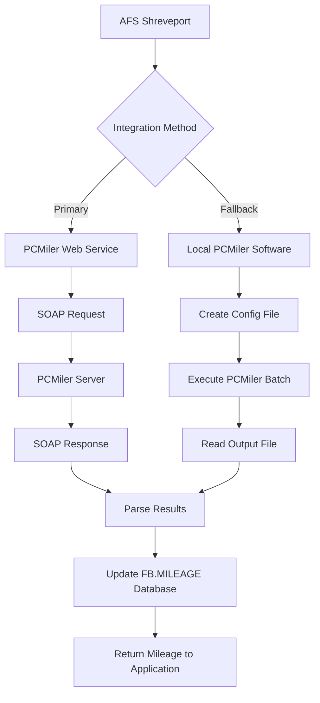
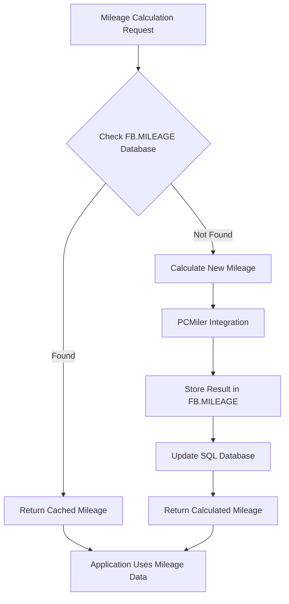
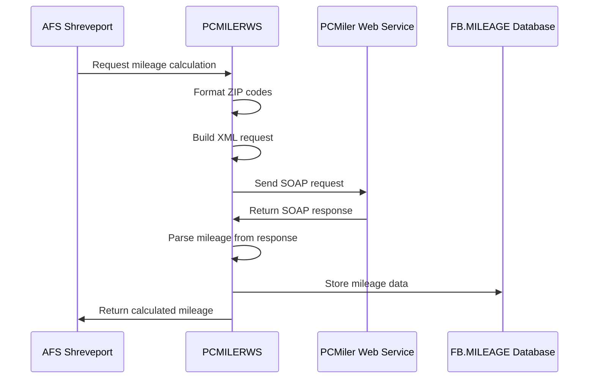
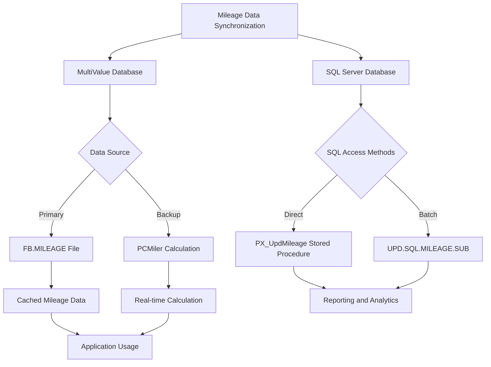

# Mileage Calculation Integration in AFS Shreveport

## Overview of Mileage Calculation Integration

The AFS Shreveport system integrates with PCMiler to calculate distances between locations for freight billing calculations. This integration is critical for determining accurate shipping costs based on the distance between origin and destination points. The system supports both US ZIP codes and Canadian postal codes, maintains a mileage database for future reference, and includes fallback mechanisms when the primary calculation method is unavailable. The mileage calculation functionality is used throughout the application for freight billing, rate estimation, and route planning.

## PCMiler Integration Architecture

AFS Shreveport integrates with PCMiler through multiple methods to ensure reliable distance calculations. The primary integration is through a SOAP-based web service that communicates with PCMiler's servers to calculate distances between locations. As a fallback mechanism, the system can also use file-based integration with locally installed PCMiler software (versions 16, 27, and 32). The integration architecture includes:

1. **Web Service Integration**: A SOAP-based web service client that sends origin and destination information to PCMiler's servers and receives mileage data.

2. **Local Software Integration**: A file-based integration that creates configuration files for PCMiler's batch processing engine, executes the calculation, and reads the results.

3. **Mileage Database**: A persistent storage system that caches calculated mileages to reduce redundant calculations and improve performance.

4. **ZIP Code Management**: A subsystem that validates, substitutes, and manages ZIP codes to ensure accurate mileage calculations.

The system selects the appropriate integration method based on availability, with the web service being the preferred method due to its reliability and performance.

## ZIP Code Management and Validation

The AFS Shreveport system implements a comprehensive approach to ZIP code management and validation to ensure accurate mileage calculations. This includes:

1. **ZIP Code Validation**: Before calculating mileage, the system validates that both origin and destination ZIP codes exist and are properly formatted. Special handling is implemented for invalid or problematic ZIP codes.

2. **ZIP Code Substitution**: The system maintains a table of ZIP code substitutions (ZIP.SUBSTITUTIONS) in the FB.TABLES file. This allows administrators to define replacements for problematic ZIP codes without modifying code. When a ZIP code is known to cause issues with PCMiler, it is automatically substituted with a valid alternative.

3. **Special Case Handling**: Certain ZIP codes, such as those in Hawaii, Alaska, or Puerto Rico, receive special handling since standard ground transportation mileage calculations don't apply.

4. **ZIP Code Formatting**: The system properly formats ZIP codes before sending them to PCMiler, ensuring that Canadian postal codes are formatted correctly with spaces (e.g., "A1A 1A1" instead of "A1A1A1").

5. **ZIP Code Lookup**: The system can retrieve city and state information for ZIP codes using the ZIPS.CODES and CAN.ZIP.CODES files, which helps in validating and displaying location information.

This comprehensive approach to ZIP code management ensures that mileage calculations are as accurate as possible, even when dealing with problematic or special case ZIP codes.

## Mileage Database Structure

The FB.MILEAGE database stores calculated distances between ZIP code pairs for future reference. This database serves as a cache to avoid redundant calculations and improve system performance. The key structure of the database includes:

1. **Record ID Format**: Each record in the FB.MILEAGE database is identified by a unique key constructed from the origin and destination ZIP codes, formatted as "ORIGIN*DESTINATION" (e.g., "90210*10001").

2. **Record Structure**: Each record contains the following fields:
   - Field 1: Mileage distance (numeric value)
   - Field 2: Additional information or status flags
   - Field 3: Reserved for future use (cleared by maintenance utilities)

3. **Optimization**: ZIP codes are stored in a standardized order (smaller ZIP code first) to reduce duplicate entries. For example, the distance from ZIP A to ZIP B is stored only once, regardless of which is the origin or destination.

4. **Synchronization**: The mileage data is synchronized with a SQL database through the UPD.SQL.MILEAGE.SUB subroutine, which formats the data appropriately and updates the SQL server through ODBC connections.

The FB.MILEAGE database is maintained by various utilities, including BUILD.FB.MILEAGE for initial population and CLEAN.MILEAGE for maintenance operations. This database structure ensures efficient storage and retrieval of mileage data throughout the AFS Shreveport system.

## Canadian Postal Code Handling

AFS Shreveport implements specialized handling for Canadian postal codes to ensure accurate mileage calculations for cross-border and Canadian domestic shipments. The system recognizes Canadian postal codes by their distinctive pattern (1A1N1A1N1A1N, where 1 represents a letter and N represents a number) and applies specific processing rules:

1. **Format Conversion**: Canadian postal codes are automatically detected using pattern matching and converted from the internal format (e.g., "A1A1A1") to the standard Canadian format with a space (e.g., "A1A 1A1") before sending to PCMiler.

2. **Country Code Assignment**: When a Canadian postal code is detected, the system automatically sets the country code to "CAN" or "CA" in API requests to ensure proper routing through Canadian roads and territories.

3. **Special Character Handling**: The system removes hyphens and other special characters from Canadian city names when sending them to PCMiler, as these can cause lookup failures.

4. **Canadian ZIP Database**: The system maintains a separate CAN.ZIP.CODES file specifically for Canadian postal codes, which contains city, province, and other location information.

5. **Cross-Border Calculations**: For shipments between the US and Canada, the system ensures that border crossing points are properly considered in the mileage calculation.

This specialized handling ensures that Canadian shipments receive accurate mileage calculations, which is essential for proper freight billing and cost estimation in cross-border logistics operations.

## Web Service Implementation

The AFS Shreveport system implements a SOAP-based web service integration with PCMiler for real-time mileage calculations. This implementation is found primarily in the PCMILERWS subroutine and related components. Key aspects of this implementation include:

1. **SOAP Protocol**: The system uses Universe's built-in SOAP functions (SoapCreateRequest, SoapSetRequestContent, SoapSubmitRequest) to create and send SOAP requests to PCMiler's web service.

2. **XML Construction**: The system dynamically builds XML requests containing origin and destination information, including city, state, ZIP code, and country code.

3. **Security Context**: For secure communications, the system creates appropriate security contexts using TLSv1.2 protocols when required.

4. **Error Handling**: The implementation includes comprehensive error handling for connection failures, SOAP faults, and invalid responses, with email notifications to system administrators when critical errors occur.

5. **Response Parsing**: The system parses the XML response to extract mileage information, using string manipulation functions to locate and extract the relevant data.

6. **Retry Logic**: The implementation includes retry mechanisms that attempt to establish connections up to five times before failing, improving reliability in unstable network conditions.

7. **Version Selection**: The system can work with multiple versions of PCMiler's web service (versions 27, 29, 30, and 32) and adapts its parsing logic accordingly.

This web service implementation provides a reliable and efficient method for calculating mileages in real-time, which is essential for accurate freight billing and cost estimation.

## Error Handling and Fallback Mechanisms

AFS Shreveport implements robust error handling and fallback mechanisms to ensure reliable mileage calculations even when primary methods fail. These mechanisms include:

1. **Connection Failure Handling**: When the web service connection fails, the system attempts multiple retries (up to 5) before falling back to alternative methods.

2. **Service Unavailability**: If the PCMiler web service is unavailable, the system automatically falls back to using the local PCMiler software installation.

3. **Version Fallback**: The system can fall back to older versions of PCMiler (from version 32 to 27 to 16) if newer versions are unavailable or return errors.

4. **Invalid ZIP Code Handling**: When invalid ZIP codes are encountered, the system attempts to substitute them with valid alternatives from the ZIP.SUBSTITUTIONS table.

5. **Zero Mileage Handling**: Special logic is implemented to handle cases where PCMiler returns zero mileage, distinguishing between valid zero mileage (same origin and destination) and error conditions.

6. **Email Notifications**: Critical errors trigger email notifications to system administrators, allowing for prompt investigation and resolution.

7. **Logging**: Detailed logging of errors and fallback operations is maintained in the PCMILER.LOG file for troubleshooting and analysis.

8. **Default Values**: For certain client-carrier combinations, the system can use predefined mileage values when PCMiler calculations fail.

These comprehensive error handling and fallback mechanisms ensure that the AFS Shreveport system can continue to provide mileage calculations even under adverse conditions, maintaining business continuity and accurate freight billing.

## Client-Specific Mileage Overrides

AFS Shreveport implements a system for client-specific mileage overrides to accommodate special business arrangements and contractual agreements. This functionality allows for predefined mileage values to be used for specific client-carrier combinations and routes, overriding the standard PCMiler calculations. Key aspects of this implementation include:

1. **Client-Carrier Identification**: The system identifies specific client-carrier combinations using CLIENT.ID and CARRIER.ID parameters passed to the mileage calculation functions.

2. **Route-Specific Overrides**: For identified client-carrier combinations, the system checks if the specific origin-destination pair has a predefined mileage value.

3. **Hard-Coded Overrides**: Some critical client-specific overrides are implemented directly in the code, particularly in the PCMILER and PCMILER.BETA subroutines.

4. **Override Precedence**: Client-specific overrides take precedence over standard PCMiler calculations, ensuring that contractual agreements are honored.

5. **Special Case Handling**: For certain clients like Artco Bell (CLIENT.ID='10337') and Crete Carriers (CARRIER.ID='00097'), specific origin-destination pairs have predefined mileages.

6. **STC Clients**: For STC clients (FP.CO='00002'), the system automatically updates the billed miles with the calculated total miles.

This client-specific override functionality ensures that AFS Shreveport can accommodate special business arrangements and contractual agreements while maintaining the overall integrity of the mileage calculation system.

## Performance Optimization Techniques

AFS Shreveport implements several performance optimization techniques to ensure efficient mileage calculations, even with large volumes of requests. These techniques include:

1. **Mileage Caching**: The system maintains a FB.MILEAGE database that stores previously calculated distances between ZIP code pairs, eliminating the need for redundant calculations.

2. **Batch Processing**: For bulk operations, the system can process multiple ZIP code pairs in a single request, reducing overhead and improving throughput.

3. **Standardized Storage**: ZIP code pairs are stored in a standardized order (smaller ZIP code first) to reduce duplicate entries and optimize database size.

4. **Web Service Priority**: The system prioritizes the faster web service integration over the file-based local PCMiler integration when available.

5. **Asynchronous Processing**: For non-critical operations, the system can perform mileage calculations asynchronously, allowing the main application to continue without waiting.

6. **SQL Synchronization**: The mileage data is synchronized with a SQL database for efficient querying and reporting.

7. **ZIP Code Substitution**: The system maintains a table of ZIP code substitutions to quickly resolve known problematic ZIP codes without complex processing.

8. **Progress Tracking**: For long-running operations like building complete mileage tables, the system implements progress tracking and reporting.

9. **Database Indexing**: The FB.MILEAGE database is properly indexed to ensure fast retrieval of cached mileage data.

These performance optimization techniques ensure that the AFS Shreveport system can handle large volumes of mileage calculations efficiently, supporting the high-throughput requirements of freight billing operations.

[Generated by the Sage AI expert workbench: 2025-05-28 08:06:16  https://sage-tech.ai/workbench]: #