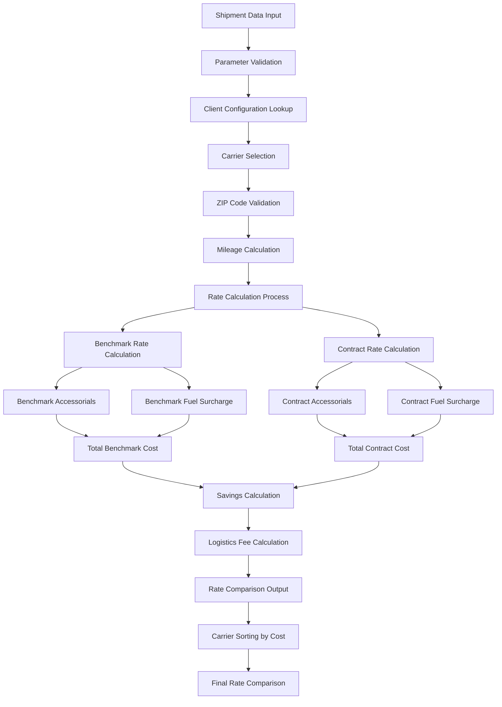
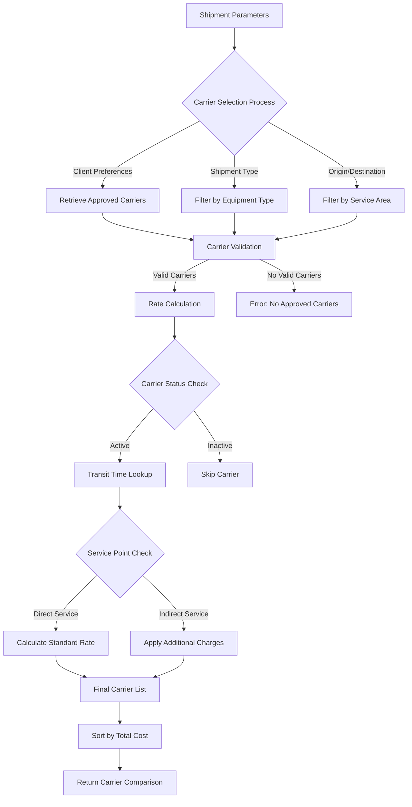
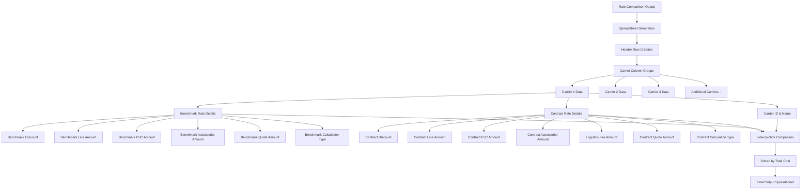
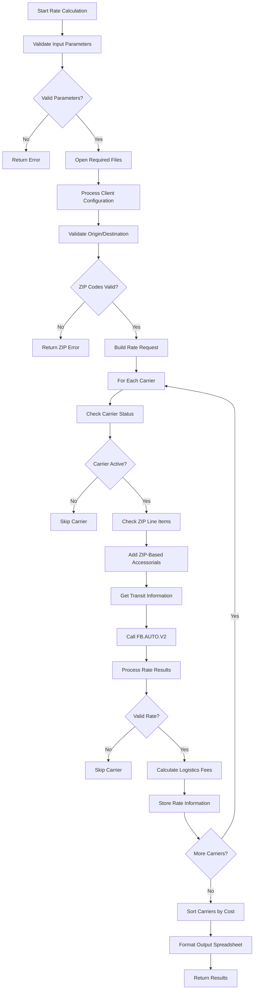

# Rate Calculation Integration in AFS Shreveport

## Overview of Rate Calculation Integration

The rate calculation system in AFS Shreveport serves as a critical component for freight cost optimization and carrier selection. This system automates the complex process of comparing rates across multiple carriers to identify the most cost-effective shipping options for clients. By analyzing shipment parameters such as origin/destination ZIP codes, freight class, weight, and accessorial requirements, the system calculates and compares total freight costs across approved carriers. This automation eliminates manual rate lookups and calculations, providing clients with data-driven carrier selection recommendations that optimize their transportation spend. The system integrates with client-specific rate configurations, carrier contracts, and real-time fuel surcharge data to ensure accurate and up-to-date cost comparisons.

## Core Components of Rate Calculation

The rate calculation system consists of several key components that work together to determine the total freight cost. Benchmark rates serve as the industry standard pricing baseline, typically derived from published tariffs or industry averages, against which client-specific negotiated rates are compared. Contract rates reflect the client's negotiated pricing with specific carriers, often including discounts off benchmark rates. Fuel surcharges are calculated as a percentage of the base rate and vary based on current fuel prices, with different calculation methods for benchmark versus contract rates. Accessorial charges account for additional services such as residential delivery, liftgate service, or limited access locations, which can be automatically applied based on origin and destination ZIP codes. The system also factors in client-specific logistics fees and commissions when applicable. Together, these components provide a comprehensive view of the total freight cost across multiple carriers, enabling informed decision-making for optimal carrier selection.

The diagram above illustrates the data flow through the rate calculation system. Starting with shipment input parameters, the system validates the data, retrieves client-specific configurations, and selects appropriate carriers. It then validates ZIP codes, calculates mileage, and processes rates for both benchmark and contract scenarios. Accessorial charges and fuel surcharges are applied to both rate types before calculating total costs. The system then determines potential savings, calculates any applicable logistics fees, and produces a comprehensive rate comparison output with carriers sorted from lowest to highest cost.

## Client-Specific Rate Configuration

The AFS Shreveport system employs sophisticated client-specific rate configurations to ensure pricing accuracy and customization. Each client has a unique profile that can include substitute client relationships, where one client's rate structure may be applied to another for consistency across corporate entities. The system maintains client-specific logistics settings that determine how savings are calculated and distributed, particularly important for logistics clients where commissions are based on the difference between benchmark and contract rates. Commission percentages are stored with effective dates, allowing for time-based adjustments to fee structures. Client profiles also contain carrier relationship configurations, specifying which carriers are approved for specific routes and shipment types. Additional customization includes client-specific fuel surcharge handling, which may vary from the carrier's standard calculation method, and the ability to override standard accessorial charges for particular origin-destination pairs. These configurations ensure that rate calculations reflect the unique business arrangements and preferences of each client.

The flowchart above illustrates the carrier selection process within the rate calculation system. The process begins with shipment parameters and applies multiple filters based on client preferences, shipment type, and geographic service areas. Carriers are validated for active status and service capabilities before rates are calculated. The system checks carrier status and service points to determine if additional charges apply for indirect service. Finally, carriers are sorted by total cost to present the optimal options to the client.

## ZIP Code Integration and Accessorial Charges

The rate calculation system leverages a sophisticated ZIP code integration framework to determine applicable accessorial charges and validate shipment routing. The system maintains a ZIP.LINE.ITEM file that maps origin and destination ZIP codes to specific accessorial charges that should be automatically applied based on geographic considerations. This functionality is particularly valuable for identifying areas that require special handling, such as limited access locations, residential areas, or high-cost regions. When processing a shipment, the system performs lookups against this ZIP code database to identify any location-specific accessorial charges that should be added to the base rate. The implementation supports both client-specific and carrier-specific accessorial mappings, allowing for customized handling based on the unique requirements of each shipping lane. Additionally, the ZIP code validation process helps identify potential misrouting situations where a shipment might be directed to a carrier that doesn't provide optimal service to the destination area, ensuring that routing decisions are based on accurate geographic service capabilities.

## Fuel Surcharge Management

The AFS Shreveport system implements a sophisticated fuel surcharge management approach that accommodates the varying methodologies used across the transportation industry. Fuel surcharges are calculated differently for benchmark versus contract rates, with the system maintaining separate fuel surcharge tables for each scenario. For benchmark rates, the system typically applies industry-standard fuel surcharge percentages based on current fuel indices. For contract rates, carrier-specific fuel surcharge schedules are applied, which may include negotiated caps or alternative calculation methods. The system supports client-specific handling options through configuration flags such as 'Y' (use contract fuel surcharge for benchmark), 'C' (use contract fuel surcharge for benchmark), 'O' (use a different calculation method), or standard handling where benchmark and contract fuel surcharges are calculated independently. This flexibility is crucial for logistics clients who may have negotiated special fuel surcharge arrangements with carriers. The system also accounts for regional fuel price differences and can apply different surcharge percentages based on shipment origin. Additionally, certain carriers may be exempted from fuel surcharges for specific clients, as demonstrated by the special handling for clients 01758, 01784, and 01810 with carrier 00014 in the code.

This diagram illustrates the structure of the rate comparison output spreadsheet. The system generates a comprehensive side-by-side comparison of carriers, with each carrier occupying a set of columns that include detailed cost breakdowns. The output includes carrier identification information, benchmark rate details (including discount, line amount, fuel surcharge, accessorials, and calculation type), and contract rate details (with similar components plus logistics fees). This structured format allows clients to easily compare total costs across carriers while also examining the individual cost components that contribute to the final price.

## Carrier Connect Integration

The AFS Shreveport rate calculation system integrates with Carrier Connect XL (CCXL.V2) to enhance routing decisions with detailed transit information and directional flags. This integration retrieves critical service data including estimated transit times between origin and destination points, which helps clients balance cost considerations with delivery time requirements. The directional flags obtained from Carrier Connect provide valuable insight into the service capabilities of carriers for specific lanes. These flags indicate whether a carrier provides direct service to the origin point (ORIG.DIR.FLG), direct service to the destination point (DEST.DIR.FLG), or direct service for the complete origin-destination pair (COMB.DIR.FLG). When a flag is set to 'I' (indirect), it indicates that the carrier may need to use interline partners or additional handling to service that point, potentially affecting transit time and reliability. The system uses this information to make more informed carrier recommendations, particularly for time-sensitive shipments. Additionally, the integration caches transit data for repeated lookups of the same origin-destination pairs, improving system performance by reducing redundant API calls to the Carrier Connect service.

## Logistics Fee Calculation

The AFS Shreveport system implements a sophisticated logistics fee calculation mechanism specifically designed for logistics clients. For these clients, the system calculates fees based on the savings achieved between benchmark and contract rates. The process begins by identifying the client's logistics status through the LOGISTICS flag in the client record. When this flag is set to 'Y', the system retrieves the applicable commission percentage from the client's profile based on the shipment date. The commission structure is date-sensitive, allowing for changes in fee arrangements over time. The system calculates the savings by subtracting the contract amount from the benchmark amount (SAVINGS = BENCH.AMT - CONTR.AMT). The logistics commission is then computed as a percentage of these savings (LOG.COMM = SAVINGS * COMM.PERC / 100). Additionally, the system can calculate client savings after the logistics commission (CL.SAVINGS = SAVINGS - LOG.COMM) and apply a savings quote percentage to determine the portion of savings passed on to the client (SAVINGS.QUOTE.AMT = CL.SAVINGS * (1 - SAVINGS.QUOTE.PERC / 10000)). This approach ensures that logistics providers are compensated based on the value they deliver through rate optimization, while clients receive a transparent breakdown of costs and savings.

This technical diagram illustrates the step-by-step algorithm used to calculate and compare rates across carriers. The process begins with input validation and proceeds through client configuration processing, ZIP code validation, and carrier selection. For each valid carrier, the system checks status, adds ZIP-based accessorials, retrieves transit information, and calls the core rate calculation function FB.AUTO.V2. After processing the results and calculating any logistics fees, the system stores the rate information for each carrier. Once all carriers are processed, they are sorted from lowest to highest cost before formatting the final output spreadsheet.

## System Integration Points

The rate calculation system serves as a central integration point within the AFS Shreveport platform, connecting with numerous other modules to provide comprehensive freight management capabilities. It integrates with the client management module to retrieve client-specific configurations, including substitute client relationships, logistics settings, and commission percentages. The carrier configuration module provides carrier information, SCAC codes, and service capabilities that inform the carrier selection process. The system connects with the ZIP code management module to validate locations and determine applicable accessorial charges based on geographic considerations. For mileage calculation, it interfaces with external mileage databases through the PCIN and PCOUT files. The Carrier Connect XL integration provides transit time and service point information to enhance routing decisions. When processing freight bills, the rate calculation system feeds into the freight bill processing module, providing benchmark and contract rates for audit purposes. The system also integrates with the financial modules for commission calculations and logistics fee processing. Additionally, it connects with reporting systems to provide cost analysis and savings reports for clients. This extensive integration enables seamless data flow throughout the AFS Shreveport platform, ensuring consistent and accurate rate information across all aspects of freight management.

[Generated by the Sage AI expert workbench: 2025-05-28 08:06:21  https://sage-tech.ai/workbench]: #