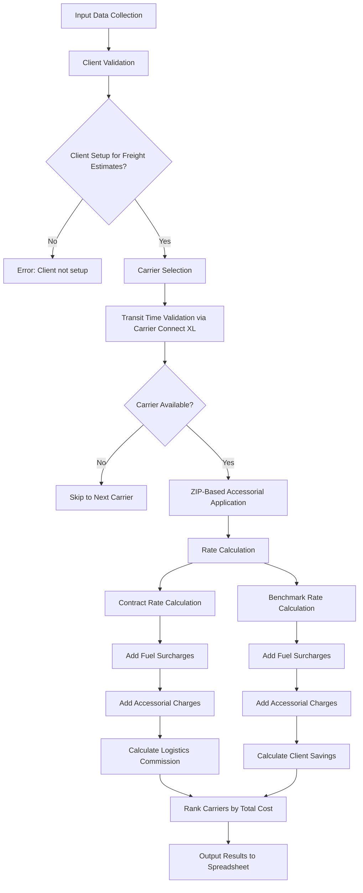
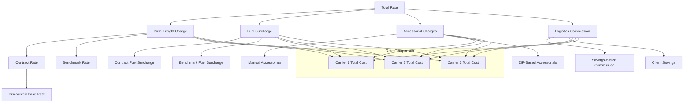
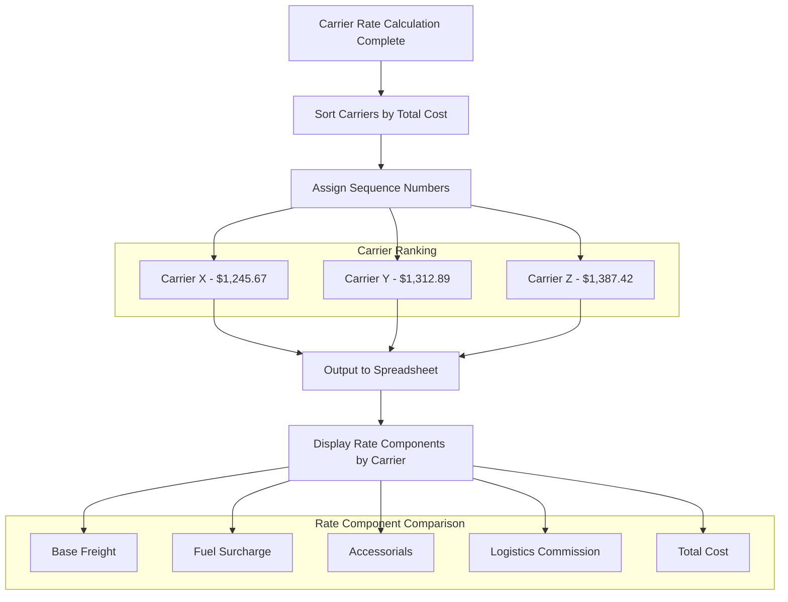
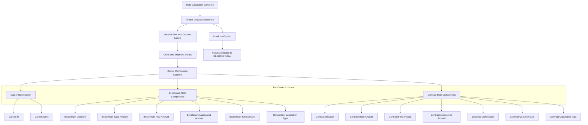

# Rate Calculation in AFS Shreveport

## Rate Calculation Overview

The rate calculation functionality in AFS Shreveport serves as a critical component in determining optimal carrier pricing for freight shipments. This system analyzes client contracts and benchmark rates to identify the most cost-effective shipping options while ensuring compliance with client-specific requirements. The rate calculation engine processes shipment details including origin/destination ZIP codes, freight classes, weights, and accessorial charges to compute accurate freight costs across multiple carriers. By comparing contract rates against benchmark rates, the system enables clients to make informed decisions about carrier selection while identifying potential savings opportunities. The rate calculation module integrates with other system components to provide comprehensive pricing analysis that balances cost considerations with service requirements.

## Rate Calculation Process Flow

The rate calculation process begins with collecting shipment details from input spreadsheets, including client information, origin/destination ZIP codes, freight classes, and weights. After validating client setup for freight estimates, the system selects appropriate carriers based on client approvals and active status. Before rating, the system integrates with Carrier Connect XL to validate transit times and service availability. For each valid carrier, the system applies ZIP-based accessorial charges automatically and calculates both contract and benchmark rates with their respective fuel surcharges. The system then computes logistics commissions based on the difference between benchmark and contract rates, ranks carriers by total cost, and outputs comprehensive results to a spreadsheet for client review.

## Client Contract and Benchmark Rate Integration

The AFS Shreveport system employs a sophisticated approach to integrate client-specific contract rates with industry benchmark rates. For each shipment, the system retrieves client contract information from the FB.AUDIT tables and applies carrier-specific discounts stored in the client profile. These contract rates represent negotiated pricing agreements between clients and carriers. Simultaneously, the system calculates benchmark rates that serve as industry standards for similar shipments, providing a baseline for comparison.

The integration of these two rate types enables the system to quantify potential savings for clients. The code specifically handles this through the FB.AUTO.V2 function, which calculates both contract rates (stored in A.VOUT<8>) and benchmark rates (stored in A.VOUT<9>). The difference between these rates forms the basis for logistics commission calculations and client savings analysis.

The system also accommodates client-specific settings for rate handling, such as whether to take commissions on fuel surcharges (controlled by CL.LOG.FSC flag) and whether to use carrier-specific or benchmark fuel surcharges (managed through the CARR.ONLY.FSC parameter). This flexibility allows AFS to tailor the rate calculation process to each client's unique requirements while maintaining consistent comparison methodologies across the platform.

## Carrier Selection Logic

The carrier selection logic in AFS Shreveport implements a multi-faceted approach to identify appropriate carriers for specific shipments. The system begins by querying the FB.AUDIT file with specific criteria to filter carriers based on client approvals and operational status. For least-cost carrier sequencing, the system executes a SELECT statement that filters carriers with the "ENABLE" status and those flagged as "Core Carriers" (indicated by the "Y" value in field 13).

When a specific carrier is requested (rather than "ALL"), the system validates that the carrier is properly set up for freight estimates and has an "ENABLE" status in the client's audit file. The code also performs additional validation to ensure carriers are active (not marked with an "I" status in the CARRIERS file) before including them in the rating process.

The system further refines carrier selection by integrating with Carrier Connect XL to verify service availability for the specific origin-destination pair. This integration checks for transit times and directional flags (origin, destination, and combined) to ensure the carrier can service the route. Carriers that fail this validation are excluded from the rating process, ensuring clients only see viable options for their shipments.

This multi-layered selection process ensures that rate calculations are performed only for carriers that are both approved by the client and operationally capable of handling the specific shipment requirements.

## Rate Component Breakdown

The rate calculation system breaks down total shipping costs into distinct components to provide transparency and enable detailed cost analysis. The base freight charge forms the foundation, calculated using either contract rates (stored in A.VOUT<10>) or benchmark rates (stored in A.VOUT<8>), with applicable discounts applied (tracked in CARRIER.EST.ARRAY<19> for contract and CARRIER.EST.ARRAY<21> for benchmark).

Fuel surcharges are calculated separately from the base freight and stored distinctly (CONTR.FSC.AMT and BENCH.FSC.AMT), allowing for different handling based on client preferences. The system supports multiple fuel surcharge calculation methods, including carrier-specific surcharges and benchmark surcharges, controlled through the CARR.ONLY.FSC parameter.

Accessorial charges are tracked in two categories: manually entered accessorials from the input spreadsheet and automatically applied ZIP-based accessorials from the ZIP.LINE.ITEM file. These are summed and stored in W.TOT.CONT.ACC.AMTS and W.TOT.BENCH.ACC.AMTS respectively.

For logistics clients, the system calculates a commission based on the savings between benchmark and contract rates, stored in LOG.COMM. This commission is factored into the final quote amount presented to clients.

The breakdown of these components allows the system to present detailed cost information in the output spreadsheet, with separate columns for each rate component across multiple carriers, enabling informed decision-making based on comprehensive cost analysis.

## Accessorial Charge Management

The AFS Shreveport system employs a dual approach to accessorial charge management, combining manual entry with automated ZIP code-based application. Manual accessorial charges are captured from the input spreadsheet through the LINE.MISC.CHG.CODES variable, which stores accessorial codes entered by users. These codes represent additional services required for the shipment, such as residential delivery, liftgate service, or inside delivery.

The system's sophisticated ZIP.LINE.ITEM functionality enhances this process by automatically applying appropriate accessorial charges based on origin and destination ZIP codes. This feature, implemented in the GRB02 section of the code, retrieves ZIP-specific accessorial requirements from the ZIP.LINE.ITEM file using a composite key that includes carrier ID, client ID, transport mode, and inbound/outbound indicator. The system then searches for the origin and destination ZIP codes within the retrieved record and adds any applicable accessorial codes to the shipment.

The ZIP.LINE.ITEM functionality supports directional application of accessorials, with codes marked as 'O' (origin), 'D' (destination), or 'B' (both) to ensure charges are applied appropriately. This automation reduces manual entry errors and ensures consistent application of accessorial charges based on known geographic requirements, such as automatically adding limited access charges for deliveries to certain ZIP codes or residential delivery charges for predominantly residential areas.

Both manual and automated accessorial charges are incorporated into the final rate calculation, with separate tracking for contract and benchmark accessorial amounts to maintain accurate cost comparisons across carriers.

## Fuel Surcharge Calculation

The fuel surcharge calculation methodology in AFS Shreveport is highly configurable, accommodating both client-specific settings and carrier-specific surcharge tables. The system retrieves fuel surcharge information from the FB.BC.FSC file, which stores surcharge tables indexed by carrier ID and client ID. For benchmark rates, the system looks for a record with the pattern 'B*[CARRIER_ID]*[CLIENT_ID]', falling back to a generic carrier record if a client-specific one doesn't exist. Similarly, for contract rates, it searches for 'C*[CARRIER_ID]*[CLIENT_ID]'.

Client preferences significantly influence how fuel surcharges are calculated and applied. The CL.LOG.FSC flag (stored in DCLIENTS<111>) determines whether logistics commissions should be calculated on fuel surcharges. The CARR.ONLY.FSC parameter (DCLIENTS<189>) offers multiple options: 'Y' to use carrier-specific fuel surcharges for both contract and benchmark calculations, 'C' to use carrier surcharges for contracts only, 'O' for a specialized calculation method, or other values to use standard benchmark surcharges.

The system also supports carrier-specific exceptions to these rules, as demonstrated by the special handling for specific carriers (like carrier '00748' for client '01758' and carrier '00014' for clients '01784' and '01810'), where the fuel surcharge calculation method is overridden.

Once calculated, fuel surcharges are stored separately from base freight charges (in CONTR.FSC.AMT and BENCH.FSC.AMT), allowing for transparent reporting and analysis of this significant cost component. This separation also enables the system to apply different commission structures to fuel versus freight components, providing maximum flexibility in client billing arrangements.

## Least-Cost Carrier Sequencing

The least-cost carrier sequencing functionality in AFS Shreveport provides a systematic approach to ranking carriers based on their total cost for a shipment. After calculating rates for all eligible carriers, the system sorts them in ascending order of total cost, ensuring the most economical options appear first in the results.

This sequencing is implemented through the strategic insertion of carrier information into the CARRIER.EST.ARRAY structure. The system uses the LOCATE statement with the 'AR' (ascending right-justified) option to position each carrier in the array based on its quote amount plus logistics commission (QUOTE.AMT+LOG.COMM/100). This creates a sorted list where the lowest-cost carrier appears first.

For each carrier in the sequence, the system stores comprehensive information including carrier ID, name, contract and benchmark rates, fuel surcharges, accessorial charges, logistics commission, and calculation types. This detailed information allows for transparent comparison between carriers across all cost components.

The output spreadsheet presents carriers in this least-cost sequence, with each carrier's information displayed in a set of columns that includes both benchmark and contract rate components. This presentation enables clients to easily identify the most cost-effective carrier while also understanding the breakdown of charges that contribute to the total cost.

The sequencing logic also handles cases where carriers might have identical total costs by maintaining the insertion order, ensuring consistent results across multiple rating sessions. This systematic approach to carrier ranking simplifies decision-making by presenting the most economical options first while providing complete transparency into the cost structure.

## Transit Time and Service Integration

The AFS Shreveport system enhances rate calculation with integrated transit time data through its connection to Carrier Connect XL (CCXL.V2). This integration provides critical service-level information alongside rate data, enabling informed decision-making that balances cost considerations with delivery timeframes.

When processing each carrier, the system constructs a request to Carrier Connect XL that includes the carrier's SCAC code, origin and destination countries and ZIP codes, and client ID. The response provides transit time information and directional service flags that indicate whether the carrier can service the origin point (ORIG.DIR.FLG), destination point (DEST.DIR.FLG), or the combined route (COMB.DIR.FLG).

The system interprets these flags to determine service availability, with values like 'C' (commercial), 'P' (point), or 'I' (interline) indicating different service capabilities. A carrier must pass this service validation check (CC.STATUS = 'PASS') before the system proceeds with rate calculation, ensuring that clients are only presented with carriers that can actually service their shipment.

Transit time information (TRANSIT.TIME) is captured from the Carrier Connect response and incorporated into the rating results. This allows clients to make trade-offs between cost and speed, potentially selecting a slightly more expensive carrier that offers significantly faster transit times when needed.

By integrating this service information directly into the rate calculation process, AFS Shreveport provides a comprehensive view of carrier capabilities that extends beyond simple price comparisons, supporting more nuanced logistics decision-making that accounts for both cost and service requirements.

## Logistics Commission and Savings Calculation

The AFS Shreveport system implements a sophisticated approach to calculating logistics commissions and client savings based on the difference between benchmark and contract rates. For clients with logistics services enabled (indicated by LOGISTICS=DCLIENTS<93>='Y'), the system calculates commissions that reflect the value AFS provides through its carrier negotiation and management services.

The commission calculation begins by determining the savings between benchmark and contract rates (SAVINGS = BENCH.AMT-CONTR.AMT). The system then retrieves the appropriate commission percentage (COMM.PERC) from the client's profile based on the shipment date, locating the applicable rate in the DCLIENTS<84> and DCLIENTS<85> arrays. This percentage is applied to the savings amount to calculate the logistics commission (LOG.COMM = SAVINGS*COMM.PERC/100).

Client savings are calculated as the difference between the total savings and the logistics commission (CL.SAVINGS = SAVINGS - LOG.COMM). The system further refines this by applying a client-specific savings quote percentage (SAVINGS.QUOTE.PERC) that varies based on the shipment type (inbound, outbound, or third-party) as defined in DCLIENTS<136>, DCLIENTS<137>, and DCLIENTS<138> respectively.

The final quote amount presented to the client includes the contract amount plus the logistics commission and a portion of the savings (QUOTE.AMT=CONTR.AMT + LOG.COMM + SAVINGS.QUOTE.AMT). This approach ensures that both AFS and the client benefit from the negotiated savings, with the specific distribution determined by the client's contract terms.

These calculations are performed for each carrier, allowing for accurate comparison of total costs while maintaining transparency about how the final amounts are derived. The resulting commission and savings information is stored in the CARRIER.EST.ARRAY structure and included in the output spreadsheet, providing clients with clear visibility into the value generated through the logistics service.

## Rate Output and Reporting Structure

The rate calculation output in AFS Shreveport is structured as a comprehensive spreadsheet that organizes results for client review and decision-making. The output format begins with the original shipment details from the input file, preserving information such as client ID, origin/destination ZIP codes, freight classes, and weights. It then appends detailed rating information for each carrier in a structured column format.

For each carrier, the system creates a set of 15 columns that provide complete transparency into the rate calculation. These columns are organized into three main sections:

1. **Carrier Identification**: Includes the carrier ID and name for clear identification.

2. **Benchmark Rate Components**: Displays the benchmark discount percentage, base freight amount, fuel surcharge amount, accessorial charges, total benchmark quote amount, and calculation type used. This section provides the baseline for comparison.

3. **Contract Rate Components**: Shows the contract discount percentage, base freight amount, fuel surcharge amount, accessorial charges, logistics commission amount, total contract quote amount, and calculation type used. This section demonstrates the negotiated rates and resulting savings.

The carriers are sequenced from lowest total cost to highest, making it easy for clients to identify the most economical option. The spreadsheet structure allows for side-by-side comparison of up to 10 carriers, with consistent column positioning for each rate component to facilitate easy comparison across carriers.

Upon completion of the rating process, the system sends an email notification to the user with information about the location of the output file (in the BILLDATA folder with the prefix "RR-"). This notification ensures that users are promptly informed when their rate calculation results are available for review.

## System Integration Points

The rate calculation functionality in AFS Shreveport serves as a central hub that integrates with numerous other system components to deliver comprehensive pricing analysis. The primary integration points include:

**Client Management Integration**: The system pulls client-specific settings from the CLIENTS file, including logistics flags, commission percentages, fuel surcharge handling preferences, and carrier approval lists. This ensures that rate calculations adhere to client-specific business rules and contractual agreements.

**Carrier Profiles**: Integration with the CARRIERS file provides carrier information including names, addresses, SCAC codes, and status flags. The system also checks carrier-specific settings in the FB.AUDIT file to determine eligibility for specific clients and routes.

**Fuel Surcharge Tables**: The system connects to the FB.BC.FSC file to retrieve carrier and client-specific fuel surcharge tables, supporting complex surcharge calculations based on negotiated agreements.

**ZIP Code Management**: Integration with ZIPS.CODES, CAN.ZIP.CODES, and ZIP.LINE.ITEM files enables geographic validation and automatic application of location-specific accessorial charges based on origin and destination points.

**Transit Time Data**: The system connects to Carrier Connect XL (CCXL.V2) to retrieve real-time transit time and service availability information, enhancing rate data with critical service-level details.

**Tariff Management**: Integration with tariff data stored in FB.TABLES (including TARIFF.DATE.XREF and TARIFFS records) ensures that the appropriate rate bases are used for calculations based on effective dates.

**Accessorial Code Management**: The system references LI.CODES from FB.TABLES to validate and process accessorial charges correctly.

**Email Notification**: Upon completion, the system integrates with the email functionality (SENDMAIL) to notify users about the availability of rating results.

**Audit and Logging**: Integration with the PROGTRACK function records execution metrics for performance monitoring and troubleshooting.

These integration points create a cohesive ecosystem where rate calculation draws from and contributes to the broader freight management capabilities of the AFS Shreveport system, ensuring consistent data handling and business rule application across the platform.

[Generated by the Sage AI expert workbench: 2025-05-28 08:06:21  https://sage-tech.ai/workbench]: #