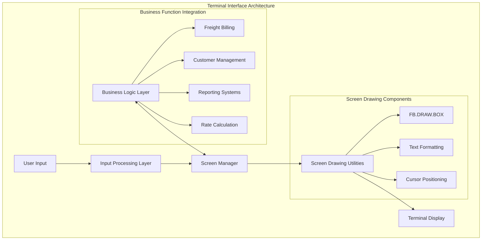
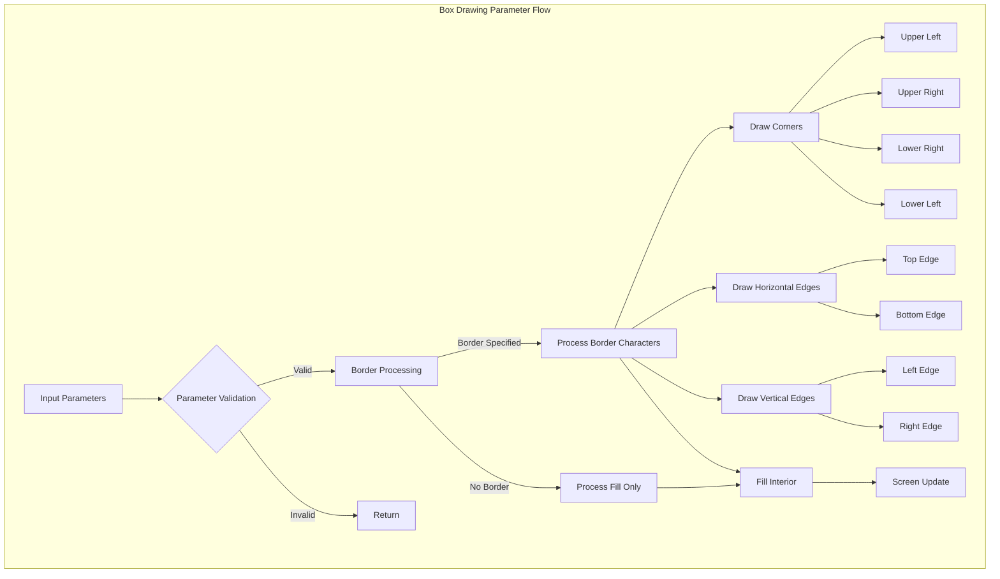
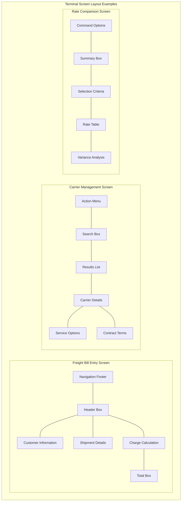
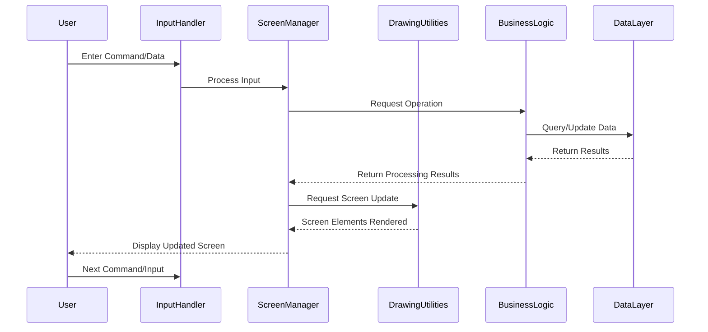

# Terminal-Based Interface in AFS Shreveport

## Overview of Terminal-Based Interface in AFS Shreveport

The AFS Shreveport system employs a sophisticated terminal-based interface that serves as the primary interaction method for users managing freight logistics operations. This text-based interface system, while appearing deceptively simple, is built on a robust foundation of screen formatting utilities and character-based rendering techniques. The interface enables users to efficiently navigate through complex freight management tasks including bill processing, carrier management, rate calculations, and reporting functions. Unlike modern graphical interfaces, the terminal-based approach optimizes for speed and efficiency in data entry and retrieval, particularly important in high-volume logistics operations. The system uses carefully designed screen layouts with boxes, borders, and formatted text fields to create intuitive navigation paths and data presentation, allowing experienced users to perform complex operations with minimal keystrokes and screen refreshes.

## Terminal Interface Architecture

The architecture diagram illustrates how the terminal interface in AFS Shreveport is structured. At its core, the Screen Drawing Utilities (particularly FB.DRAW.BOX) provide the foundation for rendering structured visual elements. User input flows through an Input Processing Layer to the Screen Manager, which coordinates with both the drawing utilities and the Business Logic Layer. This architecture enables efficient integration between the presentation layer and critical business functions like Freight Billing, Customer Management, and Reporting Systems, allowing users to interact with complex logistics data through a consistent terminal interface.

## Screen Drawing Utilities

The terminal interface in AFS Shreveport relies heavily on specialized screen drawing utilities, with FB.DRAW.BOX serving as a cornerstone component. This utility provides the fundamental capability to create structured visual elements anywhere on the screen, essential for organizing information in a text-based environment. FB.DRAW.BOX accepts parameters for positioning (X,Y coordinates), dimensions (width and height), fill characters, and border styles, allowing for flexible screen layouts. The utility's efficient implementation minimizes screen refreshes by only updating necessary characters rather than redrawing entire screen areas. This optimization is crucial in a terminal environment where display performance directly impacts user productivity. Additional utilities work in concert with FB.DRAW.BOX to handle text formatting, cursor positioning, and field management, creating a cohesive framework for building complex screens that support freight management operations.

## Box Drawing and Border Management

The box drawing techniques employed in AFS Shreveport's terminal interface represent a sophisticated approach to visual organization in a character-based environment. The FB.DRAW.BOX utility implements a comprehensive border management system that handles various border styles through a compact encoding scheme. Each border set is represented by a single string containing all necessary elements (corners and edges), allowing for efficient storage and processing. The utility intelligently handles special cases, such as when borders or fillers are spaces or empty strings, providing flexibility in visual presentation. Box dimensions are carefully validated to ensure minimum requirements are met, preventing rendering errors. The system supports both bordered and borderless boxes, with precise control over the interior fill character. This approach to border management enables the creation of complex screen layouts with nested boxes, dividing lines, and highlighted sections, all essential for organizing the dense information required in freight management operations.

## Box Drawing Parameter Flow

This flowchart illustrates how parameters are processed by the FB.DRAW.BOX utility to render boxes on screen. The process begins with parameter validation to ensure minimum box dimensions are met. If valid, the flow branches based on whether a border is specified. For bordered boxes, the utility processes the border character set and systematically draws corners and edges before handling the interior fill. For borderless boxes, only the interior fill is processed. The diagram shows how the utility optimizes screen updates by drawing only the necessary components, resulting in efficient terminal rendering that minimizes screen refreshes and improves user experience in the freight management system.

## Screen Optimization Techniques

AFS Shreveport's terminal interface employs sophisticated optimization techniques to maximize performance in character-based environments. Rather than redrawing entire screen areas, the system uses selective character updates, targeting only the specific screen positions that require changes. This approach is evident in the FB.DRAW.BOX utility, which draws box components (corners, edges, and fills) individually rather than refreshing the entire box area. The system also optimizes memory usage through compact data structures, such as the border character set encoding that stores all border elements in a single string. Another key optimization involves conditional rendering logic that avoids unnecessary operations—for example, skipping interior fill operations when not required or bypassing border drawing for borderless boxes. These techniques are particularly important in a logistics environment where rapid screen updates and responsive user interaction directly impact operational efficiency. By minimizing the amount of data sent to the terminal and reducing screen flicker, the system provides a smooth user experience despite the limitations of character-based displays.

## User Interface Components

The terminal interface in AFS Shreveport features a comprehensive set of UI components built upon the core screen drawing utilities. Data entry forms utilize carefully positioned boxes with labeled fields to capture freight information, customer details, and shipment specifications. Selection menus implement highlighted options and keyboard navigation for efficient operation selection. Information displays use structured layouts with borders to organize complex data like rate tables, carrier information, and billing details. Status indicators provide visual feedback on system operations and process completion. Dialog boxes present confirmations, warnings, and error messages with appropriate formatting to draw user attention. These components maintain consistent visual styling through standardized border types, spacing conventions, and text formatting patterns. The modular design allows components to be combined into complex screens that support sophisticated workflows such as freight bill processing, audit management, and reporting functions. Despite the character-based limitations, these UI components create an intuitive interface that experienced users can navigate with minimal keystrokes.

## Terminal Screen Layout Examples

This diagram illustrates typical screen layouts used in the AFS Shreveport terminal interface. Each layout demonstrates how boxes, borders, and other screen elements combine to create functional interfaces for specific freight management tasks. The Freight Bill Entry Screen organizes information in a hierarchical structure with dedicated areas for customer information, shipment details, and charge calculations. The Carrier Management Screen provides a workflow from search to detailed carrier information. The Rate Comparison Screen shows how tabular data is presented alongside analysis tools. These layouts maximize the limited screen real estate of terminal displays while providing clear visual organization that guides users through complex logistics operations.

## Integration with Business Functions

The terminal interface in AFS Shreveport serves as a critical bridge between users and the system's core business functions. Screen layouts are meticulously designed to map directly to underlying business processes, ensuring that the interface reflects the logical flow of freight management operations. For freight billing, the interface captures hierarchical data relationships, guiding users through customer selection, shipment details, and charge calculations in a structured sequence. Customer management screens integrate contact information, shipping preferences, and historical data in contextually appropriate groupings. Reporting interfaces provide parameter selection, data filtering, and output formatting options that align with business analysis needs. The system implements specialized screens for rate management that visualize complex pricing structures and contractual terms. This tight integration between interface design and business logic minimizes the cognitive load on users, allowing them to focus on logistics decisions rather than system navigation. The terminal interface also incorporates role-based access controls, displaying only the functions and data relevant to specific user responsibilities, further streamlining operations in the freight management environment.

## Character-Based UI Design Patterns

The AFS Shreveport terminal interface employs several sophisticated design patterns to maintain consistency and usability across different system modules. Hierarchical navigation patterns use breadcrumb-style indicators to show users their current position within nested functions. Form-based interaction patterns standardize data entry sequences with consistent tab ordering and field validation. List-based selection patterns implement efficient keyboard navigation through options with highlighting and selection indicators. Modal operation patterns clearly delineate when users are in special processing modes versus standard navigation. Command-line integration patterns allow power users to bypass menu navigation with direct commands. Visual grouping patterns use consistent border styles and spacing to indicate related information sets. Status feedback patterns provide uniform indicators for process completion, warnings, and errors. These patterns create a predictable interaction model that reduces training requirements and improves operational efficiency. Despite the constraints of character-based displays, these design patterns enable complex workflows to be represented in an intuitive manner, allowing users to develop muscle memory for common operations and reducing cognitive load during intensive freight management tasks.

## Terminal Interface Workflow

This sequence diagram illustrates the typical workflow of screen rendering, user interaction, and data processing in AFS Shreveport's terminal-based interface. The process begins with user input, which is captured by the Input Handler and passed to the Screen Manager. The Screen Manager coordinates with Business Logic components to process the request, which may involve data retrieval or updates through the Data Layer. Once processing is complete, the Screen Manager instructs the Drawing Utilities (including FB.DRAW.BOX) to render the appropriate screen elements. The updated screen is then presented to the user, who can proceed with the next command or data entry. This workflow demonstrates how the terminal interface efficiently manages the interaction between user actions and system functions, minimizing unnecessary screen refreshes while ensuring timely feedback.

## Future Evolution and Maintenance

Maintaining and evolving AFS Shreveport's terminal interface presents both challenges and opportunities in a technology landscape dominated by graphical interfaces. The system's character-based design, while appearing dated, offers performance advantages that remain relevant for high-volume data entry and processing tasks common in freight management. Future maintenance strategies should focus on preserving these efficiency benefits while selectively modernizing components. Code refactoring opportunities include extracting hardcoded screen layouts into configuration files, improving parameter validation, and enhancing error handling. Compatibility considerations must address evolving terminal emulation environments and changing character encoding standards. Potential modernization paths include developing hybrid approaches that maintain terminal efficiency for core operations while offering graphical alternatives for visualization-heavy tasks. Documentation enhancements should capture the institutional knowledge embedded in the existing code, particularly the optimization techniques and design patterns that have evolved over years of operational use. Training materials should emphasize the productivity benefits of keyboard-driven interfaces for experienced users. By taking a measured approach to evolution, the system can maintain its operational efficiency while gradually incorporating modern interface concepts where they provide genuine value to freight management workflows.

[Generated by the Sage AI expert workbench: 2025-05-28 08:06:23  https://sage-tech.ai/workbench]: #