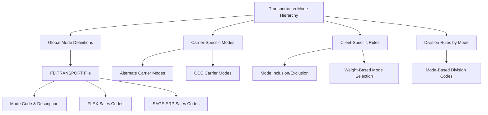
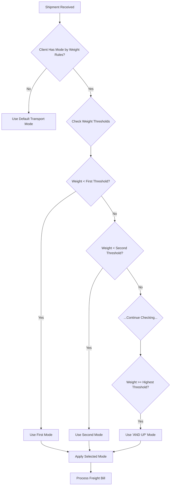
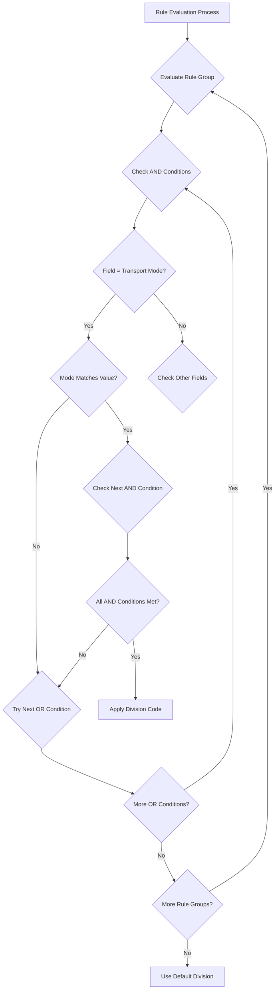

# Transportation Mode Rules in AFS Shreveport

## Introduction to Transportation Mode Rules

Transportation mode rules form a critical foundation of the AFS Shreveport freight billing system, defining how shipments are categorized, processed, and billed. These rules establish the framework for identifying different transportation methods (such as LTL, Truckload, Air Freight) and applying appropriate business logic for each mode. Transportation modes serve as a primary classification mechanism that influences numerous downstream processes including rate calculations, carrier selection, auditing thresholds, and division code assignments. The system implements a sophisticated hierarchy of rules that can be customized at multiple levels - from global defaults to carrier-specific and client-specific configurations - allowing for precise control over freight billing operations.

## Core Transportation Mode Configuration

The fundamental structure of transportation modes in AFS Shreveport is maintained in the FB.TRANSPORT file, which stores mode codes, descriptions, and associated sales codes. Each transport mode record contains a unique identifier (typically a numeric code), a descriptive name, and sales code associations for different accounting systems. The system supports dual accounting integration with both FLEX and SAGE ERP, maintaining separate sales codes for each platform. These sales codes are critical for financial operations as they determine how freight charges are categorized in the accounting system.

Programs like FB.1.9 and FB.1.9.1 provide the interface for managing these core transport mode definitions. They implement validation to ensure sales codes exist in the appropriate reference files (AR.SALES.CODE.1000.1 for FLEX or SQL database for SAGE ERP) and maintain descriptions for each code. This core configuration serves as the master reference for all transportation mode operations throughout the system.

## Carrier-Specific Mode Configuration

AFS Shreveport extends the core transportation mode framework by allowing carrier-specific mode configurations. This is implemented through two primary mechanisms:

1. **Alternate Carrier Modes** (managed by FB.11.12): This feature allows specific carriers to use alternative mode codes that differ from the standard system codes. The system maintains these mappings in the CARRIER.ALT.MODE file, with separate files for each carrier (CARRIER.ALT.MODE,{carrier_id}). This enables carriers to use their own mode terminology while ensuring proper translation to AFS standard modes.

2. **CCC Carrier Modes** (managed by FB.11.8): Similar to alternate modes, this feature provides another layer of carrier-specific mode customization stored in CCC.MODE,{carrier_id} files. These carrier-specific mode configurations support the diverse terminology and classification systems used by different transportation providers.

Both implementations include soundex indexing for efficient searching and maintain synchronized descriptions with the master mode list. The system enforces validation to ensure carrier-specific modes reference valid entries in the master mode list, maintaining data integrity throughout the system.

## Weight-Based Mode Selection

A sophisticated feature of the transportation mode rules system is the ability to automatically select transportation modes based on shipment weight thresholds. This functionality, implemented in FB.1.2.MODE.BY.WEIGHT, allows carriers to define up to five weight thresholds with corresponding transportation modes.

The system uses a special designation '@' to represent an "AND UP" weight threshold, which must be defined to ensure all possible weight ranges are covered. When processing freight bills, the system evaluates the shipment weight against these thresholds and automatically assigns the appropriate transportation mode. This automation reduces manual classification errors and ensures consistent application of carrier-specific pricing structures.

The weight-based mode selection is particularly valuable for carriers that offer different service levels or equipment types based on shipment size, allowing for automatic mode determination without manual intervention. The system enforces validation rules to ensure logical weight ranges and prevents overlapping or incomplete threshold definitions.

## Client Inclusion/Exclusion Rules

AFS Shreveport provides granular control over which transportation modes are available for specific clients through inclusion/exclusion rules. The FB.4.20.MODE program manages these rules, allowing administrators to specify whether particular transport modes should be included or excluded for a client, with date-effective parameters.

Each rule contains:
- A transport mode code validated against the FB.TRANSPORT file
- An inclusion/exclusion indicator (I/E)
- Begin and end dates defining when the rule applies
- Optional notes for documentation purposes

The system stores these configurations in the FB.CAR.MODE.CTRL file with a client ID as the key. When processing freight bills, the system evaluates these rules to determine if a particular transportation mode is valid for the client at the time of shipment. This prevents inappropriate mode usage and ensures clients only use transportation modes that align with their business agreements.

The inclusion/exclusion rules support date ranges, allowing for scheduled changes to transportation mode availability without requiring manual updates when the effective date arrives. The system also maintains audit information including creation and modification timestamps and user identifiers.

## Division Rules for Transportation Modes

Division codes in AFS Shreveport determine how freight costs are allocated within client organizations. The FB.DIVISION.SETUP program implements a sophisticated rule engine that can assign division codes based on transportation modes and other shipment attributes.

Division rules are organized in a hierarchical structure:
1. Client-carrier specific rules (highest precedence)
2. Client-wide rules (applying to all carriers)
3. Carrier-wide rules (applying to all clients)

Within each level, rules are organized into groups using AND/OR logic structures. Each rule specifies a field (such as transportation mode), an operator, and a value to compare against. When the system evaluates these rules, it processes each group sequentially until finding a match, then applies the associated division code.

The division code can be static or dynamically generated using variable substitution with curly brace notation (e.g., "{DIV}") to incorporate values from the shipment record. This powerful feature allows for complex division code assignment logic based on transportation modes and other shipment characteristics.

## Carrier Override Configuration

The carrier override system, managed by FB.OVERRIDE.SETUP, provides a mechanism to modify standard transportation mode behavior for specific client-carrier combinations. These overrides are organized into groups and subgroups with date ranges, allowing for precise control over when and how they apply.

Each override rule specifies:
- A group and subgroup identifier for logical organization
- Begin and end dates defining the effective period
- A stack number determining processing order
- A field identifier (which can include transportation mode)
- An operator and value for comparison

When the system processes a freight bill, it evaluates applicable override rules in sequence. If a transportation mode-based override matches, it can modify various aspects of the freight bill processing, such as rate calculations, service levels, or routing decisions.

The override system implements a sophisticated validation mechanism that ensures rule integrity, prevents conflicting rules, and maintains proper date sequencing. It also includes an audit trail that tracks all changes to override configurations with user identification and timestamps.

## Threshold Management

AFS Shreveport implements threshold management for transportation modes through the UPD.THC.TRANSP.MODES program. This functionality allows administrators to define threshold amounts for different transportation modes, determining when freight bills require additional scrutiny or auditor review.

Threshold configurations are stored in the FB.TABLES file with composite keys in the format "MODE_THC*[mode_id]*[client_id]". When a freight bill's amount exceeds the defined threshold for its transportation mode, the system automatically routes it for auditor review rather than allowing straight-through processing.

These thresholds can be set globally for all clients or customized for specific client-mode combinations, providing flexible control over the audit process. The threshold system helps balance processing efficiency with financial control by focusing human review on higher-value or potentially problematic shipments based on their transportation mode and amount.

## Misroute Detection and Notification

A critical component of the transportation mode rules system is the ability to detect and address misrouted shipments - cases where carriers have used incorrect transportation modes. The FB.TEM.EMAILS program implements a progressive notification system for handling these issues.

The system identifies misroutes by comparing the actual transportation mode used against approved modes for the specific origin-destination pair and client. When a misroute is detected, the system initiates a series of escalating notifications:

1. Initial notification to the carrier identifying the misroute
2. Follow-up notifications if the issue persists
3. Escalation to management if multiple notifications fail to resolve the issue
4. Creation of debit memos for financial recovery when appropriate

Each notification includes detailed shipment information, the correct transportation mode that should have been used, and the cost difference resulting from the misroute. The system tracks notification history and calculates overcharges by comparing actual freight costs against approved carrier rates for the correct transportation mode.

Client-specific configurations determine notification thresholds, debit memo amounts, and escalation timelines. The system integrates with email systems to deliver notifications and maintains comprehensive records of all communication regarding misroutes.

---

This comprehensive analysis demonstrates how transportation mode rules form a fundamental building block of the AFS Shreveport freight billing system. Through a sophisticated hierarchy of configurations - from global defaults to carrier and client-specific rules - the system provides precise control over how different transportation methods are processed, priced, and managed throughout the freight billing lifecycle.

[Generated by the Sage AI expert workbench: 2025-05-28 08:06:17  https://sage-tech.ai/workbench]: #