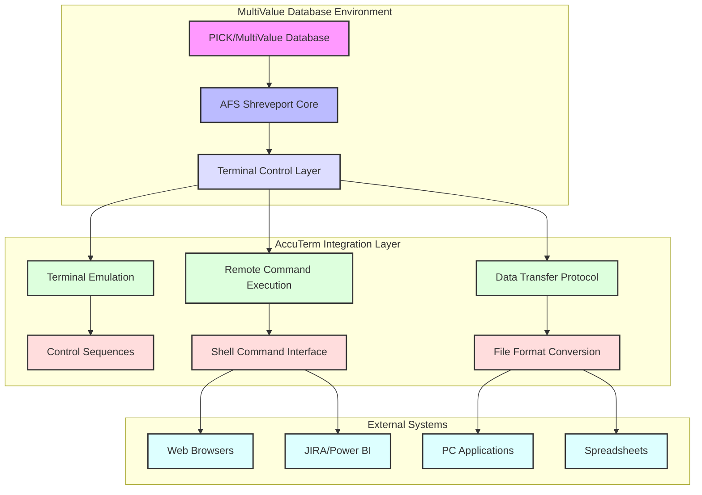
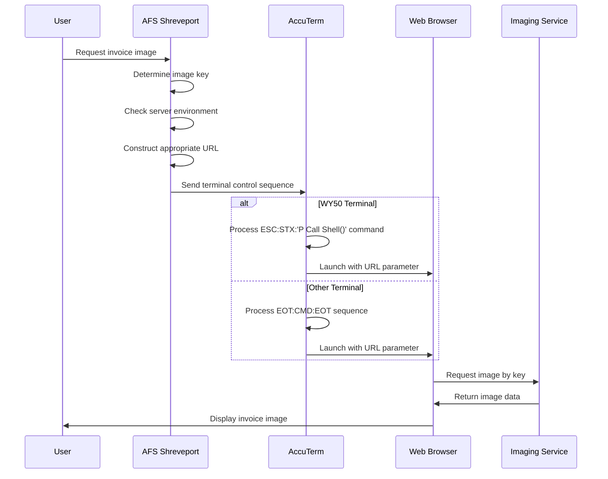
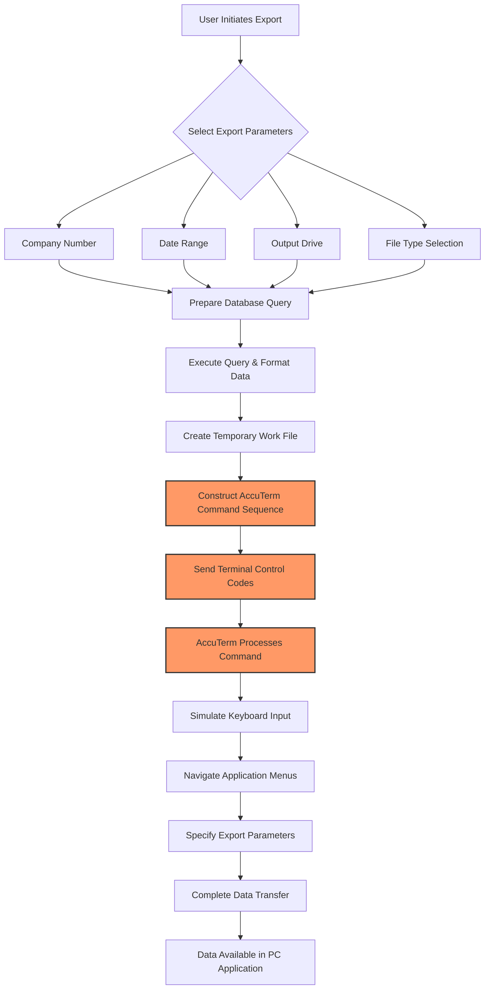
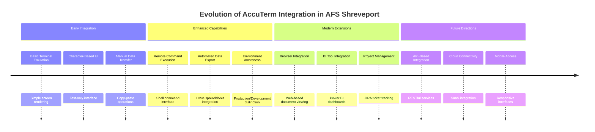

# AccuTerm Integration in AFS Shreveport

## Introduction to AccuTerm Integration

AccuTerm serves as a critical terminal emulation solution within the AFS Shreveport system, bridging the gap between legacy PICK/MultiValue database environments and modern applications. As a sophisticated terminal emulator, AccuTerm extends beyond simple screen rendering to provide integration capabilities that allow the MultiValue database to interact with external systems, web browsers, and PC applications. This integration layer enables AFS Shreveport to preserve its robust MultiValue database foundation while extending functionality through modern interfaces. AccuTerm's capabilities include remote command execution, file transfer protocols, and specialized control sequences that facilitate data exchange between disparate systems. By leveraging these integration points, AFS Shreveport maintains operational continuity while progressively enhancing user experience through modern interfaces.

## AccuTerm Integration Architecture

The AccuTerm integration architecture illustrates the layered approach that enables AFS Shreveport to bridge legacy and modern systems. At its core, the MultiValue database environment contains the business logic and data storage capabilities of the AFS Shreveport system. The AccuTerm Integration Layer serves as the middleware that translates between the MultiValue environment and external systems. This layer handles terminal emulation with specialized control sequences, remote command execution through shell interfaces, and data transfer protocols that manage format conversion. The external systems layer represents the various modern applications and interfaces that users interact with, including web browsers for document viewing, PC applications for data analysis, spreadsheet applications for reporting, and modern tools like JIRA and Power BI for project tracking and business intelligence.

## Terminal Control and Command Execution

AccuTerm's integration with AFS Shreveport relies heavily on specialized terminal control sequences and escape codes that enable sophisticated interactions between the MultiValue database and external systems. These control sequences, typically beginning with escape characters (ESC, represented as CHAR(27)), allow PICK BASIC programs to send commands directly to the AccuTerm terminal emulator rather than displaying them as text. The system employs character equates like STX (Start of Text, CHAR(2)), EOT (End of Transmission, CHAR(4)), and others to construct precise control instructions that AccuTerm interprets as commands rather than display content.

The remote command execution capability is particularly powerful, allowing AFS Shreveport programs to launch external applications and pass parameters to them. This is implemented through AccuTerm's "remote command" protocol, where special escape sequences instruct AccuTerm to execute commands on the client PC rather than sending them to the host system. For terminal types identified as "WY50" (a common terminal emulation mode), the system uses the ESC:STX:'P Call Shell()' sequence to execute commands, while other terminal types may use alternative approaches like the EOT command EOT sequence. This flexibility allows the system to adapt to various terminal configurations while maintaining consistent functionality.

## Browser Integration for Document Viewing

The FB.SHOW.INV.IMAGE subroutine exemplifies how AFS Shreveport leverages AccuTerm's integration capabilities to enhance user experience through browser integration. This subroutine enables users to view invoice images stored in an external imaging service directly from within the AFS Shreveport application. The program determines the appropriate imaging service URL based on the server environment (production or development) and constructs a complete URL with the image key parameter.

What makes this integration sophisticated is its environment awareness and terminal-specific implementation. The code first identifies the server environment by calling GET.SERVER.INFO to determine whether it's running in production or development, then constructs the appropriate URL to either the production or QA imaging service. For terminals identified as WY50 type, the program uses AccuTerm's remote command execution capability with the syntax `ESC:STX:'P Call Shell("URL",1)'` to launch the default web browser with the specified URL. For other terminal types, it uses a more generic `RUN` command wrapped in EOT characters. This dual approach ensures compatibility across different terminal configurations while maintaining consistent functionality.

## Document Viewing Workflow

The document viewing workflow demonstrates how AccuTerm serves as a bridge between the MultiValue database environment and modern web technologies. When a user requests to view an invoice image, the AFS Shreveport system first determines the appropriate image key and server environment. Based on this information, it constructs a URL pointing to either the production or development imaging service. The system then sends a terminal control sequence to AccuTerm, which varies depending on the terminal type. For WY50 terminals, AccuTerm processes an ESC:STX sequence that calls the Shell function to launch a web browser with the specified URL. For other terminal types, it processes an EOT-wrapped command sequence. In either case, the result is that a web browser is launched with the appropriate URL, which then requests the image from the imaging service and displays it to the user. This seamless integration allows users to access modern web-based services directly from within the terminal-based AFS Shreveport application.

## Data Export to PC Applications

AccuTerm's integration capabilities extend beyond browser launching to sophisticated data export functionality, enabling AFS Shreveport to transfer data from its MultiValue database to PC applications like Lotus spreadsheets. Programs like FB.4.9.2 and FB.4.9.3 demonstrate this capability by constructing specialized command sequences that leverage AccuTerm's terminal control features to automate the export process.

These programs first prepare the data for export by querying the MultiValue database and formatting the results appropriately. They then construct a complex command sequence using escape characters, control codes, and keyboard emulation commands that AccuTerm interprets to perform the export operation. For example, the command sequence typically begins with `CHAR(27):CHAR(8)` to initiate PC control mode, followed by `KEY` commands that simulate keyboard input to navigate through the Lotus import dialog. The sequence includes simulated keystrokes like `<ALT+F>I` to access the Import menu, file path specifications, and format selections.

What makes this integration particularly powerful is its ability to completely automate what would otherwise be a manual, multi-step process. The user simply provides basic parameters like company number and date range, and the system handles the complex data extraction, formatting, and export operations transparently. This approach not only saves time but also ensures consistency in the exported data format.

## Environment-Aware Integration

A sophisticated aspect of AccuTerm integration in AFS Shreveport is its environment awareness and adaptability. The system intelligently adjusts its behavior based on both the execution environment (production vs. development) and the terminal configuration being used. This adaptability ensures consistent functionality across different deployment scenarios while maintaining appropriate separation between environments.

For instance, the FB.SHOW.INV.IMAGE subroutine demonstrates environment awareness by first determining whether it's running on the production or development server using the GET.SERVER.INFO function. Based on this determination, it constructs URLs pointing to either the production imaging service (imagingws.afs.net) or the QA environment (imagingws.qa.afs.net). This approach ensures that users access the appropriate imaging service for their environment, preventing cross-environment contamination.

Similarly, the system adapts to different terminal types by checking the TERM.TYPE variable (populated from SYSTEM(7)) and implementing different command execution strategies accordingly. For WY50 terminals, it uses the ESC:STX sequence for shell command execution, while for other terminals it employs the EOT command wrapping approach. This terminal-specific implementation ensures that the integration works correctly regardless of the user's terminal configuration.

## Data Export Process Flow

The data export process flow illustrates how AFS Shreveport leverages AccuTerm to transfer data from the MultiValue database to PC applications. The process begins with the user selecting export parameters including company number, date range, output drive, and file type. Based on these selections, the system prepares and executes a database query, formatting the results and storing them in a temporary work file. The critical AccuTerm integration happens in the next steps (highlighted in orange), where the system constructs a specialized command sequence using terminal control codes, sends these codes to AccuTerm, and AccuTerm processes them to simulate keyboard input and navigate through application menus. This automation continues through specifying export parameters and completing the data transfer, resulting in the data being available in the target PC application. The sophistication of this process lies in its ability to bridge between the MultiValue database environment and PC applications through terminal control sequences, effectively creating an automated integration pathway between otherwise disconnected systems.

## Modern Integration Extensions

AccuTerm integration within AFS Shreveport has evolved beyond basic terminal emulation and data export to embrace modern tools and platforms. The system now leverages AccuTerm's capabilities to integrate with contemporary business intelligence and project management tools like Power BI dashboards and JIRA ticket tracking systems. This evolution represents a strategic approach to extending legacy system functionality without requiring complete rewrites.

Evidence of this modern integration can be seen in files like "emil.txt," which references "power bi dash board view accuterm jira tickets." This suggests that AccuTerm is being used as an integration point to expose data from the MultiValue database to Power BI for visualization and analysis of JIRA ticket information. This approach allows AFS Shreveport to benefit from modern reporting and analytics capabilities while maintaining its core business logic in the established MultiValue environment.

These integrations likely leverage similar techniques to those used for browser launching and data export, using AccuTerm's remote command execution and data transfer capabilities to bridge between the MultiValue database and modern web-based applications. By extending AccuTerm integration to these modern platforms, AFS Shreveport achieves a hybrid architecture that combines the reliability and proven business logic of its legacy systems with the analytical and collaborative capabilities of contemporary tools.

## Security and Authentication Considerations

AccuTerm integration in AFS Shreveport introduces important security considerations that must be carefully managed. Since AccuTerm provides mechanisms for executing commands on the client PC and transferring data between environments, it potentially creates vectors for unauthorized access or data exfiltration if not properly secured.

The remote command execution capability, as demonstrated in FB.SHOW.INV.IMAGE, allows MultiValue programs to launch applications and execute commands on the client PC. While this provides powerful integration capabilities, it also means that any user with access to these programs could potentially execute commands on their local machine through the AccuTerm interface. This necessitates careful control over which programs can issue remote commands and what commands they're allowed to execute.

Data transfer operations, as seen in FB.4.9.2 and FB.4.9.3, involve moving potentially sensitive business data from the secure MultiValue environment to PC applications. This creates risks related to data leakage, unauthorized access, and compliance violations. The system must ensure that users can only export data they're authorized to access and that appropriate audit trails are maintained for data export operations.

Environment separation is another critical security consideration. As seen in FB.SHOW.INV.IMAGE, the system distinguishes between production and development environments when constructing URLs. This separation must be rigorously maintained to prevent development testing from affecting production data and to ensure that sensitive production data isn't inadvertently exposed in development environments.

## AccuTerm Integration Evolution

The evolution of AccuTerm integration in AFS Shreveport reflects the system's adaptation to changing technology landscapes while preserving its core business functionality. In its early stages, AccuTerm served primarily as a terminal emulator providing basic screen rendering and a character-based user interface, with data transfer limited to manual copy-paste operations. As integration capabilities matured, the system implemented enhanced features like remote command execution for launching external applications, automated data export to PC applications like Lotus spreadsheets, and environment-aware behavior that adapted to production or development contexts.

The modern phase of AccuTerm integration has extended these capabilities to embrace contemporary technologies, including browser integration for web-based document viewing, business intelligence tool integration with Power BI dashboards, and project management integration through JIRA ticket tracking. These extensions allow AFS Shreveport to leverage modern platforms while maintaining its established MultiValue foundation.

Looking to the future, AccuTerm integration may evolve toward more standardized approaches like API-based integration using RESTful services, cloud connectivity to integrate with SaaS platforms, and mobile access through responsive interfaces. This timeline illustrates how AccuTerm has served as a crucial bridge, allowing AFS Shreveport to progressively modernize its capabilities while preserving its core business logic and data structures.

[Generated by the Sage AI expert workbench: 2025-05-28 08:06:30  https://sage-tech.ai/workbench]: #