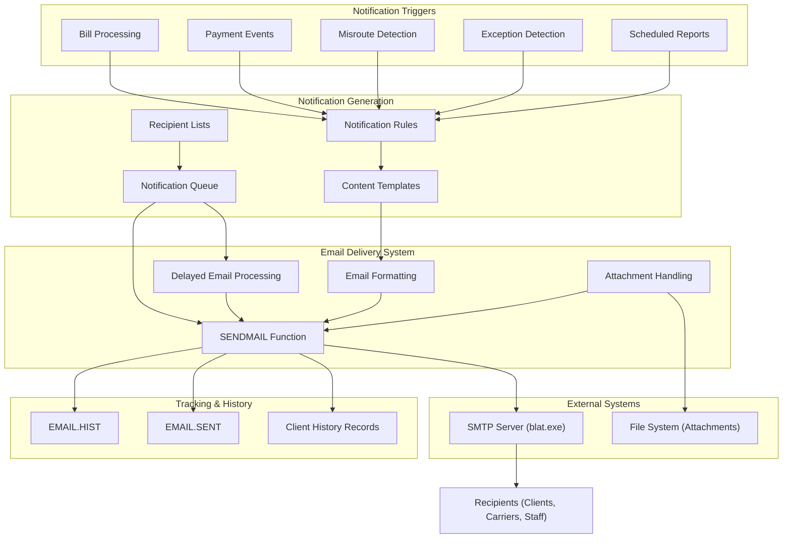
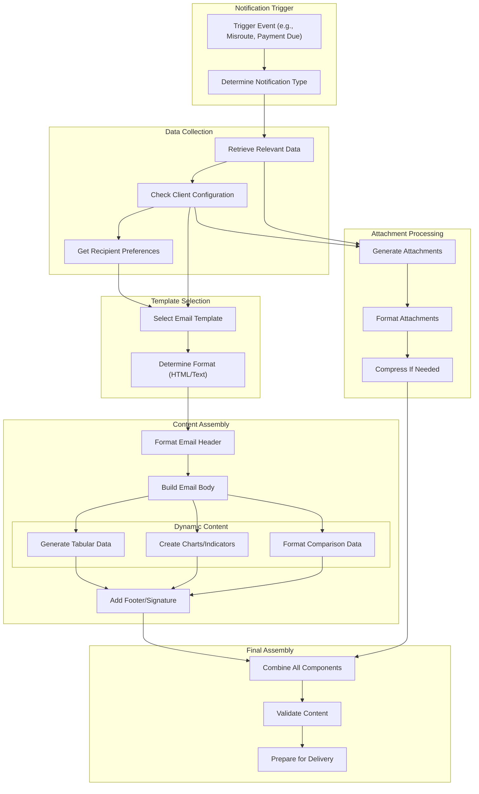
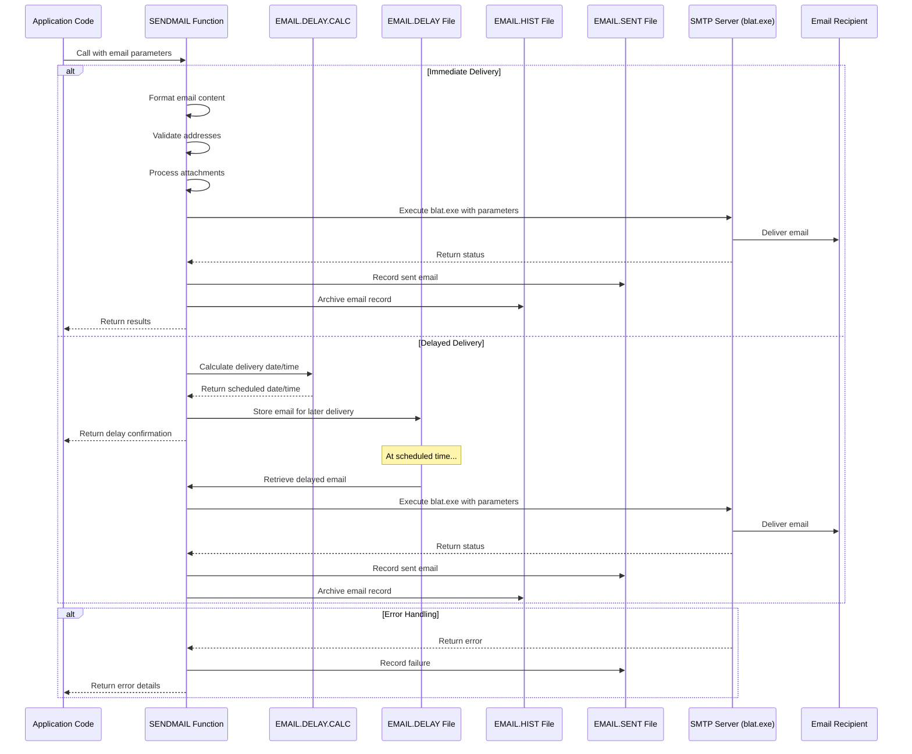
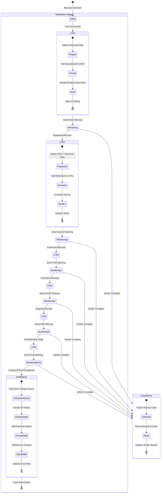

# Automated Email Notifications in AFS Shreveport

## Email Notification Architecture Overview

The AFS Shreveport system implements a comprehensive email notification architecture that serves as a critical communication channel between the freight billing platform and its stakeholders. This architecture enables automated communications for various business processes including payment notifications, misroute alerts, processing exceptions, and client reports. 

The email notification system is built on a modular design that separates notification generation, content formatting, delivery mechanisms, and tracking. At its core, the system uses the SENDMAIL subroutine as the primary interface for email delivery, which connects to an SMTP server (using blat.exe on a DEC Alpha server) to transmit messages. The architecture supports various notification types with different urgency levels, from informational reports to critical alerts requiring immediate action.

The system implements sophisticated features including HTML formatting for tabular data presentation, attachment handling for reports and supporting documents, delayed email delivery based on business or calendar days, and progressive notification workflows that escalate based on recipient responses. Email notifications are deeply integrated with the freight billing workflow, triggering at key points such as bill processing, payment status changes, carrier misrouting, and exception detection.

## Email Notification System Architecture

The architecture diagram illustrates the flow of email notifications through the AFS Shreveport system. The process begins with various triggers that initiate notifications, such as bill processing events, payment status changes, misroute detection, exception identification, and scheduled report generation. These triggers interact with notification rules that determine when and what type of notification should be sent.

Once a notification is triggered, the system retrieves appropriate content templates and recipient information, then formats the email with proper HTML structure, tabular data, and any required attachments. The notification can either be sent immediately through the SENDMAIL function or queued for delayed delivery based on business rules.

The SENDMAIL function serves as the central component for email delivery, interfacing with the SMTP server (implemented via blat.exe) to transmit messages to recipients. The system maintains comprehensive tracking by recording all sent emails in the EMAIL.HIST and EMAIL.SENT files, as well as updating client history records for audit and reference purposes.

This architecture supports various notification types and delivery scenarios while maintaining a consistent approach to email generation, formatting, and delivery across the system.

## Notification Types and Use Cases

The AFS Shreveport system employs a diverse range of notification types to address specific business needs across the freight billing workflow. These notifications serve different purposes and are tailored to various stakeholders:

**Process Alerts**: These notifications inform AFS staff about system processes, errors, or exceptions. Examples include the CK.SQL.UPD script that monitors whether the nightly SQL data push completed successfully, and CHECK.PROCESS.LOG which validates process log integrity. These alerts help operations teams quickly identify and address system issues before they impact clients.

**Payment Notifications**: The system sends various payment-related notifications to both clients and carriers. For clients, programs like PPP.SEND.EMAIL generate notifications about approaching bill due dates, with escalating urgency as due dates approach. For carriers, SAGE.CHECK.CUTBACKS sends detailed notifications about invoices that were paid for less than their billed amount, explaining the reasons for payment reductions.

**Misroute Warnings**: A sophisticated progressive notification system for misrouted shipments is implemented through programs like FB.MR.EMAILS and FB.TEM.EMAILS. These notifications alert vendors when they've shipped using incorrect carriers, with escalating severity from initial warnings to debit memos after multiple violations. The system tracks notification history to determine the appropriate next communication level.

**Client Reports**: Automated report distribution is handled by programs like FB.3.1.NEW, which generates and emails weekly freight bill reports, rejected bills reports, and summary of charges to clients. These reports can be customized by client and delivered in various formats (HTML, Excel, text) based on client preferences.

**Transportation Exception Management (TEM)**: Programs like FB.SEND.TEM.EMAILS generate notifications about excessive freight charges when unapproved carriers are used or when higher-priced approved carriers are chosen over lower-priced options. These notifications include detailed comparisons of carrier costs and service advantages.

**Operational Monitoring**: Utilities like COUNT.OCR.QUEUE.RPT and MONITOR.EXCHANGE.RATES generate reports on system operations (OCR queue counts, currency exchange rates) and distribute them to appropriate staff for review and action.

**Carrier Communications**: FB.2.1.CARRIER.LETTER sends notifications to carriers about incorrect billing addresses, redirecting them to AFS Logistics for proper billing. EDI.REJECT.NOTIFY informs carriers about rejected EDI transactions that need resolution.

Each notification type is designed with specific content, formatting, and delivery rules to effectively communicate the necessary information to the appropriate audience and drive the required actions.

## Email Generation and Formatting

The AFS Shreveport system employs sophisticated techniques for constructing email content that is both informative and visually effective. The email generation process varies based on notification type but follows consistent patterns for creating structured, readable communications.

For HTML-formatted emails, the system uses a combination of HTML tags and CSS styling to create professional-looking messages. Programs like FB.SEND.MISROUTE.EMAILS and FB.SEND.TEM.EMAILS construct detailed HTML tables showing shipment details, carrier comparisons, and cost analyses. These emails use color coding to highlight important information - for example, using red text for excessive charges and green for savings. The HTML construction is typically done by concatenating strings with HTML tags, with careful attention to proper nesting and formatting.

Tabular data presentation is a key feature, particularly for reports and financial notifications. The system formats data into HTML tables with appropriate headers, row styling, and column alignment. For Transportation Exception Management (TEM) emails, tables include multiple columns showing approved versus actual carriers, cost differences, and service day comparisons. The FB.TEM.EMAILS program even implements color-coded service comparison indicators using Unicode characters with HTML styling to visually represent service advantages or disadvantages.

Dynamic content generation is handled based on notification type and recipient preferences. For misroute notifications, the system determines the appropriate content based on the notification stage (first warning, follow-up, or debit memo) and includes different explanatory text and data points accordingly. The SAGE.CHECK.CUTBACKS program generates carrier-specific formatting for different logistics companies, recognizing that different carriers may have different information requirements.

For non-HTML emails, the system uses careful text formatting with proper spacing and line breaks to ensure readability. The SENDMAIL.NEW subroutine supports various formatting options including HTML, MIME, and rich text, allowing the system to select the appropriate format based on the notification requirements.

The system also handles special formatting needs for specific clients. For example, FB.SEND.TEM.EMAILS includes special CSV attachment generation for specific clients (client 5267) instead of the standard HTML format, demonstrating the system's flexibility in accommodating client-specific requirements.

## Email Content Generation Workflow

The diagram illustrates the workflow for generating email content in the AFS Shreveport system. This process begins when a notification is triggered by a business event such as a misrouted shipment, approaching payment due date, or scheduled report generation.

First, the system determines the notification type and retrieves relevant data from various sources. For misroute notifications, this includes shipment details, carrier information, and cost comparisons. For payment notifications, it includes bill details, due dates, and payment amounts. The system also checks client configuration settings to determine notification preferences and retrieves recipient information.

Based on the notification type and client preferences, the system selects an appropriate email template and determines the format (HTML or plain text). HTML is typically used for complex notifications with tabular data, while plain text may be used for simpler alerts.

The content assembly phase involves formatting the email header with appropriate subject lines and then building the body content. For complex notifications, this includes generating tabular data (such as shipment details or payment information), creating visual indicators (like service day advantage indicators in misroute emails), and formatting comparison data (such as approved versus actual carrier costs). The system then adds standard footers or signatures as needed.

If attachments are required, the system generates them in appropriate formats (Excel, PDF, CSV) based on client preferences and the notification type. For large attachments, the system may compress them into ZIP files to accommodate email size limitations.

Finally, all components are combined into a complete email structure, validated for correctness, and prepared for delivery through the SENDMAIL function. This structured approach ensures consistent, well-formatted emails that effectively communicate the necessary information to recipients.

## Recipient Management and Distribution

The AFS Shreveport system implements a sophisticated approach to managing email recipients and distribution lists. This functionality is critical for ensuring notifications reach the appropriate stakeholders while maintaining proper email etiquette and security.

The system handles TO, CC, and BCC recipients separately, with distinct business rules for each category. Primary recipients are placed in the TO field, while stakeholders who need to be informed but aren't primary action-takers are added to CC. The BCC field is typically used for internal AFS staff who need visibility without exposing their addresses to external recipients. Programs like FB.EMAIL and FB.EMAIL.NEW provide user interfaces for managing these recipient types, with validation to ensure at least one TO address exists before CC/BCC addresses.

Address validation is implemented throughout the system to ensure email deliverability. The FB.EMAIL subroutine validates that email addresses contain the @ symbol and proper domain structure. For convenience, the system implements domain defaulting to save keystrokes - if a user enters an address without a domain, the system automatically appends @AFS.NET (as seen in SENDMAIL.NEW), or reuses the domain from previously entered addresses.

Distribution list management is handled through various mechanisms. Simple hardcoded lists appear in utility scripts like BBSEND and GRB, which map shorthand recipient codes (like 'WCE', 'CAROL', 'DAVID') to actual email addresses. More sophisticated approaches are used in client-facing notifications, where recipient lists are stored in client records and can be managed through dedicated interfaces like FB.1.1.EMAIL.MISR.

The system also supports role-based distribution, where notifications are sent to functional roles rather than specific individuals. For example, FB.MR.EMAILS consolidates notifications by vendor and distributes addresses to TO, CC, and BCC fields based on role relationships. This ensures business continuity when staff changes occur.

For client communications, the system stores email preferences in client records, including separate settings for different notification types. The FB.1.1.ACCT.MGR program allows configuration of email notification settings for misroutes and UPS PDF delivery, with client-specific preferences.

The system also implements special handling for SMS notifications through email-to-text gateways. Scripts like BBSEND and GRB include SMS gateway addresses (like 7132998998@txt.att.net) for sending text alerts to mobile phones, providing an additional notification channel for urgent alerts.

## Attachment Handling and File Processing

The AFS Shreveport system implements robust capabilities for processing and attaching files to email notifications, supporting various file types and handling scenarios across different business processes.

PDF extraction and handling is a key feature, particularly for invoice and billing documents. The UNZIPTEST series of scripts demonstrates how the system extracts PDF files from ZIP archives containing e-bill invoices. These scripts use the 7-Zip command-line tool to extract files, then select the appropriate PDFs based on account and date criteria before attaching them to emails. The EMAIL.UPS.PDFS program handles the automated distribution of UPS e-billing documents to clients, processing client preferences for receiving billing information in PDF format.

Excel report generation is extensively used for data-rich notifications. Programs like FB.3.1.NEW generate Excel-compatible reports for freight billing information, creating structured spreadsheets with proper headers, data formatting, and calculations. The EDI.REJECT.NOTIFY program creates Excel reports containing details about rejected EDI bills, formatting rejection reasons into appropriate columns. These Excel files are then attached to emails for distribution to carriers and clients.

For large attachments, the system implements ZIP file handling to manage email size limitations. The RESEND.EMAIL utility uses 7-Zip for compressing attachments when client configuration requires it, and implements special handling for clients with email server limitations by splitting large attachments into multiple emails. This ensures reliable delivery even when dealing with substantial data volumes.

The system also handles specialized file formats for different business needs. The TAB.LIQUIDE program creates customized UPS reports in tab-delimited format for Air Liquide, while FB.UPS.REMITTANCE generates tab-delimited remittance files with invoice numbers and amounts for UPS. The FB.IMPORT.DIV.LA program processes tab-delimited text files containing purchase order division data.

File path management is carefully implemented to ensure attachments are properly located and accessible. Most programs use standardized directory structures like "e:\Ardent\public\billdata\E-BILL\TEMP" for temporary files and "PUBLIC/EMAILDATA" for files intended for email distribution. The system handles file naming conventions to ensure uniqueness and traceability, often incorporating client IDs, dates, and transaction identifiers into filenames.

The attachment process itself is handled through the SENDMAIL function, which accepts file paths in specific array positions (typically position 11) to include attachments with emails. The function supports multiple attachments per email and handles the MIME encoding necessary for proper email delivery.

## Email Delivery Process

This sequence diagram illustrates the email delivery process in the AFS Shreveport system, from initial call to final delivery. The process begins when application code calls the SENDMAIL function with email parameters including recipients, subject, message body, and optional attachments.

For immediate delivery, the SENDMAIL function first formats the email content, validates email addresses (adding @AFS.NET domain if missing), and processes any attachments. It then executes the blat.exe command-line tool with appropriate parameters to send the email via SMTP. After delivery, the function records the sent email in both the EMAIL.SENT file (for operational tracking) and EMAIL.HIST file (for archival purposes) before returning results to the calling application.

For delayed delivery, the process follows a different path. The SENDMAIL function calls EMAIL.DELAY.CALC to determine when the email should be delivered based on parameters like calendar mode (business or calendar days), delay basis (today, check date, specific weekday), and additional delay days. The email is then stored in the EMAIL.DELAY file with the scheduled delivery time. At the appointed time, the system retrieves the delayed email and processes it through the normal delivery path, including recording in the EMAIL.SENT and EMAIL.HIST files.

Error handling is implemented throughout the process. If the SMTP server returns an error, the SENDMAIL function records the failure in the EMAIL.SENT file and returns detailed error information to the calling application. This allows the application to implement appropriate error handling, such as retrying the delivery or notifying administrators.

This comprehensive process ensures reliable email delivery while supporting both immediate and scheduled notifications, with proper tracking and error handling throughout the workflow.

## Delayed Email Processing

The AFS Shreveport system implements a sophisticated delayed email processing capability that allows notifications to be scheduled for future delivery based on various timing parameters. This functionality is particularly valuable for payment-related communications, remittance information, and other time-sensitive notifications that need to be delivered at specific points in business processes.

The delayed email system is primarily implemented through the EMAIL.DELAY.CALC subroutine, which determines when to schedule emails based on specified parameters. This subroutine accepts multiple configuration options including calendar mode (CALENDAR/BUSINESS), delay basis (TODAY, TOMORROW, specific weekdays), additional delay days, and target time. When operating in BUSINESS mode, the calculation accounts for weekends and holidays, ensuring emails are only delivered on business days.

For payment-related notifications, the FB.UPS.REMITTANCE program demonstrates how delayed emails are used to coordinate remittance information with check dates. The program implements conditional email delay functionality based on check dates, ensuring that electronic remittance information is delivered to UPS at the appropriate time relative to when payments are issued. This synchronization is critical for proper payment reconciliation.

The system uses a special ID format for delayed emails, incorporating a pipe character for counter appending. This allows multiple delayed emails to be scheduled with related base IDs but distinct counter values, as seen in the CANCEL.DELAYED.EMAILS subroutine. When emails need to be cancelled (for example, when checks are voided), the system can process all related delayed emails by incrementing a counter appended to the base ID.

The PPP.SEND.EMAIL series of programs showcases how delayed emails are used in a multi-stage notification system for approaching payment due dates. These programs send different notifications at 10, 9, 8, 7, 6, and 5 days before due dates, with escalating urgency as the deadline approaches. For bills with due dates less than 5 days away, the system creates payment fees and marks bills as paid when pre-funding is required.

The EMAIL.DELAY.PARMS program provides an interface for authorized users to configure system-wide parameters for delaying emails. It manages settings for calendar mode, delay basis, number of days to delay, and time of day to send emails. The program includes safeguards to prevent conflicts with check printing processes and notifies relevant stakeholders when parameters are modified.

Delayed emails are stored in the EMAIL.DELAY file until their scheduled delivery time, at which point they are processed through the normal email delivery path. The system maintains a history of delayed emails in the EMAIL.DELAY.HIST file, allowing for audit and tracking of scheduled communications.

## Progressive Notification Workflow

The AFS Shreveport system implements a sophisticated progressive notification workflow, particularly for handling misrouted shipments and transportation exceptions. This workflow automatically escalates communications based on recipient responses (or lack thereof), increasing urgency and consequences with each stage to drive appropriate action.

The progressive notification system is most evident in the misroute handling process implemented by programs like FB.MR.EMAILS, FB.MR.LTRS, and FB.TEM.EMAILS. These programs identify shipments where vendors have used unauthorized carriers, resulting in excess freight charges, and implement a multi-stage notification approach to drive compliance with routing instructions.

The workflow begins with an initial notification (typically labeled LTR1) that informs vendors about the misrouting issue, explains the approved carrier requirements, and details the excessive charges incurred. This first communication is educational in nature, designed to inform vendors of the routing requirements and request compliance in future shipments.

If the vendor continues to misroute shipments, the system progresses to follow-up notifications (LTR2 through LTR6), each with increasing urgency and more explicit consequences. These follow-up communications reference previous notifications and include historical misroute information as evidence of repeated violations. The FB.MR.EMAILS program builds historical misroute information arrays for inclusion in notification emails, showing patterns of non-compliance.

After multiple warnings without correction (typically after the sixth notification), the system escalates to debit memo notifications (DM). These communications inform vendors that the excessive freight charges will be deducted from future payments. The FB.TEM.EMAILS program implements logic for creating debit memos when vendors fail to comply with routing instructions, calculating appropriate debit amounts based on client configuration settings.

The system tracks notification history in vendor/customer records to maintain a complete record of communications and determine the appropriate next step in the escalation process. The FB.MR.EMAILS program updates vendor/customer records with notification details, including dates, letter types, and response information. This history is used to determine which notification type should be sent next, based on previous communications and client configuration.

Client configuration plays an important role in this workflow, as different clients may have different thresholds and policies for escalation. The system reads client settings to determine how many warnings should be issued before escalating to debit memos, what minimum charge thresholds should trigger notifications, and which stakeholders should be included in communications at each stage.

This progressive approach ensures that vendors receive appropriate warnings and opportunities to correct behavior before financial consequences are imposed, while maintaining a documented trail of communications for compliance and audit purposes.

## Progressive Notification State Machine

This state diagram illustrates the progressive notification state machine implemented in the AFS Shreveport system for handling misrouted shipments. The process begins when a misroute is detected, triggering the initial notification stage.

The notification process follows a structured progression through multiple stages, with each stage representing an escalating level of communication. The system starts with an initial warning letter (LTR1) that educates the vendor about routing requirements and excessive charges. After sending this notification, the system enters a monitoring state to track vendor compliance.

If the vendor continues to misroute shipments, the system progresses through subsequent warning stages (LTR2 through LTR6), each with increasing urgency and more explicit consequences. Each notification references previous communications and includes historical misroute information to demonstrate the pattern of non-compliance.

After the final warning stage (LTR6), continued non-compliance triggers the debit memo stage, where financial consequences are imposed. The debit memo process includes calculating the charge amount based on excessive freight costs, preparing comprehensive documentation including all previous warnings, and distributing the information to finance departments for processing.

At any stage in the process, if the vendor begins using proper routing, the system transitions to the compliance state, where the warning counter is reset and the vendor record is updated to reflect compliance. This allows the system to recognize and reward corrected behavior.

Each notification stage involves several substates, including preparing the notification content, formatting it appropriately for the stage, sending it to the relevant recipients, and updating history records to track the communication. The system maintains this state information in vendor/customer records, allowing it to determine the appropriate next action based on the current state and vendor behavior.

This state machine approach ensures consistent, escalating responses to non-compliance while maintaining complete visibility into the notification history and providing opportunities for vendors to correct their behavior at each stage.

## Email Tracking and History Management

The AFS Shreveport system implements comprehensive email tracking and history management capabilities to maintain records of sent notifications, track email status, and provide audit capabilities for compliance and troubleshooting. This functionality is critical for ensuring accountability, enabling follow-up actions, and supporting business process continuity.

At the core of the email tracking system are two primary files: EMAIL.SENT and EMAIL.HIST. The SENDMAIL.NEW subroutine records all sent emails in these files, creating detailed records that include recipient information, subject lines, message content, attachment details, and delivery timestamps. The EMAIL.SENT file maintains records of recent emails for operational tracking, while EMAIL.HIST serves as a long-term archive for compliance and audit purposes.

For specialized notification types, the system maintains additional history records in process-specific files. The FB.MISROUTES.HIST file stores history of misroute notifications, while the FB.TEM.EMAIL.HIST file tracks Transportation Exception Management emails. These specialized history files include not only the email content but also related business data such as shipment details, carrier information, and cost comparisons, providing complete context for each notification.

The system also integrates email history with client and vendor records to maintain a comprehensive communication timeline. The FB.MR.EMAILS program updates vendor/customer records with notification details, including dates, letter types, and response information. This integration allows the system to track the progression of communications with each vendor or client, supporting the progressive notification workflow.

For delayed emails, the system maintains records in the EMAIL.DELAY file for pending notifications and the EMAIL.DELAY.HIST file for completed or cancelled delayed emails. The CANCEL.DELAYED.EMAILS subroutine demonstrates how these records are managed when emails need to be cancelled, moving records from EMAIL.DELAY to EMAIL.DELAY.HIST and deleting associated attachments from EMAILDATA.DELAY.

Email status tracking is implemented through result codes returned by the SENDMAIL function. These codes indicate whether an email was successfully sent ('OK'), encountered an error ('ERROR'), or was delayed for future delivery ('DELAY'). Programs like CANCEL.DELAYED.EMAILS use more detailed status codes such as 'CAN' (email cancelled), 'SENT' (email already sent), or 'NOF' (email not found) to provide precise feedback about email processing operations.

For troubleshooting purposes, the system includes utilities like RESEND.EMAIL that can retrieve and resend previously generated reports. This utility searches the EMAILDATA directory for matching files, displays them in a list, and allows users to select which reports to include as attachments in a new email. Similarly, GBRESEND.EMAIL is specialized for resending failed UPS eBill conversion emails, extracting recipient addresses, subject lines, message content, and attachments from previous attempts.

The comprehensive email tracking and history management capabilities ensure that the AFS Shreveport system maintains complete records of all notifications, supporting compliance requirements, enabling effective follow-up, and providing the necessary audit trail for business operations.

[Generated by the Sage AI expert workbench: 2025-05-28 08:06:26  https://sage-tech.ai/workbench]: #