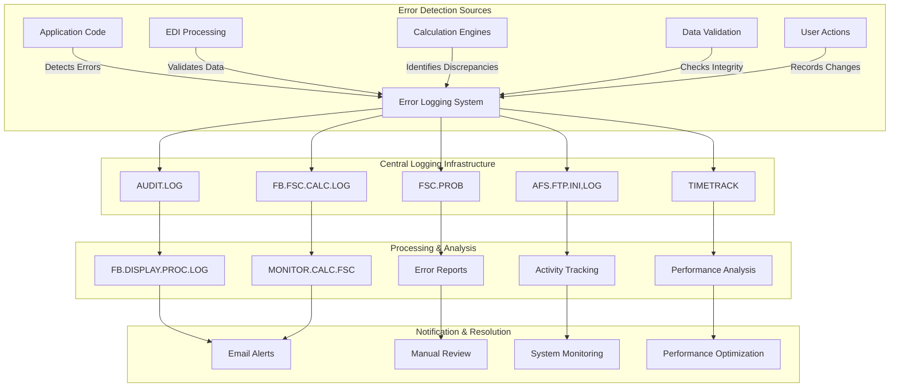
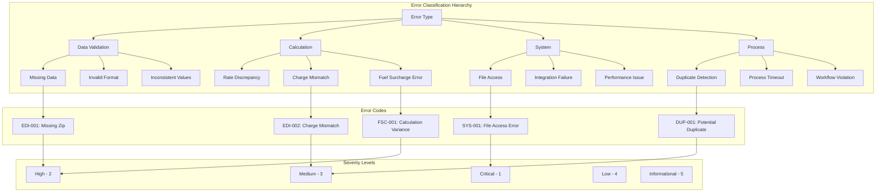
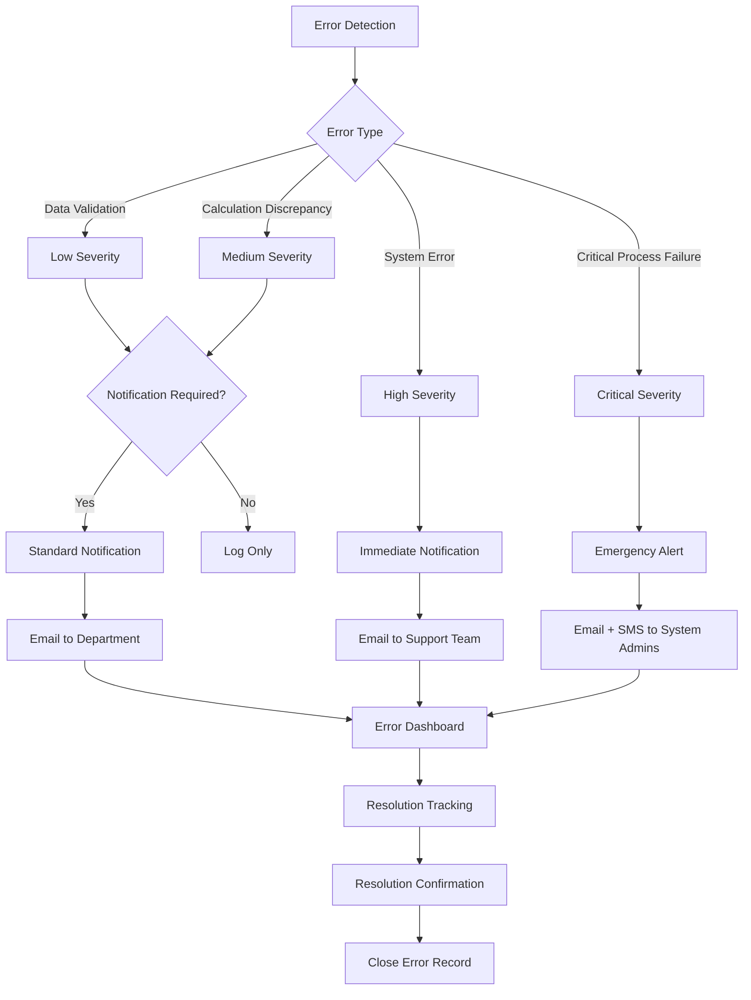
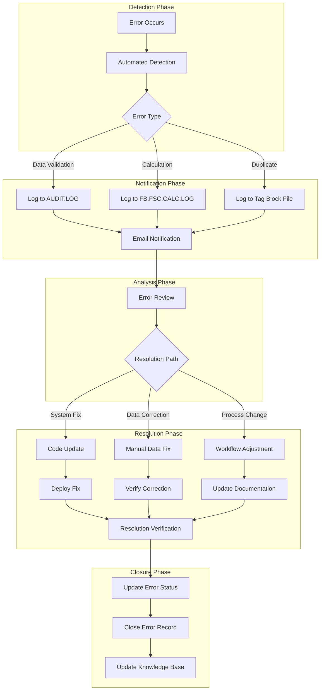

# Automated Error Logging in AFS Shreveport

## Introduction to Automated Error Logging in AFS Shreveport

The AFS Shreveport system implements a comprehensive automated error logging infrastructure that serves as the backbone for system reliability and data integrity across the freight billing platform. This sophisticated logging system captures a wide range of events - from simple execution tracking to complex validation failures and data discrepancies. By automatically detecting, categorizing, and recording errors, the system enables proactive monitoring, facilitates troubleshooting, and maintains a detailed audit trail of system activities. The logging architecture spans multiple layers, from low-level file operations to high-level business rule validations, ensuring that errors are captured regardless of where they occur in the processing pipeline. This robust error logging framework is particularly critical in the freight billing domain, where data accuracy directly impacts financial outcomes for both AFS Logistics and its clients. The system not only identifies errors but also provides contextual information about their origin, severity, and potential impact, enabling efficient resolution and continuous improvement of the platform.

## Error Logging Architecture Overview

The error logging architecture in AFS Shreveport follows a multi-layered approach to ensure comprehensive capture and processing of system errors. At the top level, various error detection sources feed into the central logging infrastructure. Application code, EDI processing modules, calculation engines, data validation routines, and user actions all generate error events that are captured by specialized logging components.

The central logging infrastructure consists of several specialized log files, each serving a specific purpose. AUDIT.LOG stores user-initiated changes, FB.FSC.CALC.LOG captures fuel surcharge calculation discrepancies, FSC.PROB records fuel surcharge setup issues, AFS.FTP.INI,LOG tracks file transfer activities, and TIMETRACK monitors execution performance. These logs form the core repository of system errors and anomalies.

Once errors are logged, various processing and analysis tools come into play. FB.DISPLAY.PROC.LOG provides a user interface to view and analyze log entries, while MONITOR.CALC.FSC specifically analyzes fuel surcharge calculation discrepancies. Other components generate error reports, track activities, and analyze performance metrics from the logged data.

Finally, the notification and resolution layer ensures that appropriate personnel are alerted to critical issues through email alerts, while providing tools for manual review, system monitoring, and performance optimization. This comprehensive architecture ensures that errors are not only captured but also effectively addressed throughout the system lifecycle.

## Centralized Logging Infrastructure

The AFS Shreveport system employs a sophisticated centralized logging infrastructure that consists of several specialized log files, each designed to capture specific types of error and change data. At the core of this infrastructure is the AUDIT.LOG file, which serves as a comprehensive audit trail for data modifications throughout the system. The UPD.AUD.LOG subroutine writes to this file, capturing who made changes, what was changed, and when the changes occurred. It maintains a configurable history (defaulting to 50 entries) and handles null values by converting them to 'NULL' to maintain multivalue synchronization.

The FB.FSC.CALC.LOG file, managed by the MONITOR.CALC.FSC subroutine, specifically tracks discrepancies between old and new fuel surcharge calculation methods. This specialized log is crucial for ensuring consistency in financial calculations and identifying potential issues in the calculation logic. When differences are detected, detailed information including calculation percentages, formulas used, and fuel prices are recorded for later analysis.

The FSC.PROB file, updated by the NFSC.PROBLEMS subroutine, logs fuel surcharge setup issues using a composite key that combines carrier ID, bill date, and quarter-hour time. This approach allows for efficient retrieval of related problems and facilitates trend analysis. Additionally, the AFS.FTP.INI,LOG file, maintained by UPDATE.BOL.FTP.LOG, records information about Bill of Lading (BOL) file imports via FTP, including start/end times, user information, and import details.

The TIMETRACK file, updated by the PROGTRACK subroutine, monitors and records execution times of processes, providing valuable performance metrics. This data helps identify bottlenecks and optimize system performance. Together, these logging components form a comprehensive infrastructure that not only captures errors but also provides the context necessary for effective troubleshooting and system improvement.

## Error Detection Mechanisms

The AFS Shreveport system implements a multi-faceted approach to error detection that operates across various system components. At the data validation level, the system employs rigorous checks to ensure data integrity. For instance, the REPRINT.EDI.ERROR.REPORT script systematically identifies errors in EDI billing data by checking for missing zip codes, charge mismatches, and specific client/carrier combinations requiring attention. It implements a comprehensive error detection system with numeric codes for different validation failures, allowing for precise categorization of issues.

Comparison operations form another critical error detection mechanism. The MONITOR.CALC.FSC subroutine exemplifies this approach by comparing results between old and new fuel surcharge calculation methods. When differences exceed acceptable thresholds, the system logs these discrepancies to FB.FSC.CALC.LOG with detailed information about the calculation parameters, enabling analysts to understand the root cause of the variation.

The FB.TAGGING subroutine demonstrates threshold-based detection by preventing duplicate billing for transportation loads. It compares incoming freight bills against previously tagged loads using a 10% variance threshold for matching charges. When potential matches are found within this threshold, the system flags them for review or automatically blocks them in the case of EDI transactions.

Process timing monitoring, implemented through UPD.TIMING.BENCH and PROGTRACK, detects performance anomalies by tracking execution times. When processes exceed expected durations, this may indicate underlying issues that require investigation. Similarly, UPD.RATE.ACTIVITY monitors rating requests by hour, categorizing activities into time ranges and incrementing counters for each range, which helps identify unusual patterns in system usage.

These diverse error detection mechanisms work in concert to create a comprehensive monitoring system that can identify issues ranging from data inconsistencies to performance problems, ensuring the overall reliability and accuracy of the AFS Shreveport platform.

## Error Classification System

The AFS Shreveport system employs a sophisticated error classification system that categorizes errors based on type, severity, and source. This hierarchical approach enables efficient error management and prioritization.

At the top level, errors are classified into major types: Data Validation errors occur when input data fails to meet required standards; Calculation errors indicate discrepancies in financial or operational computations; System errors reflect infrastructure or technical issues; and Process errors highlight workflow or business rule violations.

Each error type is further subdivided into specific categories. For example, Data Validation errors include Missing Data (such as absent zip codes), Invalid Format (like malformed identifiers), and Inconsistent Values (where related data points contradict each other). Calculation errors encompass Rate Discrepancies, Charge Mismatches, and Fuel Surcharge Errors, which are particularly critical in the freight billing domain.

The system assigns severity levels from 1 (Critical) to 5 (Informational), allowing operations teams to prioritize their response. Critical errors that impact financial calculations or system availability receive immediate attention, while informational messages might simply be logged for trend analysis.

Error codes provide a standardized reference system, combining the error category with a numeric identifier. For instance, "EDI-001" indicates a specific EDI processing error, while "FSC-001" refers to a particular fuel surcharge calculation issue. These codes are accompanied by descriptive text that provides context and facilitates troubleshooting.

This comprehensive classification system ensures that errors are not only detected but properly categorized, prioritized, and addressed according to their business impact, supporting the overall reliability and accuracy of the AFS Shreveport platform.

## Change Tracking and Audit Trails

The AFS Shreveport system implements a robust change tracking and audit trail mechanism through the UPD.AUD.LOG and CMP.PRO.RECS subroutines, creating detailed records of data modifications throughout the system. UPD.AUD.LOG serves as the core audit logging component, systematically recording who made changes, what was changed, and when the changes occurred. For each modification, it captures the process date, system time, user information, description of the change, new and old data values, record ID, source process, and source file. This comprehensive approach ensures that every data alteration is traceable to a specific user and point in time.

The system maintains audit history with configurable retention limits (defaulting to 50 entries per record) to balance comprehensive tracking with system performance. A particularly noteworthy feature is its handling of null values by converting them to 'NULL' to maintain multivalue synchronization, ensuring that the audit trail remains consistent and analyzable.

CMP.PRO.RECS complements this functionality by specifically focusing on comparing old and new versions of PRO (Bill) records to identify changes. It reads attribute descriptions from the FB.BILLS.HIST dictionary and builds a detailed change log that highlights modifications between record versions. The subroutine intelligently ignores specific attributes (55, 84, 85, 86, 91) that are deemed non-significant for audit purposes, focusing attention on meaningful changes.

An interesting aspect of the audit system is its ability to distinguish between different types of access. For instance, if CMP.PRO.RECS determines that no actual changes were made to a record, it automatically changes the access reason from 'CNG' (change) to 'INQ' (inquiry), ensuring accurate categorization of user interactions with the data. The audit logs can optionally be written to user-specific BILLDATA records, creating personalized audit trails that facilitate user accountability and streamline troubleshooting processes.

This comprehensive change tracking system provides the foundation for regulatory compliance, security monitoring, and system integrity verification across the AFS Shreveport platform.

## Duplicate Detection and Prevention

The FB.TAGGING subroutine implements a sophisticated duplicate detection and prevention mechanism that safeguards the AFS Shreveport system against redundant billing for transportation loads. This critical functionality operates by comparing incoming freight bills against previously tagged loads using a combination of shipment attributes and configurable variance thresholds.

When processing a new freight bill, FB.TAGGING extracts key shipment details including client/carrier information, origin/destination locations, and charges. It then creates a unique tag ID based on normalized city and state information, which serves as the primary key for comparison. The system employs a 10% variance threshold (defined by TAG.CHG.PCT) for matching charges, recognizing that legitimate duplicate shipments may have minor variations in their financial values. Additionally, it maintains a 365-day lifespan for tagged loads, balancing comprehensive duplicate detection with system performance considerations.

For manual processing scenarios, FB.TAGGING presents users with an interactive interface displaying potential match details and prompting for confirmation. This human-in-the-loop approach allows for nuanced decision-making in ambiguous cases. The system tracks user decisions about matches using three separate flags (YES/NO/MAYBE), building an institutional knowledge base about duplicate handling preferences.

EDI transactions receive special treatment due to their automated nature. When potential duplicates are detected in EDI bills, the system automatically blocks the suspected duplicates and triggers email notifications to appropriate personnel. This proactive approach prevents erroneous automated processing while ensuring that exceptions receive human attention.

The duplicate detection system maintains records of processed bills in a tag block file, creating a comprehensive database of shipment fingerprints that grows more effective over time. By implementing this multi-faceted approach to duplicate detection and prevention, AFS Shreveport ensures billing accuracy while minimizing the need for costly correction processes after bills have been processed.

## Notification Workflow

The notification workflow in AFS Shreveport's error logging system follows a sophisticated path from error detection to resolution confirmation. When an error is detected, the system first categorizes it by type and assigns an appropriate severity level. Data validation issues and minor discrepancies typically receive lower severity ratings, while calculation errors and system failures trigger higher severity classifications.

For low and medium severity errors, the system evaluates whether notification is required based on configurable rules. Some errors may simply be logged without notification if they don't require immediate attention. Higher severity errors automatically trigger notifications without this evaluation step.

The notification mechanism adapts based on severity. Standard notifications for routine issues are sent via email to the appropriate department. More urgent notifications for support teams include additional context and may be flagged as high priority. Critical alerts employ multiple channels, including both email and SMS, to ensure system administrators receive immediate notification regardless of their current activity.

Several components in the codebase support this notification workflow. The MONITOR.CALC.FSC subroutine includes email notification functionality that alerts specified addresses when discrepancies are detected between old and new fuel surcharge calculations. Similarly, FB.TAGGING implements email notifications for potential duplicate detection, especially important for EDI transactions that would otherwise be processed automatically.

All notifications feed into a centralized error dashboard where support personnel can track issues through to resolution. The workflow includes explicit steps for resolution tracking and confirmation, ensuring that every error receives appropriate attention and is formally closed once addressed.

This comprehensive notification workflow ensures that the right people receive timely information about system errors, enabling efficient resolution and minimizing impact on business operations.

## Performance Monitoring Integration

The AFS Shreveport system seamlessly integrates performance monitoring with error logging, creating a comprehensive approach to system health tracking. This integration provides crucial context for error analysis by correlating performance metrics with error occurrences, enabling more effective troubleshooting and system optimization.

At the core of this integration are the UPD.TIMING.BENCH and PROGTRACK subroutines, which capture detailed execution timing metrics across the platform. UPD.TIMING.BENCH records program execution benchmarks including program name, group (client/bank), start and end times, user information, and the number of records processed. This data is stored in the TIMING.BENCH file with composite keys for efficient retrieval and analysis. Similarly, PROGTRACK monitors when programs start and end, along with associated user information and optional counter values, storing this data in the TIMETRACK file.

These performance metrics enhance error logging in several ways. First, they provide temporal context for error events, helping analysts determine whether performance degradation preceded or coincided with specific errors. For instance, if a calculation error occurs during a period of unusually high system load, this correlation may point to resource contention as a contributing factor.

The UPD.RATE.ACTIVITY subroutine further extends this integration by tracking rating requests by hour, categorizing activities into time ranges, and incrementing counters for each range. This time-based analysis helps identify patterns in system usage and potential performance bottlenecks that might lead to errors.

Performance monitoring also includes conditional tracking based on system switches, allowing administrators to intensify monitoring during troubleshooting periods. The TURN.ON.SERVERDEBUG utility exemplifies this approach by enabling administrators to toggle Universe log files for server debugging, directing detailed logs to e$\temp when enabled.

By combining performance metrics with error data, AFS Shreveport creates a holistic view of system behavior that facilitates root cause analysis and informs system optimization efforts. This integrated approach ensures that error resolution addresses not just the symptoms but the underlying performance factors that may contribute to system issues.

## Reporting and Analysis Tools

The AFS Shreveport system provides a comprehensive suite of reporting and analysis tools that transform raw error log data into actionable insights. These tools enable administrators and analysts to identify patterns, prioritize issues, and drive system improvements based on empirical data.

FB.DISPLAY.PROC.LOG serves as a primary interface for retrieving and displaying detailed logging information for freight billing processes. This subroutine reads header and detail records from log files and presents formatted information about program execution, including start/end times, elapsed processing time, and process details. A notable feature is its ability to display log entries in reverse chronological order (newest first), enhancing user experience by presenting the most recent information prominently. The subroutine connects to the CLIENTS file to retrieve client names associated with log entries, providing business context alongside technical details.

REPRINT.EDI.ERROR.REPORT generates comprehensive reports to identify errors in EDI billing data. It processes historical EDI bill records for specified date ranges, checking for various error conditions such as missing zip codes, charge mismatches, and specific client/carrier combinations. The script produces three distinct Excel reports: a detailed listing of all bills, an error report highlighting specific issues, and a summary report aggregating data by client and carrier. This multi-dimensional reporting approach allows analysts to examine errors at various levels of granularity.

The reporting tools implement sophisticated data organization techniques, including hierarchical structures for client/carrier relationships and numeric coding systems for error categorization. For instance, REPRINT.EDI.ERROR.REPORT uses a complex nested data structure for report generation with client/carrier hierarchies, enabling drill-down analysis from high-level summaries to specific error instances.

These tools also incorporate statistical analysis capabilities, calculating metrics such as error rates, processing times, and financial impacts. By quantifying the operational and financial implications of system errors, they help prioritize remediation efforts and measure the effectiveness of system improvements over time.

Together, these reporting and analysis tools transform error logging from a passive record-keeping function into a proactive system management capability, enabling continuous improvement of the AFS Shreveport platform.

## Error Resolution Process

The error resolution process in AFS Shreveport follows a structured workflow from detection through closure, ensuring that errors are systematically addressed and knowledge is retained for future improvement.

The process begins in the Detection Phase when an error occurs and is captured by the automated detection systems. Based on the error type, the system routes the information to the appropriate logging mechanism - data validation errors to AUDIT.LOG, calculation discrepancies to FB.FSC.CALC.LOG, or potential duplicates to the Tag Block File.

In the Notification Phase, the system generates appropriate alerts based on error severity and type. Email notifications are sent to relevant personnel, with critical errors triggering immediate alerts. For example, the MONITOR.CALC.FSC subroutine sends detailed notifications when fuel surcharge calculation discrepancies are detected, while FB.TAGGING alerts staff about potential duplicate bills.

During the Analysis Phase, support staff review the error details using tools like FB.DISPLAY.PROC.LOG, which presents information about program execution including timing and process details. Based on this analysis, they determine the appropriate resolution path - whether a system fix, data correction, or process change is required.

The Resolution Phase involves implementing the chosen solution. System fixes require code updates and deployment, data corrections involve manual intervention with subsequent verification, and process changes necessitate workflow adjustments and documentation updates. Each path converges at resolution verification, where the fix is tested to ensure it properly addresses the original error.

Finally, the Closure Phase involves updating the error status, closing the error record, and contributing to the knowledge base for future reference. This systematic approach ensures that errors are not only resolved but also serve as learning opportunities for system improvement.

Throughout this process, the status of the error transitions through various states - from "New" through "In Progress" and "Resolved" to "Closed" - providing visibility into the resolution lifecycle and accountability for timely error handling.

## Future Enhancements and Recommendations

The current error logging system in AFS Shreveport provides a solid foundation for error detection, notification, and resolution. However, several strategic enhancements could significantly improve its effectiveness and value to the organization.

A primary recommendation is to implement better integration between the various logging components. Currently, different types of errors are logged to separate files (AUDIT.LOG, FB.FSC.CALC.LOG, FSC.PROB, etc.), making it challenging to obtain a holistic view of system health. Developing a centralized logging architecture that aggregates data from these disparate sources would enable more comprehensive analysis and correlation of errors across system components. This could be achieved through a modern log aggregation platform that preserves the specialized nature of individual logs while providing unified search and analysis capabilities.

Advanced analytics represent another significant opportunity for enhancement. The current system primarily focuses on capturing and reporting errors, but lacks sophisticated analytical capabilities to identify patterns and predict potential issues. Implementing machine learning algorithms could enable anomaly detection, trend analysis, and predictive modeling. For example, by analyzing historical error patterns, the system could identify conditions that frequently precede specific types of errors, allowing preemptive intervention before problems occur.

The notification system could be enhanced with more granular configuration options and dynamic routing based on error context. Rather than using hardcoded email addresses (as seen in several components), a rule-based notification engine could direct alerts to the most appropriate personnel based on error type, severity, affected client, and time of day. Integration with modern communication platforms beyond email would also improve response times for critical issues.

Real-time monitoring dashboards would provide greater visibility into system health and error status. These dashboards could display key metrics such as error rates, resolution times, and recurring issues, helping management prioritize improvement efforts and measure the effectiveness of system enhancements over time.

Finally, implementing a more structured knowledge management system around error resolution would accelerate troubleshooting and reduce mean time to repair. By systematically capturing the diagnosis and resolution steps for each error type, the organization could build a valuable knowledge base that improves over time and facilitates knowledge transfer between team members.

These enhancements would transform the error logging system from a primarily reactive tool to a proactive asset that contributes to continuous system improvement and operational excellence.

[Generated by the Sage AI expert workbench: 2025-05-28 08:06:29  https://sage-tech.ai/workbench]: #