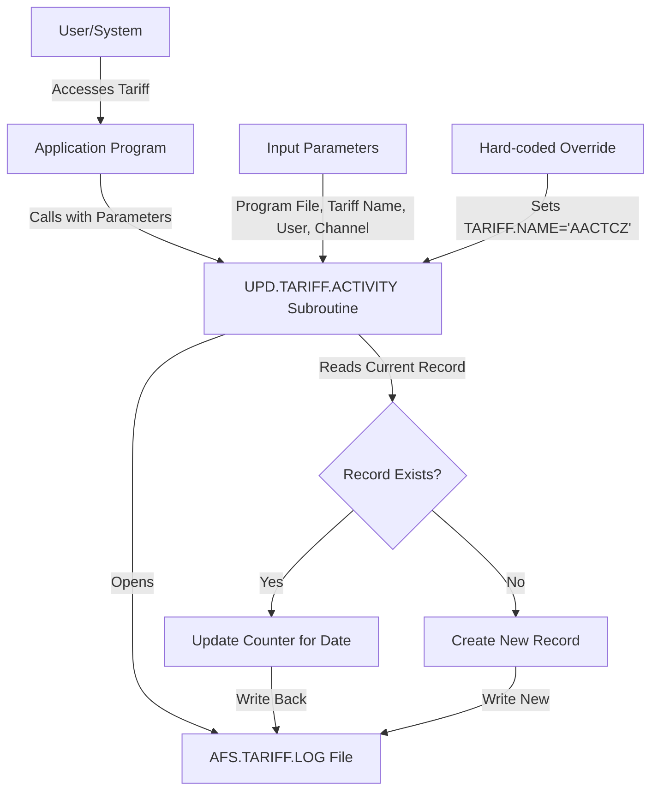
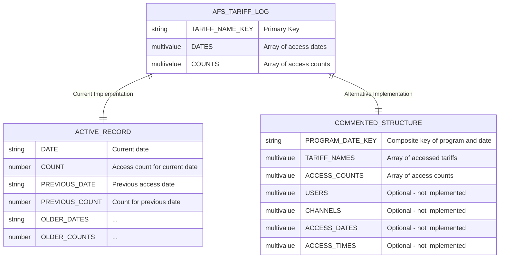
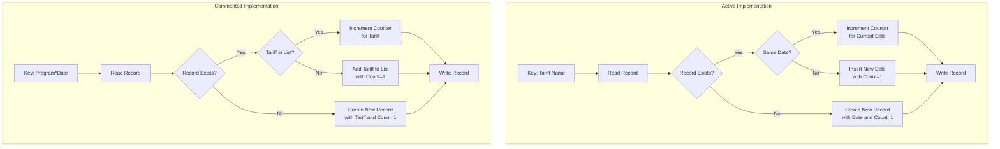

# Automated Usage Logging in AFS Shreveport

## Introduction to Automated Usage Logging

The AFS Shreveport system incorporates a sophisticated automated logging system designed to track and record system usage patterns, particularly focusing on tariff access and utilization. This logging infrastructure serves as a critical component for system analysis, optimization, and auditing purposes. The UPD.TARIFF.ACTIVITY subroutine represents a key implementation of this functionality, capturing detailed metrics about how and when tariffs are accessed within the system. By systematically recording these interactions, the platform generates valuable usage data that can inform system improvements, identify usage patterns, and support capacity planning. The logging system operates transparently in the background, requiring no user intervention while building a comprehensive historical record of tariff utilization across the platform.

## Tariff Activity Tracking Implementation

The UPD.TARIFF.ACTIVITY subroutine implements a streamlined approach to monitoring tariff usage within the AFS Shreveport system. Written in PICK BASIC, this subroutine captures each tariff access event and records it in the AFS.TARIFF.LOG file. The implementation accepts input parameters including the program file name, tariff name, user identifier, and channel number, though interestingly, the code contains a hard-coded override that sets the tariff name to 'AACTCZ' regardless of the input parameter. When executed, the subroutine either creates a new record for the tariff with the current date and an initial usage count of 1, or updates an existing record by incrementing its usage counter. The design prioritizes efficiency, using a simple date-based counter approach rather than recording detailed information about each individual access event. This minimizes storage requirements while still providing valuable usage metrics that can be analyzed to understand tariff utilization patterns over time.

## Usage Logging Data Flow

The diagram illustrates the data flow within the automated usage logging system. When a user or system process accesses a tariff, the application program calls the UPD.TARIFF.ACTIVITY subroutine with relevant parameters. The subroutine then processes this information, overriding the tariff name with a hard-coded value ('AACTCZ'), and either updates an existing record or creates a new one in the AFS.TARIFF.LOG file. This streamlined approach ensures that every tariff access is recorded with minimal system overhead, creating a comprehensive usage history that can be analyzed for patterns, trends, and optimization opportunities. The simplicity of this design contributes to its reliability and performance efficiency.

## Record Structure and Counter Mechanisms

The logging system employs an elegant record structure optimized for the MultiValue database environment. Each record in the AFS.TARIFF.LOG file is keyed by the tariff name, creating a direct access path to usage statistics for any specific tariff. Within each record, the system maintains a multi-value array structure where the first attribute (`TAR.REC<1>`) stores dates of access, and the second attribute (`TAR.REC<2>`) stores corresponding usage counts. When a tariff is accessed on a new date, the system inserts the new date at the beginning of the date array and initializes its counter to 1. For subsequent accesses on the same date, the system simply increments the counter in the corresponding position. This approach efficiently tracks daily usage patterns without creating separate records for each date, leveraging the MultiValue database's ability to store arrays within a single record. The counter mechanism is implemented through simple incrementation (`TAR.REC<2,1> +=1`), providing an accurate tally of access frequency by date with minimal computational overhead.

## Evolution of Logging Implementation

The UPD.TARIFF.ACTIVITY subroutine contains significant evidence of evolutionary development in its logging approach. The commented sections reveal a previous, more complex implementation that tracked usage with greater granularity. Arrays named `RANGE1` and `RANGE2` suggest the code once supported time-based tracking capabilities, potentially dividing the day into segments for more detailed usage analysis. Additionally, the lower portion of the code (lines 47-65) contains an entirely different logging implementation that uses a compound key structure (`PGM.FILE:"*":DATE()`) and maintains multi-valued lists of tariffs and their access counts. This alternative approach appears to have organized data by program and date rather than by tariff name. The transition from this more complex model to the current streamlined implementation likely represents a deliberate architectural decision to prioritize simplicity and performance over granular tracking. The preservation of the commented code serves as both documentation of the system's evolution and a potential pathway for reimplementing more detailed tracking if future requirements demand it.

## Tariff Log Record Structure

The diagram illustrates the data structure used in the AFS.TARIFF.LOG file. In the current implementation, each record is identified by the tariff name as the key, with two multi-valued arrays storing dates and their corresponding usage counts. This structure efficiently maintains a historical record of tariff usage over time, with the most recent date typically stored in the first position of the array. The alternative (commented-out) implementation shows a different approach where records would be keyed by a combination of program name and date, with arrays storing the various tariffs accessed and their counts. This comparison highlights the architectural decision to organize data around tariffs rather than programs, which likely better serves the system's analytical needs by making tariff-specific usage patterns immediately accessible. The simplicity of the active implementation also contributes to better performance and easier maintenance while still capturing the essential usage metrics.

## Integration with MultiValue Database

The UPD.TARIFF.ACTIVITY subroutine demonstrates sophisticated integration with the MultiValue database architecture, leveraging PICK BASIC's native capabilities for efficient record management. The code utilizes MultiValue's dynamic arrays and attribute positioning to maintain compact, hierarchical data structures without requiring complex relational schemas. Key MultiValue features employed include the use of the `<n,m>` syntax for precise attribute and value addressing, the `INSERT` function for dynamically expanding arrays, and the `LOCATE` command with the 'AL' option for associative list operations. The implementation takes advantage of MultiValue's record-locking mechanisms through the `READU` command to ensure data integrity in concurrent access scenarios. Additionally, the code demonstrates the MultiValue paradigm of storing related data elements within a single record rather than normalizing them across multiple tables, as would be typical in relational databases. This approach minimizes I/O operations and leverages the database's strength in handling hierarchical data, resulting in a logging system that is both performant and storage-efficient while maintaining the flexibility to evolve with changing requirements.

## Hard-Coded Values and Configuration Issues

A notable anomaly in the UPD.TARIFF.ACTIVITY subroutine is the hard-coded assignment of the tariff name to 'AACTCZ' (line 19), which effectively overrides any tariff name passed as an input parameter. This hard-coding represents a significant deviation from expected behavior and suggests several possibilities: it may be a debugging modification that was inadvertently left in production code, a temporary configuration for testing specific tariff usage, or an intentional limitation to focus logging on a single critical tariff. The presence of this override raises important questions about the subroutine's actual functionality in the production environment. If the override is unintentional, it means that all usage statistics are being incorrectly attributed to the 'AACTCZ' tariff regardless of which tariffs are actually being accessed. This would severely compromise the value of the collected data for analysis purposes. The override also points to potential configuration management issues in the codebase, where development or debugging modifications might be making their way into production without proper review. A comprehensive code review and testing process would be necessary to determine whether this override should be removed to restore the subroutine's intended functionality.

## Alternative Logging Implementation Comparison

This comparison illustrates the fundamental architectural differences between the active and commented-out logging implementations. The active implementation organizes data by tariff name, making each tariff the primary entity with dates and counts as attributes. This approach optimizes for queries about specific tariff usage over time. In contrast, the commented implementation organizes data by program and date, treating tariffs as attributes within these records. This would optimize for queries about which tariffs were used by specific programs on specific dates. The active implementation's simpler structure likely offers better performance and easier maintenance, while the commented version potentially provides richer contextual information by associating tariff usage with specific programs. The architectural shift suggests a deliberate decision to prioritize tariff-centric analysis over program-centric analysis, perhaps reflecting evolving business requirements or performance considerations. Both approaches demonstrate valid design patterns within a MultiValue database context, with different trade-offs in terms of query efficiency, storage requirements, and analytical capabilities.

## Usage Analytics and Reporting Potential

The usage data collected by the UPD.TARIFF.ACTIVITY subroutine represents a valuable asset for system analytics and optimization. By systematically recording tariff access patterns, the logging system creates a foundation for sophisticated usage analysis that can inform business decisions and system enhancements. The date-based counters enable trend analysis to identify seasonal patterns, usage spikes, or declining utilization of specific tariffs. This information can guide resource allocation, help prioritize maintenance efforts, or identify tariffs that may be candidates for retirement. The data structure also supports comparative analysis between tariffs to understand relative importance and usage frequency across the system. While the current implementation focuses on basic frequency counting, the collected data could be further leveraged through integration with business intelligence tools or custom reporting modules to generate visualizations, forecasts, and anomaly detection. The system could be extended to correlate tariff usage with other operational metrics such as processing times, error rates, or business outcomes, creating a more comprehensive view of how tariff utilization impacts overall system performance and business results.

## Security and Audit Implications

The UPD.TARIFF.ACTIVITY subroutine contributes significantly to the AFS Shreveport platform's security and audit capabilities by creating an immutable record of tariff access events. This logging mechanism serves as an important component in the system's overall audit trail, providing evidence of which tariffs are being utilized and with what frequency. From a security perspective, the logging system could potentially be enhanced to capture more detailed information about the accessing user (currently passed as a parameter but not utilized in the active implementation) to support user activity monitoring and anomaly detection. The current implementation focuses on aggregate counts rather than individual access events, which limits its utility for detailed security auditing but still provides valuable trend data that could help identify unusual patterns of tariff access. The logging system also supports compliance requirements by maintaining historical records of system usage that can be referenced during audits or investigations. To fully realize its security potential, the system might benefit from additional enhancements such as tamper-evident logging, integration with centralized security information and event management (SIEM) systems, or more granular recording of access contexts including user roles, locations, or access methods.

[Generated by the Sage AI expert workbench: 2025-05-28 08:06:30  https://sage-tech.ai/workbench]: #