# Expense Code Structure and Management in AFS Shreveport

## Expense Code Structure and Organization

The AFS Shreveport system organizes expense codes in a hierarchical structure using client-specific subfiles. Each client in the system has a dedicated expense code subfile named `EXPENSE.CODES,client_id`, where `client_id` is the unique identifier for the client. This architecture allows the system to maintain separate expense code configurations for each client while using a consistent processing framework.

Expense codes are stored as individual records within these subfiles, with each record containing the expense code itself as the record ID, along with associated metadata such as descriptions, year-to-date totals (separated by outbound, inbound, and third-party transactions), and status flags. The system dynamically creates these subfiles when needed, as seen in the `FB.1.1.EXP` subroutine which checks for the existence of the subfile and creates it if not found.

The expense code structure supports both standard and extended formats, with most clients using standard 35-character expense codes, while specific clients (such as 05687, 05706, and 05812) utilize longer 45-character expense codes to accommodate more complex accounting structures. This flexibility allows the system to handle various client-specific requirements within the same framework.

## Expense Code Subfile Architecture


The diagram illustrates the hierarchical relationship between client IDs, carrier codes, and expense code records. The `FB.TABLES` file contains the `EXPENSE.FIELDS` record that defines the available fields for expense code rules. Each client has its own `EXPENSE.CODES` subfile containing individual expense code records. The `FB.EXPENSE` file stores rule configurations organized by client and carrier combinations, with each rule having groups (AND conditions) and subgroups (OR conditions) that determine when specific expense codes should be applied.

## Client-Specific Expense Code Management

The AFS Shreveport system maintains separate expense code subfiles for each client, allowing for highly customized expense code configurations. This approach provides several advantages:

1. **Isolation**: Each client's expense codes are completely isolated from other clients, preventing cross-contamination of accounting data.

2. **Customization**: Clients can have unique expense code formats and validation rules without affecting other clients.

3. **Extended Code Support**: Specific clients (05687, 05706, 05812) require longer expense codes (45 characters vs. the standard 35), which the system accommodates through client-specific configuration.

4. **Client-Specific Business Rules**: The system implements unique expense code determination logic for each client, with separate handling for inbound versus outbound shipments, specific carriers, and other business requirements.

The `FB.1.1.EXP` subroutine demonstrates how the system manages these client-specific expense codes, providing functionality to view, add, modify, and delete expense codes for individual clients. The program includes safeguards to prevent deletion of active codes with non-zero year-to-date amounts and implements special handling for clients with extended code length requirements.

When copying expense codes between clients, the system uses utilities like `COPY.EXPENSE.CODES` to maintain data integrity while transferring codes from one client's subfile to another.

## Rule-Based Expense Code Determination

The AFS Shreveport system implements a sophisticated rule evaluation system to determine the appropriate expense code for a given shipment. This system is organized into groups (representing AND conditions) and subgroups (representing OR conditions), allowing for complex conditional logic.

The rule evaluation process, as implemented in the `NEW.GET.EXPENSE` subroutine, follows these steps:

1. **Rule Group Organization**: Rules are organized into groups where all conditions must be met (AND logic) and subgroups where any condition can be met (OR logic).

2. **Rule Evaluation**: For each rule, the system evaluates the specified field against the configured value using the designated operator (EQ, NE, GT, LT, GE, LE, AP, NA).

3. **Special Pattern Matching**: For text fields, the system supports sophisticated pattern matching using bracket notation for prefix, suffix, or contains operations.

4. **Dynamic Field Substitution**: The system can reference values from the shipment record to evaluate rules, including origin/destination information, carrier details, service levels, and custom reference fields.

5. **Result Determination**: When all conditions in a rule group are satisfied, the associated expense code is returned, potentially with dynamic substitutions from the shipment data.

The rule structure is stored in the `FB.EXPENSE` file, with records keyed by client ID and carrier ID combinations (e.g., "01234*UPSG"). Special wildcards like "ALL" can be used to create default rules that apply across all carriers or clients.

## Expense Code Rule Evaluation Flow

```mermaid
flowchart TD
    A[Start Rule Evaluation] --> B{Check Client+Carrier Rules}
    B -->|Found| C[Build Rule Groups]
    B -->|Not Found| D{Check Client+ALL Rules}
    D -->|Found| C
    D -->|Not Found| E{Check ALL+Carrier Rules}
    E -->|Found| C
    E -->|Not Found| F[Return No Expense Code]
    
    C --> G[For Each Rule Group]
    G --> H{Evaluate Field Conditions}
    H -->|Field=ALL| I[Match All Bills]
    H -->|Field=INTRA| J[Check Origin=Destination State]
    H -->|Field=INTER| K[Check Origin≠Destination State]
    H -->|Field=Text Field| L[Apply Pattern Matching]
    H -->|Field=Numeric| M[Apply Numeric Comparison]
    
    L --> N{Check Operator}
    N -->|EQ| O[Exact Match/Contains/Prefix/Suffix]
    N -->|NE| P[Not Match/Contains/Prefix/Suffix]
    N -->|AP| Q[Value Appears in Field]
    N -->|NA| R[Value Does Not Appear]
    
    M --> S{Check Operator}
    S -->|EQ| T[Value Equals Field]
    S -->|NE| U[Value Not Equals Field]
    S -->|GT| V[Field Greater Than Value]
    S -->|LT| W[Field Less Than Value]
    S -->|GE| X[Field Greater/Equal Value]
    S -->|LE| Y[Field Less/Equal Value]
    
    I --> Z[Rule Group Matched]
    J -->|Yes| Z
    K -->|Yes| Z
    O -->|Match| Z
    P -->|Match| Z
    Q -->|Match| Z
    R -->|Match| Z
    T -->|Match| Z
    U -->|Match| Z
    V -->|Match| Z
    W -->|Match| Z
    X -->|Match| Z
    Y -->|Match| Z
    
    Z --> AA{All Groups Matched?}
    AA -->|Yes| AB[Return Expense Code]
    AA -->|No| G
    
    AB --> AC[Process Dynamic Substitutions]
    AC --> AD[Return Final Expense Code]
```



This flowchart illustrates how the system evaluates expense code rules. It first checks for client and carrier specific rules, then falls back to more general rules if needed. For each rule group, it evaluates field conditions using pattern matching for text fields and numeric comparisons for numeric fields. When all conditions in a group are met, the system returns the associated expense code, potentially with dynamic substitutions.

## Dynamic Expense Code Generation

The AFS Shreveport system supports dynamic expense code generation through a powerful field substitution mechanism. This allows expense codes to be constructed at runtime based on shipment attributes, providing highly customized accounting codes that reflect the specific characteristics of each transaction.

The field substitution system uses curly brace notation to indicate where values should be inserted into the expense code. For example, an expense code template might be defined as:

```
31650-{DIV}-000
```

When processed, the system would replace `{DIV}` with the actual division code from the shipment record.

The system also supports more complex substitutions with range specifications using bracket notation:

```
31650-{DIV[1,3]}-000
```

This would extract characters 1 through 3 from the division code for insertion into the expense code.

The `NEW.GET.EXPENSE` subroutine implements this functionality by parsing the expense code template, identifying substitution markers, retrieving the corresponding values from the shipment record, and constructing the final expense code. This allows for highly dynamic expense code generation that can adapt to various business requirements without requiring code changes.

## Tax Component Distribution

The AFS Shreveport system includes specialized handling for tax components (GST, PST, HST, QST) in expense codes. Rather than combining all charges into a single expense code, the system can distribute tax amounts to specific expense codes while maintaining the correct total amount.

The `DIST.EXPENSE` subroutine demonstrates this functionality by:

1. Extracting tax components from the total amount
2. Assigning each tax component to its designated expense code
3. Allocating the remaining amount (total minus taxes) to the freight expense code
4. Building an array of expense codes and corresponding amounts

For example, for client 01460, the system separates GST, PST, and QST amounts from the freight expense and assigns them to specific general ledger codes based on the division:

```
Division 07370:
- Freight: 080.632017.00100.000.00000
- GST: 080.110008.00000.000.00000
- PST: 080.632017.00100.000.00000
- QST: 080.207052.00000.000.00000
```

Some clients like 01105 and 01898 have even more complex distribution rules, where the freight amount itself is split across multiple expense codes using percentage-based allocation (39%, 22%, remainder).

This sophisticated tax handling ensures that expenses are properly categorized in the client's general ledger system while maintaining accurate total amounts.

## Expense Code Data Structure


This diagram shows the detailed structure of expense code records in the AFS Shreveport system. Each expense code record contains the code itself as the identifier, along with a description, year-to-date totals for different transaction types (outbound, inbound, third-party), and status flags like the inactive indicator. The rule records in the FB.EXPENSE file contain groups and subgroups of conditions, each specifying a field, operator, value, and resulting expense code. The EXPENSE.FIELDS record in the FB.TABLES file defines the available fields that can be used in rules, including their descriptions, attribute numbers, and validation types.

## Expense Code Validation and Verification

The AFS Shreveport system implements multiple validation mechanisms to ensure expense codes are properly formatted, valid for specific clients, and appropriate for the transaction type. These validation processes occur at several points in the workflow:

1. **Input Validation**: When users enter or modify expense codes through the `FB.1.1.EXP` subroutine, the system validates the code length (35 or 45 characters depending on the client) and ensures the code doesn't already exist in the client's subfile.

2. **Format Validation**: The `GET.EXPENSE` subroutine includes a FORMAT mode that validates expense code formats against client-specific patterns. This ensures codes conform to the required structure before being used in transactions.

3. **Verification**: The VERIFY mode in `GET.EXPENSE` performs additional validation beyond format checking, ensuring the expense code is appropriate for the specific transaction based on business rules.

4. **Active Code Protection**: The system prevents deletion of expense codes with non-zero year-to-date amounts, ensuring accounting integrity is maintained. Attempts to delete active codes trigger email notifications to administrators.

5. **Field Validation**: When configuring expense code rules in `FB.EXPENSE.SETUP`, the system validates field values against expected formats based on the field type and operator. For example, numeric fields must contain valid numbers when used with comparison operators.

These validation mechanisms work together to maintain data integrity throughout the expense code lifecycle, from creation to application in freight transactions.

## Expense Code Maintenance Workflows

The AFS Shreveport system provides comprehensive workflows for adding, modifying, and deleting expense codes. These workflows are primarily implemented through the `FB.1.1.EXP` subroutine, which offers a menu-driven interface for expense code maintenance.

The key workflows include:

1. **Adding New Expense Codes**: Users can add new expense codes by selecting an empty line in the display, entering the code, description, and status. The system validates the code to ensure it doesn't already exist and conforms to client-specific format requirements.

2. **Modifying Existing Codes**: Users can select an existing code to modify its description or status. The code itself cannot be modified once created; instead, users must delete the old code and create a new one if the code needs to change.

3. **Deleting Expense Codes**: Users can delete expense codes that are no longer needed, but the system implements safeguards to prevent deletion of active codes with non-zero year-to-date amounts. This protection ensures accounting integrity by preventing the removal of codes that have been used in transactions.

4. **Copying Between Clients**: The `COPY.EXPENSE.CODES` utility allows administrators to copy expense codes from one client to another, facilitating the setup of new clients with similar expense code structures.

5. **Rule Configuration**: The `FB.EXPENSE.SETUP` program provides a separate workflow for configuring the rules that determine when specific expense codes should be applied. This includes creating, editing, and sorting rule groups and subgroups.

These workflows are designed to maintain data integrity while providing flexibility for administrators to configure and maintain expense code structures according to client requirements.

## Expense Code Processing Modes


The AFS Shreveport system implements four primary expense code processing modes, each serving a different purpose in the expense code lifecycle. The DEFAULT mode is used for initial code assignment based on rule evaluation and dynamic substitution. The TRANSLATE mode converts codes between different formats based on client requirements. The FORMAT mode validates that expense codes conform to expected patterns. The VERIFY mode performs additional business rule validation beyond basic formatting checks. All modes ultimately return an appropriate expense code or validation result.

## Cross-Client Expense Code Operations

The AFS Shreveport system supports operations that span multiple clients while maintaining the integrity of client-specific expense code structures. These cross-client operations are essential for efficient system administration and consistent expense code management across the platform.

Key cross-client operations include:

1. **Code Copying**: The `COPY.EXPENSE.CODES` utility allows administrators to copy expense codes from one client to another. This is particularly useful when onboarding new clients with similar accounting structures to existing clients, as it eliminates the need to recreate expense codes manually.

2. **Format Translation**: The TRANSLATE mode in the `GET.EXPENSE` subroutine can convert expense codes between different formats based on client requirements. This allows the system to maintain consistent internal representations while presenting codes in client-specific formats.

3. **Default Rules**: The system supports default expense code rules using the "ALL" wildcard in place of specific client or carrier IDs. These rules serve as fallbacks when more specific rules aren't defined, providing a baseline expense code determination mechanism across clients.

4. **Client-Specific Formatting**: The system accommodates different expense code formats for different clients. Standard clients use 35-character expense codes, while specific clients (05687, 05706, 05812) use extended 45-character codes. The system automatically adjusts its display and validation logic based on the client being processed.

These cross-client operations provide flexibility while maintaining the isolation between client expense code structures, ensuring that each client's accounting requirements are properly addressed without compromising system integrity.

[Generated by the Sage AI expert workbench: 2025-05-28 08:06:29  https://sage-tech.ai/workbench]: #