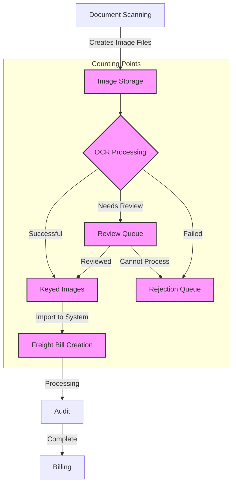
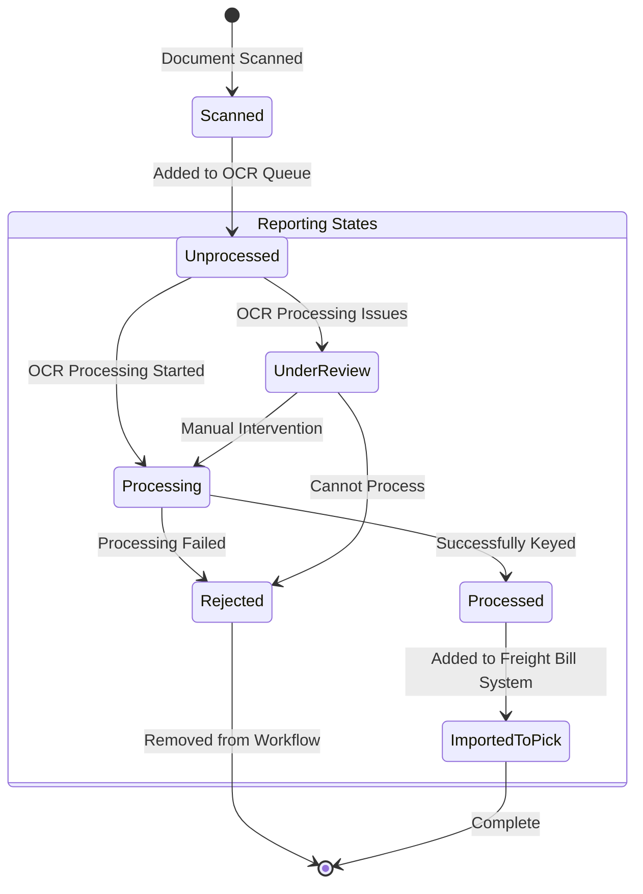
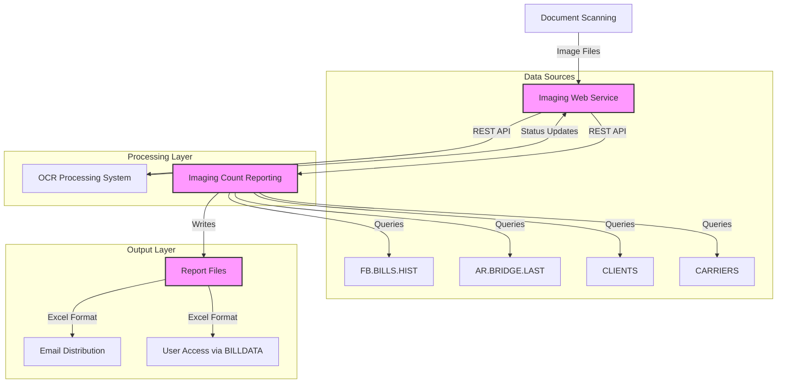

# Imaging Count Reporting in AFS Shreveport

## Overview of Imaging Count Reporting

Imaging count reporting is a critical component of the AFS Shreveport system, providing visibility into document volumes and processing status across the freight billing operation. This functionality enables stakeholders to track the flow of scanned freight bills, monitor processing backlogs, and analyze operational efficiency. The system captures metrics at various stages of document processing, from initial scanning through OCR processing, auditing, and final billing. These reports help management allocate resources, identify bottlenecks, and ensure timely processing of client documents. The imaging count reporting functionality integrates with both internal systems and external web services to provide comprehensive visibility into document processing workflows.

## OCR Queue Monitoring

The AFS Shreveport system implements sophisticated monitoring of unprocessed OCR images in queues through programs like `COUNT.OCR.QUEUE.RPT`. This functionality provides operational visibility into the volume and status of documents awaiting processing. The system tracks several key metrics for OCR queue monitoring:

1. **Batch-level statistics**: The system organizes images into batches, tracking the number of documents in each batch, when they were scanned, and their current processing status.

2. **Aging information**: Critical for operational efficiency, the system calculates how long images have been waiting in queues, flagging those that exceed expected processing timeframes.

3. **Client-specific metrics**: Queue monitoring is segmented by client, allowing operations teams to prioritize processing based on service level agreements and client importance.

4. **Processing status tracking**: The system distinguishes between different queue statuses such as unprocessed, under review, and rejected.

The OCR queue monitoring functionality relies heavily on REST API integration with the imaging web service, retrieving real-time data about queue status and document counts. This data is processed, aggregated, and presented in reports that can be distributed via email to stakeholders. The system supports both automated scheduled reporting and on-demand queue analysis, providing flexibility to meet different operational needs.

## OCR Image Processing Workflow

The OCR image processing workflow in AFS Shreveport follows a structured path from document scanning to final billing. At each stage, the system maintains counts and status information that feeds into the imaging count reporting system. The workflow begins with document scanning, which creates image files that are stored in the imaging system. These images then undergo OCR processing, which can result in three outcomes: successful processing, flagging for review, or rejection.

Images that are successfully processed are marked as "keyed" and proceed to freight bill creation. Those needing review are placed in a review queue for human intervention, while rejected images are sent to a rejection queue. The system tracks counts at each of these transition points, providing visibility into the volume and flow of documents through the process.

The counting points (highlighted in the diagram) represent key metrics that are captured and reported by the imaging count reporting system. These metrics include:
- Total images scanned
- Images awaiting OCR processing
- Successfully keyed images
- Images in review queue
- Rejected images
- Images imported into the freight billing system

This comprehensive tracking enables operational teams to identify bottlenecks, allocate resources effectively, and ensure timely processing of client documents.

## Client-Based Image Reporting

AFS Shreveport's imaging count reporting system organizes and presents document processing data by client, enabling targeted analysis and billing for document processing services. This client-centric approach is fundamental to the system's design and is implemented across multiple reporting tools.

The system maintains client-specific document counts throughout the processing lifecycle, from initial scanning through OCR processing and final billing. Programs like `FB.3.20.17` generate reports that show imaging counts by client for specific date ranges, allowing operations teams to track processing volumes and trends for each client.

Client-based reporting serves several key purposes:

1. **Service level monitoring**: Ensures that document processing meets contractual obligations for each client.

2. **Billing accuracy**: Supports accurate billing for document processing services based on actual volumes processed.

3. **Resource allocation**: Helps operations teams allocate processing resources based on client priorities and volumes.

4. **Performance analysis**: Enables comparison of processing efficiency across different client document types.

The client-based reporting functionality leverages the `CLIENTS` file to retrieve client information and associates document counts with specific client IDs. Reports can be generated for individual clients or across the entire client base, with filtering options for date ranges and processing status.

This approach to organizing imaging counts by client aligns with AFS Shreveport's client-centric business model and supports both operational efficiency and accurate client billing.

## Batch Management and Tracking

The AFS Shreveport system implements comprehensive batch management and tracking for document images, providing structured organization and efficient monitoring of document processing. Batches represent logical groupings of images, typically organized by scan date, client, or processing requirements.

The batch management functionality includes:

1. **Batch number assignment**: The system assigns unique batch identifiers, often incorporating date information and sequential numbering (e.g., "ASHV128520190918"). These identifiers are embedded in image paths and stored in document metadata.

2. **Date tracking**: Each batch is associated with a scan date, which is used for aging analysis and processing prioritization. The system extracts this date information either from explicit metadata or from the batch number itself.

3. **Batch-level statistics**: The system maintains counts of images within each batch, tracking how many have been processed, are awaiting processing, or have been rejected.

4. **Client association**: Batches are linked to specific clients, supporting client-based reporting and processing prioritization.

Programs like `OCR.BATCH.RPT` and `COUNT.OCR.QUEUE.RPT` provide detailed reporting on batch status, including image counts, aging information, and processing metrics. The system also supports batch-level operations such as prioritization, deletion (via `OCR.DELETE.BATCH`), and status updates.

Batch management is critical for operational efficiency, as it allows processing teams to work with logical groups of documents rather than individual images. It also supports quality control processes by enabling verification that all documents within a batch have been properly processed.

## Image Status Lifecycle

The image status lifecycle in AFS Shreveport represents the various states an image can have as it moves through the document processing workflow. Each status change is tracked and affects how images are counted and reported in the imaging count reporting system.

The lifecycle begins when a document is scanned and added to the OCR queue with an "Unprocessed" status. From there, it can follow several paths:

1. **Normal processing path**: Unprocessed → Processing → Processed → ImportedToPick
2. **Review path**: Unprocessed → UnderReview → Processing → Processed → ImportedToPick
3. **Rejection path**: Unprocessed → (Processing or UnderReview) → Rejected

Each state transition is recorded in the system, with timestamps and user information where applicable. The imaging count reporting system tracks the number of images in each state, providing visibility into the processing pipeline.

The reporting states (highlighted in the diagram) represent key metrics that are captured in various reports:
- Unprocessed: Images waiting for OCR processing
- UnderReview: Images flagged for manual review
- Processing: Images currently being processed
- Processed: Images successfully keyed but not yet imported
- Rejected: Images that cannot be processed
- ImportedToPick: Images successfully imported into the freight billing system

This detailed status tracking enables operations teams to identify bottlenecks, monitor processing efficiency, and ensure timely document handling. Programs like `COUNT.OCR.QUEUE.RPT` and `OCR.NEEDS.REVIEW.BILLS` leverage these status codes to generate targeted reports for specific parts of the workflow.

## REST API Integration for Image Data

AFS Shreveport's imaging count reporting system leverages REST APIs to communicate with imaging web services, enabling seamless retrieval of counts, metadata, and status information. This integration is a critical component of the system's architecture, providing real-time access to document processing data.

The REST API integration is implemented through several key components:

1. **API endpoint selection**: The system dynamically selects between production (`imagingws.afs.net`) and development (`imagingws.qa.afs.net`) endpoints based on the server environment, ensuring appropriate data access in different contexts.

2. **Request construction**: Programs like `COUNT.OCR.QUEUE.RPT` and `OCR.BATCH.RPT` construct REST API requests with specific parameters to retrieve targeted data, such as images for a particular client, batch, or date range.

3. **Secure communication**: The system uses TLS 1.2 for secure API communication, protecting sensitive document data during transmission.

4. **JSON parsing**: Universal Data Objects (UDO) functions are used to parse JSON responses from the imaging web service, extracting relevant data such as image keys, paths, client information, and status details.

5. **Error handling**: Comprehensive error detection and reporting mechanisms ensure that API communication issues are promptly identified and addressed.

The REST API integration supports various imaging count reporting functions, including:

- Retrieving counts of unprocessed images by client
- Obtaining batch-level statistics and aging information
- Updating image status information
- Retrieving detailed metadata for specific images
- Marking images as processed, rejected, or duplicates

This integration enables the imaging count reporting system to provide accurate, up-to-date information about document processing status, supporting operational decision-making and client reporting.

## Aging Analysis and Reporting

The AFS Shreveport system implements sophisticated aging analysis and reporting for document images, providing critical insights into processing timeframes and helping identify operational bottlenecks. This functionality is essential for maintaining service level agreements and ensuring timely document processing.

Aging analysis tracks how long images have been in various states of the processing workflow, with particular focus on:

1. **Queue aging**: Monitoring how long images have been waiting in the OCR queue before processing begins. Programs like `COUNT.OCR.QUEUE.RPT` calculate the difference between the current date and the scan date to determine queue age.

2. **Review aging**: Tracking the time images spend in the review queue awaiting manual intervention. The `OCR.NEEDS.REVIEW.BILLS` program specifically reports on images that have been flagged for review, including their age in the review state.

3. **Audit aging**: The `AUDIT.AGING.RPT` program focuses on bills requiring OCR auditing, highlighting those that have exceeded expected processing timeframes.

The aging analysis functionality includes several key features:

- **Date extraction**: The system extracts scan dates from image metadata or derives them from file paths when explicit dates are unavailable.

- **Age calculation**: Programs calculate the difference between relevant dates (scan date, current date, processing date) to determine how long images have been in specific states.

- **Threshold alerting**: Reports highlight images that exceed expected processing timeframes, enabling proactive intervention.

- **Trend analysis**: By tracking aging metrics over time, the system supports identification of systemic processing issues.

Aging reports can be generated on demand or scheduled for automatic distribution, providing operations teams with regular visibility into processing timeframes. These reports are typically formatted as Excel spreadsheets for easy analysis and are distributed via email to relevant stakeholders.

By identifying aged documents and processing bottlenecks, the aging analysis and reporting functionality supports continuous operational improvement and helps ensure timely document processing.

## Reporting Data Flow Architecture

The reporting data flow architecture for imaging count reporting in AFS Shreveport illustrates how image count data moves between system components, from initial capture to final reporting outputs. This architecture integrates multiple data sources, processing components, and output mechanisms to provide comprehensive visibility into document processing.

The flow begins with document scanning, which creates image files that are stored in the imaging web service. The OCR processing system interacts with these images, updating their status as they move through the workflow. The imaging count reporting components retrieve data through REST API calls to the imaging web service and queries to internal database files such as FB.BILLS.HIST, AR.BRIDGE.LAST, CLIENTS, and CARRIERS.

Key components in this architecture include:

1. **Data Sources**: The primary sources of imaging count data are the imaging web service (accessed via REST API) and internal database files that store freight bill and client information.

2. **Processing Layer**: This layer includes the OCR processing system and the imaging count reporting components that aggregate and analyze data from various sources.

3. **Output Layer**: The final reports are generated as Excel-compatible files that can be distributed via email or accessed directly by users through the BILLDATA directory structure.

Critical data flow paths (highlighted in the diagram) represent the core of the imaging count reporting functionality:
- The imaging web service provides real-time data about image status and counts
- The imaging count reporting components process and aggregate this data
- The report files serve as the standardized output format for distribution and analysis

This architecture supports both automated scheduled reporting and on-demand report generation, providing flexibility to meet different operational needs. The use of standardized file formats and distribution mechanisms ensures that imaging count data is accessible to all relevant stakeholders.

## Automated vs. Manual Reporting

AFS Shreveport's imaging count reporting system implements both automated scheduled reports and on-demand manual reporting tools, each serving distinct operational needs. This dual approach provides flexibility while ensuring consistent visibility into document processing metrics.

### Automated Reporting

Automated reports are scheduled to run at predetermined intervals, typically daily or weekly, without user intervention. These reports are identified by service user prefixes (e.g., "SV.") in the code and include:

1. **OCR Queue Count Reports**: The `COUNT.OCR.QUEUE.RPT` program can run in automated mode, retrieving current queue counts and distributing results via email to predefined recipients.

2. **Needs Review Reports**: Programs like `OCR.NEEDS.REVIEW.BILLS` can be scheduled to automatically identify and report on images requiring manual intervention.

3. **Aging Reports**: The `AUDIT.AGING.RPT` can run automatically to identify documents exceeding processing timeframes.

Automated reports typically use predefined parameters (such as date ranges based on the current date) and have fixed distribution lists. They ensure consistent monitoring of key metrics without requiring manual effort.

### Manual Reporting

Manual reporting tools allow users to generate on-demand reports with custom parameters. These tools include:

1. **Client-Specific Reports**: Programs like `FB.3.20.17` allow users to generate imaging count reports for specific clients and date ranges.

2. **Batch Reports**: The `OCR.BATCH.RPT` program enables users to search for and report on specific batches of images.

3. **Custom Date Range Reports**: Most reporting tools allow users to specify custom date ranges for targeted analysis.

Manual reports provide flexibility for ad-hoc analysis and investigation of specific issues or trends. They typically include interactive prompts for parameter input and allow users to save reports to their personal BILLDATA directories.

### Use Cases

Automated reporting is ideal for:
- Regular operational monitoring
- Trend analysis over time
- Ensuring consistent visibility into key metrics
- Alerting stakeholders to processing backlogs

Manual reporting is better suited for:
- Investigating specific issues or anomalies
- Responding to client inquiries
- Performing targeted analysis of processing efficiency
- Generating custom reports for management review

The combination of automated and manual reporting ensures that AFS Shreveport's imaging count reporting system meets both routine monitoring needs and supports flexible, targeted analysis.

## Excel Integration and Distribution

The AFS Shreveport system implements comprehensive Excel integration for imaging count reports, facilitating easy distribution, analysis, and decision-making. This approach leverages the ubiquity and analytical capabilities of Excel to make imaging count data accessible and actionable for various stakeholders.

### Excel Formatting

Imaging count reports are formatted specifically for Excel compatibility through several key techniques:

1. **Tab-delimited structure**: Programs like `COUNT.OCR.QUEUE.RPT` and `FB.3.20.17` use tab characters (CHAR(9)) as field delimiters, ensuring proper column separation when opened in Excel.

2. **Structured headers**: Reports include formatted headers with column titles that become Excel column headers, making data immediately understandable.

3. **Data typing**: Numeric values are formatted appropriately for Excel's automatic recognition, enabling immediate calculation and analysis.

4. **Date formatting**: Dates are converted to formats that Excel recognizes, allowing for date-based filtering and analysis.

### Distribution Methods

The system employs multiple distribution methods to ensure reports reach the appropriate stakeholders:

1. **Email distribution**: Programs like `COUNT.OCR.QUEUE.RPT` include built-in email functionality that sends reports as attachments to predefined recipients or distribution lists.

2. **User-specific directories**: Reports can be saved to user-specific BILLDATA directories (e.g., `BILLDATA.USERNAME`), allowing users to access their reports directly.

3. **Shared locations**: Some reports are written to shared locations for broader access across the organization.

4. **Automated scheduling**: Service users (SV.*) can run reports on a scheduled basis, ensuring regular distribution without manual intervention.

### Business Analysis and Decision-Making

Excel-formatted reports support various business analysis and decision-making processes:

1. **Operational monitoring**: Daily and weekly reports provide visibility into processing volumes and backlogs, supporting resource allocation decisions.

2. **Trend analysis**: Excel's charting capabilities allow stakeholders to visualize trends in document volumes and processing times.

3. **Client billing**: Reports organized by client support accurate billing for document processing services.

4. **Performance measurement**: Processing times and volumes can be analyzed to identify efficiency improvements or bottlenecks.

5. **Service level compliance**: Aging reports help ensure that document processing meets contractual service level agreements.

The Excel integration and distribution capabilities ensure that imaging count data is not only collected but also effectively communicated to stakeholders who can use it for business analysis and decision-making.

## Future Enhancements and Challenges

As AFS Shreveport continues to evolve its imaging count reporting functionality, several planned improvements and ongoing challenges have been identified. These reflect the changing needs of the business and the technical complexities of maintaining accurate document counts across distributed systems.

### Planned Enhancements

1. **Real-time dashboard integration**: Future enhancements include integrating imaging count data with real-time operational dashboards, providing immediate visibility into document processing status without requiring report generation.

2. **Advanced analytics**: Plans include implementing more sophisticated analytics capabilities, such as predictive modeling for processing volumes and machine learning for anomaly detection in document processing patterns.

3. **Mobile accessibility**: Enhancing report formats and distribution methods to better support mobile access, enabling managers to monitor document processing status from anywhere.

4. **Integration with client portals**: Future development will focus on exposing relevant imaging count data through client portals, giving customers direct visibility into their document processing status.

5. **Expanded API capabilities**: Enhancing the REST API integration to support more granular queries and real-time status updates, improving the timeliness and accuracy of imaging count reports.

### Ongoing Challenges

1. **Distributed system synchronization**: Maintaining accurate counts across distributed systems remains challenging, particularly when images are processed across multiple servers or when network issues cause temporary disconnections.

2. **Legacy system integration**: The codebase reveals ongoing efforts to integrate modern REST API capabilities with legacy PICK BASIC systems, requiring careful handling of data formats and communication protocols.

3. **Performance optimization**: As document volumes grow, ensuring that reporting queries don't impact operational performance becomes increasingly important, requiring ongoing optimization of database queries and API calls.

4. **Data consistency**: Ensuring consistent counting methodologies across different reporting tools is an ongoing challenge, particularly when reports are generated from different data sources or at different points in the processing workflow.

5. **Environmental differences**: Code shows significant effort dedicated to handling differences between production and development environments, highlighting the challenge of maintaining consistent reporting across different system configurations.

Addressing these enhancements and challenges will require continued investment in both technical infrastructure and process refinement. The evolution of imaging count reporting will likely focus on increasing automation, improving real-time visibility, and enhancing integration with other business systems while maintaining the reliability and accuracy that operations teams depend on.

[Generated by the Sage AI expert workbench: 2025-05-28 08:06:15  https://sage-tech.ai/workbench]: #