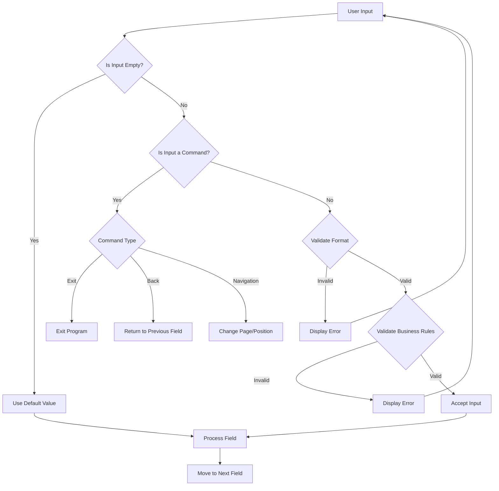
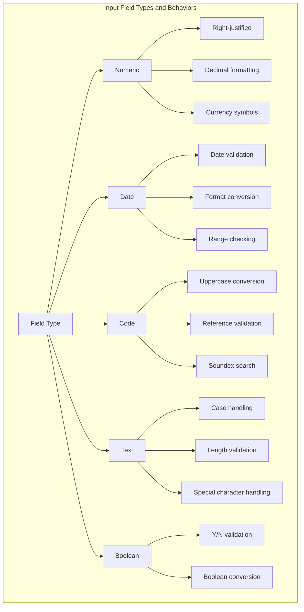

# GEN IN Input Handling

## GEN.IN Overview and Purpose

GEN.IN serves as the standardized input handling mechanism in AFS Shreveport, providing a consistent and robust interface for user interactions across the entire system. As a cornerstone component of the application's user interface layer, GEN.IN abstracts the complexities of terminal input/output operations, field validation, and navigation controls into a single, reusable function. This centralized approach ensures that users experience consistent behavior regardless of which module they're working in, from bill entry to client maintenance.

The function acts as a mediator between raw terminal input and the business logic of the application, handling the formatting, validation, and processing of user input before it reaches the core application code. By standardizing these operations, GEN.IN significantly reduces code duplication across the system while enforcing consistent validation rules and user experience patterns. This standardization is particularly valuable in a large, complex system like AFS Shreveport, where maintaining consistency across hundreds of screens and input fields would otherwise be challenging.

## Core Input Handling Features

GEN.IN implements several key features that create a consistent user experience throughout the AFS Shreveport system. At its foundation, GEN.IN manages field formatting by applying masks to input fields, ensuring data is displayed in the expected format (such as dates in MM/DD/YY format or currency with appropriate decimal places). The function handles cursor positioning and field navigation, allowing users to move between fields in a predictable manner.

Validation is another critical feature, with GEN.IN supporting both format validation through masks and business rule validation through integration with external validation routines. The function provides immediate feedback when input doesn't meet the required format or business rules, displaying error messages and allowing users to correct their input without losing context.

GEN.IN also implements a consistent command structure across the application, recognizing special commands like 'X' for back, 'EX' for exit, and function keys for specific operations. This command consistency means users can apply the same navigation patterns regardless of which part of the system they're using. Additionally, GEN.IN supports context-sensitive help text that guides users through the input process, explaining the expected format and available options for each field.

## GEN.IN Parameter Structure

The GEN.IN function accepts a comprehensive set of parameters that control its behavior. The first two parameters define the screen position (column and row) where input will be captured. The display mask parameter controls how the field appears to users, while the format type parameter specifies validation rules for common data types like dates, amounts, and codes. 

Required flag, maximum length, justification, and fill character parameters control the basic field behavior, while input type determines whether the field accepts alphanumeric, numeric, or special formats. The function also includes parameters for error handling (row for error messages), help text display, and return value handling. This extensive parameterization allows GEN.IN to be highly configurable while maintaining consistent behavior across the application.

## Mask Formatting and Validation

GEN.IN implements a sophisticated system of input masks and validation patterns to ensure data integrity across different data types. For numeric inputs like amounts, GEN.IN applies masks with the '#' character to indicate digit positions, automatically formatting currency values with commas and decimal points. Date fields use specialized formatting that validates against valid calendar dates while presenting them in the organization's standard format (typically MM/DD/YY).

For code fields, GEN.IN applies validation rules specific to the code type, often checking against reference files to ensure the code exists in the system. For example, when entering a vendor code in FB.2.1.CONSIGN, GEN.IN validates the code against the VEND.CUST file. ZIP code handling in FB.2.1.CSZ.NEW demonstrates how GEN.IN applies different validation patterns based on whether the code is a US ZIP (5 digits) or Canadian postal code (alphanumeric pattern).

The mask system also supports special formatting for display purposes, such as showing dashes in appropriate positions for phone numbers or properly formatting Social Security Numbers. When validation fails, GEN.IN provides immediate feedback, highlighting the error and allowing the user to correct it without losing context or requiring a full screen refresh.

## Navigation and Command Processing

GEN.IN processes navigation commands and special function keys consistently across different input contexts, creating a predictable user experience throughout the AFS Shreveport system. The function recognizes standard navigation commands like 'X' to go back to the previous field, 'EX' to exit the current program, and empty input (pressing Enter) to accept default values or move to the next field.

In paginated displays, such as those seen in FB.2.1.VAR.DIST and FB.OVR.2, GEN.IN processes commands like 'B' for back page, 'F' for forward page, and 'T' for top page. These navigation patterns remain consistent across different modules, allowing users to develop muscle memory that works throughout the system.

Function keys are also processed consistently, with GEN.IN mapping them to specific actions based on the current context. For example, function keys might trigger lookups, help screens, or special processing depending on the field being edited. The command processing logic in GEN.IN ensures that these special keys behave predictably regardless of which module is using them.

GEN.IN also handles field-to-field navigation, managing the cursor position and focus as users tab through fields or use arrow keys to navigate. This consistent navigation behavior creates a cohesive user experience that reduces training time and user errors.

## Input Handling Workflow

GEN.IN follows a structured decision process when handling user input. When a user enters data, GEN.IN first checks if the input is empty. If so, it either uses a default value (if provided) or treats it as an acceptance of the current value. If the input is not empty, GEN.IN checks if it's a special command like 'X', 'EX', or a function key.

For non-command input, GEN.IN validates the format against the specified mask and data type. If the format is valid, GEN.IN may perform additional business rule validation, often by calling external validation routines. Only after passing both format and business rule validation is the input accepted.

Throughout this process, GEN.IN provides immediate feedback to the user, displaying error messages for invalid input and help text for guidance. The workflow is designed to be efficient while ensuring data integrity, allowing users to correct errors without losing context or requiring full screen refreshes.

## Context-Sensitive Help Integration

GEN.IN implements a sophisticated context-sensitive help system that adapts based on the current input field and application context. Each call to GEN.IN includes a help text parameter that provides specific guidance for the current field. This help text is displayed in a consistent location (typically at the bottom of the screen) and updates automatically as the user navigates between fields.

The help system in GEN.IN goes beyond simple static text, often incorporating dynamic elements based on the current state of the application. For example, when entering a date in FB.2.10, the help text includes the minimum acceptable date based on client settings: "Enter claims billing date, MM/DD/YY or later. [X]=Back [EX]=Exit."

In more complex scenarios, GEN.IN's help system can provide guidance on available commands and their effects. For instance, in FB.2.1.VAR.DIST, the help text for line number entry explains: "Enter Line Num. [cr]=End. [B]=Back. [F]=Forward page. [EX]=Exit." This dynamic help ensures users always have relevant guidance without needing to consult external documentation.

The context-sensitive help integration is particularly valuable for new users and for functions that are used infrequently, as it provides just-in-time guidance that reduces training needs and user errors.

## Error Handling and User Feedback

GEN.IN implements a comprehensive error handling and user feedback system that provides immediate, context-specific responses to invalid input. When validation fails, GEN.IN displays error messages in a consistent location (typically specified by the "row for error" parameter), using the ELINE subroutine to format and display the message.

The error handling system in GEN.IN is designed to be non-disruptive, allowing users to correct errors without losing context or requiring a full screen refresh. Error messages are specific to the validation failure, providing clear guidance on what went wrong and how to fix it. For example, in FB.2.1.VAR.DIST, when distribution amounts don't match the variance amount, GEN.IN displays "Distributions are not equal to variance."

Beyond error messages, GEN.IN provides continuous feedback during the input process. As users enter data, GEN.IN updates the display to show the formatted input, applying masks and formatting rules in real-time. This immediate feedback helps users understand how their input is being interpreted and reduces errors.

The error handling system also includes special handling for different types of validation failures. Format validation errors (like entering letters in a numeric field) are handled differently from business rule validation errors (like entering a non-existent code), with appropriate messaging for each case.

## Input Field Types and Behaviors

GEN.IN supports multiple input field types, each with specific behaviors and validation rules. Numeric fields are right-justified and support decimal formatting, thousands separators, and currency symbols. Date fields implement calendar validation and format conversion, supporting input in various formats while storing dates in a standardized internal format.

Code fields typically convert input to uppercase and validate against reference files, often supporting Soundex-based searching when exact matches aren't found. Text fields handle case conversion based on field requirements and validate length constraints. Boolean fields accept Y/N input and convert it to appropriate internal representations.

Each field type in GEN.IN has specific behaviors for handling empty input, default values, and special commands. The behavior is controlled by the parameters passed to GEN.IN, allowing for customization while maintaining consistency across similar field types.

## Integration with Business Logic

GEN.IN interfaces seamlessly with business logic validation and lookup functions throughout the AFS Shreveport system. Rather than implementing all validation logic internally, GEN.IN often delegates to specialized functions that implement business-specific rules. This separation of concerns allows GEN.IN to focus on input handling while leveraging external functions for complex validation.

A prime example of this integration is seen in the use of SOUNDEX.DISPLAY for name-based searches. When users enter a partial name instead of a code, GEN.IN passes the input to SOUNDEX.DISPLAY, which performs a phonetic search and returns matching records. GEN.IN then handles the display and selection of these matches, creating a seamless experience for the user.

Similarly, GEN.IN integrates with validation functions that check business rules beyond simple format validation. For example, when entering expense codes in FB.2.1.DIST, GEN.IN calls external functions to validate the code against the expense code file and ensure it's valid for the current context.

This integration extends to calculation functions as well. In FB.2.1.DISC, GEN.IN captures discount percentages and net amounts, then integrates with calculation functions that determine whether the entered values are consistent with each other and with the gross amount.

## Performance Considerations

GEN.IN is designed with performance in mind, implementing several optimization techniques to ensure responsive input handling even in high-volume scenarios. The function minimizes screen refreshes by updating only the specific fields being modified, rather than redrawing the entire screen. This targeted updating reduces the amount of data transmitted between the server and terminal, improving response times especially over slower network connections.

Memory usage is optimized by reusing variables and buffers where possible, rather than creating new ones for each input operation. This efficiency is particularly important in the MultiValue environment where memory management is critical to overall system performance.

GEN.IN also implements intelligent caching of reference data when performing validations that require lookups. Rather than querying reference files for each validation, GEN.IN often works with calling programs to cache frequently used reference data, reducing disk I/O and improving response times.

The function is designed to handle high-volume input scenarios efficiently, such as entering multiple line items in FB.2.1.LINE.ITEMS or multiple distribution entries in FB.2.1.DIST. In these scenarios, GEN.IN maintains performance by minimizing unnecessary operations and optimizing the validation workflow.

## Cross-Module Consistency

GEN.IN ensures consistent input handling across different modules of the AFS Shreveport system, from bill entry to client maintenance. This consistency is achieved through standardized parameter structures, common validation patterns, and shared command processing logic. Users experience the same behavior whether they're entering client information in FB.1.1.ADDTL, processing bills in FB.2.1.BOL.NEW, or maintaining override operators in FB.OVR.2.

The cross-module consistency extends to error handling, help text display, and navigation commands. Users learn these patterns once and apply them throughout the system, reducing training needs and user errors. This consistency is particularly valuable in a large, complex system like AFS Shreveport, where users may work across multiple modules during their daily tasks.

GEN.IN also ensures consistency in how special data types are handled across modules. Date fields, amount fields, and code fields behave predictably regardless of which module is using them. This consistency extends to special processing like Soundex searches, which work the same way whether searching for clients, vendors, or expense codes.

By centralizing input handling in GEN.IN, the AFS Shreveport system achieves a level of consistency that would be difficult to maintain if each module implemented its own input handling logic. This centralization also simplifies maintenance and enhancements, as improvements to GEN.IN automatically benefit all modules that use it.

[Generated by the Sage AI expert workbench: 2025-05-28 08:06:28  https://sage-tech.ai/workbench]: #