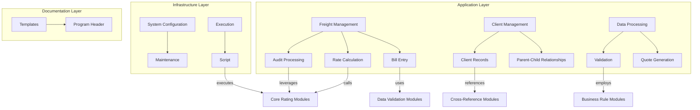
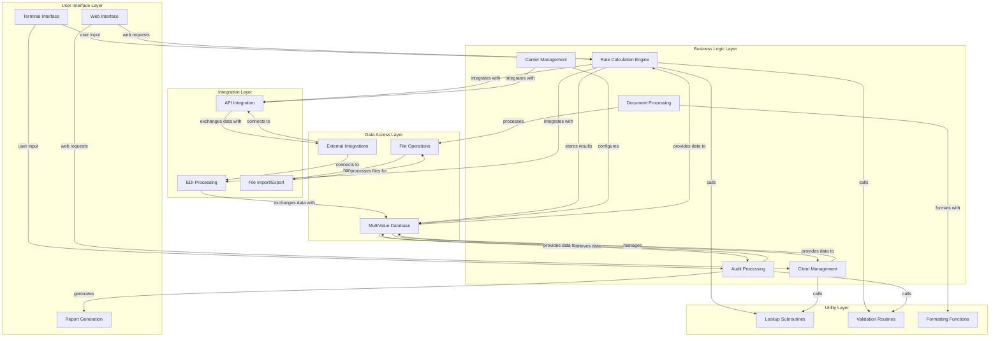
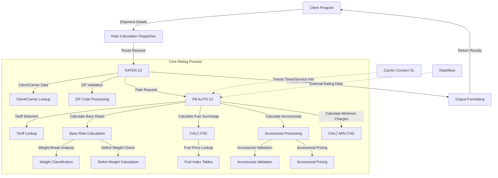
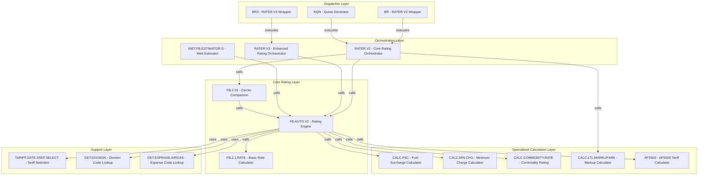
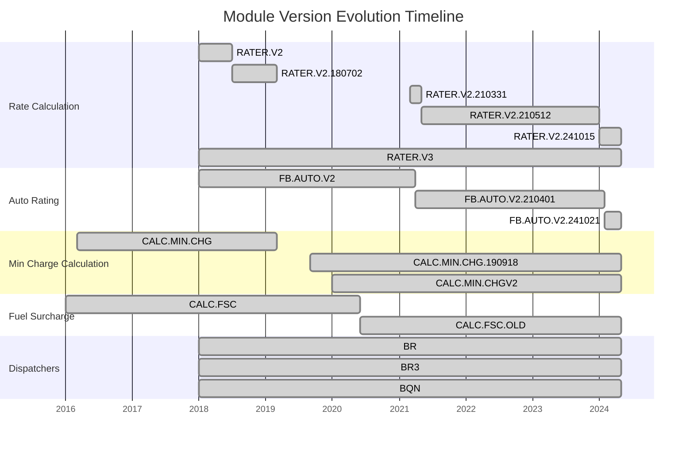

# Modular Program Architecture in AFS Shreveport

## Introduction to Modular Architecture in AFS Shreveport

The AFS Shreveport system exemplifies a sophisticated implementation of modular program architecture, designed to manage the complex domain of freight billing and logistics operations. At its core, the system employs a structured approach to software design where functionality is divided into discrete, self-contained modules that communicate through well-defined interfaces. This architecture enables the system to handle the multifaceted requirements of freight management while maintaining code maintainability and extensibility.

The system's modular design is evident across multiple layers, from high-level program organization to low-level calculation routines. Modules are organized around business functions such as rate calculation, bill entry, audit processing, and client management. Each module encapsulates specific business logic while exposing standardized interfaces for interaction with other system components. This separation of concerns allows developers to modify or enhance specific functionality without disrupting the entire system.

A key strength of the AFS Shreveport architecture is its use of reusable components. Core functions like rate calculation, ZIP code processing, and carrier selection are implemented as subroutines that can be called from multiple programs. This approach reduces code duplication and ensures consistent behavior across the system. The architecture also supports extensibility through version control mechanisms that allow new functionality to be added while maintaining backward compatibility with existing modules.

## Core Architectural Components

The AFS Shreveport system's architecture is built around several key components that work together to provide comprehensive freight management capabilities. The diagram below illustrates the main architectural components and their interactions across different system layers.

The architecture demonstrates clear separation between different system layers. The Business Logic Layer contains the core modules that implement the system's functionality, with the Rate Calculation Engine being particularly central to operations. This engine interacts with multiple components across different layers, retrieving data from the MultiValue Database, calling utility subroutines for lookups and validation, and integrating with external systems through the Integration Layer.

The modular design allows for specialized components to handle specific aspects of freight management. For example, the Audit Processing module focuses on validating freight bills, while the Carrier Management module handles carrier-specific configurations. These components communicate through well-defined interfaces, enabling them to work together while remaining independently maintainable.

The system's architecture also supports multiple user interfaces, including traditional terminal interfaces and modern web interfaces, all accessing the same underlying business logic. This separation of presentation from business logic exemplifies the modular approach that characterizes the entire system.

## Subroutine-Based Modularity

The AFS Shreveport system extensively leverages subroutine-based modularity as a cornerstone of its architecture. Subroutines serve as the primary mechanism for encapsulating functionality into reusable components that can be called from multiple programs throughout the system. This approach creates a library of specialized functions that handle specific tasks while maintaining consistent behavior across different contexts.

The system's subroutines follow a standardized parameter passing convention, typically using VIN (variables in) and VOUT (variables out) arrays to exchange data between the calling program and the subroutine. This convention creates a clear contract for how modules interact, making it easier to understand and maintain the code. For example, the `CALC.COMMODITY.RATE` subroutine accepts input parameters for carrier ID, ZIP codes, and weight, then returns calculated rates and any error messages through its output parameters.

Many subroutines in the system are designed around specific business functions. The `CALC.MIN.CHG` subroutine handles minimum charge calculations, `GET.DIVISION` determines appropriate division codes based on client rules, and `CALC.FSC` computes fuel surcharges. Each encapsulates complex business logic in a self-contained unit that can be called whenever that functionality is needed.

The rate calculation subsystem demonstrates particularly sophisticated use of subroutine-based modularity. Core rating functions like `FB.AUTO.V2` and `RATER.V2` call numerous specialized subroutines to handle different aspects of the rating process. For instance, `CALC.LTL.MARKUP.MIN` calculates markup minimums for less-than-truckload shipments, while `TARIFF.DATE.XREF.SELECT` handles tariff selection. This decomposition of the rating process into discrete subroutines allows for precise control over each step while maintaining overall system coherence.

The system also employs nested subroutines, where one subroutine calls another to perform a specific subtask. This creates a hierarchy of functionality that promotes code reuse and maintainability. For example, the `FB.2.1.AUDIT.OWEN.V2` subroutine calls `WHY.CALCS` to generate detailed calculation breakdowns and `BUILD.DETAIL.OUT` to format output data.

This subroutine-based approach enables the system to handle the complex domain of freight billing with a collection of specialized components that work together through well-defined interfaces. It allows developers to modify or enhance specific functionality without disrupting the entire system, supporting the ongoing evolution of the AFS Shreveport platform.

## Program Wrappers and Dispatchers

The AFS Shreveport system employs program wrappers and dispatchers as key architectural components that enhance modularity, maintainability, and version control. These lightweight programs serve as intermediaries that route execution to the appropriate core functionality modules, creating an additional layer of abstraction that decouples the invocation of functionality from its implementation.

Program wrappers in the system typically consist of simple scripts that call more complex programs with specific parameters or execution contexts. For example, the `BR` script serves as a wrapper for the `RATER.V2` program, while `BR3` wraps `RATER.V3`. These wrappers provide several advantages:

1. **Simplified Access**: They offer concise, easy-to-remember entry points to complex functionality.
2. **Version Control**: They enable transparent switching between different versions of core functionality. The modification history in `BR` shows it was updated to use version 2 of the rater, demonstrating how wrappers facilitate version transitions.
3. **Parameter Standardization**: They can pre-configure or standardize parameters before passing them to the underlying program.
4. **Execution Context**: They establish the appropriate execution environment for the target program.

Program dispatchers extend this concept by adding conditional logic to determine which specific implementation to invoke based on runtime conditions. The `BQN` script exemplifies this approach, using a `BEGIN CASE` structure that could potentially route to different rating engines based on conditions, though it currently only implements one case. This dispatcher pattern allows for:

1. **Dynamic Module Selection**: Choosing the appropriate implementation based on business rules, client configurations, or system settings.
2. **Feature Toggling**: Enabling or disabling features by routing to different implementations.
3. **Gradual Migration**: Supporting phased transitions from legacy to new implementations by selectively routing traffic.
4. **A/B Testing**: Facilitating comparison of different implementations by controlling which one gets executed.

The `TARIFF.DATE.XREF.SELECT` program demonstrates a more complex wrapper that not only calls another program (`TARIFF.DATE.XREF`) but also handles its output, formatting it for display. This shows how wrappers can provide additional pre-processing or post-processing around core functionality.

These program wrappers and dispatchers contribute significantly to the system's modular architecture by creating clean separation points between the invocation of functionality and its implementation. They allow core modules to evolve independently while maintaining stable interfaces for the rest of the system, supporting the long-term maintainability and extensibility of the AFS Shreveport platform.

## Module Interaction Flow

The rate calculation process in the AFS Shreveport system demonstrates sophisticated module interaction, with data flowing through multiple specialized components to produce accurate freight charges. The diagram below illustrates how different modules communicate and pass data during this critical business process.

The flow begins when a client program submits shipment details to the rate calculation dispatcher, which routes the request to the appropriate rating module (typically RATER.V2). The rating module orchestrates the entire calculation process, calling specialized modules for different aspects of the rating:

1. **Client/Carrier Lookup**: Retrieves client-specific configurations and carrier information needed for rating.

2. **ZIP Code Processing**: Validates origin and destination ZIP codes and determines appropriate service points.

3. **FB.AUTO.V2**: The core rating engine that handles the detailed calculation process:
   - **Tariff Lookup**: Selects the appropriate tariff based on carrier, effective date, and shipment characteristics.
   - **Base Rate Calculation**: Determines base freight charges using class, weight, and distance.
   - **CALC.FSC**: Calculates fuel surcharges based on current fuel indices and carrier-specific formulas.
   - **Accessorial Processing**: Adds charges for additional services like liftgate, residential delivery, etc.
   - **CALC.MIN.CHG**: Ensures charges meet minimum requirements for the carrier and service type.

4. **Weight Classification**: Analyzes shipment weight to determine appropriate weight breaks and potential deficit weight scenarios.

5. **External Integrations**: Interfaces with systems like Carrier Connect XL for transit times and RateWare for external rating data.

6. **Output Formatting**: Structures the calculation results for return to the calling program.

Data flows between these modules through standardized parameter passing, typically using arrays or structured variables. Each module receives the specific data it needs to perform its function and returns results in a predefined format. This standardized data exchange ensures that modules can work together effectively while remaining independently maintainable.

The modular design allows for specialized handling of different rating scenarios. For example, the system can route certain calculations to client-specific modules when needed, or select different calculation paths based on shipment characteristics. This flexibility enables the system to handle the complex requirements of freight rating while maintaining a clean, maintainable architecture.

## Modular Rate Calculation Engine

The rate calculation engine in the AFS Shreveport system exemplifies advanced modular design, decomposing the complex process of freight rating into specialized components that work together to determine accurate shipping costs. This subsystem is critical to the platform's core functionality, handling the intricate calculations required for freight billing, auditing, and logistics optimization.

At the heart of the rate calculation engine is a layered architecture that separates different aspects of the rating process. The top layer consists of dispatcher programs like `BR`, `BR3`, and `BQN` that route execution to the appropriate rating module based on context. These dispatchers call into the core rating modules (`RATER.V2`, `RATER.V3`, `FB.AUTO.V2`) that orchestrate the overall rating process.

The core rating modules are themselves modular, delegating specific calculations to specialized subroutines. For example, `FB.AUTO.V2` calls `CALC.FSC` for fuel surcharge calculations, `CALC.MIN.CHG` for minimum charge determination, and various tariff-specific modules for base rate calculations. This decomposition allows each aspect of rating to be handled by a dedicated module with specialized expertise.

The engine supports multiple rating methodologies through its modular design. It can calculate rates based on tariff tables (using modules like `AFS500`), distance-based formulas, flat rates, or weight-based brackets. The appropriate methodology is selected based on carrier, client, and shipment characteristics, with the core rating module routing to the relevant calculation component.

A key strength of the modular design is its support for specialized business rules. The engine includes modules like `CALC.COMMODITY.RATE` for commodity-specific pricing and `CALC.LTL.MARKUP.MIN` for markup calculations. These modules encapsulate complex business logic in self-contained units that can be maintained independently from the core rating flow.

The rate calculation engine also demonstrates modularity in its handling of external integrations. It interfaces with systems like RateWare and Carrier Connect XL through dedicated modules that abstract the complexities of these integrations from the rest of the system. This allows the engine to leverage external data sources while maintaining a clean internal architecture.

The engine's output generation is similarly modular, with dedicated components for formatting calculation results. Functions like `WHY.CALCS` generate detailed breakdowns of how charges were calculated, while `BUILD.DETAIL.OUT` formats this information for display or reporting. This separation of calculation from presentation enhances maintainability and allows for different output formats to be supported.

Through its modular design, the rate calculation engine achieves remarkable flexibility and maintainability despite the inherent complexity of freight rating. It can handle diverse rating scenarios, support client-specific business rules, and evolve over time without requiring wholesale rewrites of the system.

## Rate Calculation Module Hierarchy

The rate calculation subsystem in AFS Shreveport follows a hierarchical structure where modules are organized in layers of increasing specialization. This hierarchy enables the system to handle the complex domain of freight rating while maintaining code organization and modularity. The diagram below illustrates the relationships and dependencies between the various rate calculation modules.

At the top of the hierarchy is the Dispatcher Layer, containing lightweight wrapper programs that provide entry points to the rating functionality. These dispatchers route execution to the appropriate modules in the Orchestration Layer, which coordinates the overall rating process.

The Orchestration Layer includes modules like `RATER.V2` and `RATER.V3` that manage the end-to-end rating workflow. These modules handle user input, coordinate the various calculation steps, and format the results for display or further processing. They serve as the central controllers for the rating process, delegating specific calculations to more specialized modules.

The Core Rating Layer contains the primary engines that perform the fundamental rating calculations. `FB.AUTO.V2` is particularly central, implementing the core logic for determining freight charges based on tariffs, discounts, and surcharges. `FB.2.1.RATE` handles basic rate calculations, while `FB.2.16` specializes in comparing rates across carriers.

The Specialized Calculation Layer includes modules focused on specific aspects of the rating process. `CALC.FSC` handles fuel surcharge calculations, `CALC.MIN.CHG` determines minimum charges, and `CALC.COMMODITY.RATE` specializes in commodity-specific rating. Each module encapsulates the logic for a particular type of calculation, allowing it to be maintained and evolved independently.

At the bottom of the hierarchy is the Support Layer, containing utility modules that provide services to the higher layers. These include modules for tariff selection, division code lookup, and expense code determination.

The hierarchical organization creates clear dependencies between modules, with higher-level modules calling into more specialized ones as needed. This structure supports the separation of concerns, allowing each module to focus on its specific responsibility within the overall rating process. It also facilitates maintenance and evolution, as changes to specialized calculations can be made without affecting the higher-level orchestration logic.

## Business Rule Isolation

The AFS Shreveport system employs a sophisticated approach to business rule isolation, separating client-specific logic from core processing modules to enhance maintainability and flexibility. This architectural strategy allows the system to support diverse client requirements while preserving the stability and consistency of the core codebase.

Business rules in the system are isolated through several mechanisms:

1. **Dedicated Client-Specific Modules**: The system includes modules specifically designed to handle client-specific business logic. For example, `GET.HUSSEY.DIV.EXP` contains rules for determining division and expense codes for Hussey clients, while `GET.00761.DIV` handles division code logic for client 00761. These modules encapsulate all the specialized processing for particular clients, preventing this logic from contaminating the core modules.

2. **Conditional Logic in Generic Modules**: Some modules use client ID-based conditional structures to apply different rules for different clients. The `GET.DIVISION` subroutine exemplifies this approach, using a large `BEGIN CASE` structure with client IDs as case selectors. This allows a single module to handle multiple clients' business rules while keeping each client's logic isolated within its own case block.

3. **Client Configuration Records**: Rather than hardcoding all client-specific rules, the system stores many configuration parameters in client records. Core modules like `RATER.V2` and `FB.AUTO.V2` retrieve these parameters and adjust their processing accordingly. This approach moves some business rules from code to data, making them easier to modify without code changes.

4. **Client-Specific Overrides**: The architecture allows for client-specific overrides of standard processing. For instance, the fuel surcharge calculation in `CALC.FSC` includes special handling for specific clients like Rawlings and Xpedx, implementing their unique requirements without affecting the standard calculation path.

5. **Modular Integration Points**: The system defines clear integration points where client-specific modules can be plugged into the standard processing flow. This allows for customization at specific stages of processing while maintaining the overall structure of the workflow.

The benefits of this business rule isolation are significant:

- **Core Stability**: Core modules remain stable and consistent, focusing on the fundamental logic of freight billing without being cluttered with client-specific exceptions.
- **Simplified Maintenance**: Client-specific rules can be modified without risking unintended effects on other clients or core functionality.
- **Enhanced Extensibility**: New client requirements can be accommodated by adding new modules or extending existing ones, without requiring changes to the core system.
- **Clearer Code Organization**: Developers can easily locate client-specific logic, either in dedicated modules or within clearly marked sections of generic modules.

This approach to business rule isolation exemplifies the modular architecture of the AFS Shreveport system, demonstrating how careful separation of concerns can support both standardization and customization in a complex business domain.

## Cross-Module Data Structures

The AFS Shreveport system employs standardized data structures to facilitate communication between modules, ensuring consistent interfaces and reliable data exchange. These structures serve as the contract between modules, defining the format and semantics of the data being passed. This standardization is crucial for maintaining the integrity of the modular architecture, allowing components to evolve independently while preserving their ability to interact effectively.

Several key cross-module data structures are evident in the system:

1. **Parameter Arrays (VIN/VOUT)**: Many subroutines use standardized input and output arrays named VIN and VOUT. For example, `CALC.COMMODITY.RATE` accepts a VIN array containing carrier ID, ZIP codes, and weight, then returns results in a VOUT array with calculated rates and location information. This convention creates a clear contract for how data is exchanged between modules.

2. **Freight Bill Records**: The system uses consistent structures for representing freight bills across modules. These records contain standardized fields for shipment details, charges, and metadata, allowing different modules to process the same bill information without requiring data transformation.

3. **Rate Calculation Arrays**: Modules in the rating subsystem share standardized arrays for rate data. For instance, `FB.2.1.RATE` uses arrays like CLASS.WGT for freight details and RATE.TABLE for storing rate matrices. These consistent structures allow different rating modules to work with the same data formats.

4. **Client/Carrier Configuration Records**: The system maintains standardized structures for client and carrier configurations, which are accessed by multiple modules. For example, `RATER.V2` and `FB.AUTO.V2` both reference client records with consistent field positions for settings like markup percentages and commission structures.

5. **Error and Status Information**: Modules use consistent formats for reporting errors and status information. Many subroutines include an ERRORS variable in their parameter list, allowing them to return detailed error information in a standardized way that calling modules can process.

6. **Cross-Reference Identifiers**: The system employs standardized formats for identifiers used in cross-reference lookups. For example, tariff identifiers follow a consistent pattern (e.g., CARRIER.ID:"*":TABLE) across different modules that need to access tariff data.

These standardized data structures provide several benefits to the system:

- **Reduced Coupling**: Modules depend on the structure of the data they exchange, not on each other's internal implementation details.
- **Enhanced Maintainability**: Changes to a module's internal logic don't require changes to other modules as long as the data structures remain consistent.
- **Simplified Integration**: New modules can be integrated more easily by conforming to the established data formats.
- **Improved Testing**: Standardized data structures facilitate the creation of test data and the validation of module outputs.

The consistent use of these cross-module data structures demonstrates the system's commitment to modular design principles, creating clear boundaries between components while enabling them to work together effectively as part of a cohesive whole.

## Module Version Evolution

The AFS Shreveport system demonstrates a sophisticated approach to module versioning that supports continuous evolution while maintaining backward compatibility. This approach allows the system to incorporate new features and improvements without disrupting existing functionality. The timeline below illustrates how key modules have evolved through different versions while preserving compatibility with the broader system.

The timeline reveals several key patterns in the system's approach to module versioning:

1. **Version Suffixing**: Modules are versioned using suffixes that indicate major versions (V2, V3) and point releases (often using dates like 210331). This naming convention makes the version lineage clear and helps developers understand the chronology of changes.

2. **Parallel Version Support**: Multiple versions of the same module often coexist in the system. For example, RATER.V2 and RATER.V3 run in parallel, allowing gradual migration of functionality and clients from one version to another without forcing an immediate cutover.

3. **Date-Based Versioning**: Many modules use date-based version suffixes (e.g., FB.AUTO.V2.210401 for April 1, 2021), providing an immediate indication of when the version was created and helping to track the chronology of changes.

4. **Dispatcher Stability**: While core modules evolve through multiple versions, the dispatcher modules (BR, BR3, BQN) remain stable. These dispatchers abstract the version details from calling programs, allowing them to be updated to point to new versions without requiring changes to the programs that invoke them.

5. **Preservation of Previous Versions**: When new versions are created, previous versions are often retained with modified names (e.g., CALC.FSC becoming CALC.FSC.OLD). This allows for fallback if issues are discovered in the new version and provides reference for understanding how functionality has evolved.

This versioning approach offers several benefits:

- **Risk Mitigation**: New versions can be introduced gradually, with the ability to fall back to previous versions if issues arise.
- **Client-Specific Versioning**: Different clients can use different versions of modules based on their specific requirements and readiness for new features.
- **Continuous Evolution**: The system can evolve continuously without requiring "big bang" upgrades that might disrupt operations.
- **Historical Reference**: Preserved older versions provide valuable reference for understanding how functionality has changed over time.

The module version evolution in AFS Shreveport demonstrates a pragmatic approach to managing change in a complex system, balancing the need for innovation with the requirement for stability and backward compatibility.

## Documentation Standards

The AFS Shreveport system implements comprehensive documentation standards that support its modular architecture by improving maintainability, facilitating knowledge transfer, and ensuring consistent implementation across the codebase. These standards are evident in the standardized header templates, inline commenting practices, and structured modification histories found throughout the system's modules.

At the foundation of the documentation approach is the standardized program header template exemplified by the `PROGRAM.HEADING` file. This template establishes a consistent format for documenting essential program information, including:

1. **Basic Identification**: Program name, description, creation date, and author.
2. **Copyright Notice**: A standardized copyright statement with a placeholder for the current year.
3. **Maintenance Timeline**: A structured section for tracking changes, with fields for date, programmer initials, and reference information.

This header template is consistently applied across modules, creating a uniform documentation pattern that makes it easy to quickly understand a program's purpose and history. For example, the `CALC.MIN.CHG` subroutine follows this pattern with a detailed header that includes its creation date (02-25-2016), author (Greg Bino), and a modification history noting specific changes.

Beyond the standard headers, the system employs structured inline commenting to document complex logic and business rules. These comments often explain the rationale behind specific implementations, highlight special cases, and provide context that might not be immediately obvious from the code alone. For instance, in `GET.HUSSEY.DIV.EXP`, comments explain the purpose of pattern matching for Canadian ZIP codes and clarify the business logic for inter-plant shipment identification.

The system also maintains detailed modification histories within each module, tracking changes over time with standardized notation. These histories typically include:

1. **Date of Change**: When the modification was made.
2. **Author Initials**: Who made the change.
3. **Reference Number**: Often tied to a request or issue tracking system.
4. **Description**: A concise explanation of what was changed and why.

For example, `CALC.MIN.CHG` includes a modification history noting "Mod 00 02-25-16, grb, 10037.0000 New program" and "03/07/19 : NKH01 : ACCU-316 Modified CREATE-FILE file sizes".

The documentation standards extend to variable naming and code organization as well. Variables often have descriptive names that indicate their purpose (e.g., `CONTR.LINE.HAUL.CHARGE` rather than generic names like `X1`), and code is organized into logical sections with clear delineation between different functional areas.

These documentation standards contribute significantly to the maintainability of the modular architecture by:

1. **Facilitating Module Understanding**: Developers can quickly grasp the purpose and behavior of a module without having to decipher its entire implementation.
2. **Supporting Knowledge Transfer**: Comprehensive documentation reduces dependency on tribal knowledge and helps new developers understand the system.
3. **Enabling Impact Analysis**: Detailed change histories and clear documentation of dependencies help developers assess the potential impact of modifications.
4. **Promoting Consistent Implementation**: Standardized documentation encourages consistent approaches to similar problems across different modules.

By maintaining these rigorous documentation standards, the AFS Shreveport system ensures that its modular architecture remains maintainable and comprehensible despite its complexity and scale.

## Benefits and Challenges of Modular Architecture

The AFS Shreveport system's modular architecture delivers substantial benefits while presenting certain challenges that require ongoing attention. Understanding these advantages and difficulties provides valuable insight into the trade-offs inherent in modular design approaches, particularly in complex, long-lived enterprise systems.

### Benefits

1. **Enhanced Maintainability**: The separation of functionality into discrete modules with clear interfaces significantly improves maintainability. When issues arise or enhancements are needed, developers can focus on specific modules without having to understand the entire system. For example, changes to fuel surcharge calculations can be isolated to the `CALC.FSC` module without affecting other components.

2. **Parallel Development**: The modular structure enables multiple developers or teams to work concurrently on different system components. One team might enhance the rate calculation engine while another improves client management functionality, with minimal risk of conflicts as long as they adhere to the established interfaces.

3. **Incremental Evolution**: The system can evolve incrementally, with individual modules being updated or replaced without requiring wholesale system changes. The versioning approach seen in modules like `RATER.V2` and its successors demonstrates how functionality can evolve while maintaining backward compatibility.

4. **Code Reuse**: Modular design promotes code reuse across the system. Core functions like ZIP code validation, rate calculation, and client lookup are implemented once and used by multiple higher-level modules, reducing duplication and ensuring consistent behavior.

5. **Simplified Testing**: Modules with well-defined interfaces can be tested in isolation, making it easier to verify their behavior and identify issues. This facilitates both unit testing of individual components and integration testing of module combinations.

6. **Client Customization**: The isolation of business rules in client-specific modules allows the system to support diverse client requirements without compromising the core functionality. New client requirements can be accommodated by adding specialized modules rather than modifying the core system.

### Challenges

1. **Interface Management**: Maintaining consistent interfaces between modules requires discipline and careful coordination. Changes to interfaces can have ripple effects across the system, potentially requiring updates to multiple dependent modules.

2. **Version Proliferation**: The system's approach to versioning, while supporting backward compatibility, has led to multiple versions of similar functionality coexisting in the codebase. This increases the overall complexity and can make it challenging to determine which version should be used in new development.

3. **Cross-Module Dependencies**: Despite efforts to maintain clean separation, some modules have developed dependencies on the internal behavior of others, creating coupling that complicates maintenance. Changes to one module might unexpectedly affect others that depend on its implementation details.

4. **Documentation Overhead**: Maintaining comprehensive documentation for a large number of modules requires significant effort. While the system has strong documentation standards, keeping this documentation current as modules evolve presents an ongoing challenge.

5. **Performance Considerations**: The modular approach, with its emphasis on separation and reuse, can sometimes introduce performance overhead due to additional function calls and data transformations between modules. Balancing modularity with performance requirements requires careful design decisions.

6. **Knowledge Fragmentation**: As the system grows more modular, knowledge about specific components tends to become specialized among different developers. This can create challenges when troubleshooting issues that span multiple modules or when onboarding new team members.

The AFS Shreveport system demonstrates that a well-implemented modular architecture can deliver significant benefits in terms of maintainability, flexibility, and evolution capacity. However, realizing these benefits requires ongoing attention to interface design, version management, documentation, and cross-module dependencies. The system's longevity and continued evolution suggest that the advantages of its modular approach have outweighed the challenges, providing a solid foundation for supporting complex freight management operations over time.

[Generated by the Sage AI expert workbench: 2025-05-28 08:06:27  https://sage-tech.ai/workbench]: #