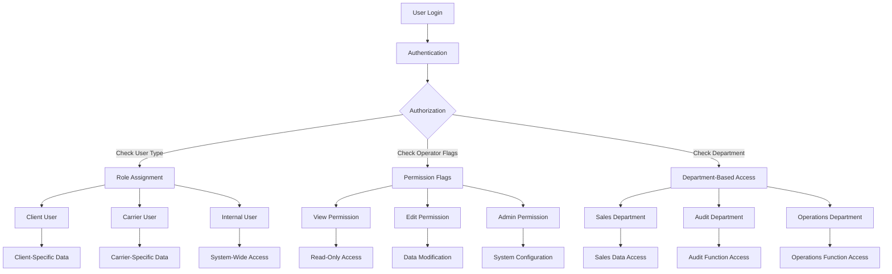
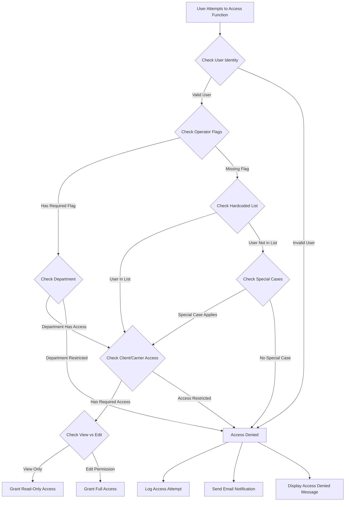
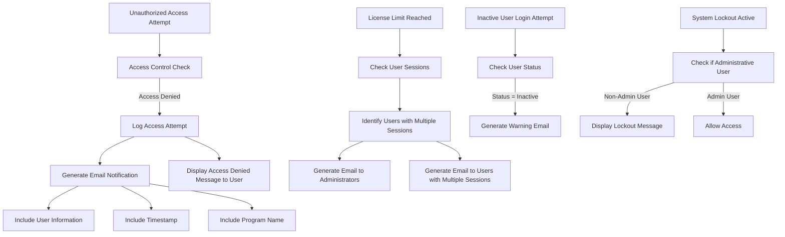

# Role-Based Access Control in AFS Shreveport

## Introduction to Role-Based Access Control

The AFS Shreveport system implements a comprehensive role-based access control (RBAC) framework to manage user permissions across its freight billing and logistics operations. This security architecture ensures that users can only access the functionality and data appropriate to their roles within the organization. The system employs multiple approaches to RBAC, including hardcoded user lists, operator flags stored in database tables, and specialized permission flags for different functional areas.

The core of the RBAC implementation relies on a combination of user identity verification and role assignment. When users attempt to access system functions, their credentials are validated against stored permissions, and access is either granted or denied based on their assigned roles. This approach allows AFS to maintain strict control over sensitive freight billing data, carrier information, and client records while still providing necessary access to employees based on their job functions.

The system has evolved over time from a purely hardcoded approach (where usernames were explicitly listed in program code) to a more flexible database-driven model using the OPERATOR file with specialized flags. This evolution reflects the growing complexity of the organization and the need for more granular and maintainable access control mechanisms.

## User Authentication and Authorization Framework

AFS Shreveport employs a multi-layered authentication and authorization system that begins with basic user identification and extends to granular permission controls. The authentication process starts when a user logs into the Universe system, where their credentials are validated against stored user records. Once authenticated, the system applies multiple layers of authorization checks before granting access to specific functionality.

The authorization framework consists of several key components:

1. **Basic User Authentication**: Initial login verification against the Universe system credentials.

2. **Session Management**: The CHECK.USERS program enforces session limits and validates whether users can maintain active connections based on license constraints and user-specific session allowances.

3. **Program-Level Authorization**: Individual programs check user permissions before allowing access to their functionality, often using a combination of hardcoded user lists and database flags.

4. **Function-Level Authorization**: Within programs, specific functions may have additional permission checks to control who can perform certain operations, such as distinguishing between view and edit capabilities.

5. **Data-Level Authorization**: Access to specific client or carrier data is controlled based on user roles, with some users restricted to certain clients or carriers while others have broader access.

The system maintains this layered approach to ensure that users only access the data and functionality appropriate to their roles. For unauthorized access attempts, the system typically logs the event, sends email notifications to administrators, and displays an access denied message to the user.

## RBAC Architecture Overview



The RBAC architecture in AFS Shreveport follows a hierarchical model where user permissions are determined through multiple layers of checks. The system first authenticates the user's identity, then determines their role type (client, carrier, or internal), and finally applies specific permission flags and department-based access rules.

The diagram illustrates how users flow through this permission structure, with different paths leading to varying levels of system access. Internal users may be further categorized by department, with each department having specific data access patterns. The operator flags in the database provide fine-grained control over which specific functions a user can access and whether they have view-only or edit capabilities.

This multi-layered approach allows AFS to implement precise access controls while maintaining flexibility to adapt to changing organizational needs. The architecture supports both broad role-based permissions and granular function-specific authorizations, creating a comprehensive security framework.

## Permission Management Mechanisms

AFS Shreveport employs several mechanisms to assign, store, and validate user permissions throughout the system. These mechanisms work together to create a comprehensive access control framework that can be adapted to the organization's evolving needs.

The primary permission management mechanisms include:

1. **Operator Flags**: The system uses flags stored in the OPERATOR file to indicate specific permissions. For example, in SS.ACCESS, the code checks `OP.FLG` to determine if a user has superuser access. These flags provide a flexible way to assign permissions without modifying program code.

```
READV OP.FLG FROM F.OP,USER,3 ELSE
   OP.FLG = "N"
END
IF OP.FLG = "Y" THEN
   CLIENT.ACCESS='ALL'
   CARRIER.ACCESS='ALL'
   SALES.ACCESS='ALL'
   COMM.ACCESS='Y'
END
```

2. **Hardcoded User Lists**: Many programs still contain hardcoded lists of authorized users, particularly for sensitive operations. This approach provides tight control but requires code changes when permissions need to be updated.

3. **Department-Based Permissions**: The system reads user department information from the BCTRL file and assigns permissions based on departmental roles. For example, in SS.ACCESS, users in the Audit department (USER.DPT='AU') receive specific carrier access permissions.

4. **User Type Classification**: Users are classified into types (client, carrier, internal) with different base permissions. This classification occurs during user creation in programs like ADD.INET.USERS and affects what data and functions they can access.

5. **View vs. Edit Permissions**: Many programs implement separate permission checks for viewing versus modifying data. For example, FB.LTL.SETUP.2 uses the operator flag to determine if a user can only view data or also make changes:

```
IF OP.FLG<1,2> = "Y" THEN
   WRITE.DATA = @TRUE
END
```

6. **Permission Inheritance**: Some permissions are inherited based on user role or department. For instance, sales department users inherit permissions from their sales representative configuration in the SS.ACCESS module.

7. **Permission Verification and Logging**: Unauthorized access attempts are logged and often trigger email notifications to administrators, creating an audit trail of permission violations.

The system's permission management has evolved over time, with newer implementations favoring database-stored flags over hardcoded user lists. This evolution reflects a move toward more maintainable and flexible access control that can be updated without code changes.

## User Types and Role Classifications

The AFS Shreveport system categorizes users into distinct types and roles, each with specific access patterns and permissions. This classification forms the foundation of the role-based access control system and determines what data and functionality users can access.

### Primary User Types

1. **Client Users (Type 0)**: External users representing client organizations who need access to their own freight billing data. These users typically have restricted access limited to their own client records and may have customized savings percentage overrides.

2. **Carrier Users (Type 1)**: External users representing transportation carriers who need access to their own shipment and billing information. Their access is typically limited to carrier-specific data.

3. **Internal Users (Type 2)**: AFS employees who require access to system functionality based on their job responsibilities. These users may have varying levels of access depending on their department and role.

### Internal Role Classifications

Internal users are further classified based on their department and specific job functions:

1. **Administrative Users**: Users with broad system access, often identified by operator flags or specific usernames in authorization lists. These users can access and modify system configuration and perform sensitive operations.

2. **Sales Representatives**: Users in the sales department who need access to client information and sales data, often with commission visibility. Their access may be limited to specific clients they manage.

3. **Audit Personnel**: Users responsible for auditing freight bills who need access to billing data and audit tools but may have restricted access to other system functions.

4. **Operations Staff**: Users handling day-to-day freight operations who need access to operational data and tools.

5. **View-Only Users**: Users granted read-only access to certain system functions without the ability to modify data.

### Role Assignment and Verification

Role assignment occurs during user creation, as seen in the ADD.INET.USERS program:

```
300:***
  HELP='User type: [0]=Client [1]=Carrier [2]=Estimates Only [X]=Back [EX]=Exit'
  CALL GEN.IN(0,7,'Enter User Type       : ':MASK ,'',Q,0,2,'','',2,24,7,0,QI,HELP,0,23)
  QI=OCONV(QI,'MCU')
  BEGIN CASE
    CASE QI='EX' 
      GOTO THE.END
    CASE QI='X'
      CRT @(0,7):@(-4)
      GOTO 200
    CASE NUM(QI)
      BEGIN CASE
        CASE QI=0
          USER.TYPE=0
        CASE QI=1
          USER.TYPE=1
        CASE QI=2
          USER.TYPE=2
        CASE 1
          CALL ELINE('Invalid user type. Please try again.')
          GOTO 300
      END CASE                    
    CASE 1
      CALL ELINE('Invalid user type. Please try again.')
      GOTO 300
  END CASE
```

Role verification occurs during program execution, with different checks applied based on the program's sensitivity and the user's role. This multi-layered classification system allows AFS to implement precise access controls while maintaining the flexibility to adapt to changing organizational needs.

## User Access Validation Flow



The user access validation flow in AFS Shreveport follows a systematic decision process to determine whether a user should be granted access to a particular system function. This process combines multiple layers of checks to ensure appropriate access control.

When a user attempts to access a system function, the validation process begins by verifying the user's identity through their login credentials. Once the identity is confirmed, the system checks for operator flags in the database that indicate specific permissions. These flags serve as the primary mechanism for role-based access in newer implementations.

If the required operator flag is not present, the system falls back to checking hardcoded user lists within the program code. These lists explicitly name users who are authorized to access the function. While this approach is less flexible than operator flags, it remains common in many parts of the system.

For certain functions, the system also considers the user's department, which is stored in the BCTRL file. Different departments have different access patterns - for example, audit department users may have broader access to carrier information than users in other departments.

The system then evaluates whether the user has appropriate access to the specific client or carrier data being requested. Some users have access to all clients ("CLIENT.ACCESS='ALL'"), while others are restricted to specific clients.

Finally, for many functions, the system distinguishes between view-only and edit permissions. Users with view-only access can see data but cannot modify it, while users with edit permissions can make changes.

If at any point the user fails a validation check, access is denied. The system typically logs the access attempt, sends an email notification to administrators (particularly for sensitive functions), and displays an access denied message to the user. This comprehensive logging helps maintain an audit trail of access attempts for security monitoring.

## Access Control Implementation

The AFS Shreveport system implements access control through a combination of hardcoded user lists, operator flags, and department-based permissions. This multi-faceted approach has evolved over time, with newer implementations favoring database-stored flags over hardcoded lists for greater flexibility and maintainability.

### Hardcoded User Lists

Many programs in the system still use explicit lists of authorized users, particularly for sensitive operations. For example, in FB.11.15:

```
BEGIN CASE
   CASE USER.NAME = 'DAVID'
   CASE USER.NAME = 'OWEN'
   CASE USER.NAME = 'BRIAN'
   CASE USER.NAME = 'KAREN'
   CASE USER.NAME = 'KRISTY'
   CASE USER.NAME = 'DONNA'
   CASE USER.NAME = 'SSMITH'
   CASE USER.NAME = 'MKERBOW'
   CASE 1
      SUBJ="Unauthorized Program Access by ":USER.NAME
      TEXT=''
      TEXT<1,-1>=USER.NAME:' ':DATE()'D2/':' ':OCONV(TIME(),'MTHS'):' ':PROG.NAME
      TEXT<1,-1>='User ':USER.NAME:' tried to access ':PROG.DESC
      TEXT<1,-1>="(This user's name was not included in the program to allow access)"
      MVIN=''
      MVIN<1>='SMatthews@afs.net'
      MVIN<2>=''
      MVIN<4>='AFS'
      MVIN<5>=SUBJ
      MVIN<6>=TEXT
      CALL SENDMAIL(MVIN,MVOUT)
```

This approach provides tight control but requires code changes when permissions need to be updated.

### Operator Flags

The system increasingly uses flags stored in the OPERATOR file to indicate specific permissions. This approach is more flexible as it allows permissions to be updated without code changes:

```
OPEN '','OPERATOR' TO F.OP ELSE CALL OPEN.ABORT("OPERATOR",PROG.NAME)
READV OP.FLG FROM F.OP,USER.NAME,50 ELSE
   OP.FLG = "N"
END
IF OP.FLG = '1' THEN ALLOW.CHANGE = 0
IF OP.FLG = '2' THEN ALLOW.CHANGE = 1
```

Different flag positions in the OPERATOR record control different permissions, creating a flexible permission matrix.

### Department-Based Access

The system reads user department information from the BCTRL file and assigns permissions based on departmental roles:

```
READ BCTRL.REC FROM F.BCTRL,USER ELSE BCTRL.REC=''
USER.DPT=BCTRL.REC<15>
USER.LOC=BCTRL.REC<23>
SS.LIST=BCTRL.REC<24>
SS.NUM=BCTRL.REC<25>
SS.ACCESS=SS.NUM:@VM:SS.LIST

CASE USER.DPT='AU'
   CARRIER.ACCESS='ALL'
CASE USER.DPT='SA'
   SALES.ACCESS=SS.ACCESS
```

### View vs. Edit Permissions

Many programs implement separate permission checks for viewing versus modifying data:

```
IF OP.FLG<1,2> = "Y" THEN
   WRITE.DATA = @TRUE
END
```

Users without the edit permission flag can view data but cannot make changes.

### Unauthorized Access Handling

When unauthorized access is attempted, the system typically:
1. Logs the access attempt
2. Sends email notifications to administrators
3. Displays an access denied message to the user

```
CALL FB.PRINT.CENT(1,80,12,'Restricted Access Application')
CALL FB.PRINT.CENT(1,80,14,'Access Denied! See CHRIS for Access')
CALL ELINE('')
STOP
```

This comprehensive approach to access control ensures that users can only access the functionality and data appropriate to their roles while maintaining an audit trail of access attempts for security monitoring.

## Session Management and Licensing

AFS Shreveport implements a sophisticated session management and licensing system that controls user access based on license availability, concurrent session limits, and user-specific restrictions. This system ensures efficient use of limited licenses while preventing unauthorized access.

The CHECK.USERS program serves as the primary mechanism for session management, performing several key functions:

1. **License Validation**: The system checks if adding another user would exceed the available Universe licenses. Different license pools are maintained for different user types:

```
AFS.LIC.LIMIT=U2.LIC-WEB.USERS
OLEDB.USER.LIMIT=10
MAX.OLEDB.USERS=8
```

2. **User-Specific Session Limits**: Each user has a configured maximum number of concurrent sessions, stored in the BCTRL file:

```
MAX.USER.TIMES=DBCTRL<3>
IF MAX.USER.TIMES='N' THEN MAX.USER.TIMES=1
IF NOT(NUM(MAX.USER.TIMES)) THEN MAX.USER.TIMES=1
```

3. **User Type Differentiation**: The system identifies different user types (standard, OLEDB, SV, phantom, console) and applies appropriate session limits:

```
IF USER[1,5]='OLEDB' THEN USER.OLEDB=1
IF USER[1,3]='SV.' THEN USER.SV=1
IF @TTY='console' THEN USER.CONSOLE=1
IF @TTY='phantom' THEN USER.PHANTOM=1
IF USER.OLEDB OR USER.SV OR USER.CONSOLE OR USER.PHANTOM THEN
   MAX.USER.TIMES=106
END
```

4. **Time-Based Restrictions**: Session limits are enforced primarily during business hours on weekdays:

```
DAY=REM(CURRENT.DATE,7)
IF DAY > 0 AND DAY < 6 THEN
   IF CURRENT.TIME GE 28800 AND CURRENT.TIME LE 61200 THEN
      IF USER.COUNT > MAX.USER.TIMES AND USER#"BRIAN" AND USER.OLEDB=0 AND USER.SV=0 THEN
         CRT "-- Access to Universe is Denied --"
```

5. **License Optimization**: When licenses are scarce, the system sends targeted emails to users with multiple sessions:

```
IF TWO.HEAD AND USER.COUNT<2 THEN
   GOSUB SEND.MULTIU.EMAILS
END
```

6. **System Lockout**: A global lockout mechanism can be activated to prevent all non-administrative users from logging in during maintenance:

```
READV LOCKOUT FROM F.BCTRL,"LOCKOUT",1 ELSE LOCKOUT = ""
IF LOCKOUT = 1 THEN
   IF USER='GBINO' OR USER='DAVID' OR USER='GSHAFER' OR USER='ADOWD' OR USER='EXTERNALAPPS' OR USER='KWILLOUGHBY' OR USER = 'NMEDDAUGH' THEN
   END ELSE
      CRT @(0,22):"All Users are currently Locked out. wait for notification before logging in"
      CHAIN 'LO'
   END
END
```

7. **Inactive User Detection**: The system prevents inactive users from logging in:

```
STATUS=DBCTRL<16>
IF STATUS='I' THEN
   EXCLUDE=1
   IF USER[LEN(USER)-4,5] # "AUDIT" THEN EXCLUDE=0
   IF USER[LEN(USER)-1,2] # "FP" THEN EXCLUDE=0
   IF EXCLUDE THEN
      SUBJ='WARNING! ':USER:' (':LONG.USER.NAME:') was denied access to Universe!'
      TEXT=USER:' attempted to login to Universe and was denied access'
      TEXT<1,-1>='due to Inactive Status in Employee File (BCTRL).'
```

This comprehensive session management system ensures efficient use of limited licenses while maintaining appropriate access controls. The system's ability to differentiate between user types and apply context-sensitive restrictions allows it to balance security requirements with operational needs.

## Security Notification System



The AFS Shreveport system implements a comprehensive security notification system that detects, logs, and reports unauthorized access attempts and other security-relevant events. This system ensures that administrators are promptly informed of potential security issues while maintaining an audit trail for future investigation.

When an unauthorized access attempt is detected, the system follows a structured notification process:

1. **Access Attempt Logging**: The system records details of the access attempt, including the user's identity, timestamp, and the program or function they attempted to access. This creates a persistent audit trail of access attempts.

2. **Email Notification Generation**: For sensitive functions, the system sends email notifications to designated administrators. These emails contain detailed information about the access attempt:

```
SUBJ="Unauthorized Program Access by ":USER.NAME
TEXT=''
TEXT<1,-1>=USER.NAME:' ':DATE()'D2/':' ':OCONV(TIME(),'MTHS'):' ':PROG.NAME
TEXT<1,-1>='User ':USER.NAME:' tried to access ':PROG.DESC
TEXT<1,-1>="(This user's name was not included in the program to allow access)"
MVIN=''
MVIN<1>='SMatthews@afs.net'
MVIN<4>='AFS'
MVIN<5>=SUBJ
MVIN<6>=TEXT
CALL SENDMAIL(MVIN,MVOUT)
```

3. **License Limit Notifications**: When the system approaches or reaches license limits, it sends specialized notifications:

```
SUBJ='WARNING! -- ':USER:' (':LONG.USER.NAME:') was denied access to Universe!'
TEXT=USER:' attempted to login to Universe and was denied access'
TEXT<1,-1>='due to Insufficient procomm user licenses.'
TEXT<1,-1>='The License Limit is ':AFS.LIC.LIMIT:' this would have been the ':LICENSES-OLEDB.COUNT:' license.'
```

4. **Multiple Session Alerts**: When license capacity is reached, the system identifies users with multiple sessions and sends targeted emails requesting them to close unnecessary sessions:

```
TEXT<1,-1> = LONGON.USER.NAME:' was unable to login to ACCUTERM because all of our user licenses have been used up.'
TEXT<1,-1> = 'If you are not using one of your sessions heavily please close it so that ':R.LOGIN.NAME:' can log into the system.'
TEXT<1,-1> = 'Also, please "Reply to all" and inform them that a session is now available for use.'
```

5. **Inactive User Warnings**: When inactive users attempt to log in, the system generates specific notifications:

```
SUBJ='WARNING! ':USER:' (':LONG.USER.NAME:') was denied access to Universe!'
TEXT=USER:' attempted to login to Universe and was denied access'
TEXT<1,-1>='due to Inactive Status in Employee File (BCTRL).'
```

6. **User Feedback**: In addition to administrator notifications, the system provides immediate feedback to users about access denials:

```
CALL FB.PRINT.CENT(1,80,12,'Restricted Access Application')
CALL FB.PRINT.CENT(1,80,14,'Access Denied! See CHRIS for Access')
CALL ELINE('')
```

This multi-layered notification system ensures that security events are promptly detected and reported, allowing administrators to respond quickly to potential security issues while maintaining a comprehensive audit trail for compliance and security analysis.

## View vs. Edit Permissions

The AFS Shreveport system implements a sophisticated distinction between view-only and edit permissions across various system functions. This separation allows users to access and view data relevant to their roles without necessarily having the ability to modify that data, enhancing security while maintaining operational efficiency.

The view vs. edit permission model is implemented through several mechanisms:

1. **Operator Flag-Based Control**: Many programs use specific operator flags to determine whether a user has edit permissions. For example, in FB.LTL.SETUP.2:

```
READV OP.FLG FROM F.OP,USER.NAME,32 ELSE
   OP.FLG<1,1> = "N"
END
IF OP.FLG<1,2> = "Y" THEN
   WRITE.DATA = @TRUE
END
```

Here, the second value in flag position 32 determines whether the user can modify data or only view it.

2. **Explicit Mode Selection**: Some programs, like FB.1.3, prompt users to choose between view and edit modes:

```
HELP="Enter [V]iew for View only or [C]hange to make changes/additions."
CALL GEN.IN(0,22,'Enter mode V','',Q,0,1,'','',0,-1,22,0,QI,HELP,0,23)
QI=OCONV(QI,'MCU')
BEGIN CASE
   CASE QI='X' OR QI='EX'
      STOP
   CASE QI='V' OR QI=''
      DISPLAY.MODE=1
   CASE QI='C'
      DISPLAY.MODE=0
   CASE 1
      CALL ELINE("Invalid Entry")
END CASE
```

This approach gives users with dual capabilities the choice to operate in a safer view-only mode when they don't need to make changes.

3. **Function-Specific Permissions**: Different system functions may have separate permission checks for viewing versus editing. For example, a user might have permission to view client records but not to modify them.

4. **Read vs. READU Operations**: The system often uses different database operations depending on whether a user has edit permissions. View-only access typically uses READ operations, while edit access uses READU to lock the record for modification:

```
IF DISPLAY.MODE = 1 THEN
   READ RECORD FROM FILE,ID ELSE RECORD = ''
ELSE
   READU RECORD FROM FILE,ID ELSE RECORD = ''
END
```

5. **UI Adaptation**: The user interface adapts based on whether the user has edit permissions. For view-only users, edit-related options may be hidden or disabled:

```
IF WRITE.DATA THEN
   CRT @(0,22):"[E]dit [D]elete [X]Exit"
ELSE
   CRT @(0,22):"[X]Exit"
END
```

This distinction between view and edit permissions serves several important purposes:

1. **Risk Reduction**: It reduces the risk of accidental data modification by limiting edit capabilities to users who specifically need them.

2. **Operational Efficiency**: It allows broader access to data for reporting and analysis purposes without increasing the risk of data corruption.

3. **Training Flexibility**: New users can be given view-only access during training before being granted full edit capabilities.

4. **Compliance Support**: It helps meet regulatory requirements that mandate separation of duties and controlled access to sensitive data.

The view vs. edit permission model is a key component of the AFS Shreveport security architecture, providing fine-grained control over user capabilities while maintaining appropriate access to system data.

## Audit Logging and Access Tracking

AFS Shreveport implements comprehensive audit logging and access tracking mechanisms to maintain detailed records of user activity throughout the system. These mechanisms serve multiple purposes, including security monitoring, compliance requirements, and operational troubleshooting.

The system's audit logging and access tracking capabilities include:

1. **Program Access Logging**: The system logs each program access through the UPD.PROGRAM.LOG subroutine, which is called at the beginning of most programs:

```
UPL.VIN = 'FBBP' ; UPL.VIN<2> = 'FB.1.3' ; UPL.VOUT = ''
CALL UPD.PROGRAM.LOG(UPL.VIN,UPL.VOUT)
```

This creates a record of which users accessed which programs and when.

2. **Bill Access Tracking**: The system maintains detailed records of who has viewed specific freight bills through the FB.BILLS.ACCESS file. The FB.BILL.INQUIRY program allows authorized users to view this access history:

```
CALL FB.BILLS.ACCESSED(VIN,VOUT)
```

This tracking is particularly important for sensitive billing information.

3. **Record Modification Tracking**: When records are modified, the system typically stores information about who made the change and when:

```
PRO.REC<111> = USER.NAME
PRO.REC<113> = TIME()
PRO.REC<114> = DATE()
PRO.REC<115> = REASON
```

This creates an audit trail of data modifications.

4. **Unauthorized Access Logging**: Failed access attempts are logged and often trigger email notifications to administrators:

```
SUBJ="Unauthorized Program Access by ":USER.NAME
TEXT=''
TEXT<1,-1>=USER.NAME:' ':DATE()'D2/':' ':OCONV(TIME(),'MTHS'):' ':PROG.NAME
TEXT<1,-1>='User ':USER.NAME:' tried to access ':PROG.DESC
```

5. **Session Tracking**: The system tracks user sessions through the LAST.LOGINS file, which records when users log in and which ports they use:

```
OPEN 'LAST.LOGINS' TO F.LAST.LOGINS THEN
   DA=USER
   DA<2>=DATE()
   DA<3>=TIME()
   WRITE DA ON F.LAST.LOGINS,CH.NUM
END
```

6. **User Activity Analysis**: The BLS.USER.AUDIT program specifically analyzes user activity logs to identify users with elevated privileges:

```
IF CLIENT = "ALL" THEN
   REC=''
   REC<1> = USER
   REC<2> = FIELD(ID,"*",3)
   WRITE REC ON F.TRACK,SEQ
   SEQ+=1
END
```

7. **Reason Tracking**: Many programs require users to provide a reason when making significant changes, which becomes part of the audit trail:

```
HELP='Enter a reason for this change. EX=Exit.'
CALL GEN.IN(0,12,'Reason for change?  ':MASK,'',Q,0,25,'','',0,20,12,0,QI,HELP,0,23)
```

8. **Creation and Modification History**: For important records, the system maintains detailed creation and modification history:

```
IF DUMMY<46>#'' THEN
   FOOTER1="Created by ":DUMMY<46,1>'MCT':" On ":DUMMY<47,1>'D2/':" At ":OCONV(DUMMY<48,1>,'MTHS')
   CRT @(0, 18):FOOTER1:@(-4)
END
IF DUMMY<43>#'' THEN
   NUM.OF.ITEM=DCOUNT(DUMMY<43>,@VM)
   FOOTER2="Last Updated by ":DUMMY<43,NUM.OF.ITEM>'MCT':" On ":DUMMY<44,NUM.OF.ITEM>'D2/':" At ":OCONV(DUMMY<45,NUM.OF.ITEM>,'MTHS')
   CRT @(0, 20):FOOTER2:@(-4)
END
```

These comprehensive audit logging and access tracking mechanisms ensure that AFS Shreveport maintains detailed records of user activity throughout the system. This information is valuable for security monitoring, compliance with regulatory requirements, and operational troubleshooting. The ability to trace who accessed what data and when provides accountability and supports forensic analysis when needed.

## Evolution and Future Improvements

The role-based access control system in AFS Shreveport has undergone significant evolution since its inception, transitioning from simple hardcoded user lists to a more sophisticated and flexible permission framework. This evolution reflects the growing complexity of the organization and the increasing importance of granular access control in modern enterprise systems.

### Historical Evolution

1. **Early Implementation**: The earliest access control mechanisms relied heavily on hardcoded user lists within each program. This approach was simple but required code changes whenever user permissions needed to be updated.

2. **Transition to Database Flags**: Over time, the system began to incorporate database-stored flags in the OPERATOR file to indicate specific permissions. This approach provided more flexibility as permissions could be updated without code changes.

3. **Department-Based Access**: The system evolved to incorporate department-based access controls, using information from the BCTRL file to assign permissions based on organizational roles.

4. **View vs. Edit Distinction**: A significant evolution was the introduction of separate permissions for viewing versus editing data, allowing for more granular access control.

5. **Audit and Tracking Improvements**: The system has progressively enhanced its audit logging and access tracking capabilities, creating more comprehensive records of user activity.

### Current Limitations

Despite these improvements, the current system still has several limitations:

1. **Mixed Implementation**: The system still uses a mix of hardcoded user lists and database flags, creating inconsistency and maintenance challenges.

2. **Limited Role Hierarchy**: The current implementation lacks a sophisticated role hierarchy that would allow for more efficient permission management.

3. **Manual Permission Updates**: Many permission changes still require manual updates to database flags or even code changes.

4. **Limited Self-Service**: Users cannot request or manage their own access, requiring administrator intervention for all permission changes.

### Future Improvement Opportunities

To address these limitations and further enhance the access control system, several improvements could be considered:

1. **Unified Permission Framework**: Consolidate all permission checks to use a consistent database-driven approach, eliminating hardcoded user lists.

2. **Role Hierarchy Implementation**: Develop a hierarchical role system that allows permissions to be inherited from parent roles, reducing duplication and simplifying management.

3. **Permission Management Interface**: Create a dedicated interface for administrators to manage user permissions without requiring direct database access or code changes.

4. **Automated Provisioning**: Implement automated provisioning based on job roles, ensuring that users automatically receive appropriate permissions when they join or change roles.

5. **Context-Aware Permissions**: Enhance the system to consider contextual factors (time of day, location, device) when making access control decisions.

6. **Self-Service Access Requests**: Develop a self-service portal where users can request access to specific functions, with appropriate approval workflows.

7. **Enhanced Audit Analytics**: Implement more sophisticated analytics on audit logs to identify unusual access patterns or potential security issues.

8. **Integration with Identity Management**: Integrate with enterprise identity management systems to ensure consistent access control across multiple applications.

These improvements would build on the solid foundation of the current system while addressing its limitations and preparing for future security and operational requirements. The evolution toward a more flexible, granular, and automated access control system would enhance both security and operational efficiency.

[Generated by the Sage AI expert workbench: 2025-05-28 08:06:29  https://sage-tech.ai/workbench]: #