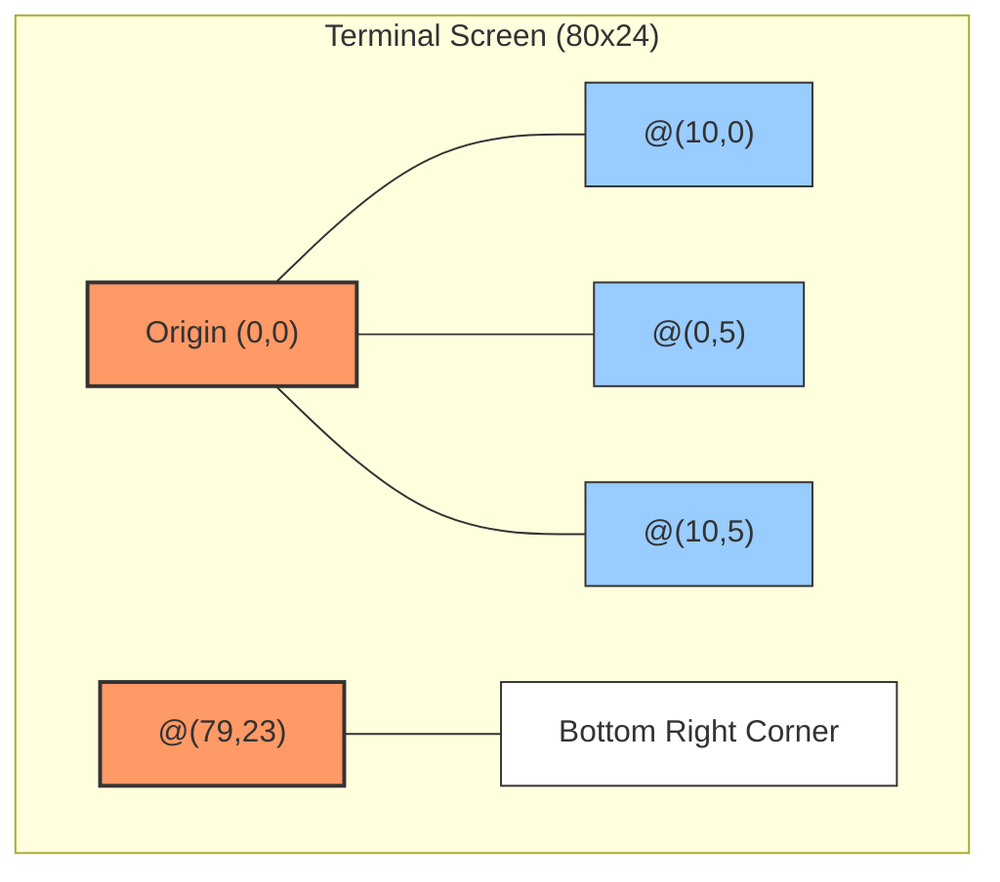
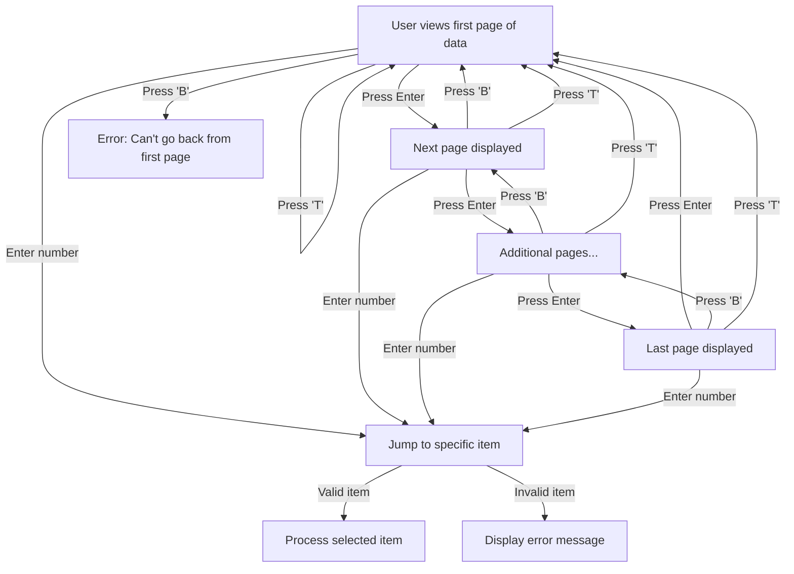
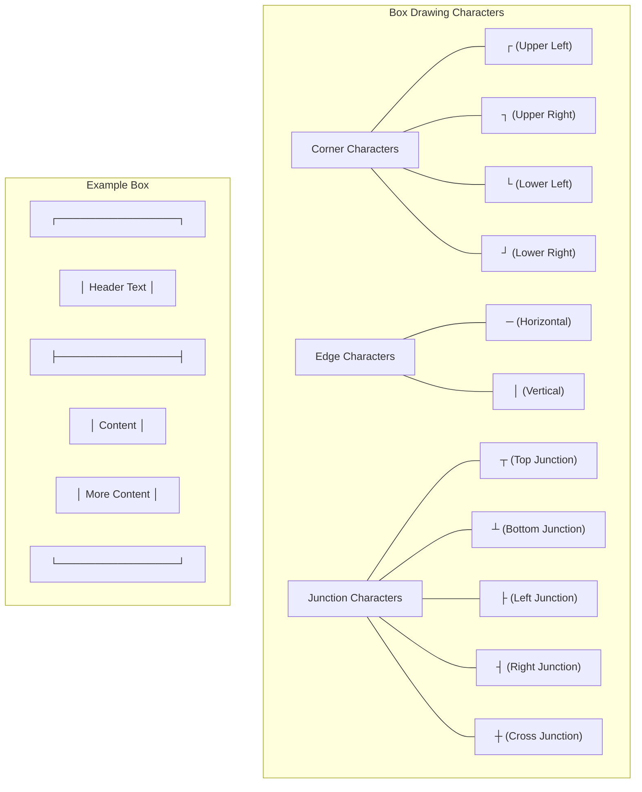
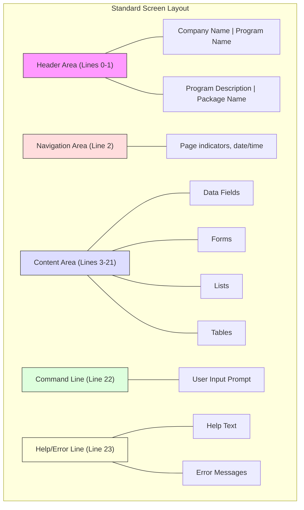

# Screen Output With CRT in AFS Shreveport

## Introduction to CRT-Based Screen Output in AFS Shreveport

The AFS Shreveport system relies heavily on CRT (Cathode Ray Tube) commands for its terminal-based interfaces, forming the foundation of its user interaction model. These commands control how information is displayed on screen, enabling the creation of forms, reports, and interactive interfaces essential to freight billing workflows. The system uses a combination of positioning commands, screen clearing operations, and text formatting to create consistent, navigable screens that guide users through complex freight management processes.

CRT commands in AFS Shreveport serve multiple critical functions: they position text at precise coordinates, control text attributes like highlighting and color, manage screen clearing and redrawing, and implement pagination for data that exceeds a single screen. This approach allows the system to present dense information in an organized manner, crucial for freight billing operations where users need to quickly access and interpret shipment details, client information, charges, and audit data.

The terminal-based interface design reflects the system's evolution from earlier mainframe and minicomputer environments, maintaining compatibility with various terminal types while providing a consistent user experience. Despite the age of this technology, the CRT-based approach remains efficient for data entry and viewing in the freight billing context, where structured forms and tabular data presentation are primary requirements.

## Core CRT Commands and Positioning Syntax

AFS Shreveport employs a specific set of CRT commands to control screen output, with the most fundamental being the positioning command `@(x,y)`. This command places the cursor at specific coordinates on the screen, where `x` represents the column (horizontal position) and `y` represents the row (vertical position). The coordinate system typically starts at (0,0) in the upper-left corner of the screen.

Several key CRT control sequences are used throughout the system:

- `@(x,y)`: Positions the cursor at the specified coordinates
- `@(-1)`: Clears the entire screen and positions the cursor at the top-left corner
- `@(-3)`: Clears from the cursor position to the end of the line
- `@(-4)`: Clears from the cursor position to the end of the screen
- `CRT @(x,y):@(-4):`: Combination that positions the cursor and clears the remainder of the screen

Text formatting is controlled through specialized syntax:
- `'L#n'`: Left-justifies text in a field of width n
- `'R#n'`: Right-justifies text in a field of width n
- `'R26#8'`: Right-justifies text in a field of width 8, with decimal alignment at position 26

The system also uses conversion codes with the `OCONV` function to format data before display:
- `OCONV(value,'MCT')`: Converts text to title case
- `OCONV(value,'MCU')`: Converts text to uppercase
- `OCONV(date,'D2/')`: Formats dates as MM/DD/YY
- `OCONV(time,'MTS')`: Formats time as HH:MM:SS

These commands work together to create precisely formatted screens with consistent layouts, enabling efficient data presentation and user interaction throughout the freight billing workflow.

## Screen Positioning Coordinate System



The AFS Shreveport system uses a coordinate-based positioning system for placing text on the terminal screen. The screen is treated as a grid where each character occupies one cell. The origin (0,0) is at the top-left corner of the screen, with x-coordinates increasing from left to right and y-coordinates increasing from top to bottom.

In standard terminal configurations, the screen is typically 80 columns wide by 24 rows high, though the system can adapt to different dimensions. The `@(x,y)` command positions the cursor at the specified coordinates, allowing text to be displayed at that exact location. This precise positioning is essential for creating forms, tables, and other structured displays where alignment is critical.

For example, `CRT @(10,5):"Client Name:"` would display the text "Client Name:" starting at column 10 of row 5. This coordinate system enables the creation of complex screen layouts with multiple elements positioned precisely where needed, such as headers at the top, navigation options at the bottom, and data fields in between.

The system also uses relative positioning in some cases, where the cursor's current position serves as the reference point for subsequent output. This approach is particularly useful for building tables or lists where elements need to be aligned vertically or horizontally with consistent spacing.

## Standardized Screen Headers with AFS.SCR.HEAD

The AFS Shreveport system implements consistent screen headers across applications through the `AFS.SCR.HEAD` utility subroutine. This standardization ensures that all screens present a uniform appearance with proper identification of the current program, company information, and other contextual details.

The `AFS.SCR.HEAD` subroutine takes several parameters including company ID, file ID, program name, program description, package name, and optional time/date information. It then formats and displays this information in a standardized header at the top of the screen. The header typically occupies the first two lines of the screen, with the company name and program name on the first line, and the program description and package name on the second line.

Key features of the `AFS.SCR.HEAD` utility include:

1. Dynamic positioning calculations to ensure proper alignment of text elements regardless of their length
2. Support for optional screen clearing before displaying the header
3. Special handling for phantom processes to prevent screen output during background operations
4. Consistent formatting of text using the `OCONV` function with `MCT` conversion for title case

The subroutine calculates display positions to ensure proper right-alignment of program and package names, creating a balanced and professional appearance. For example, if the program name is "FB.1.1" and the company name is "AFS Logistics, LLC", the header would position these elements at opposite sides of the first line, with appropriate spacing in between.

By centralizing header generation in this utility, the system ensures consistency across all modules and simplifies maintenance. When changes to the header format are needed, they can be implemented in a single location rather than across multiple programs.

## Screen Pagination and Navigation Techniques

AFS Shreveport implements sophisticated pagination techniques to handle large datasets that exceed the visible area of a single screen. The system divides data into logical pages and provides navigation controls that allow users to move between these pages efficiently. This approach is essential for presenting extensive information like client lists, freight bill details, or audit histories in a manageable format.

The pagination system typically maintains a `PAGE` variable to track the current page number and calculates display ranges based on this value. For example, if each page shows 18 items, page 1 would display items 1-18, page 2 would show items 19-36, and so on. The system calculates these ranges using formulas like `START=(PAGE*18)-17` and `STOP=START+17`.

Navigation between pages is implemented through standardized command inputs:
- Empty input (pressing Enter): Advance to the next page
- `B`: Go back to the previous page
- `T`: Return to the top (first page)
- Numeric input: Jump directly to a specific item

The system includes validation to prevent navigation beyond available data boundaries, displaying appropriate messages when users attempt to go back from the first page or forward from the last page. It also implements redrawing logic to refresh the screen content when changing pages, ensuring a clean display without artifacts from previous pages.

For complex data structures like notes or access history, the pagination system tracks both the overall page count and the number of items displayed on each page, adjusting the display accordingly. This ensures that users can navigate through all available data regardless of its volume or complexity.

## Multi-Page Screen Flow



The multi-page screen flow in AFS Shreveport provides users with a structured way to navigate through paginated data. When viewing large datasets, the system divides the information into manageable pages and offers several navigation options.

The diagram illustrates how users can move through paginated screens using various commands. From any page, users can press Enter to advance to the next page, cycling back to the first page after reaching the end. The 'B' command allows users to move backward through pages, except from the first page where an error message is displayed.

Users can also enter a specific item number to jump directly to that item, bypassing sequential navigation. The system validates the input to ensure it corresponds to an existing item, displaying an error message for invalid selections. The 'T' command provides a quick way to return to the first page from anywhere in the sequence.

This navigation system is particularly important for functions like viewing client lists, freight bill histories, or audit logs where the volume of data typically exceeds what can be displayed on a single screen. The consistent implementation of these navigation commands across different modules of the system creates a familiar user experience, reducing training needs and improving efficiency.

The pagination system also includes visual indicators showing the current page number and total pages, helping users maintain context as they navigate through the data. This approach balances the need to present comprehensive information with the constraints of terminal-based displays.

## Form-Based Data Entry with CRT

AFS Shreveport implements sophisticated form-based interfaces for data entry using CRT commands. These interfaces provide structured templates where users can input and edit data in specific fields, with support for field navigation, validation, and formatting. The system positions input fields at precise coordinates on the screen, often with descriptive labels and formatting indicators to guide users.

The primary tool for implementing form-based input is the `GEN.IN` subroutine, which provides a standardized way to capture user input with validation. A typical call to this subroutine includes parameters for:

1. Field position (x,y coordinates)
2. Prompt text or field label
3. Default value or current content
4. Validation type (date, numeric, etc.)
5. Maximum field length
6. Help text to display
7. Required input flag

For example, a call to capture a date field might look like:
```
CALL GEN.IN(0,7,'Date.  ':DATE()'D2/','DATE',PROC.DATE,0,8,'','',2,-8,7,0,QI,HELP,0,23)
```

This creates a date input field at position (0,7) with the current date as the default value, validating that the input conforms to a date format.

Form navigation is implemented through special key handling, allowing users to:
- Move to the next field by pressing Enter
- Return to the previous field with 'X' or '<'
- Exit the form with 'EX' or other designated commands

Field validation occurs both during input (through the validation type parameter) and after submission, with error messages displayed when input doesn't meet requirements. The system also supports field-specific formatting, such as displaying phone numbers as (XXX)XXX-XXXX or dates in MM/DD/YY format.

Multi-page forms are implemented for complex data entry scenarios, with clear navigation between pages and consistent positioning of common elements like headers and command prompts. This approach creates a structured, predictable interface for data entry tasks throughout the freight billing workflow.

## Box Drawing and Visual Elements

AFS Shreveport enhances screen readability through visual elements like borders, boxes, and dividers created with the `FB.DRAW.BOX` utility and similar functions. These elements provide visual structure to the interface, separating different sections of information and highlighting important data.

The `FB.DRAW.BOX` utility is a flexible tool that draws boxes anywhere on the screen with customizable dimensions, borders, and fill characters. It accepts parameters for:

1. Starting position (x,y coordinates for the upper-left corner)
2. Width and height of the box
3. Fill character for the box interior
4. Border character set for the box edges and corners

The utility handles drawing the box corners, horizontal and vertical edges, and filling the interior if specified. It optimizes screen drawing by only updating necessary characters rather than redrawing the entire box area.

Beyond simple boxes, the system uses various visual elements to enhance screen organization:
- Horizontal dividers created with repeated characters (often hyphens or equals signs)
- Section headers with surrounding borders to highlight important areas
- Tabular data with column separators for alignment
- Highlighted fields for important information or current selections

These visual elements serve both aesthetic and functional purposes, making complex screens easier to navigate and understand. For example, a client information screen might use boxes to separate contact details from billing information, while a freight bill entry screen might use dividers to distinguish between shipment details and charge information.

The consistent use of these visual elements across different modules creates a cohesive look and feel throughout the system, improving usability and reducing the cognitive load on users who need to quickly locate and interpret information.

## Box Drawing Character Set



The AFS Shreveport system uses a specialized set of characters for drawing boxes and borders in its terminal interfaces. These characters create visual structures that organize information and improve screen readability. While modern Unicode terminals support a wide range of box-drawing characters, the AFS system typically uses a more limited set compatible with older terminal types.

In the `FB.DRAW.BOX` utility, border characters are specified as a string where each position represents a specific part of the box:
- Position 1: Upper-left corner
- Position 2: Horizontal top edge
- Position 3: Upper-right corner
- Position 4: Vertical right edge
- Position 5: Lower-right corner
- Position 6: Horizontal bottom edge
- Position 7: Lower-left corner
- Position 8: Vertical left edge

For example, a simple box might use the characters `+-+|+-+|` where `+` represents corners, `-` represents horizontal edges, and `|` represents vertical edges.

These characters combine to create various visual structures:
- Simple boxes for grouping related information
- Double-line borders for emphasizing important areas
- Tables with column and row separators
- Dividers between sections of a form
- Highlighted areas for current selections or important data

The system also supports filling box interiors with specific characters, allowing for visual effects like shaded backgrounds or highlighted regions. This approach to visual structuring helps users quickly identify different sections of information and understand the relationships between data elements on complex screens.

## Progress Indicators and Status Display

AFS Shreveport implements various visual feedback mechanisms to keep users informed during processing operations. These progress indicators and status displays are crucial for long-running operations like batch processing, file generation, and data migration, where users need visibility into the system's activities and completion status.

The system employs several types of progress indicators:

1. **Numeric Counters**: Display the number of records processed out of a total, such as "Processing record 150 of 500"

2. **Percentage Completion**: Show the percentage of a task that has been completed, often updated in real-time as processing continues

3. **Status Messages**: Display descriptive text about the current operation, such as "Loading client data..." or "Calculating freight charges..."

4. **Elapsed Time Indicators**: Show how long an operation has been running, often with updates at regular intervals

5. **Activity Indicators**: Simple animated characters or symbols that change to indicate ongoing processing

These indicators are typically positioned at consistent locations on the screen, such as the bottom line or in a dedicated status area. For example, a file processing operation might display a message at line 22 showing "Processing file: filename.dat (345 of 1200 records)" with updates as each record is processed.

The system also implements more sophisticated progress tracking for multi-stage operations. For instance, the `FB.PROCESS.PROGRESS` utility displays which clients are currently being processed, when processing started, elapsed time, and AR posting status. This provides comprehensive visibility into complex workflows with multiple steps.

For background operations, the system may update a status file that can be viewed separately, allowing users to check progress without interrupting the process. This approach is particularly important for overnight batch operations or processes that run while users perform other tasks.

## Error Handling and User Notifications

AFS Shreveport implements a comprehensive error handling and notification system to communicate issues, warnings, and informational messages to users. This system ensures that users receive appropriate feedback when errors occur, with clear instructions for resolution when possible.

Error messages and notifications are displayed using several techniques:

1. **Line-based messages**: The `ELINE` subroutine displays messages at a consistent location (typically line 23) at the bottom of the screen, providing immediate feedback without disrupting the main display area.

2. **Positioned messages**: Error messages can be displayed at specific screen coordinates using `CRT @(x,y)` commands, often positioned near the field or area where the error occurred.

3. **Highlighted notifications**: Important messages may use special formatting like uppercase text, surrounding characters (*** Message ***), or inverse video to draw attention.

4. **Modal dialogs**: Critical errors that prevent continuation may display in a box-drawn "dialog" that requires user acknowledgment before proceeding.

The system implements different severity levels for notifications:

- **Errors**: Indicate conditions that prevent an operation from completing, requiring correction before proceeding
- **Warnings**: Alert users to potential issues that don't prevent continuation but may require attention
- **Information**: Provide context or status updates without requiring specific action

User acknowledgment is handled through standardized input prompts, often with options like:
- Press Enter to continue
- Enter 'X' to cancel
- Choose from specific options to resolve the error

The error handling system also includes validation at multiple levels:
- Field-level validation during data entry
- Form-level validation before saving
- Business rule validation to ensure data consistency
- System-level error trapping to prevent crashes

This multi-layered approach ensures that users receive appropriate guidance when issues arise, maintaining data integrity while providing a smooth user experience.

## Phantom Process Handling

AFS Shreveport implements specialized handling for phantom processes (background tasks) to prevent screen output when running non-interactive operations. This capability is essential for maintaining system efficiency when executing scheduled jobs, batch processes, or other operations that don't require user interaction.

The system detects phantom processes through the `@TTY` system variable, which returns "phantom" when a process is running in the background. This detection occurs early in program execution, typically in header subroutines like `AFS.SCR.HEAD`, allowing the code to bypass screen output operations entirely:

```
IF @TTY = "phantom" THEN RETURN
```

This simple but effective check prevents phantom processes from attempting to write to a terminal that doesn't exist or isn't being monitored, avoiding potential errors and improving performance by skipping unnecessary display operations.

For processes that may run in either interactive or background mode, the code often includes conditional logic that adjusts output behavior based on the execution context:

1. In interactive mode, the system displays progress updates, status messages, and user prompts on the screen
2. In phantom mode, the same information might be written to log files instead of the screen
3. Error handling adapts to the execution context, with interactive errors displaying on screen while phantom errors are logged for later review

The system also implements special handling for processes that start interactively but continue in the background. These "detached" processes may capture initial parameters through the user interface before transitioning to background execution, with appropriate changes to their output behavior.

This distinction between interactive and phantom processes allows the AFS Shreveport system to efficiently handle both user-facing operations and automated background tasks using the same underlying code, with appropriate adjustments to the input/output behavior based on the execution context.

## Screen Layout Architecture



The AFS Shreveport system employs a consistent screen layout architecture that organizes interface elements into distinct functional zones. This architectural approach creates a predictable user experience across different modules and functions within the system.

The standard screen layout consists of five main areas:

1. **Header Area (Lines 0-1)**: Contains company identification, program name, and program description. This area is typically managed by the `AFS.SCR.HEAD` utility, ensuring consistent formatting across all screens. The first line usually displays the company name on the left and program name on the right, while the second line shows the program description and package name.

2. **Navigation Area (Line 2)**: Provides contextual information like page numbers, date/time, and navigation indicators. This area helps users maintain awareness of their current position within multi-page displays or complex workflows.

3. **Content Area (Lines 3-21)**: The largest portion of the screen, dedicated to displaying and capturing data. This area may contain forms with labeled fields, tabular data, lists of items, or detailed information displays. The content area's layout varies based on the specific function but follows consistent patterns for similar operations.

4. **Command Line (Line 22)**: Reserved for user input prompts and command entry. This line typically displays prompts like "Enter selection please" or "Enter line number" and captures user responses. The `GEN.IN` subroutine often manages input on this line with appropriate validation.

5. **Help/Error Line (Line 23)**: Displays context-sensitive help text and error messages. Help text typically shows available commands or input options, while error messages provide feedback when invalid data is entered or operations fail.

This architectural approach creates clear visual separation between different functional areas of the interface, helping users quickly locate information and understand available actions. The consistent positioning of these elements across different screens reduces cognitive load and improves efficiency as users navigate through the system.

[Generated by the Sage AI expert workbench: 2025-05-28 08:06:27  https://sage-tech.ai/workbench]: #