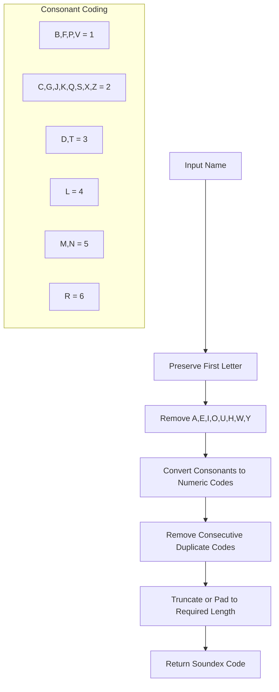
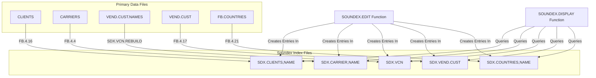
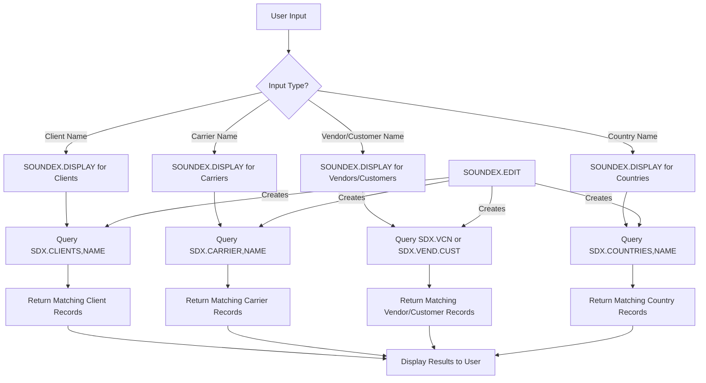
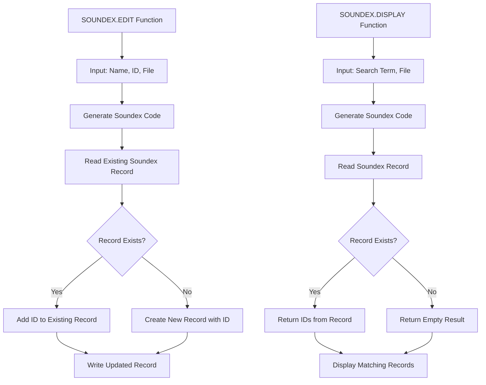

# Soundex Search Capability in AFS Shreveport

## Introduction to Soundex Search in AFS Shreveport

The AFS Shreveport system implements a sophisticated Soundex phonetic algorithm to enhance name searching capabilities across its client, carrier, and vendor/customer data. This implementation addresses the common challenge of locating entities when exact spelling is unknown or varies across records. By converting names into phonetic codes, the system can match similar-sounding names despite spelling variations, typos, or alternative forms. The Soundex functionality is deeply integrated into the system's core search mechanisms, enabling users to efficiently locate records based on phonetic similarity rather than exact character matching. This capability is particularly valuable in the logistics industry where company names, carrier designations, and customer identifiers may have multiple spelling variants or be entered inconsistently across different documents and systems.

## Technical Foundation of Soundex Indexing

The Soundex algorithm works by transforming names into standardized phonetic codes that represent how words sound rather than how they're spelled. In the AFS Shreveport implementation, the algorithm preserves the first letter of a name and converts subsequent consonants to numeric codes based on their phonetic characteristics, while ignoring vowels, 'H', 'W', and 'Y' (except as first letters). This produces a code typically consisting of a letter followed by three digits, though the AFS implementation may use variations of this standard format. The system maintains these codes in specialized soundex index files that serve as phonetic lookup tables, allowing rapid retrieval of records with phonetically similar names. When a user performs a search, the input is converted to its Soundex representation and matched against these pre-computed codes, returning all records that share the same phonetic pattern regardless of spelling differences.

## Soundex Algorithm Flow

The Soundex algorithm in AFS Shreveport follows a systematic process to transform names into phonetic codes. It begins by preserving the first letter of the name, then removes vowels and certain consonants (H, W, Y) that don't significantly impact pronunciation. The remaining consonants are converted to numeric codes based on their phonetic characteristics, with similar-sounding consonants receiving the same code. Consecutive duplicate codes are eliminated to prevent overrepresentation of repeated sounds, and the resulting code is either truncated or padded to achieve a standardized length. This process creates a consistent phonetic representation that allows the system to match names that sound alike despite having different spellings, significantly enhancing search capabilities across the application.

## Soundex File Structure and Organization

The AFS Shreveport system maintains a series of specialized soundex index files that enable phonetic searching across different entity types. The primary soundex files include:

1. **SDX.CLIENTS** - Contains phonetic indexes for client names and aliases
2. **SDX.CARRIER,NAME** - Stores phonetic representations of carrier names
3. **SDX.VCN** - Maintains soundex codes for vendor/customer names, organized by client ID
4. **SDX.VEND.CUST** - Client-specific vendor/customer soundex indexes
5. **SDX.COUNTRIES,NAME** - Phonetic indexes for country names

Each soundex file is structured as a key-value store where the key is the soundex code and the value is a list of entity IDs that match that phonetic pattern. This organization allows for efficient retrieval of all entities that sound similar to a search term. The system maintains separate soundex files for different entity types to optimize search performance and maintain logical separation between different domains of data. These files are regularly rebuilt by maintenance utilities to ensure they remain synchronized with the primary data files as records are added, modified, or removed.

## Soundex File Relationships

The diagram illustrates the relationships between primary data files and their corresponding soundex index files in the AFS Shreveport system. Each primary data file (CLIENTS, CARRIERS, VEND.CUST.NAMES, VEND.CUST, and FB.COUNTRIES) has an associated soundex index file that stores phonetic representations of names. Maintenance utilities like FB.4.16, FB.4.4, SDX.VCN.REBUILD, FB.4.17, and FB.4.21 rebuild these indexes to ensure they remain synchronized with the primary data. The SOUNDEX.EDIT function creates entries in the soundex files, while the SOUNDEX.DISPLAY function queries these files to find phonetically similar matches. This architecture enables efficient phonetic searching across different entity types while maintaining separation between different domains of data.

## Maintenance Utilities for Soundex Files

AFS Shreveport includes several specialized maintenance utilities designed to build and maintain the soundex index files that power its phonetic search capabilities. These utilities include:

1. **FB.4.16** - Rebuilds the client soundex files (SDX.CLIENTS,NAME), processing both primary client names and their aliases. It selects active clients or those processed since January 2018, clears the existing soundex file, and regenerates entries for each client.

2. **FB.4.4** - Maintains the carrier soundex files (SDX.CARRIER,NAME) by selecting all carrier records, clearing the existing soundex file, and creating new soundex entries for each carrier name.

3. **FB.4.21** - Rebuilds the country soundex files (SDX.COUNTRIES,NAME) by processing all country records and generating phonetic representations of country names.

4. **FB.4.17** - Rebuilds vendor/customer soundex files for specific clients, prompting users to enter a client number before rebuilding the corresponding SDX.VEND.CUST file.

5. **SDX.VCN.REBUILD** - Maintains the vendor/customer name soundex files (SDX.VCN) by processing either a specific client or all clients in the system.

These utilities implement operator access control to prevent unauthorized users from running potentially disruptive maintenance tasks, and they display progress indicators during execution to provide feedback on the rebuilding process. Regular execution of these utilities ensures that the soundex indexes remain synchronized with the primary data files, maintaining the integrity and effectiveness of the system's phonetic search capabilities.

## Client Name and Alias Soundex Processing

The AFS Shreveport system enhances its search capabilities by indexing both primary client names and their aliases using the Soundex algorithm. This comprehensive approach ensures that clients can be found regardless of which name variant is used in the search. The FB.4.16 utility specifically handles this dual indexing process by first clearing the existing SDX.CLIENTS,NAME file and then systematically processing each client record. For each client, it extracts the primary name and creates a soundex entry using the SOUNDEX.EDIT function. It then processes all aliases stored in the client record (field 226), creating additional soundex entries for each alias. This approach creates a rich network of phonetic references that point to the same client record, maximizing the system's ability to find clients despite variations in how their names might be entered or referenced. The inclusion of aliases is particularly valuable for clients with abbreviated names, DBA ("doing business as") names, or those that have undergone name changes or mergers.

## Soundex Search Process

The flowchart illustrates how user input is processed through soundex matching to return relevant results from various entity databases in the AFS Shreveport system. When a user enters a search term, the system determines the entity type being searched (client, carrier, vendor/customer, or country) and routes the query to the appropriate SOUNDEX.DISPLAY function. This function converts the input to its phonetic representation and queries the corresponding soundex index file (SDX.CLIENTS,NAME, SDX.CARRIER,NAME, SDX.VCN/SDX.VEND.CUST, or SDX.COUNTRIES,NAME). The system retrieves all records that match the phonetic pattern and returns them to the user interface for display. This process enables users to find entities even when they don't know the exact spelling, significantly enhancing the system's search capabilities. The SOUNDEX.EDIT function maintains these indexes by creating phonetic representations of names as records are added or modified.

## Vendor/Customer Soundex Implementation

The vendor/customer soundex implementation in AFS Shreveport is particularly sophisticated due to the client-specific nature of vendor and customer data. The system maintains separate soundex indexes for each client's vendors and customers, allowing for efficient searching within a specific client context. The FB.4.17 utility rebuilds these client-specific soundex files (SDX.VEND.CUST) by prompting users to enter a client number, then processing all vendors and customers associated with that client. Additionally, the SDX.VCN.REBUILD utility maintains the vendor/customer name soundex files (SDX.VCN), which provide an alternative phonetic index organized by name rather than by client. 

The system also implements special handling for ZIP code-specific entries, creating cross-references between vendor/customer names, IDs, and ZIP codes. This allows users to search for vendors or customers within specific geographic areas. The FB.2.1.VEND.CUST subroutine demonstrates this integration by using soundex functionality to find similar vendor/customer names through the GET.LIST.SDX call, then displaying the results in a paginated list for user selection. This implementation enables users to efficiently locate vendors and customers despite spelling variations, while also considering geographic context through ZIP code associations.

## ZIP Code and Location-Based Soundex Search

AFS Shreveport enhances its phonetic search capabilities by combining soundex name matching with location data, particularly ZIP codes. This integration allows users to find geographically relevant search results when looking for vendors, customers, or other entities. The system maintains specialized cross-reference files that associate soundex codes with ZIP codes, enabling searches that consider both phonetic similarity and geographic proximity. The FB.2.1.VEND.CUST subroutine demonstrates this capability by organizing vendor/customer records by ZIP code and allowing users to search within specific ZIP code contexts. When a user enters a ZIP code, the system retrieves all vendor/customer records associated with that ZIP code from the VEND.CUST.ZIPS file, then displays them in a paginated list for selection.

Additionally, the FB.4.2.ZIP subroutine uses the Soundex algorithm to find phonetically similar city names when searching for ZIP codes based on city and state. This allows users to find the correct ZIP code even when they don't know the exact spelling of a city name. The subroutine processes multi-word city names by splitting on spaces and checking each word component, and it uses case-insensitive string comparison for city and state matching. This combination of phonetic matching and location data significantly enhances the system's ability to find geographically relevant results despite spelling variations or inconsistencies.

## Soundex Edit and Display Functions

The SOUNDEX.EDIT and SOUNDEX.DISPLAY functions form the core of the phonetic search capabilities in AFS Shreveport. SOUNDEX.EDIT creates phonetic representations of names and stores them in the appropriate soundex index files. It takes a name, an ID, and a target file as input, generates a soundex code for the name, and either adds the ID to an existing soundex record or creates a new record if one doesn't exist. This function is called whenever a new record is added or an existing record is modified, ensuring that the soundex indexes remain synchronized with the primary data.

SOUNDEX.DISPLAY queries these phonetic representations to find matching records. It takes a search term and a target file as input, generates a soundex code for the search term, and retrieves all IDs associated with that code from the soundex index file. These IDs are then used to fetch the corresponding records from the primary data files for display to the user. This function enables users to find records with phonetically similar names despite spelling variations, significantly enhancing the system's search capabilities. Together, these functions provide a powerful mechanism for creating and querying phonetic representations of names across the AFS Shreveport system.

## Integration with User Interfaces and Search Forms

Soundex search capabilities are seamlessly integrated into the AFS Shreveport system's user interfaces, providing intuitive name searching across the application. The FB.2.1.VEND.CUST subroutine exemplifies this integration by incorporating soundex functionality into the vendor/customer selection process. When users need to find a vendor or customer, they can enter partial names or phonetically similar terms, and the system will use the GET.LIST.SDX function to retrieve matching records from the appropriate soundex index file. The results are displayed in a paginated list, allowing users to select the correct record even if they don't know the exact spelling.

The system also provides visual indicators for soundex-matched results, helping users distinguish between exact matches and phonetic matches. For example, when a user selects a vendor/customer from a soundex-generated list, the system may flag the record as "soundex-used" to indicate that it was found through phonetic matching rather than exact matching. This integration extends across various parts of the application, including client selection, carrier lookup, and country selection, providing a consistent and intuitive search experience throughout the system.

The soundex search capability is particularly valuable in the freight billing context, where users often need to quickly locate clients, carriers, or vendors based on names they may have heard over the phone or seen on handwritten documents. By implementing phonetic searching across these critical entities, AFS Shreveport significantly enhances user productivity and reduces the risk of errors due to spelling variations or inconsistencies.

[Generated by the Sage AI expert workbench: 2025-05-28 08:06:30  https://sage-tech.ai/workbench]: #